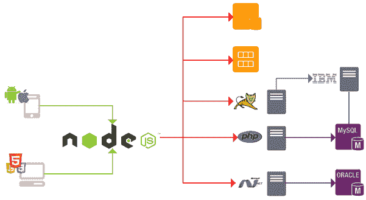
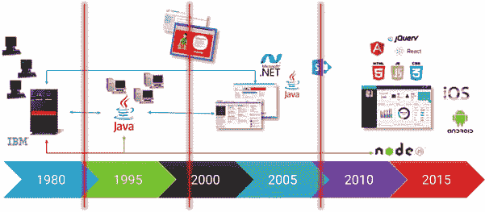
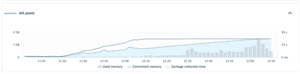
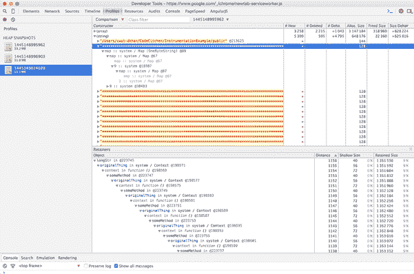
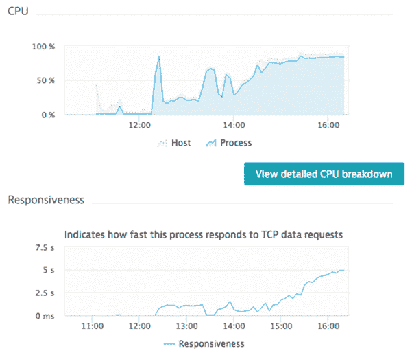
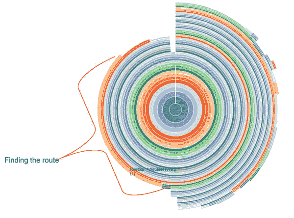
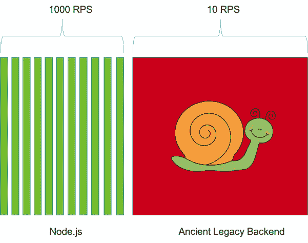

# 运营团队应该了解的四个 Node.js 陷阱

> 原文：<https://thenewstack.io/top-four-items-operations-performance-team-know-implementing-node-js/>

这篇文章来自一位演讲人

[Node.js Interactive North America](http://events.linuxfoundation.org/events/node-interactive/attend/registration)

，该活动由推动代码向前发展的开发人员深入探讨 Node.js 的未来，将于 2010 年 11 月 20 日在德克萨斯州奥斯汀举行

Nov. 29 — Dec. 2

.

 [丹尼尔·可汗

丹尼尔·可汗(@dkhan)在 web 工程领域拥有超过 17 年的全栈开发人员、架构师和技术主管经验。作为技术负责人，Daniel 正在推动 Dynatrace 对 Node.js 性能监控的支持。](http://events.linuxfoundation.org/events/node-interactive/attend/registration) 

毫无疑问 [Node.js](/tag/node.js/) 是当今发展最快的平台之一。从高科技到医疗保健，各行各业的初创企业和企业都有这种现象。

很多人都写了它受欢迎的原因，以及为什么它在“数字化转型”工作中有意义。但是当您实现 Node.js 时，您是否必须将您的大型机和遗留软件替换为全新的基于 Node.js 的微服务架构？

让我们缩小范围，从监管整个数字价值链的人的角度出发:运营和绩效团队。今天运营和性能团队在开始实施 Node.js 时面临哪些挑战？这需要彻底摧毁他们的系统吗？

图 1:企业如何使用 Node.js

## 新层次/新模式/新挑战

在许多情况下，Node.js 充当了一个新的层，它扩充了企业堆栈并将其与新的产品连接起来。这是系统边缘的快速移动技术。

图 2:在过去的 30 年中，层级的数量、涉众的数量和复杂性都呈指数级增长

Node.js 的一个经常被接受的好处是它使团队能够更快地移动。添加微服务后，突然之间，每天都有多次部署，而不是每隔几周部署一次。对于许多企业来说，这引入了一种新的模式，并需要对影响组织其他部分的流程进行更改，特别是那些负责可用性和性能的部门，即运营和性能团队。

这些团队不是由 Node.js 专家组成的，也不必如此。它们由平均修复时间(MTTR)等指标驱动。他们主要关心的是快速找到性能下降和停机的根本原因。这些团队如何确保根据他们的底线顺利过渡到 Node.js？他们如何让系统保持运转？

下面我们列出了在企业中引入 Node.js 时出现的一些常见问题，以及如何最好地管理和解决这些问题。

## Top Node.js 问题以及如何找到它们

企业场景中的 Node.js 应用程序相当简单。

常见的使用案例有:

*   从后端获取数据。
*   对传入请求执行身份验证。
*   渲染视图。

Node.js 使用[Google V8](https://developers.google.com/v8/)——Chrome 的 JavaScript 引擎——作为运行时和一个名为 [**libuv**](https://github.com/libuv/libuv) 的库，该库提供了一个事件循环来执行异步任务。所有这些都通过一个定义良好的 [JavaScript](/tag/javascript/) API 从用户那里抽象出来——不会有太多问题，例如，没有办法引入线程锁定问题，并且通常跟踪根本原因比在其他平台上更容易。

尽管如此，仍需要密切关注一些典型的问题来源。

### 1.内存泄漏

就运行时行为而言，Node.js 更类似于 Java。这是一个长时间运行的过程，正因为如此，很容易出现各种各样的内存泄漏。像在其他平台中一样，内存泄漏会随着堆使用量的稳步增长而出现，当最大可分配堆耗尽时，会导致崩溃。这通常伴随着大量的垃圾收集器流失，同时运行时拼命地试图释放内存。

图 3:内存泄漏的进展

可能的原因很简单，比如大型对象被挂接到根作用域，因此永远不会被释放。但是，所谓的闭包(依赖于其封闭范围的函数)也会导致更困难的情况，这使得垃圾收集器很难取消对依赖关系的引用。也有这样的情况，主机的内存配置[太低，导致垃圾收集器不能及时运行。](https://blog.risingstack.com/finding-a-memory-leak-in-node-js/)

为了跟踪内存泄漏，堆转储是首选的工具。有几个模块可以将 V8 挂钩导出到 JavaScript。使用它们，每当超过特定的内存阈值时，触发转储是相当容易的。[这里的](https://gist.github.com/danielkhan/0a98ae0ae2b5ddfd443e)是一个例子，它使用简单的异常检测，并利用模块 [v8-profiler](https://github.com/v8/v8/wiki/V8%20Profiler) 来创建可由 [Chrome 开发工具](https://developer.chrome.com/devtools)使用的转储文件。

图 4:使用 Chrome 开发工具进行堆转储分析

### 2.CPU 问题

Node.js 在单线程中运行。因此，它不太适合 CPU 密集型操作。如果 CPU 被占用，例如，因为它正在转换一大块 JSON——在此期间没有其他请求可以被处理。

图 CPU 拥塞导致的性能下降

网飞——一家大型 Node.js 商店——遇到了这样一个问题，一个自动化脚本在没有处理旧路由的情况下创建了路由，导致路由表随着时间的推移而被填满。在某些时候，发现调用传入请求的正确函数花费了太多时间，严重影响了性能。[看他们关于那个](http://techblog.netflix.com/2014/11/nodejs-in-flames.html)的博文。

Node.js 自带钩子来打开 CPU 采样——采样器产生的数据可以被各种工具使用。使用这些数据，很容易找出时间花在了哪里。

与内存自省一样，有几种方法可以从 JavaScript 中捕获 CPU 样本，并在各种工具中进行分析。

[这里的](https://gist.github.com/danielkhan/9cfa77b97bc7ba0a3220)是一个再次使用 v8-profiler 的例子。这一次是为了获取 CPU 采样数据，以找出在给定的时间片内 CPU 上有什么。

图 6:通过使用 D3.js 创建一个 Sunburst 图表，我们看到了 CPU 时间的分布，显示超过 25%的时间贡献给了在巨大的路由表中找到正确的函数来调用路由。

### 3.背压

当 Node.js 充当连接堆栈不同部分的粘合层时，堆栈中的问题可能首先出现在 Node.js 中。当 Node.js 将请求调度到较慢的后端时，会出现背压。虽然 Node.js 具有执行出站请求的出色能力，但缓慢的后端会导致等待这些请求返回的机器拥塞。结果可能是性能下降，甚至出现异常。

在这种情况下，要查看的指标是在任何给定时间发送的请求数与返回的请求数之比。

图 7:当请求在 Node.js 中堆积时，由于后端响应太慢，会产生反压力

只有使用监控解决方案，跟踪通过所有层的事务，提供有关层间通信的指标，才能追踪到这些问题的根源。如今，APM 领域的每个主要供应商都提供代理来监控进出 Node.js 的请求。

### 4.安全性

Node.js 提供了一个巨大的小型可组合模块库。使用 Node.js 包管理器(npm)，向项目添加模块只是几秒钟的事情，像[【HAPI】](http://hapijs.com/)或 [Express](https://github.com/expressjs) 这样的知名框架都是基于它们构建的，完全放弃使用它们是非常低效的。

尽管如此，每个安装的模块都是第三方代码。它可能很难维护，并且包含永远无法修复的错误，或者更糟糕的是，安全问题。在使用一个模块之前，开发人员应该总是检查它的质量，并确保它不是微不足道的，足以让他们自己完成。

为了解决这个问题，许多企业也运行他们自己的私有 npm 存储库，在那里只能找到通过一些审计过程的包。

像[节点安全平台](https://nodesecurity.io/)或 [Snyk](https://snyk.io/) 这样的工具可以通过利用数据库找到并修复已安装模块中可能的安全问题来简化这一过程。

## 观点

Node.js [诊断](https://github.com/nodejs/diagnostics)和[事后分析](https://github.com/nodejs/post-mortem)工作组只关注如何扩展和统一 Node.js 中的跟踪和调试功能。

其中的一些亮点包括:

*   一个新的追踪设备就在附近。它将允许低开销的流程级跟踪。
*   目前有一些计划来统一核心转储的分析方式。
*   有了异步钩子，最终将有一种通用的方法通过回调来完成长堆栈跟踪和事务跟踪。

鉴于当前的发展速度以及社区推动性能主题的活跃程度；Node.js 企业能力将在 2017 年再一次飞跃。

## 摘要

Node.js 应用程序通常很小，也不复杂。层之间的通信、内存泄漏和 CPU 拥塞会导致问题。幸运的是，这个平台不是一个黑匣子，对于每一个问题，都有办法通过自省运行的应用程序来找到根本原因。

Node.js 项目非常重视监控这一主题，在下一个版本中，将引入跟踪、调试和监控 Node.js 的其他方法，甚至添加更多快速修复问题的功能。

下次您的开发团队想要实现 Node.js 时，不要害怕，Ops。

<svg xmlns:xlink="http://www.w3.org/1999/xlink" viewBox="0 0 68 31" version="1.1"><title>Group</title> <desc>Created with Sketch.</desc></svg>