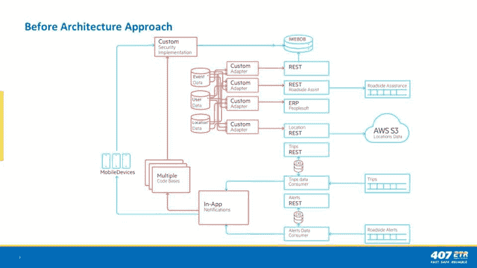
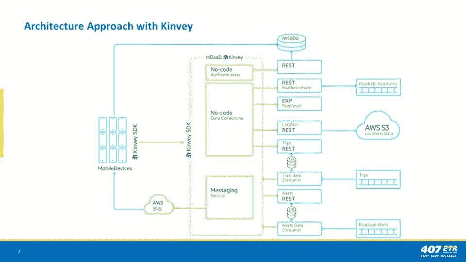

# 多伦多收费公路走上个性化服务的快车道

> 原文：<https://thenewstack.io/toronto-toll-road-takes-the-fast-lane-to-personalized-service/>

该项目的集团建筑师 Ravi Chandler 表示，407 ETR 是多伦多的全电子无障碍收费公路，它只是互联世界中功能的一个例子。

在[Progress next 2019](https://www.progress.com/next)Progress 软件全球用户大会上，他概述了用户可以无缝使用其移动应用的三种场景:

*   你要去面试你梦想中的工作。
*   你的妻子要分娩了，但她无法及时赶到医院分娩。
*   一个来自另一个国家的朋友来拜访你。

首先，如果你迟到了，你发现最快的路线是走 108 公里(67 英里)的收费公路。不用报名也不用找正确的零钱就可以拿。

如果你不得不在婴儿到来的收费公路上靠边停车，只需点击一下，你就可以召唤全天候巡逻的紧急救援车辆。该应用程序将精确定位你的确切位置，通知你谁来了，以及救援需要多长时间才能到达。如果不是紧急情况，比如你的汽油用完了，紧急救援人员会给你带足够的汽油，让你免费到达下一个加油站。

通过该应用程序，你的外国朋友也可以授权你支付她的通行费，所以她不必担心为她的汽车或汇率获得一个设备。当她离开收费公路时，应用程序会通知你她选择了正确的出口。

钱德勒说，在开发应用程序的过程中，该团队开始创造完全不同的东西。

“我们不认为其他收费公路是我们的竞争对手。我们的竞争对手是任何能提供卓越客户体验的产品，”他说。他说，就像优步或亚马逊 Prime 一样，目标是非常容易使用。

私有化的 ETR(高速收费路线)在高架塔上安装了电子传感器，记录每个司机的进出点，即使车速超过 200 公里/小时(124 英里/小时)，这些传感器也可以通过转发器信号识别车辆和/或拍摄车牌图像。

大量数据必须从不同的后端系统和异构技术堆栈汇集到一起才能实现这一点，以确保数据得到实时处理。它必须使用现代应用程序开发流程，并且必须能够扩展。

Chandler 说，自己做这些需要大量的开销和大量的代码。相反，它需要一个可以结合设备数据和后端数据的平台。

“[Progress]为我们提供了一种非常清晰的方式来专注于我们的价值主张，而不必担心所有这些解决方案。我们发现它在某些方面非常固执己见，但我们发现我们往往同意这些意见，当我们想调整它时，我们可以，”他说。

ETR 已经在使用 Progress tools 来管理其网站和业务规则——例如，在开始一个复杂的流程之前，该省规定了就拖欠付款联系司机的时间和频率，该省颁布了该流程，以拒绝为欠费车辆更新牌照。钱德勒说，那是最后的手段。

他说，开发移动应用的两个最大挑战是准确性和延迟。

“如果我们不想让人们必须有应答器，我们就依靠 GPS 技术，”他说。“GPS 技术可以非常精确，但不是 100%精确。我们如何达到最后一点准确性，说你真的在这个出口上车，而不是在最后一分钟突然转向？(我们使用)平滑算法和模式识别来说，他们确实做到了，也做到了。”

今天，收费系统使用应答器和光学字符识别(OCR)技术，这有一定的误差。添加新技术会增加另一个误差范围。那么，你怎么知道你没有犯错误呢？他说，你实际上做的是补充数据本身。

“我们不想做的是说这只是移动设备之旅，或者只是应答器之旅，或者完全无设备之旅。我们想要合并所有这些向量，并把它们作为输入，”他说。“充分利用每种特性，并将其应用于准确性。准确性是最大的技术挑战，你可以通过使用尽可能多的输入来减轻这一挑战。

延迟带来了另一个问题。

“[一切]都必须经过几个集成层。我们必须获得您的位置数据，对其应用算法，对其应用定价模型-在它到达您之前，我们必须通过云和本地的不同集成层来处理一系列不同的事情。现在，我们可以把它缩短到两秒左右，这是一项巨大的技术成就，但这意味着每一层的性能都得到优化，”他说。

安全性和身份验证是从一开始就必须考虑的基本要求。他说，这项服务会留意敏感信息，以及监控你行动的潜在可能性，并使用最少的信息来完成每项功能。

在 Progress 大会上，人们已经就创造个性化体验的必要性发表了很多意见。但是，如何使收费公路个性化呢？

“我们可以算出，周一到周五，朝九晚五，你去上班。周六，你带你的孩子去足球训练。星期天，你去教堂。钱德勒说:“我们可以通知你一个事故，并建议一个替代方案，但不要过于严厉，不要总是宣传 407，而是为你提供一个更快的方案。”。

“就是那个应用程序在说，‘这个星期你已经用了五天中的四天，去喝一杯免费咖啡吧。’如果我们与那家[咖啡店]有合作关系，我们就使用他们的 API，为他们的咖啡付费。"

“我们希望人们说，‘我想使用这项服务。太棒了。这就是我们的竞争对手。"

*照片经由 ETR 407*

<svg xmlns:xlink="http://www.w3.org/1999/xlink" viewBox="0 0 68 31" version="1.1"><title>Group</title> <desc>Created with Sketch.</desc></svg>