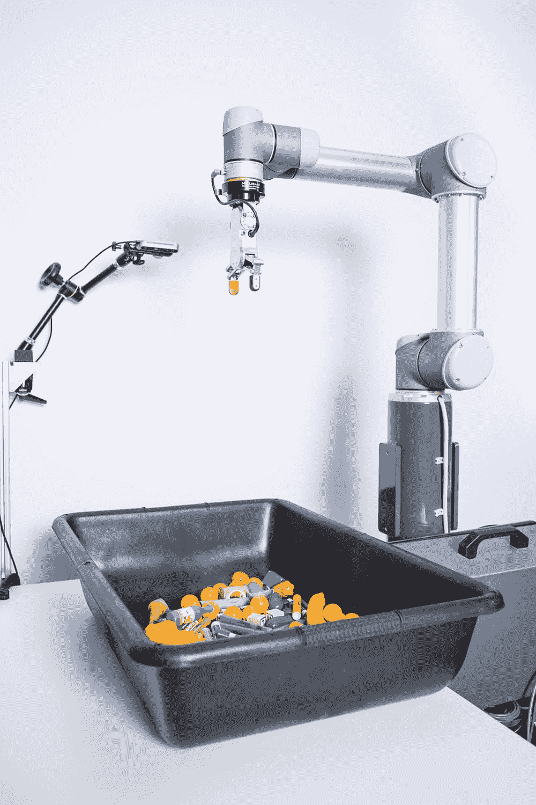
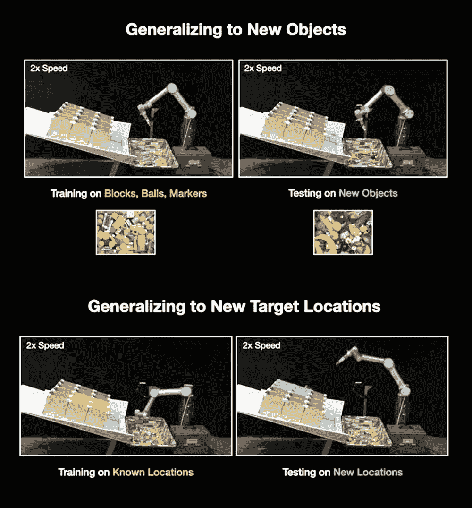
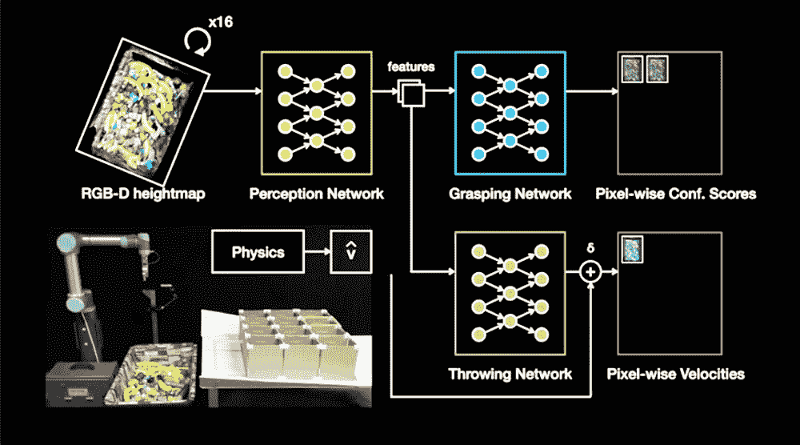

# TossingBot 使用“剩余物理学”像冠军一样出拳

> 原文：<https://thenewstack.io/tossingbot-uses-residual-physics-to-chuck-like-a-champ/>

机器人越来越能够执行看起来简单但实际上非常复杂的任务。现在，机器正在从事类似于[进行精确的外科切割](https://thenewstack.io/autonomous-robot-surgical-cuts-better-human-surgeon/)、[在微小尺度上抓取和放置](https://thenewstack.io/harvards-micro-robot-high-precision-high-speed-wonder/)、[烙牛肉饼](https://thenewstack.io/lessons-learned-hiatus-flippy-burger-flipping-robot/)、[玩叠人偶](https://thenewstack.io/mit-robot-uses-tactile-reasoning-ai-to-play-jenga-like-a-human/)，甚至[拥抱](https://thenewstack.io/huggiebot-is-a-robot-learning-how-to-hug-humans/)的活动——所有这些活动都需要在施加正确的体力和对内在动力的近乎直觉的“感觉”之间保持谨慎的平衡，因为这些力会随着时间、不同的对象和不同的目标而变化。

现在，来自谷歌、麻省理工学院、哥伦比亚大学和普林斯顿大学的工程师团队正在寻求使用人工智能、深度学习神经网络来帮助机器人学习如何抓住和准确投掷任意物体。研究人员恰如其分地将其命名为[投掷机器人](https://tossingbot.cs.princeton.edu/)，旨在开发一种可以捡起未知物体并将其扔向不同位置的机器，只需最少的训练时间和人工监督。

[https://www.youtube.com/embed/f5Zn2Up2RjQ?feature=oembed](https://www.youtube.com/embed/f5Zn2Up2RjQ?feature=oembed)

视频

正如人们可能预料的那样，准确地投掷各种物体需要我们人类进行一些练习，然后才能变得相当熟练。对于机器人来说，构建它学习如何投掷的方式有很大的不同:它不是学习如何投掷现有的每个物体(如果曾经有过的话，这是一个不可能的大数据集)，而是必须学习如何“概括”和适应它所拥有的关于投掷新物体的基本知识。换句话说，对于一个机器人来说，要可靠而准确地扔东西，这意味着要很好地掌握处理形状奇怪的物体，以及学习如何预测和补偿非结构化环境中的任何未知动态和可变性。

## “剩余物理学”

正如他们的[论文](https://tossingbot.cs.princeton.edu/paper.pdf)中所详述的，该团队的混合方法——他们称之为“剩余物理学”——不仅考虑了抛掷物体背后的物理学和不断变化的空气动力学，还考虑了最初抓住物体的*方式。他们的实验装置包括一个工业级 UR5 机械臂，一个随机物体箱，以及一系列作为投掷物体目标的盒子，这些盒子正好位于机械臂的触及范围之外。机器人手臂的进度和准确性由头顶的摄像机跟踪，因此手臂可以通过反复试验来教会自己投掷，并随着时间的推移提高其准确率。*

该团队关注的一个主要因素是“投掷前的条件”——如何拿起一个物体*以及*在哪里拿着*将会影响它如何被投掷。研究小组发现，这些投掷前的条件会对投掷尝试是否成功产生明显的影响，因为它会影响物体的抛射轨迹。例如，TossingBot 学会了如何以某种方式握住香蕉或记号笔等不对称的物体，以确保它们不会飞出预定位置。*

以前的机器人投掷工作仅限于某种形状的物体，如球或飞镖，投掷前的条件是手动设置的，而不是随机的。相比之下，为了在面对一系列可变对象和环境时实现更好的准确性，TossingBot 使用了一种基于物理的混合控制器，该控制器采用分析模型来提供关于投掷物体的力度和距离的初步估计。然后将这一初始估计与深度学习模型相结合，该模型能够预测和补偿其他数据驱动的“残余”参数，如气动阻力和抛射体速度(由物体的拾取和抓握方式决定)。然后，机器人的任务是从不同角度抓住每个不同的物体，将它们扔进某个盒子，然后通过头顶的摄像头评估每次尝试的准确性，以便学习下次如何更好地扔物体。

在让 TossingBot 愉快地扔出去的过程中，研究小组发现，该机器最初在最佳抓取物体和准确投掷两方面的结果都很差。然而，在大约 10，000 次训练尝试(或大约 14 个小时的投掷)后，机器人的投掷准确度攀升至 85%，在一小时内 600 次可能的“取放”动作中，抓取可靠性为 87%——比其他先前的方法提供了更好的结果，甚至比普通人更好。

该团队目前正在努力提高该系统的准确性和可靠性，除了整合不仅仅是视觉反馈手段，还可能添加其他传感器来收集其他类型的信息，如触觉和扭矩。随着它的进一步发展，人们可以想象这样的系统可以进一步“推广”并适用于其他情况，例如让机器人在救援行动中快速有效地打包箱子、分类衣物或投掷倒塌的碎片以拯救生命，以及许多其他尚未预见的可能性。

图片:谷歌，麻省理工学院，哥伦比亚大学和普林斯顿大学

<svg xmlns:xlink="http://www.w3.org/1999/xlink" viewBox="0 0 68 31" version="1.1"><title>Group</title> <desc>Created with Sketch.</desc></svg>