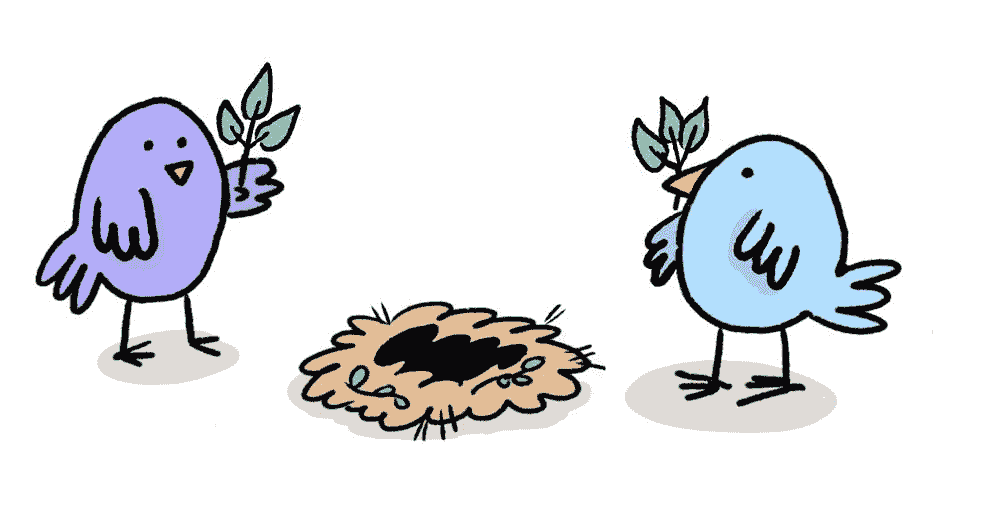
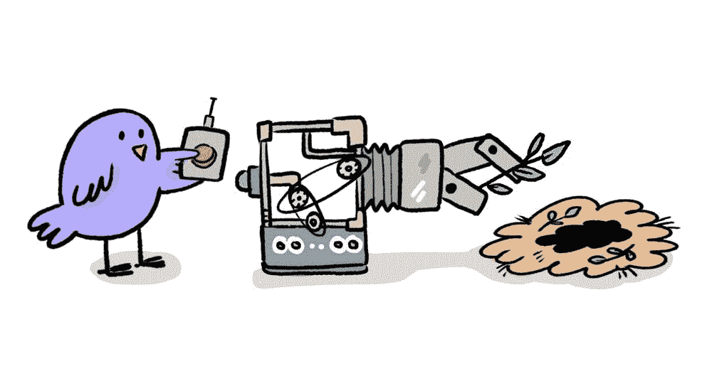

# 迈向更好的 DevOps KPIs:无代码变更成熟度模型

> 原文：<https://thenewstack.io/towards-better-devops-kpis-a-codeless-change-maturity-model/>

 [李然·海莫维奇

李然·海莫维奇是快速调试公司 Rookout 的联合创始人兼 CTO。他是一名低级技术专家，也是现代软件方法论的倡导者。Liran 拥有计算机科学学士学位和 MBA 学位。](https://www.rookout.com/) 

Nicole Forsgren、Jez Humble 和 Gene Kim 在他们的优秀著作“ [Accelerate](https://itrevolution.com/book/accelerate/) ”中讨论了衡量变革的四个核心 DevOps 关键绩效指标(KPI)。对于我们大多数从事软件工程的人来说，尤其是在“配置即代码”的时代，变更意味着“代码变更”，是关于对一些源代码控制库的提交。

然而，通过**无代码** **变更** *、*的概念，无需编写一行代码就可以交付价值和改变系统，这包括对软件产品的任何变更，无需开发人员编写代码。一般来说，这些变更是为了使特定的涉众能够从软件产品中获得更多的价值。当扩展到一般情况下，这些变化甚至可能导致一个全新的商业模式。

然而，对于当前基于代码变更的 KPI，从代码变更转移到无代码变更会*通过降低代码变更的测量速率来抑制* KPI 性能测量。此外，将最容易和最熟悉的代码变更转移到无代码过程意味着通过更改代码完成的变更更棘手和更实质性，这可能增加每次变更的缺陷——也降低 KPI。

## 无代码变更成熟度模型

与代码变更相比，非代码变更不那么分散，也更难度量，尤其是因为一些无代码变更是完全自动化的。因此，我建议使用**无代码变更成熟度模型**，而不是基于 KPI 的度量标准。该模型着眼于业务过程，并评估软件开发或其他过程是否正在做出交付价值的改变。

我们将遵循一个特定的业务流程，即商业智能(BI)度量监控，来看看它是如何通过成熟度模型形成的。

## 动手改变

这是最基本的成熟度级别，业务流程从这里开始。在这个层次上，R&D 对业务流程及其所需的变化知之甚少甚至一无所知。每一个变更都是企业所有者交付的新用户需求，必须使用“通用”软件开发生命周期(SDLC)进行评估和实现。在我们的例子中，这将由为涉众构建第一个 BI 仪表板的工程团队来表示。

## 手工制作流程

在这个级别，R&D 已经收到了来自用户的多个变更请求，以实现类似的业务流程。需求仍将被交付给业务所有者，他们在估计和定义需求方面有一些经验。这种改变将由 R&D 团队来实现，也许使用他们已经采用的工具和技术来进行这些特定种类的改变，而不必编写大量的新代码。当工程团队构建第十个 BI 仪表板时，他们可能已经有了构建它的非正式流程。

要成熟到这种程度，公司应该问:

*   这个用户请求与我们之前收到的请求相似吗？
*   我们能否创建一些流程或工具来加快这种变化？

## R&D 移交

在这个层次上，组织已经将一类无代码变更定义为业务的常规部分。这个过程应该应用到一个定义好的用例，以及一个请求变更的特定方法。这种变更通常使用一套正式的工具和技术来支持，通常支持在 SDLC 之外执行变更。拥有正式的流程意味着这些变更可以由不属于 R&D 团队的技术人员执行，例如专业服务团队或集成合作伙伴。对于我们的示例，这可能是由分析师而不是开发人员构建的 BI 仪表板，并且依赖于导出到数据仓库的原始信息。

要成熟到这种程度，公司应该问:

*   我们是否应该为客户请求变更创建一个正式的流程？
*   我们是否准备好花费金钱和时间来创建工具和方法，以便非开发人员可以做出改变？
*   考虑到更多的用户会在知道可能的情况下请求改变，我们有必要的员工时间吗？

## 所有人(DIY)

在这个成熟度级别，组织不仅定义了一类变更，还实现了一个允许最终用户自己进行变更的过程。这种变化需要非常严格的定义，以便可以很容易地分配给大量的人。UX 是这种成熟度的核心。不仅要有可能做出改变，还要让最终用户*容易*做出改变。

允许所有利益相关者创建和共享他们自己的仪表板的自助式 BI 工具将是这种类型的最终用户变化的一个很好的例子。这也是 UX 重要性的一个很好的真实例子；有许多令人困惑和设计糟糕的仪表板工具，它们使得最终用户很难自己做出他们需要的改变！

并不是每个变更都应该以这种方式交给最终用户。要成熟到这种程度，公司应该问:

*   更改的定义是否足够狭窄和简单，以允许最终用户进行更改？
*   最终用户可能会因为做出更改而破坏任何东西吗？
*   所请求的变更是否足够频繁，足以证明开发面向用户的软件来处理它所花费的时间和费用是值得的？
*   让用户控制变更会限制未来的开发可能性吗？

## 免提(自动化)

在这个层次上，组织已经建立了一个能够修改其行为以满足个人用户需求的系统。机器学习通常用于提供这种级别的灵活性，但也可以使用简单的规则集来实现

要成熟到这种程度，公司应该问:

*   这种变化是用户希望自动化的吗？
*   自动化会让人感到‘毛骨悚然’或侵扰吗？
*   我们准备好为自动化的特性提供持续的产品支持了吗？
*   我们是否希望为用户提供手动覆盖自动化的能力？

## 结果

为了代码变更而度量代码变更有时会激励开发人员去承担那些真正应该从代码中去掉的“简单”任务。企业需要超越标准的 DevOps KPIs，并且正确地评估和评价无代码变更。这意味着测量开发团队如何沿着这个成熟度模型以及经典的 KPI 前进。

现代软件工程关注于向母公司交付价值，所以对于软件公司来说，理解需要做出改变的业务需求是很重要的。如果我们能够确定哪里最需要变更，并且问我们自己上面的问题，我们就可以更快地通过变更成熟度模型，用更少的编码和更快、更容易和更安全的交付价值。

奥塔尔·阿夫拉哈姆的插图。

<svg xmlns:xlink="http://www.w3.org/1999/xlink" viewBox="0 0 68 31" version="1.1"><title>Group</title> <desc>Created with Sketch.</desc></svg>