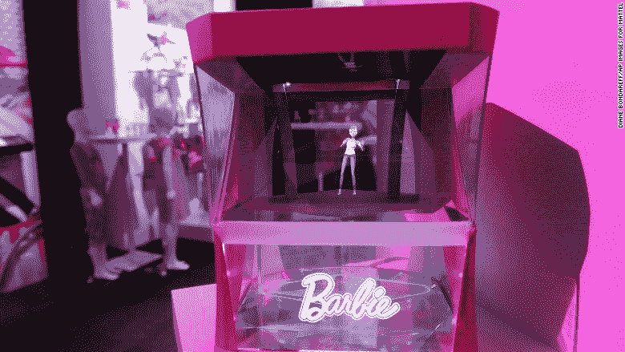
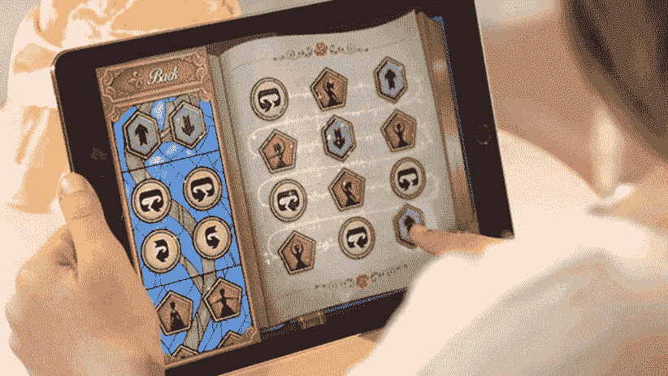
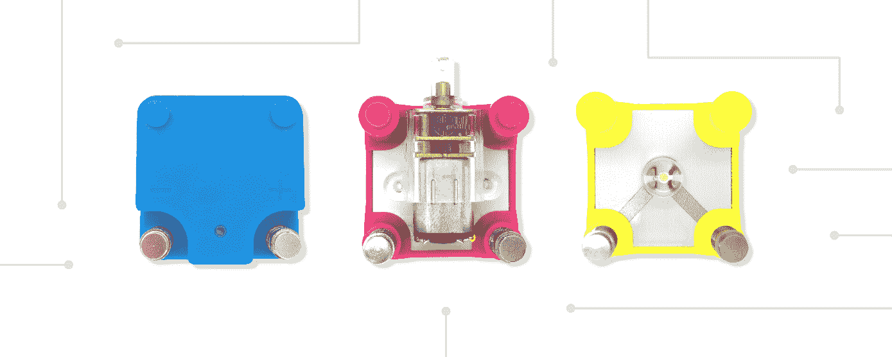
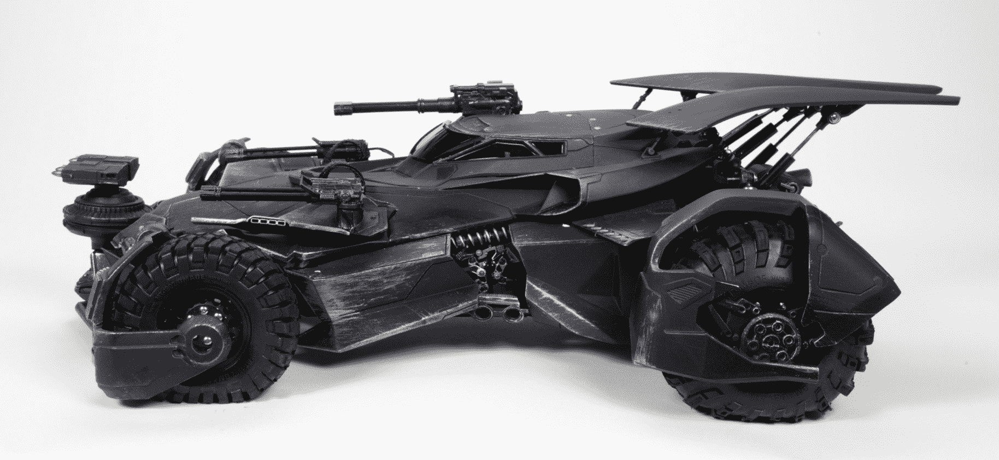

# 玩具走向高科技:2017 年玩具展之最

> 原文：<https://thenewstack.io/toys-go-high-tech-best-2017-toy-fair/>

科技正在接管玩具——至少从上周在 T2 玩具工业协会的年度玩具展上展出的新玩具来看是这样的。根据 2010 年的[数据，贸易协会代表了美国大约 85%的玩具销售商，代表了 218.7 亿美元的销售额。自 1903 年以来，它一直在纽约市举办玩具展，让媒体首次看到今年最热门的新产品。](https://pgpedia.com/t/toy-industry-association)

但今天的玩具充分利用了一些 21 世纪的技术，将新老结合成现代的混合体，旨在愉悦、娱乐——甚至可能激励孩子们追求自己的科技职业。

让我们来看几个:

## 全息芭比

“这个新的芭比将能够改变她自己的衣服，”[美国有线电视新闻网](http://money.cnn.com/2017/02/18/technology/barbie-hologram-mattel/index.html)开玩笑说——因为它们是由一个隐藏的投影仪虚拟添加的，投影仪将芭比的图像投射到一面镜子上。虽然孩子们不能触摸这个怪异半透明的“全息芭比”，但由于语音命令，她仍然是“互动的”。说正确的话会神奇地改变芭比的衣服、种族或体型。

据美国有线电视新闻网报道，这个芭比娃娃甚至可以进行对话，提供动画天气预报，提供提醒，并告诉你时间。《广告周刊》称她为“每个女孩的第一个私人助理……实用而活泼的全息伙伴……就像微笑的亚马逊回声。”

她的醒语是“你好，芭比”，当她今年秋天首次亮相时，你可以用不到 300 美元把她带回家。如果这看起来很贵，记住全息芭比甚至可以取代你的蓝牙扬声器…

“这个想法是，孩子们想知道当她不被人玩的时候，她在做什么……”The Verge 写道，并补充道“剧透:芭比喜欢跳舞。”

"实际上，芭比只是一个被困在盒子里的囚犯，根据孩子们的要求为他们跳舞."

## 舞蹈代码美女

*企业家* [报道了孩之宝(Hasbro)的一个更高科技的玩具](https://www.entrepreneur.com/article/289336)，它将互动提升到了一个新的水平。这是《美女与野兽》中爱书的美女的玩偶:“她会跳舞和唱歌，由孩子们用一个特殊的编程应用程序发出的命令驱动，教孩子们在玩耍时编写代码。”

算是吧。Gizmodo 称，有“舞蹈代码美女”的拖放舞蹈序列，“然后序列可以通过无线蓝牙连接同步到电池供电的娃娃，所以永远不需要电缆”。在玩了几天这个玩具后，Gizmodo 的记者得出结论说，它不会让孩子们为谷歌的工作面试做好准备，但它可以激发他们对科学的兴趣，“即使学习最基本的编程也可以帮助孩子们培养解决问题的技能和学习事物如何工作的兴趣。”

即使它没有，你仍然有一个 120 美元的娃娃，它会说话——说 100 种不同的短语——当然，还会唱“美女与野兽”中的歌曲

## 电路立方体

更有趣的是，无论如何，从工程的角度来看，是 Tenka Labs 的一款产品，名为 [Circuit Cubes](https://tenkalabs.com/) ，是乐高积木的嵌入式模块，让孩子们建造自己的电气化小发明。有一个可以旋转齿轮轴的嵌入式电机立方体，还有一个 LED 灯模块，甚至还有一个让孩子们建造绘画机器人的工具包。但真正的目的是激励孩子们发明他们自己的设计。

根据 Digital Trends 的说法，Circuit Cubes 的发明者现在正在使用其产品[组织课堂课程，该公司还希望在一个在线社区中为 Cubes 主持数百个项目。](http://www.digitaltrends.com/cool-tech/circuit-cubes-news/)

## 正义联盟蝙蝠战车

蝙蝠侠总是拥有最酷的玩具，为了纪念他在即将上映的电影“[正义联盟](https://www.youtube.com/watch?v=fIHH5-HVS9o)中的亮相，美泰公司推出了这个两英尺长的奇迹，一个六英寸高的小蝙蝠侠藏在驾驶舱中。Mashable [称它为](http://mashable.com/2017/02/17/justice-league-batmobile-mattel-toy/#E1hGgfXFLOqT)“我们见过的最漂亮的遥控车”，它甚至还配有大炮——和加特林机枪——用来镇压坏人。有灯光，引擎声，和一个喷出真烟的排气管。

但最棒的是，它是由一个应用程序控制的，这个应用程序控制方向盘——还有蝙蝠侠的手臂！

这是最酷的部分:该应用程序实际上显示了乘客座位上的实时画面——通过增强现实技术可以绘制出蝙蝠战车武器中的所有火箭和炮火。“他在和恶魔战斗”Nerdist [向忧心忡忡的父母们保证，“所以没关系，好吗？”](http://nerdist.com/mattel-wonder-woman-mega-bloks-pokemon-fast-furious-justice-league-batmobile-ever-to-toy-fair/)

这将花费 250 美元，但极客出版社仍然非常兴奋。“老实说，”Mashable 写道，“这辆车……有潜力比电影更受欢迎。”

特征形象:[玩具形象联想](http://toyfair.vporoom.com/)。

<svg xmlns:xlink="http://www.w3.org/1999/xlink" viewBox="0 0 68 31" version="1.1"><title>Group</title> <desc>Created with Sketch.</desc></svg>