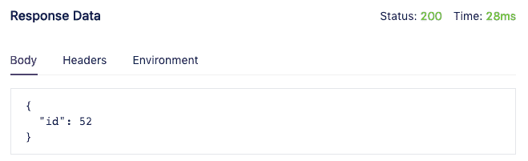
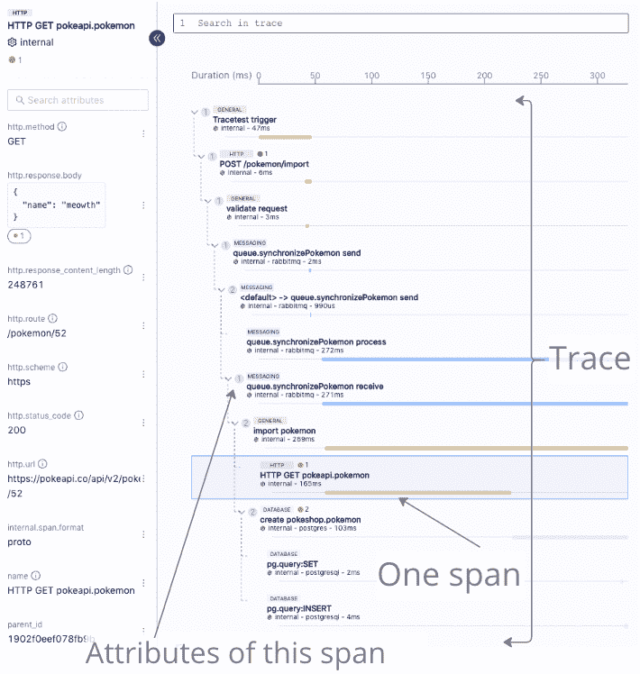
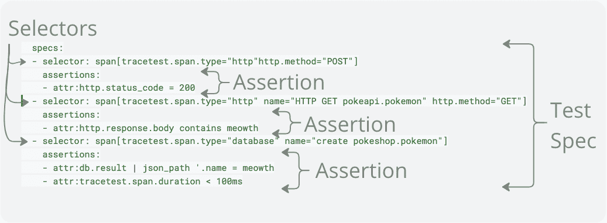
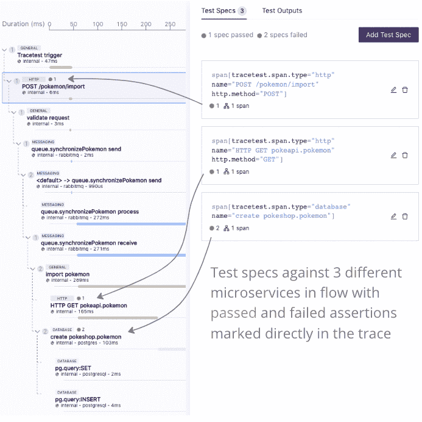

# 面向分布式世界的基于跟踪的测试

> 原文：<https://thenewstack.io/trace-based-testing-for-a-distributed-world/>

尽管现代开发团队使用的底层系统架构发生了根本性的变化，但是在过去的十年中，测试并没有发生显著的变化。分布式架构给系统测试和集成测试都带来了更多的复杂性。虽然已经做了一些工作，试图在提供隔离的同时重建现实，但对许多团队来说，这仍然是缺乏和不可靠的。

[基于跟踪的测试](https://thenewstack.io/trace-based-testing-the-next-step-in-observability/)通过使用现代可观察性技术(即分布式跟踪)来解决这一问题，允许创建测试来验证基于观察到的流程的整个系统流程——实际发生了什么。

为了解释基于跟踪的测试，我们想要“解构”部分，解释它们中的每一个，然后使用这些知识来理解整体。

## 基于痕迹的测试的故障

基于跟踪的测试有几个显著的特征，其中一些是其他形式的测试所共有的，一些是基于跟踪的测试所独有的。让我们详细看看基于痕迹的测试的构成。

对于这个例子，我们将看看由 [Tracetest](https://tracetest.io/) 定义的基于 YAML 的测试定义，但是这些原则将反对任何基于跟踪的测试的实现。让我们用这个简短的测试:

```
type:  Test
spec:
  id:  0qq91EhVR
  name:  Pokeshop  -  Import
  description:  Import  a  Pokemon
  trigger:
    type:  http
    httpRequest:
      url:  http://demo-pokemon-api.demo/pokemon/import
      method:  POST
      headers:
      -  key:  Content-Type
        value:  application/json
      body:  '{"id":52}'
  specs:
  -  selector:  span[tracetest.span.type="http"http.method="POST"]
    assertions:
    -  attr:http.status_code  =  200
  -  selector:  span[tracetest.span.type="http"  name="HTTP GET pokeapi.pokemon"  http.method="GET"]
    assertions:
    -  attr:http.response.body contains meowth
  -  selector:  span[tracetest.span.type="database"  name="create pokeshop.pokemon"]
    assertions:
    -  attr:db.result  |  json_path  '.name  =  meowth
    -  attr:tracetest.span.duration  <  100ms

```

### 触发您的分布式测试

测试触发器定义了如何开始执行测试。通常，这涉及到触及 API 端点，但是测试也可以通过将消息放入队列或进行 gRPC 调用等机制来触发。

触发器启动被测系统的执行，调用被测执行路径。触发器是测试工具和框架中的一个常见概念，因为它们用于创建来自系统的响应，然后断言该响应。

```
  # trigger test by doing POST against /pokemon/import endpoint
  trigger:
    type:  http
    httpRequest:
      url:  http://demo-pokemon-api.demo/pokemon/import
      method:  POST
      headers:
      -  key:  Content-Type
        value:  application/json
      body:'{"id":52}'

```

### REST API 调用的响应

如上所述，响应是基于触发器的执行从系统返回的记录的一组值。对于基于 REST 的触发器，响应数据通常包括 HTTP 状态代码、响应体和其他属性等信息。



大多数测试工具都遵循一个既定的模式:

*   扣动扳机。
*   断言反对回应。

虽然这种方法在单片系统和简单系统的时代非常成功，但它不能完全深入测试现代分布式系统中涉及的流程。因此，基于跟踪的测试不仅依赖于来自断言响应的数据，还依赖于来自为现代架构构建的工具——分布式跟踪——的数据。

### 分布式跟踪

分布式跟踪通过基于微服务的系统的各个部分创建执行路径的记录，记录在每个步骤捕获的关键信息。分布式跟踪是在 21 世纪后期从谷歌一个名为 Dapper 的内部项目发展而来的。它只是在过去 10 年里才被大量使用。它的采用是对现代分布式体系结构引入的跨系统故障排除复杂性的一种回应。工程师不再能够依赖单一日志来查看执行信息。

跟踪由跨度组成，每个跨度代表一个操作。每个 span 都记录了捕获特定操作关键信息的属性。



基于跟踪的测试允许针对跟踪中包含的信息做出断言。这允许对整个过程进行更全面的检查，而不仅限于检查响应。

### 测试规格

测试规格由两部分组成:

以下各节将详细介绍其中的每一项。



### 选择器

选择器是基于跟踪的测试的重要组成部分。它们用于指定由特定试验规范检查的跨度。它们可以被认为是一个返回跨度列表的过滤器。

大多数 API 测试工具没有选择器的概念，因为它们仅限于验证顶级响应。任何有前端测试工具(如 Selenium 或 Cypress)经验的人都会非常熟悉选择器的概念。

### 断言

断言是一系列检查，它们应该应用于由特定选择器指定的每个跨度。断言通常指定一个 span 中包含的属性之一，并对其进行逻辑检查。

例如，您可以针对 gRPC span 设置一个断言，以验证调用的状态代码是否返回零。这些类似于其他 API 测试工具中的断言。

## 基于跟踪的测试的好处

既然我们已经解释了创建基于跟踪的测试所涉及的部分，那么让我们来讨论通过转移到为分布式测试而构建的现代测试方法所实现的一些好处:

### 基于跟踪的测试很容易创建

构建传统系统或集成测试的“测试装备”部分是最痛苦和冗长的部分。获得对每个被测系统的访问权，拥有正确的身份验证信息来访问作为测试的一部分要询问的每个数据存储，并编写所有代码在测试中将这些联系在一起，这是大部分的代码和工作。

从上面的例子中可以看出，基于跟踪的测试简短而中肯。基于跟踪的测试消除了这项工作，因为它依赖于您已经在分布式跟踪中启用的可观察性数据。你已经做了这项工作，所以使用它！

### 对照现实进行检验

不像[针对模拟](https://tracetest.io/blog/integration-tests-pros-and-cons-of-doubles-vs-trace-based-testing)的测试，基于跟踪的测试中的测试规范是针对实际记录的针对您的系统的测试规范，如分布式跟踪所示。对于被模仿的系统将如何反应，没有错误的假设，因为实际的系统正在被测试。

### 构建测试的可视化本质

大多数基于跟踪的测试解决方案都允许您在查看触发事务的响应和跟踪时可视化地构建测试。在构建测试时以图形方式显示完整的跟踪，可以让您直观地看到分布式应用程序的流程，帮助您理解底层服务并知道应该断言什么。

### 测试整个流程

基于跟踪的测试不仅允许您断言触发器的响应，还允许您验证系统中更深层次的操作。下面是一些可以做出断言的例子:

*   如果 API 调用将消息推送到队列中，我希望有三个服务将消息从队列中取出。

*   子进程应该在父跨度开始后的 30 毫秒内完成。

您还可以使用更广泛的断言来查看某个类型的所有跨度，例如:

*   所有 gRPC 跨度应返回零状态代码。
*   任何数据库查询应该在不到 100 毫秒的时间内执行。

### 失败的测试总会留下痕迹

因为基于跟踪的测试总是针对响应和分布式跟踪运行，所以当测试失败时提供的信息比传统测试丰富得多。您不仅可以看到测试的响应数据和失败的断言，还可以获得完整的系统跟踪，详细说明在特定运行期间发生了什么。开发人员喜欢拥有排除故障所需的所有信息。

## 在您的世界中实现基于跟踪的测试

想要针对您的系统构建基于跟踪的测试吗？您所需要的是一个支持分布式跟踪的系统，最好使用基于标准的 OpenTelemetry 方法和 Tracetest，这是一个开源的基于跟踪的测试解决方案，您可以[下载并安装](https://tracetest.io/download)。

在您的 Docker 或 Kubernetes 环境中安装 Tracetest 只需要几分钟。一旦安装完毕，您就告诉 Tracetest 如何从您的分布式系统中访问跟踪，并且您已经准备好开始构建您的第一个测试了。Tracetest 可与任何流行的分布式跟踪解决方案配合使用，如 Jaeger、OpenSearch、Elastic、Grafana Tempo、New Relic、Lightstep 等。

需要帮助或有疑问？你可以通过我们的 [Discord 频道](https://discord.com/channels/884464549347074049/963470167327772703)联系 Tracetest 团队，你可以[在 GitHub 中添加问题](https://github.com/kubeshop/tracetest/issues/new/choose)来帮助指导项目的进程。如果你喜欢 Tracetest，请[在我们的 GitHub Repo 中给我们一颗星](https://github.com/kubeshop/tracetest)。

<svg xmlns:xlink="http://www.w3.org/1999/xlink" viewBox="0 0 68 31" version="1.1"><title>Group</title> <desc>Created with Sketch.</desc></svg>