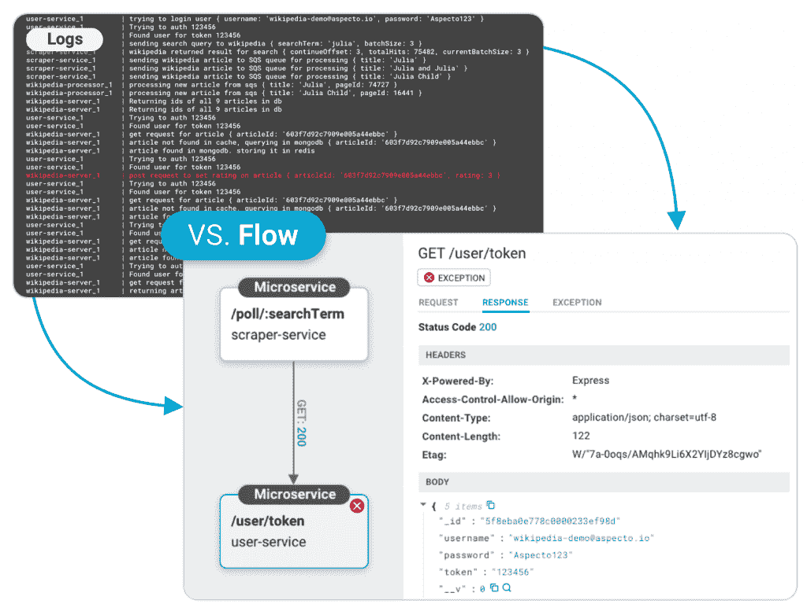
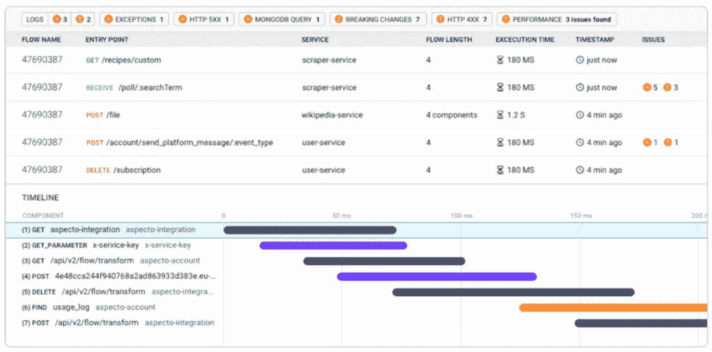
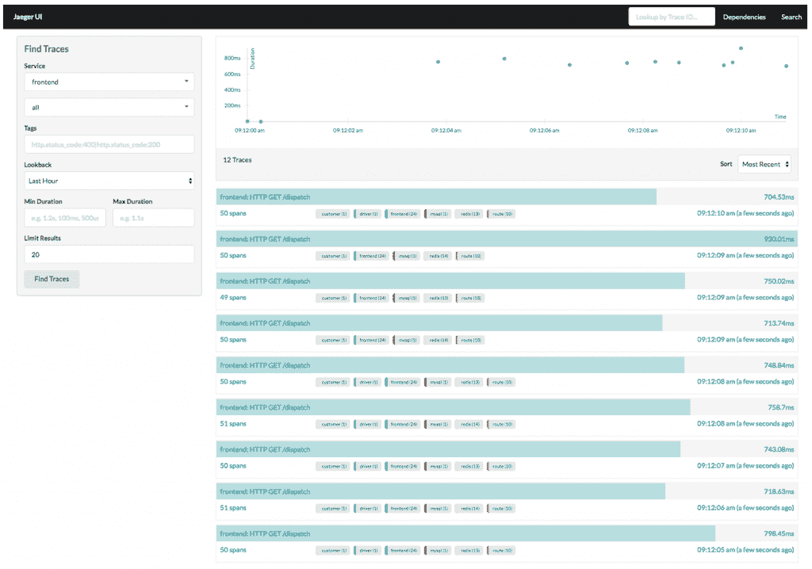
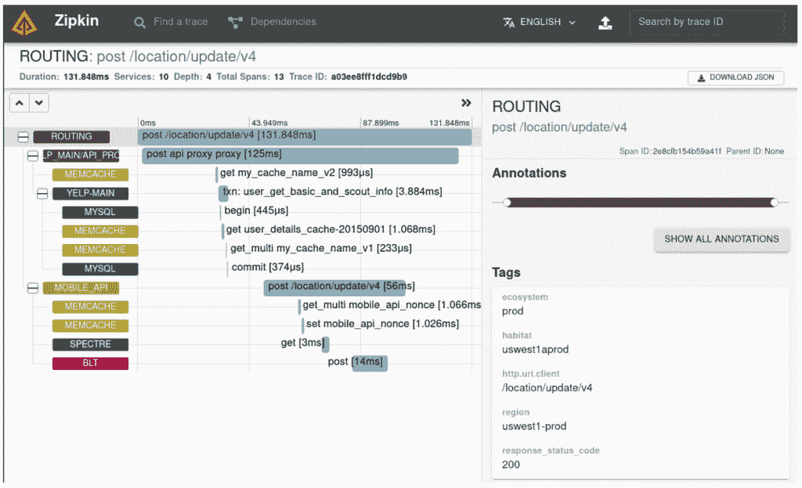
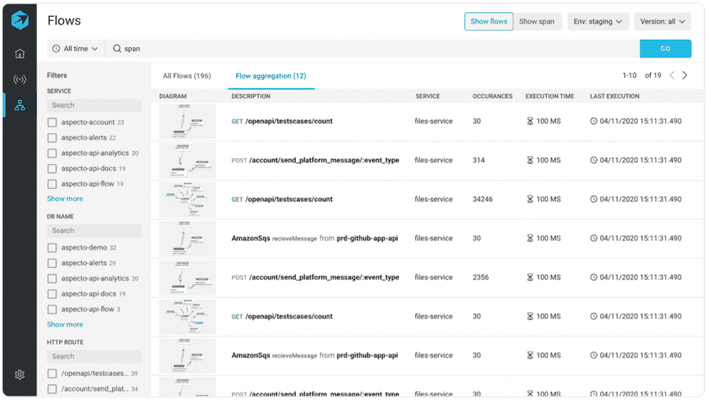

# 跟踪:为什么日志不足以调试您的微服务

> 原文：<https://thenewstack.io/tracing-why-logs-arent-enough-to-debug-your-microservices/>

 [迈克尔·哈伯曼

迈克尔·哈伯曼是 Aspecto 的联合创始人兼首席技术官。在以色列情报部门的一个精英单位担任软件开发人员后，Michael 与一些初创公司一起构建和扩展他们的微服务基础设施。在共同创立 Aspecto 之前，他是 Playbuzz 的首席建筑师。在空闲时间，Michael 还在会议上就微服务进行演讲和举办研讨会。](https://www.linkedin.com/in/michael-haberman) 

调试微服务时，开发人员很难确定问题的根本原因。更不用说在多个服务中搜索无止境的日志是多么令人沮丧，以及它所花费的时间。

然而，面对所有这些挑战，还有一线希望——分布式跟踪。

分布式跟踪可以帮助您的开发人员跨服务跟踪请求(稍后将详细介绍)。

让我们深入什么是分布式跟踪，它的好处，以及它在您的团队系统中扮演的角色。然后，我们将介绍开发人员可以使用哪些工具在云本地环境中实现分布式跟踪。

但是首先，为了理解跟踪在您的微服务调试过程中的位置以及为什么您可能首先需要它们，让我们确定使用日志进行调试所带来的挑战。

## 日志调试挑战

当我们试图了解意外响应或生产故障时，日志非常有用。然而，日志并没有无限的能力。以下是开发人员在调试微服务时面临的一些挑战:

### 1.日志记录是一个耗时的手动过程

添加日志不是一个自动的过程，它需要大量细致的手动工作。确定调试所需的所有潜在信息，添加日志，必要时删除它们——这些都需要很长时间和大量的工作。此外，该过程容易出错。开发人员可能会花费大量时间添加日志，但仍然会错过他们在生产中需要的确切信息。

### 2.很难找到正确的平衡

开发人员需要确保他们有足够的日志用于调试，但不能有太多的日志，这样代码会太重，他们会浪费太多时间来添加和分析它们。很难创造这种平衡。如果他们没有记录足够的信息，他们将会错过用于调试的数据。如果他们记录的太多，这个过程就会变得资源密集，并使日志分析变得更加困难。

### 3.跨服务跟踪日志很困难

跨多个服务、容器和流程跟踪和分析日志条目具有挑战性。开发人员必须能够理解所有不同日志之间的关系，这需要理解不同服务中的代码流，并将它们与日志关联起来。他们必须经历将原始文本(日志)转化为脑海中可视化内容的过程。

这需要非常非常长的时间。

即使是在仪器中添加了唯一标识符以实现跟踪的公司也难以维护和更新它们。更不用说确保所有开发人员都熟悉他们自己开发的标识符惯例了。

### 4.日志不是标准化的

日志没有结构化的格式，这意味着任何开发人员都可以根据自己的风格创建消息和事件。虽然这提供了灵活性和自由，但是对于您的团队来说，试图理解其他人的日志或解释它们可能是具有挑战性的，并且会产生反效果。

此外，缺乏标准化给人为错误留下了更多的空间。

## 日志调试失败

因此，日志并不总是提供解决性能和回归问题所需的信息。有许多解决方案试图克服这些挑战。这些包括标准化惯例、最佳实践、分析工具等等。但是，也许我们需要认识到日志记录有其局限性，您的团队需要另一种解决方案来调试微服务。

这个解决方案就是追踪。

## 什么是分布式跟踪？

跟踪是对日志的补充。日志提供了关于服务内部发生了什么的信息，而分布式跟踪告诉您服务/组件之间发生了什么以及它们之间的关系。这对于微服务来说非常重要，因为微服务中的许多问题都是由于组件之间的集成失败而导致的。

此外，日志是一种手动开发工具，可用于任何级别的活动——特定的低级细节或高级操作。这也是为什么有许多日志记录最佳实践可供开发人员学习。另一方面，跟踪是自动生成的，提供了对架构最完整的理解。

分布式跟踪是适应微服务架构的跟踪。分布式跟踪旨在支持跨自治服务和模块的请求跟踪，提供对云原生系统的可观察性。

## 分布式跟踪优势

在日志记录受限的地方，分布式跟踪蓬勃发展。让我们看看分布式跟踪如何解决调试微服务时的日志记录限制。

### 1.形象化

痕迹是视觉仪器。与文本日志相反，有了踪迹，开发人员不必想象通信流，也不必在脑海中构建一个图像。相反，他们可以看到它就在眼前。这使得开发人员更容易理解服务之间的关系并解决问题，比如性能瓶颈。

### 2.自动化

与日志不同，跟踪是自动的。开发人员不必手工添加日志来获得完整的图片。相反，他们会自动看到发生了什么。这也解决了标准化问题。对于自动化跟踪，标准化是硬编码的。

### 3.加快上市时间

分布式跟踪提供了服务的可观察性和清晰的图像。这提高了生产率，因为它使开发人员能够花费更少的时间来尝试定位和调试错误，因为答案更清楚地呈现给他们。因此，生产率提高了，开发人员可以花更多的时间开发特性，(或者休息一下)，同时加快上市时间。

### 4.跨服务跟踪请求

微服务交互跨越多个服务。分布式跟踪有助于理解系统和组件之间的关系。这是通过将唯一的 id 传递给处理它们的服务来跟踪和记录所有这些请求来实现的。因此，开发人员可以看到请求在整个架构中的流动和进展，这通常是调试时最难理解的。你的团队的代码质量将会大大提高。

### 5.易于使用和实施

通过正确的设置，开发人员可以使用多种应用程序和不同的编程语言。这对于分布式跟踪来说是独一无二的，因为它不限制您使用一种语言或某些应用程序，从而为您的团队节省了大量时间和麻烦。

### 6.富有洞察力的

分布式跟踪为开发人员提供了大量有见地的信息。这包括请求时间、关于组件的信息、延迟、应用程序健康状况等等。所有这些信息在调试和根本原因分析时都很有用，有助于提高代码质量和快速解决客户问题。

## 什么时候应该使用分布式跟踪？

很棒的问题！下面是分布式跟踪对您和您的团队有帮助的三个主要用例。

### 1.对于分布式应用程序体系结构

如果您的部门正在使用分布式基础结构，我们强烈建议实现分布式跟踪。如您所见，这是跨服务跟踪请求的最佳方法，涉及到许多团队，并且您有复杂的流程。

它可以确保你不会浪费时间去调查机器上的问题，或者搜索无尽的日志。

### 2.当你不知道该找哪个问题的时候

开发人员最终拥有太多日志的原因之一是，他们想保护自己，并确保他们拥有所有可能出错的场景的信息。但这是错误的方法。这正是痕迹的用途。跟踪为您提供了分析自己所需的所有信息，没有日志的缺点。所以如果你不知道问题出在哪里，你可以分析到你知道为止。

### 3.当你需要观察的时候

分布式跟踪为您提供了对系统、所有服务以及它们之间关系的可见性。您可以看到请求经历的旅程、花费的时间、对系统健康状况的了解等等。您不仅可以使用分布式跟踪来确定问题发生的原因，还可以避免正在进行的可观察性和跟踪的问题。

## 分布式跟踪工具

希望到目前为止，您已经确信分布式跟踪可以让您的生活更轻松，或者至少可以缩短您的调试时间。为了让你开始，这里有三个工具供你的团队研究。这些工具使用名为 [OpenTelemetry](https://opentelemetry.io/) 的开源软件，这是一个针对微服务的可观察性框架，也是[云本地计算基金会](https://cncf.io/?utm_content=inline-mention)的成员。

以下跟踪工具将补充您的日志工作，尤其是在微服务架构中:

### 1.贼鸥

[Jaeger](https://www.jaegertracing.io/) 是一款开源的分布式追踪工具。它支持事务监控、延迟优化和高级数据分析。Jaeger 支持大多数通用语言，需要运行 Kubernetes。你可以在这里查看。

### 2.齐普金

[Zipkin](https://zipkin.io/) ，一个与 Jaeger 非常相似的开源工具，也提供了所有的分布式追踪能力。对于实现，Zipkin 不需要容器。你可以使用 Docker，[但不是必须的。](https://zipkin.io/pages/quickstart.html)这两者之间的差异很小，最终涉及到个人偏好和具体的技术堆栈需求。

### 3.Aspecto

Aspecto 就像是分布式应用程序的 Chrome 开发工具，帮助开发人员在整个开发周期中发现、修复和防止分布式应用程序的问题。从本地开发环境一直到生产环境。

Aspecto 是基于 OpenTelemetry 的，它允许开发人员在问题进入生产之前进行预防，方法是实现学习系统的遥测数据，然后将他们在本地做的事情与生产、试运行或其他本地基线数据进行比较。

这有助于您在开发过程中验证变更和预防问题。

用一行 SDK 安装[超级容易，你可以给](https://docs.aspecto.io/?utm_source=thenewstack&utm_medium=blog&utm_campaign=logs-vs-traces) [Live Playground](https://www.aspecto.io/?utm_source=thenewstack&utm_medium=blog&utm_campaign=logs-vs-traces) 一个旋转。

## 结论

使用日志进行调试只能到此为止。通过实现分布式跟踪，您可以看到您的请求和服务，并减少调试时间。尝试使用开源工具进行分布式跟踪，如 [Jaeger](https://www.jaegertracing.io/) 或 [Zipkin](https://zipkin.io/) ，如果您正在寻找预测更改效果的额外帮助，请尝试 [Aspecto](https://www.aspecto.io/?utm_source=thenewstack&utm_medium=blog&utm_campaign=logs-vs-traces) ，以获得更快的反馈和更多的可见性。

<svg xmlns:xlink="http://www.w3.org/1999/xlink" viewBox="0 0 68 31" version="1.1"><title>Group</title> <desc>Created with Sketch.</desc></svg>