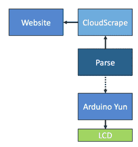
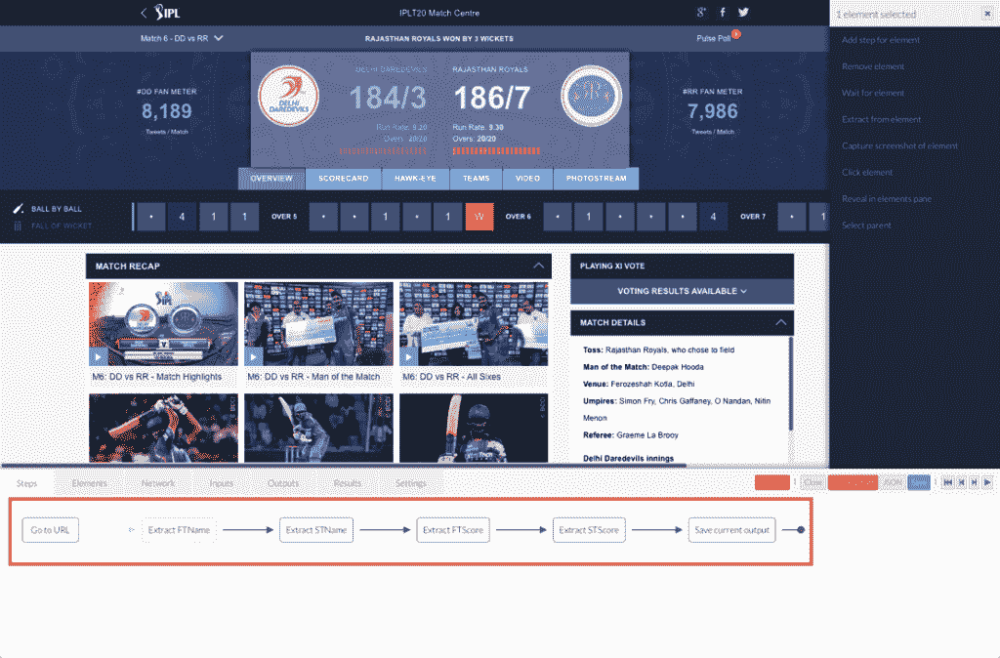
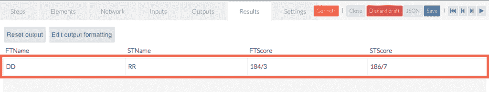

# 使用 Arduino 和 Parse IoT SDK 跟踪实时板球比分

> 原文：<https://thenewstack.io/tracking-live-cricket-scores-with-arduino-and-the-parse-iot-sdk/>

在印度，板球与其说是一项运动，不如说是一种宗教。甚至在世界杯热潮结束之前，印度超级联赛赛季就开始了，这让狂热的印度板球爱好者非常高兴。虽然我不是板球的忠实粉丝，但我想开发一个跟踪现场比分的物联网应用程序。上面是原型的图片。

我想以两个免责声明开始这篇文章:

1)这不是一个详细的分步指南，引导您完成整个设置、配置和代码。目标是向您展示可用技术和工具的可能性。如果这激发了你们中的一些人去做一些很酷的东西，我达到了我的目标。

2)此示例使用屏幕清理从网站获取内容。我们不鼓励您将这种技术用于商业用途。请参考网站的条款和条件或与他们的网站管理员联系，以了解他们的政策。

准备好了，让我带你参观一下。

## 先决条件

在你开始连接这些点之前，你需要:

让我解释一下每个组件的作用:

**Arduino Yún** 是一款功能强大的微控制器开发板，来自广受欢迎的 Arduino 系列。虽然大多数制造商都熟悉 Arduino Uno，但在我们需要内置网络和 WiFi 功能的情况下，Arduino Yún 是首选。它可以连接到互联网，不需要特殊的屏蔽。根据官方网站的说法，Yún 与其他 Arduino 板的区别在于，它可以与板载 Linux 发行版进行通信，提供强大的联网计算机，具有 Arduino 的易用性。除了像 cURL 这样的 Linux 命令，您还可以编写自己的 shell 和 python 脚本来实现健壮的交互。我们的代码将在 Arduino Yún 上运行，以接收来自云端的实时乐谱。

**Grove Base Shield** 最初是为 Arduino Uno 设计的，但与 Arduino Yún 配合使用也很好。该 Shield 可以非常轻松地将各种传感器、开关和执行器连接到 Arduino。可以将其视为开发板和 Grove 系列传感器之间的接口。

Grove LCD RGB 背光是一款很酷的显示器，不仅可以显示 ASCII 字符，甚至可以显示用户定义的字符。我们将使用它来显示实时分数。

CloudScrape.com 是一个在线工具，可以将任何网页转换成 REST 端点。它的可视化设计器非常简单直观，可以从网页中提取内容。这将是我们获取实时分数的 REST API 网关。

Parse 是一个来自脸书的强大的移动后端。最近，在 F8 开发者大会上，Parse 宣布了用于 Arduino 的原生 SDK，我们将在我们的项目中使用它。调用 REST 端点并将推送通知发送给 Arduino Yún 的代码将托管在 Parse 中。

下图描述了该流程:

[](https://thenewstack.io/wp-content/uploads/2015/04/Live_Score_IoT.png)

## 配置 CloudScrape

CloudScrape 有一个机器人的概念，它能够从网页上删除内容。花几分钟时间和设计师玩一玩，熟悉一下界面。单击一个元素可以让您提取周围 HTML 中的值。下面的截图显示，我们正在提取第一队的名字，第二队的名字，第一队的分数，第二队的分数。

[](https://thenewstack.io/wp-content/uploads/2015/04/CloudScrape_IPL.png)

当你点击播放按钮，它应该会显示输出。由于我们的 LCD 无法显示球队的全名，我们将转换该值以仅显示前几个字符。所以，德里夜魔侠变成了 DD，拉贾斯坦皇家队变成了 RR。

[](https://thenewstack.io/wp-content/uploads/2015/04/CloudScrape_IPL2.png)

完成基本配置后，用 cURL 测试 REST 端点。CloudScape 身份验证模式希望您在头中包含 accountid 和 API 密钥的 MD5 散列。你可以从[这里](https://app.cloudscrape.com/#/api)两个都抓。您也可以从这里生成 MD5 散列。只需粘贴 accountid，后跟 API 密钥，不带空格，然后点击 enter。复制 MD5 校验和并保存。您还需要创建一个运行任务来执行机器人。调用 REST 端点需要运行任务 id。

您的 cURL 命令应该如下所示:

```
curl  -X  POST  \
  -H  "X-CloudScrape-Access: YOUR_ACCESS_KEY"  \
  -H  "X-CloudScrape-Account: YOUR_ACCOUNT_ID"  \
  -H  "Content-Type: application/json"  \  https://app.cloudscrape.com/api/runs/YOUR_RUN_ID/execute/wait

```

如果一切顺利，cURL 应该会向您展示分数的 JSON 输出:

```
{"headers":["FTName","STName","FTScore","STScore","status"],"rows":[["DD","RR","184/3","186/7",null]]}

```

## 配置解析

这一步非常简单。Parse 为您提供了优秀的入门文档。只需从仪表板创建一个新的应用程序，然后直接进入安装对象。修改通道数组以添加新条目。记住它的名字，因为它可能在 Arduino 代码中被用来有选择地订阅推送通知。转到设置并启用客户端推送选项。解析推送通知的文档有所有的细节。请参考以了解如何从代码中发送推送通知。

接下来，配置后台作业以定期调用 CloudScrape REST 端点，并向 Arduino Yún 发送推送通知。有关配置和调度作业的详细信息，请参考[后台作业文档](https://www.parse.com/docs/cloud_code_guide#jobs)。下面是我用于后台工作的代码。安排作业时要谨慎。过于频繁地访问目标网站可能会导致 IP 地址被列入黑名单。

```
Parse.Cloud.job("getscore",  function(request,  response)  {

  Parse.Cloud.httpRequest({
  method:  'POST',
  url:  'https://app.cloudscrape.com/api/runs/YOUR_RUN_ID/execute/wait',
  headers:  {
    'Content-Type':  'application/json',
    'X-CloudScrape-Access':  'YOUR_ACCESS_KEY',
    'X-CloudScrape-Account':  'YOUR_ACCOUNT_ID'
  },  
  success:  function(httpResponse)  {
    var res=httpResponse.data.rows[0];
    var curscore=res[0]  +  " - "  +  res[2]  +  ":"  +  res[1]  +  " - "  +  res[3];
    Parse.Push.send({
  channels:  ["score"],
  data:  {
    alert:  curscore
  }
},  {
  success:  function()  {
    console.log("Push Successful");
    response.success("Push Successful");
  },
  error:  function(error)  {
    console.error("Push Unsuccessful");
  }
})

  },
  error:  function(httpResponse)  {
    console.error('Request failed with response code '  +  httpResponse.status);
    response.error("Push Unsuccessful");
  }
})
});

```

## 用 Arduino Yún 连接 LCD

由于我们使用的是 Grove Base Shield，这非常简单。小心地将 Grove 基座护罩推入 Arduino Yún 引脚。Grove shield 不是为 Yún 设计的，因此请确保 shield 引脚不会接触到以太网和 USB 插座。将 Grove LCD 连接到屏蔽的一个 I2C 端口。电路应该类似于我们在文章开头看到的图片。

## 编码 Arduino 草图

在继续编写代码之前，您需要两个库:

1.  [解析 Arduino 的 SDK](https://github.com/ParsePlatform/parse-embedded-sdks)。
2.  SeeedStudio 的 [Grove LCD 库](https://github.com/Seeed-Studio/Grove_LCD_RGB_Backlight)。

下载并导入到你的 Arduino 库。使用下面的代码来订阅解析推送通知并在 LCD 上显示输出:

```
#include &lt;Wire.h&gt;
#include &lt;Bridge.h&gt;
#include &lt;Parse.h&gt;
#include "rgb_lcd.h"
ParseClient client;
rgb_lcd lcd;

//For light blue backlight
const int colorR  =  10;
const int colorG  =  10;
const int colorB  =  100;

void setup()  
{

    //Configure the LCD
    lcd.begin(16,  2);
    lcd.setRGB(colorR,  colorG,  colorB);
    delay(1000);

    Bridge.begin();

    //Configure Parse
    client.begin("YOUR_APP_ID",  "YOUR_CLIENT_KEY");
    client.setInstallationId("YOUR_INSTALLATION_ID");
    client.startPushService();

}

void loop()  {
if  (client.pushAvailable())  {
  ParsePush push  =  client.nextPush();

  //Clean up JSON message to grab the score
  int mlength=message.length();
  int delimit  =  message.indexOf(':');
  String t1=message.substring(0,delimit);
  String t2=message.substring(delimit+1,mlength);

  //Print on the LCD
  lcd.clear();
  lcd.setCursor(0,  0);
  lcd.print(t1);
  lcd.setCursor(0,  1);
  lcd.print(t2);

  push.close();

}
  delay(100);

```

就是这样！将 Arduino Yún 连接到电源组，享受在草坪上追踪实时比分的乐趣。

## 后续步骤

我计划添加一个蜂鸣器，每次检票口下降时都会发出蜂鸣声。我们还可以在接收更新时改变 LCD 的背景颜色。如果你有进一步改进的想法，请告诉我。

<svg xmlns:xlink="http://www.w3.org/1999/xlink" viewBox="0 0 68 31" version="1.1"><title>Group</title> <desc>Created with Sketch.</desc></svg>