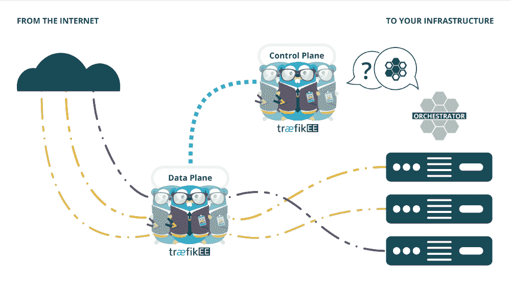

# traefik:Kubernetes 和微服务的动态反向代理

> 原文：<https://thenewstack.io/traefik-a-dynamic-reverse-proxy-for-kubernetes-and-microservices/>

一个具有自动重新配置能力的开源边缘路由器正在 Kubernetes 驱动的云原生操作世界中找到一个家。

Emile Vauge 三年前创建了 Traefik，作为开发基于中间层的微服务平台的辅助项目。他对现有的边缘路由选项感到失望。“传统的反向代理不太适合这些动态环境，”他告诉 New Stack。

与传统的边缘路由器不同，Traefik 可以在不离线的情况下动态地重新配置自身。这种动态和自动化的可重新配置性对于容器化微服务的架构来说是必不可少的，容器化微服务可以通过 orchestrator(如 Docker Swarm 或 Kubernetes)移动和扩展。

Traefik 连接到这些 orchestrator 的 API，在 orchestrator 移动其微服务时自动更新其路由。“每当 orchestrator 上发生变化时，例如，如果您部署了一个新的应用程序，Traefik 就会收到通知并自动更改其配置，”沃奇说，他围绕这项技术创建了一家名为 [Containous](https://containo.us/) 的公司。

本周，[公司推出了该软件的企业版——traefike Enterprise Edition(TraefikEE ),它可以为关键业务部署提供一个可扩展的高可用性平台。这个包的测试版在本周西雅图举行的 KubeCon + CloudNativeCon](https://blog.containo.us/introducing-traefik-enterprise-edition-83b78d09efeb) 上首次亮相。

该软件已经被许多正在转向微服务的大型组织所采用并用于生产。它在 Github 上收集了[超过 19000 颗星的赞赏，从 DockerHub](https://github.com/containous/traefik) 上下载了超过 1000 万次[。](https://hub.docker.com/_/traefik/)

TraefikEE 提供了一种在集群中轻松安装分布式 Traefik 实例的方法，这些实例使用 Raft consensus 分布在多个节点上。TraefikEE 可以跨节点安全地存储和复制配置和 TLS 证书，并且跨节点的通信是加密的。

“这是第一个能够在本地部署在集群中的反向代理，无需任何第三方软件，”Vauge 说。

控制平面监控平台和服务，存储拓扑变化，重新配置单独管理的数据平面，以动态更新入口路由。

Traefik 本身也提供了其他边缘路由器上的许多标准功能，例如 SSL 终端。

[https://www.youtube.com/embed/bsl05RVuMtM?feature=oembed](https://www.youtube.com/embed/bsl05RVuMtM?feature=oembed)

视频

[https://www.youtube.com/embed/YNKMcussMrM?feature=oembed](https://www.youtube.com/embed/YNKMcussMrM?feature=oembed)

视频

[https://www.youtube.com/embed/rPAcKSiidUo?feature=oembed](https://www.youtube.com/embed/rPAcKSiidUo?feature=oembed)

视频

<svg xmlns:xlink="http://www.w3.org/1999/xlink" viewBox="0 0 68 31" version="1.1"><title>Group</title> <desc>Created with Sketch.</desc></svg>