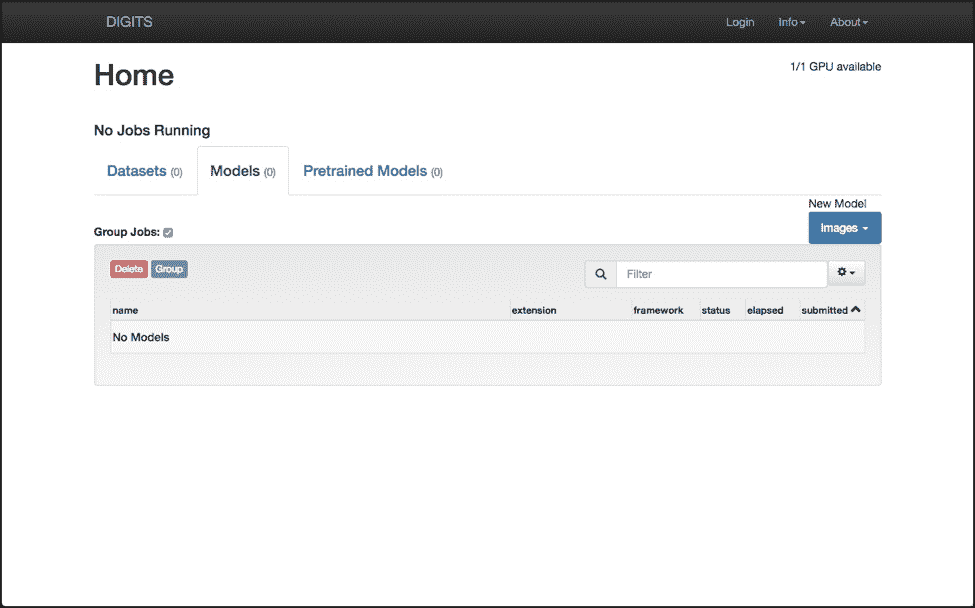
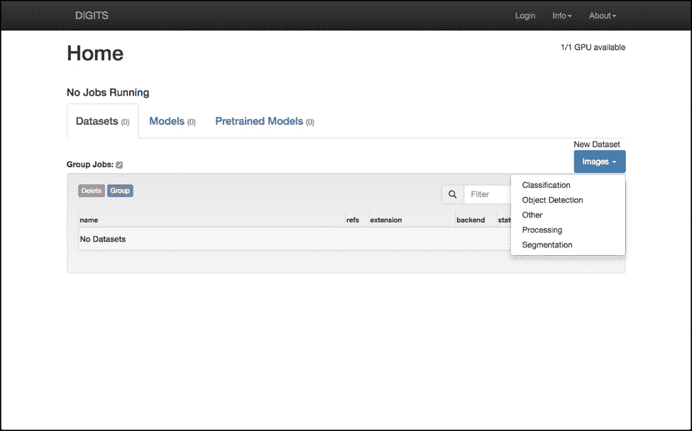
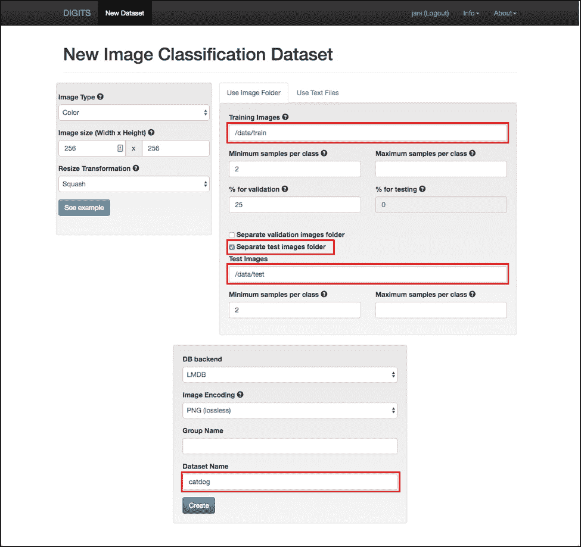
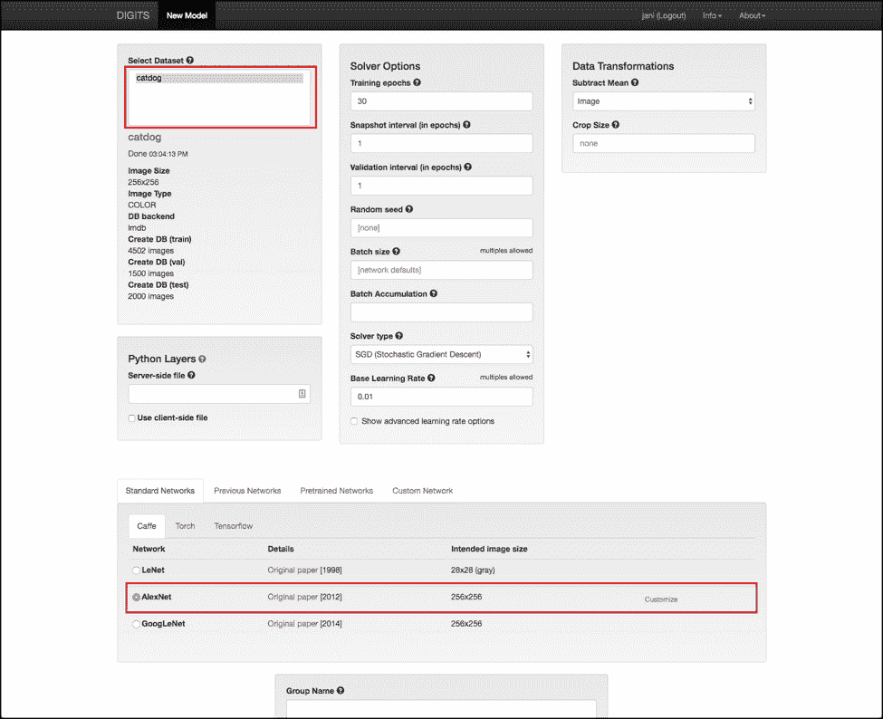
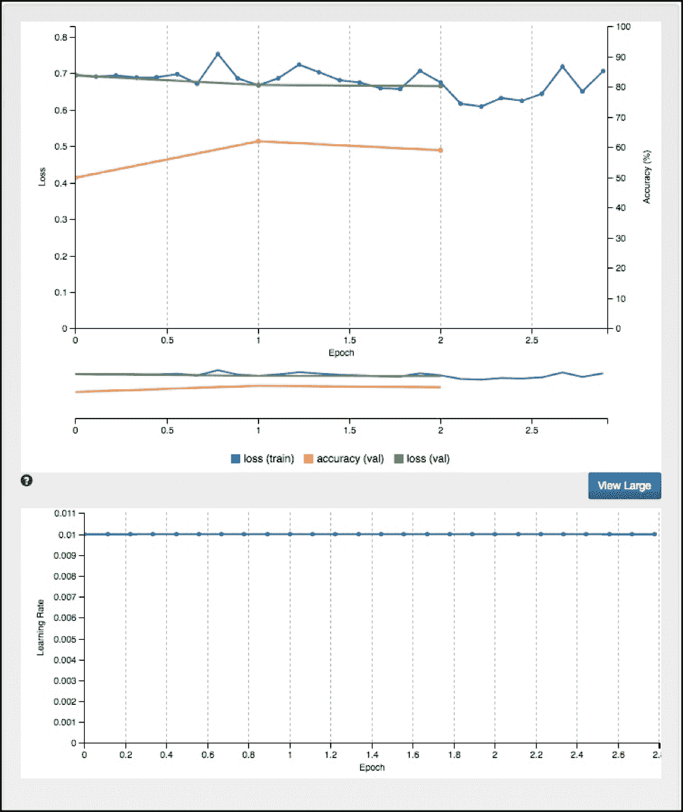
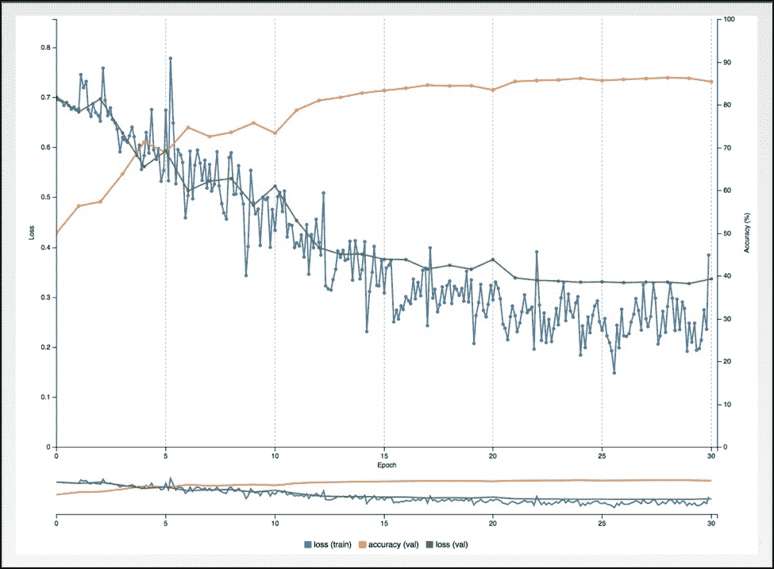
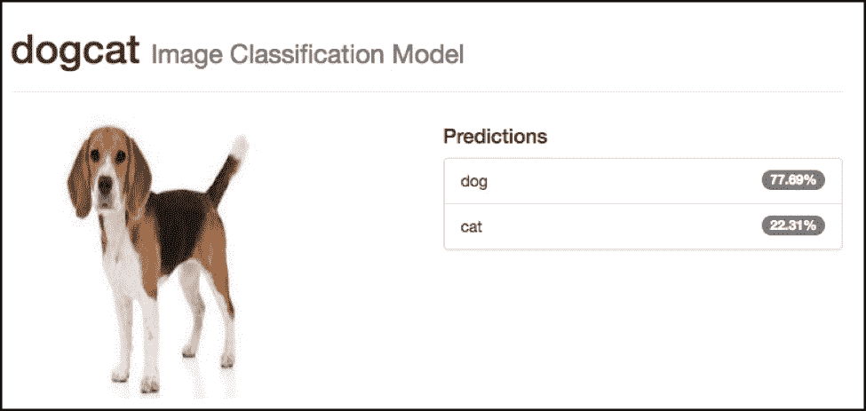
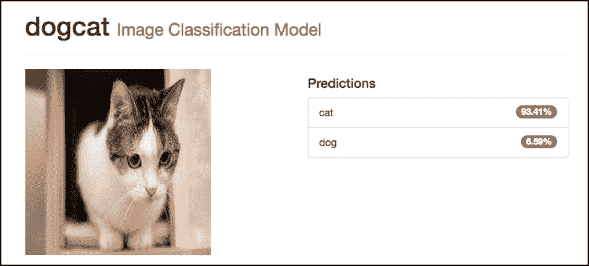
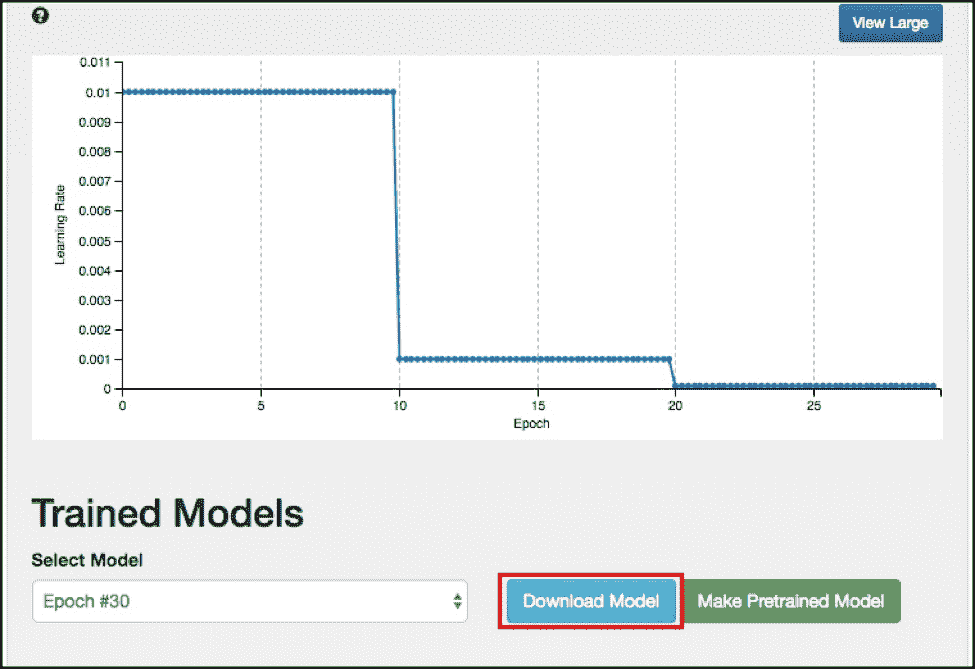
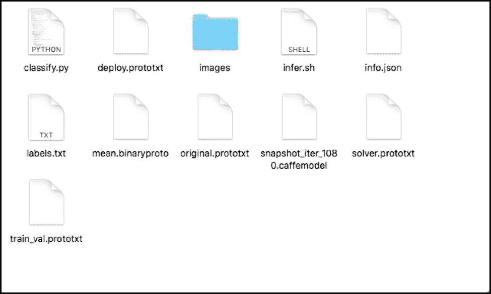

# 用 Nvidia 数字和 Caffe 训练一个卷积神经网络

> 原文：<https://thenewstack.io/train-a-convolutional-neural-network-with-nvidia-digits-and-caffe/>

在本系列的[上一部分](https://thenewstack.io/nvidia-digits-an-easy-way-to-get-started-with-deep-learning/)中，我介绍了 Nvidia DIGITS 作为一个用户友好的界面来构建深度学习模型。在本教程中，我将向您介绍构建能够对图像进行分类的卷积神经网络的步骤。我们将使用流行的猫对狗数据集来训练我们的模型。在本教程结束时，您将学会用数字训练模型并使用它进行推理所需的一切。

您需要一台带有 GPU 的 Linux 机器来构建模型。对于推理，任何可以运行 Docker 的操作系统都足够了。

## 准备环境

让我们从在运行 Nvidia DIGITS container 的主机上下载数据集开始。该数据集类似于 Kaggle 狗对猫比赛中使用的数据集。它包含了大约 4000 张猫和狗的图片，这对于本教程来说已经足够了。图像已经调整到 256×256 以跳过预处理。

由于数据集对于 Github 来说太大了，所以我把它上传到了 Google Drive。下载文件并解压到一个文件夹中。您应该看到两个目录，train 和 test。第一个目录包含每个类别的 2500 个图像，而测试目录包含大约 1500 个图像。

让我们通过映射包含训练和测试目录的文件夹来启动 Nvidia DIGITS Docker 容器。数据集将在容器内的*/数据*目录中变得可用。

```
$  docker run  --runtime=nvidia  --name digits  -d  -p  5000:5000  -v  $PWD:/data nvidia/digits

```

## 训练卷积神经网络

随着容器的启动和运行，我们可以在端口 5000 访问 web UI。



点击**数据集**选项卡，选择**分类**。



将数字指向训练和测试目录。给数据集命名并点击**创建。**



几分钟之内，DIGITS 将解析目录以创建三个数据库— train、val 和 test。

返回主页并选择**型号**选项卡。在**图像**下拉菜单下，选择**分类**。

选择在上一步中创建的数据集。在**标准网络**下，确保选择 **AlexNet** 。给模型命名，点击**创建**。



上述步骤启动了培训工作，这将需要几分钟的时间来完成。你会注意到精度随着每个历元而增加。此外，学习率随着每个时期而调整。



到第 30 个纪元时，该模型达到了 85%的准确率。



让我们用网络上的猫狗图片来测试我们训练好的模型。在**训练模型**下，浏览图像，点击**分类一个**。

我们的模型应该准确地将狗和猫分类。





恭喜你！您已经成功地构建了一个 CNN 模型，而没有编写一行代码。

下一步，我们将使用训练好的模型进行推理。

## 用 Caffe 进行模型推理

让我们在本地机器上运行训练好的模型。点击**下载模型**按钮，将开始下载压缩模型和重量。



克隆这个 [repo](https://github.com/janakiramm/digits-tutorial) ，它包含用于分类的 Python 代码，以及运行 Caffe Docker 容器进行推理的 shell 脚本。它还包含一些用于测试模型的示例图像。

解压缩下载的模型，并从克隆的 repo 的推理目录中复制所有文件。你的目录应该看起来像下面的截图。



将环境变量设置为 Caffe 模型文件，然后运行 infer.sh 脚本来执行推断。

```
$  export MODEL_NAME=snapshot_iter_1080.caffemodel
$  bash infer.sh images/1.jpg

```

这个命令将获取本地机器上 CPU 的 Caffe Docker 映像。

```
$  bash infer.sh images/1.jpg
Unable to find image  'bvlc/caffe:cpu'  locally
cpu:  Pulling from bvlc/caffe
22dc81ace0ea:  Pull complete
1a8b3c87dba3:  Pull complete
91390a1c435a:  Pull complete
07844b14977e:  Pull complete
b78396653dae:  Pull complete
efebd366640a:  Pull complete
4e325e9a951a:  Pull complete
384c8a5cd8c4:  Pull complete
0df2c13a8aa1:  Pull complete
41474c5b537e:  Pull complete
Digest:  sha256:1dd685def250ef965599c2794508aeddf8c4b91447c2e923ac0bf5e8ecf2a499
Status:  Downloaded newer image for bvlc/caffe:cpu
Processed  1/1  images in  0.344489  seconds  ...

-------------------------  Prediction for images/1.jpg  --------------------------

 78.1073%  -  "dog"
 21.8927%  -  "cat"

Script took  1.915341  seconds.

```

如果你试着发送一张猫的图片，你会看到下面的输出:

```
$  bash infer.sh images/3.jpg

Processed  1/1  images in  0.329652  seconds  ...

-------------------------  Prediction for images/3.jpg  --------------------------

 90.1773%  -  "cat"
   9.8227%  -  "dog"

Script took  1.849655  seconds.

```

让我们仔细看看 infer.sh

```
docker run  -it  --rm  --name caffe  -v  $PWD:/infer bvlc/caffe:cpu   bash  -c  "cd /infer &amp;&amp; python -W ignore classify.py -m mean.binaryproto -l labels.txt $MODEL_NAME deploy.prototxt $1 --nogpu"

```

该脚本实际上将当前目录与 Caffe 容器中的模型和权重进行了映射。然后，它调用 *classify.py* ,使用适当的参数，如模型名称、权重、标签和要分类的图像。

因为容器有 Caffe 框架和所有其他依赖项，所以它可以执行 *classify.py* 来运行推理。

本教程涵盖了通过运行在由 GPU 支持的 Linux 机器上的 Nvidia DIGITS 训练模型所涉及的工作流，并在 Mac 或 Windows 机器上使用相同的模型进行推理。

来自 via Pixabay 的猫和狗的特写图片。

<svg xmlns:xlink="http://www.w3.org/1999/xlink" viewBox="0 0 68 31" version="1.1"><title>Group</title> <desc>Created with Sketch.</desc></svg>