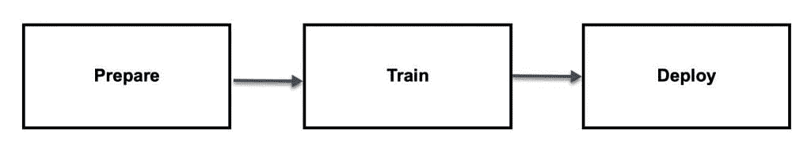
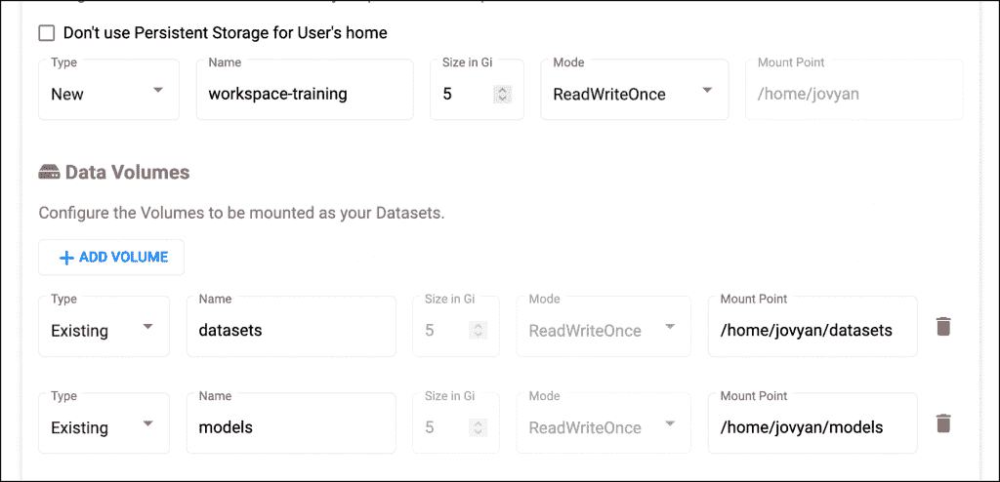
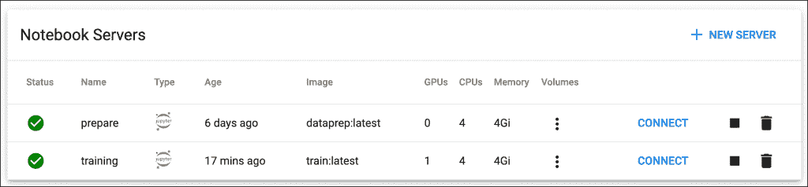
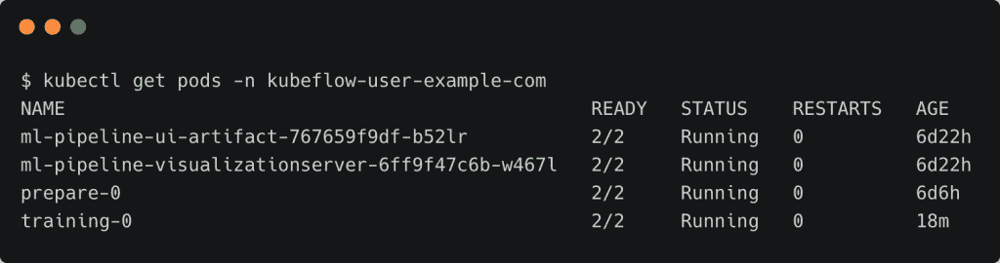
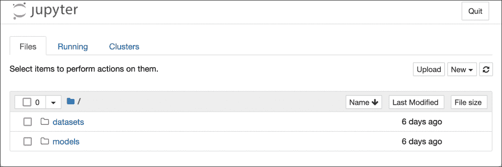
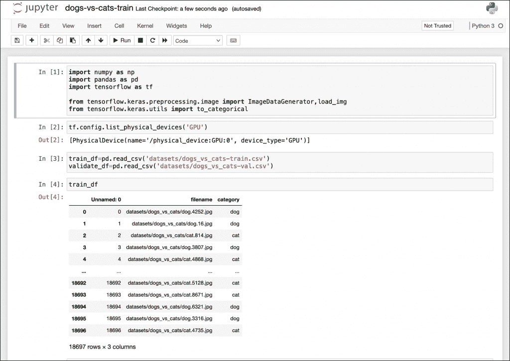
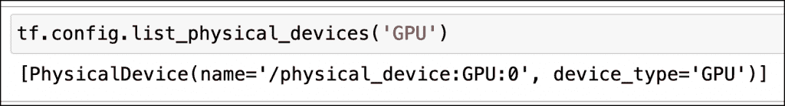
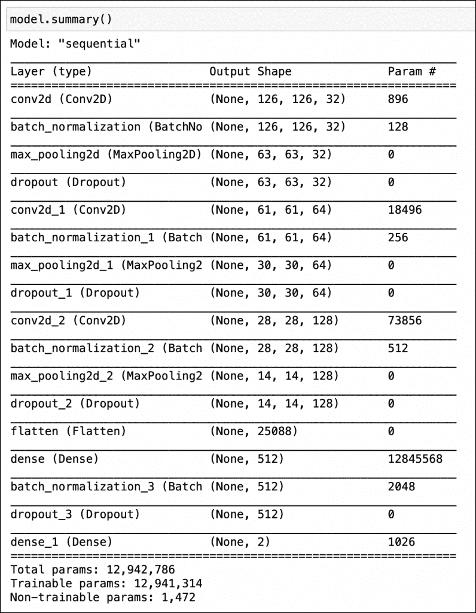
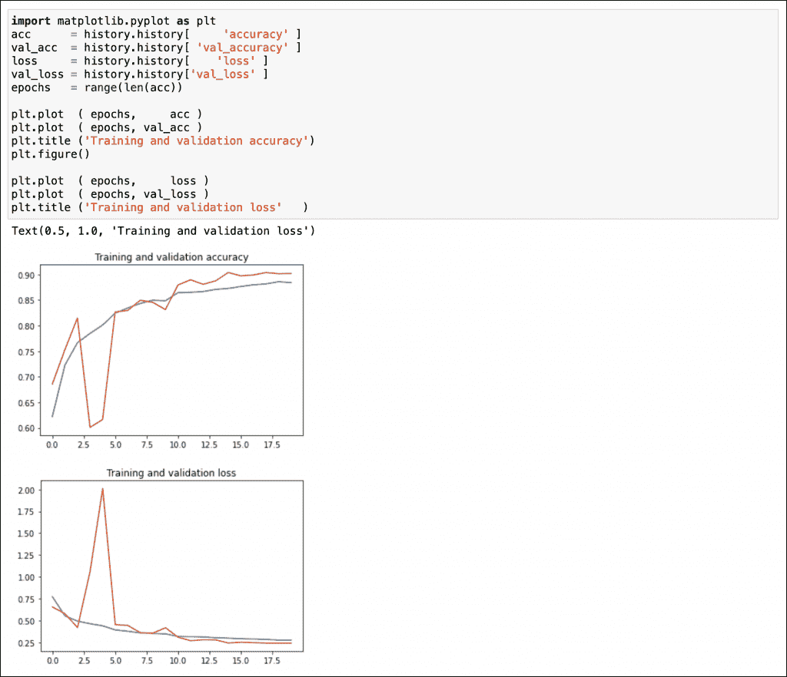
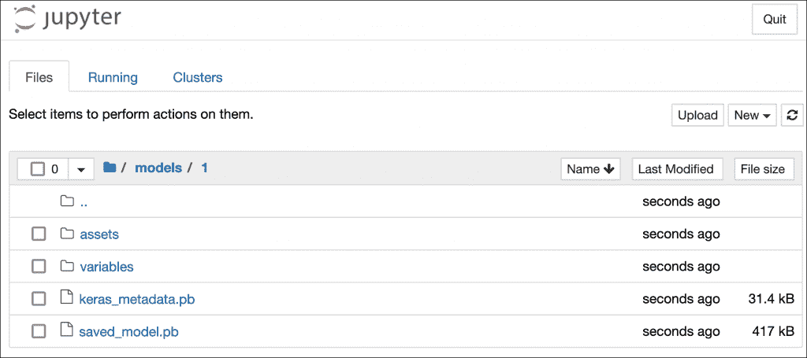

# 使用 Kubeflow Jupyter 笔记本电脑服务器训练 TensorFlow 模型

> 原文：<https://thenewstack.io/train-a-tensorflow-model-with-a-kubeflow-jupyter-notebook-server/>

本教程是

[explanatory series on Kubeflow](https://thenewstack.io/5-new-kubeflow-1-3-features-that-machine-learning-engineers-will-love/)

，谷歌流行的开源机器学习平台 Kubernetes。请每周五回来查看未来的分期付款。

在本系列的最后一部分中，我们发布了一个由共享 PVC 支持的定制 Jupyter 笔记本服务器来准备和处理原始数据集。在当前教程中，让我们利用数据集来训练和保存 TensorFlow 模型。保存的模型将存储在另一个共享的 PVC 中，该 PVC 将由部署笔记本服务器访问。

请记住，本系列的目的不是构建一个极其复杂的神经网络，而是展示 Kubeflow 如何帮助组织进行机器学习操作(MLOps)。



在继续本教程之前，请确保您已经完成了本系列的[上一部分](https://thenewstack.io/configure-a-kubeflow-jupyter-notebook-server-for-data-preparation/)中解释的步骤。

由于培训笔记本服务器可能会利用可用的 GPU，因此我们构建了针对 GPU 优化的自定义容器映像。如果您还没有构建容器映像，请参考本系列的第一部分。

培训笔记本服务器加载数据准备笔记本服务器保存的数据集，同时将模型持久化到第二 PVC 支持的`models`目录，第二 PVC 也支持 RWX 访问模式。

让我们开始启动笔记本电脑服务器。


由于培训环境需要更高的计算机能力，我们分配了四个 CPU 和 4gb 的 RAM。如果群集中有可用的 GPU，您可以将其与笔记本电脑服务器相关联。



让我们添加一个新的 PVC 卷，它将成为笔记本的主目录。除此之外，我们将附加现有的 PVC—`datasets`和`models` —来共享工件。`datasets`目录包含由数据科学家创建的预处理数据集。我们将用张量流模型填充`models`目录。

继续启动笔记本服务器。现在，您应该可以在 Kubeflow 仪表板中看到数据准备和模型训练服务器。



培训笔记本服务器本质上是属于 statefulset 的 Kubernetes pod。您可以使用下面的 kubectl 命令来验证这一点:

```
kubectl get pods  -n  kubeflow-user-example-com

```



当您连接到笔记本时，您将看到两个基于我们之前挂载的 PVC 的共享目录。



从 [GitHub 库](https://github.com/janakiramm/kubeflow-notebook-tutorial/raw/main/dogs-vs-cats-dataprep.ipynb)下载用于培训的 Jupyter 笔记本，上传到您的环境中，然后打开它。



让我们从导入 Python 库和模块开始。

```
import numpy as np
import pandas as pd
import tensorflow as tf

from tensorflow.keras.preprocessing.image import ImageDataGenerator,load_img
from tensorflow.keras.utils import to_categorical

```

我们将检查笔记本电脑服务器是否有可访问的 GPU。在我的环境中，我在 Kubeflow 集群中有一个可用的 GPU 节点。

```
tf.config.list_physical_devices('GPU')

```



从`datasets`共享目录中，让我们加载训练和验证数据集。

```
train_df=pd.read_csv('datasets/dogs_vs_cats-train.csv')
validate_df=pd.read_csv('datasets/dogs_vs_cats-val.csv')

```

我们将定义神经网络所期望的图像特征。

```
Image_Width=128
Image_Height=128
Image_Size=(Image_Width,Image_Height)
Image_Channels=3

```

让我们继续定义神经网络来训练模型。

```
from tensorflow.keras.models import Sequential
from tensorflow.keras.layers import Conv2D,MaxPooling2D,\
 Dropout,Flatten,Dense,Activation,\
 BatchNormalization

model=Sequential()

model.add(Conv2D(32,(3,3),activation='relu',input_shape=(Image_Width,Image_Height,Image_Channels)))
model.add(BatchNormalization())
model.add(MaxPooling2D(pool_size=(2,2)))
model.add(Dropout(0.25))

model.add(Conv2D(64,(3,3),activation='relu'))
model.add(BatchNormalization())
model.add(MaxPooling2D(pool_size=(2,2)))
model.add(Dropout(0.25))

model.add(Conv2D(128,(3,3),activation='relu'))
model.add(BatchNormalization())
model.add(MaxPooling2D(pool_size=(2,2)))
model.add(Dropout(0.25))

model.add(Flatten())
model.add(Dense(512,activation='relu'))
model.add(BatchNormalization())
model.add(Dropout(0.5))
model.add(Dense(2,activation='softmax'))

model.compile(loss='categorical_crossentropy',optimizer='rmsprop',metrics=['accuracy'])

```

这是一个简单的 17 层卷积神经网络。你可以用下面的语句来想象这个:



接下来，我们将定义用于训练的超参数。

```
from tensorflow.keras.callbacks import EarlyStopping,  ReduceLROnPlateau
earlystop  =  EarlyStopping(patience  =  10)
learning_rate_reduction  =  ReduceLROnPlateau(monitor  =  'val_accuracy',patience  =  2,verbose  =  1,factor  =  0.5,min_lr  =  0.00001)
callbacks  =  [earlystop,learning_rate_reduction]

```

让我们通过 ImageDataGenerator 来扩充数据:

```
train_df  =  train_df.reset_index(drop=True)
validate_df  =  validate_df.reset_index(drop=True)

total_train=train_df.shape[0]
total_validate=validate_df.shape[0]
batch_size=15

```

```
train_datagen  =  ImageDataGenerator(rotation_range=15,
                                rescale=1./255,
                                shear_range=0.1,
                                zoom_range=0.2,
                                horizontal_flip=True,
                                width_shift_range=0.1,
                                height_shift_range=0.1
                                )

train_generator  =  train_datagen.flow_from_dataframe(train_df,
 None,x_col='filename',y_col='category',
 target_size=Image_Size,
 class_mode='categorical',
 batch_size=batch_size)

validation_datagen  =  ImageDataGenerator(rescale=1./255)
validation_generator  =  validation_datagen.flow_from_dataframe(
    validate_df,  
    None,  
    x_col='filename',
    y_col='category',
    target_size=Image_Size,
    class_mode='categorical',
    batch_size=batch_size
)

```

我们现在已经准备好使用上面创建的网络和参数调用`model.fit`方法进行训练。

```
epochs=20
history  =  model.fit(
    train_generator,  
    epochs=epochs,
    validation_data=validation_generator,
    validation_steps=total_validate//batch_size,
    steps_per_epoch=total_train//batch_size,
    callbacks=callbacks
)

```

根据可用的计算能力，此步骤可能需要几分钟时间。

让我们绘制每个时期的训练和验证数据集的准确性和损失。

```
import matplotlib.pyplot as plt
acc      =  history.history[ 'accuracy'  ]
val_acc  =  history.history[  'val_accuracy'  ]
loss =  history.history[    'loss'  ]
val_loss  =  history.history['val_loss'  ]
epochs =  range(len(acc))

plt.plot  (  epochs, acc  )
plt.plot  (  epochs,  val_acc  )
plt.title  ('Training and validation accuracy')
plt.figure()

plt.plot  (  epochs, loss  )
plt.plot  (  epochs,  val_loss  )
plt.title  ('Training and validation loss' )

```



超过 90%，我们的模型已经达到了一个体面的准确性水平。

是时候我们将模型以 TensorFlow 的 SavedModel 格式保存到共享目录中了。

```
!mkdir  -p  models/1
model.save("models/1")

```



我们现在有一个经过训练的模型，可以对狗和猫的图像进行分类。在本系列的下一部分中，我们将部署这个模型进行推理。敬请关注。

<svg xmlns:xlink="http://www.w3.org/1999/xlink" viewBox="0 0 68 31" version="1.1"><title>Group</title> <desc>Created with Sketch.</desc></svg>