# 使用亚马逊 SageMaker 自动驾驶仪训练和部署机器模型

> 原文：<https://thenewstack.io/train-and-deploy-machine-models-with-amazon-sagemaker-autopilot/>

在 [AWS re:Invent 2019](/this-week-in-programming-aws-reinvent-for-developers/) ，[推出的亚马逊 SageMaker 自动驾驶](https://aws.amazon.com/blogs/aws/amazon-sagemaker-autopilot-fully-managed-automatic-machine-learning/)简化了训练机器学习模型的过程，同时提供了探索数据和尝试不同算法的机会。这是一个与众不同的 AutoML 平台，您可以下载数据探索和候选笔记本，了解数据准备、特征工程、模型训练和超参数调整。

在这个端到端的教程中，我将带您浏览 SageMaker Studio IDE 中基于二进制分类训练模型的步骤。

## 设置环境

假设您有一个有效的 AWS 帐户，请遵循[文档](https://docs.aws.amazon.com/sagemaker/latest/dg/onboard-quick-start.html)中提到的 SageMaker Studio 的入职流程。这将创建一个新的 IAM 角色，该角色具有访问 S3 存储桶和 SageMaker 环境的适当权限。

当 SageMaker Studio 准备就绪时，您可以访问 IDE 开始实验。

从 IDE 中，启动一个 Python 3 笔记本，并将其重命名为 acquire.pynb。我们将使用这个笔记本来获取和分割数据集。

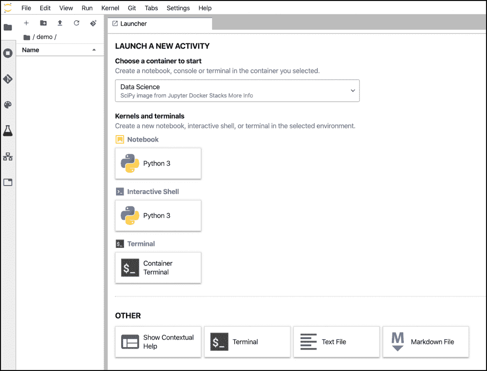

首先通过导入模块初始化环境，并获得 SageMaker Studio 使用的默认 S3 存储桶。

```
import sagemaker
import boto3
import pandas as pd
from sagemaker import get_execution_role

region  =  boto3.Session().region_name

session  =  sagemaker.Session()
bucket  =  session.default_bucket()
print(bucket)
prefix  =  'sagemaker/termdepo'

role  =  get_execution_role()

sm  =  boto3.Session().client(service_name='sagemaker',region_name=region)

```

首先，我们从 [Datahub.io](https://datahub.io/machine-learning/bank-marketing) 下载银行营销数据集，其中包含客户购买新定期存款决策的历史数据。

请随意探索 Datahub 中解释的数据集的模式。最后一列(类别)的值为 1 或 2，其中 1 代表否，2 代表是。

我们的目标是训练一个可以根据历史数据预测客户决策的模型。

```
!wget  -N  https://datahub.io/machine-learning/bank-marketing/r/bank-marketing.csv
local_data_path  =  'bank-marketing.csv'

```

我们现在将数据分为培训数据(80%)和测试数据(20%)。对于测试数据集，我们将删除标签(Class ),因为它将用于推理。

```
data  =  pd.read_csv(local_data_path)
train_data  =  data.sample(frac=0.8,random_state=200)
test_data  =  data.drop(train_data.index)
test_data  =  test_data.drop(columns=['Class'])

```

最后一步是将训练和测试数据集上传到默认的 S3 存储桶。

```
train_file  =  'train_data.csv';
train_data.to_csv(train_file,  index=False,  header=True)
train_data_s3_path  =  session.upload_data(path=train_file,  key_prefix=prefix  +  "/train")
print('Train dataset uploaded to: '  +  train_data_s3_path)

test_file  =  'test_data.csv';
test_data.to_csv(test_file,  index=False,  header=False)
test_data_s3_path  =  session.upload_data(path=test_file,  key_prefix=prefix  +  "/test")
print('Test dataset uploaded to: '  +  test_data_s3_path)

```

您可以验证用于创建训练和测试文件夹以及 CSV 文件的 S3 存储桶。

[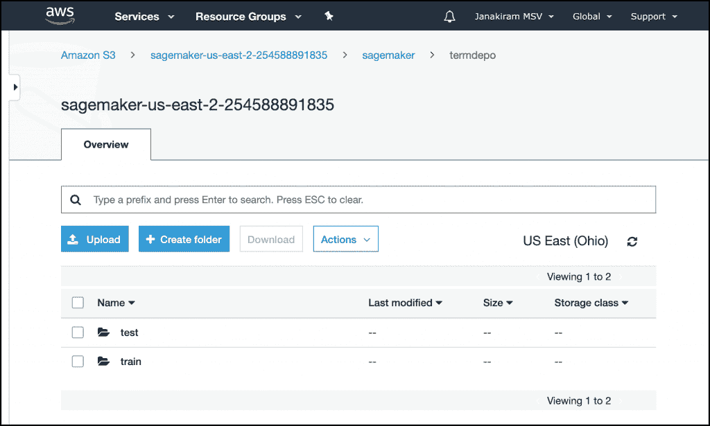](https://thenewstack.io/train-and-deploy-machine-models-with-amazon-sagemaker-autopilot/sm-ap-1-2/)

现在，我们将创建自动驾驶作业来训练模型。

### 创建一个自动驾驶实验

选择工具条中的实验图标，点击**创建实验**按钮。

我们需要提供以下详细信息:

**实验名称:**标识实验的任意名称。
**输入数据的 S3 位置:**训练数据集的 S3 路径。
**目标属性名称:**用于预测的标签。在我们的例子中，这是“类”。
**用于输出数据的 S3 位置:**用于存储模型和实验生成的其他工件的 S3 路径。
**机器学习问题类型:**这个可以留给 Auto 但是我们会选择二元分类。
**客观指标:**用于选择最佳候选人的指标。我们将使用 F1 作为度量标准。
**运行一个完整的实验:**可以只生成笔记本。在本教程中，我们将运行完整的实验。

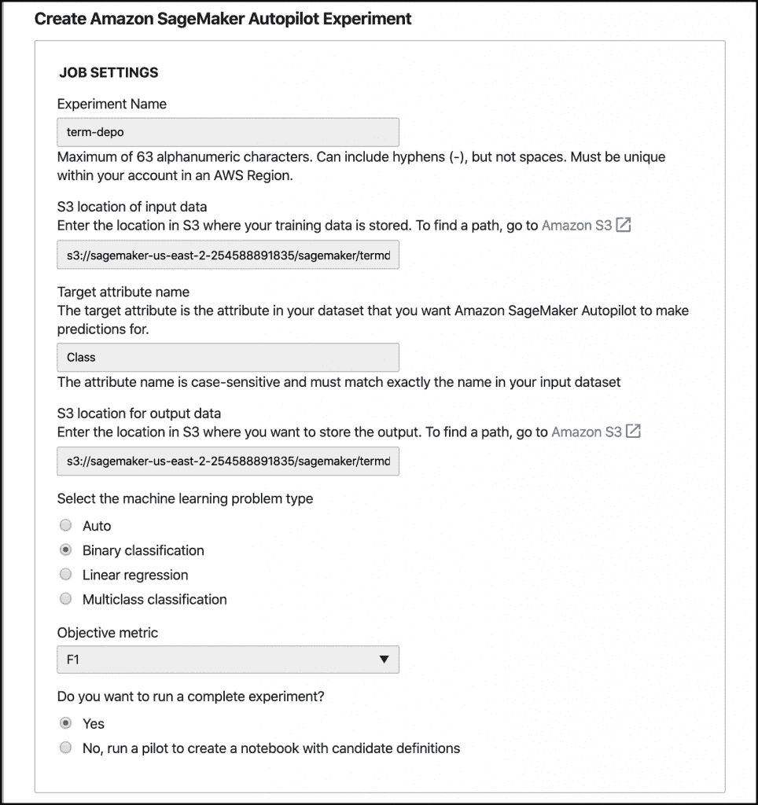

最后，点击位于右下角的**创建实验**按钮。这导致了实验的开始。

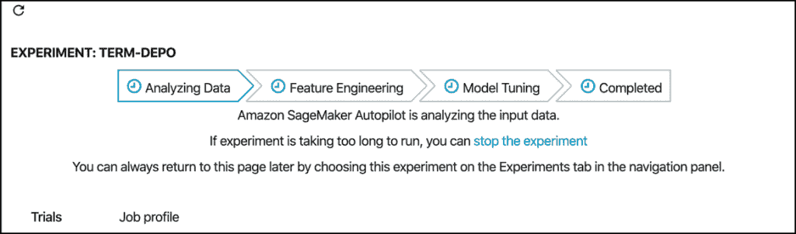

管道将从分析数据，特征工程，模型调整，并完成。整个过程大约需要 60 分钟，在此期间，我们可以探索实验产生的尝试。

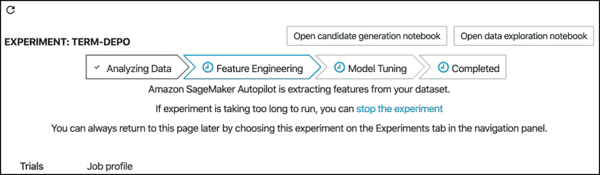

一旦第一阶段完成，我们可以访问候选人生成笔记本和数据探索笔记本。

“数据探索”笔记本分析数据集的质量，并推荐可能的改进措施。

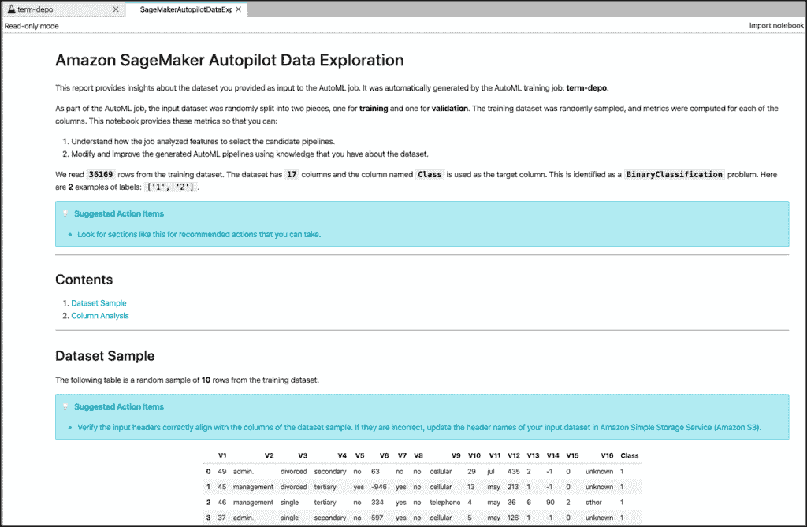

候选人定义笔记本允许为每个候选人定制管道并执行工作流。

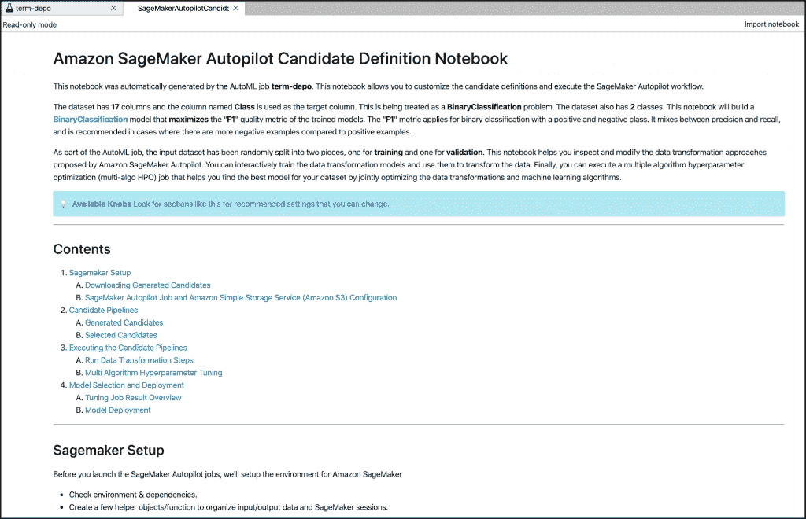

对于每次试验，SageMaker Autopilot 都会创建处理、转换、培训和调整工作，这些工作是流水线的一部分。通常，自动驾驶实验可能会产生多达 250 次试验，从中可以选择最佳候选人。S3 存储桶中的输出文件夹将包含每个作业生成的工件。

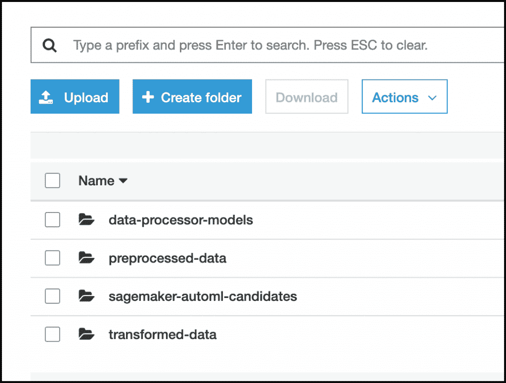

您可以等到实验结束，或者在客观指标得分达到可接受的水平后停止实验。

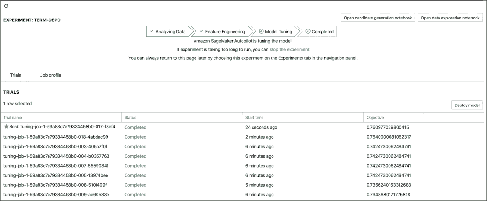

### 从最佳候选中部署模型

选择旁边标有星号的最佳作业，然后单击**部署模型**按钮，这将带我们进入模型部署 UI。为端点命名，选择一个实例类型，然后单击底部的按钮。

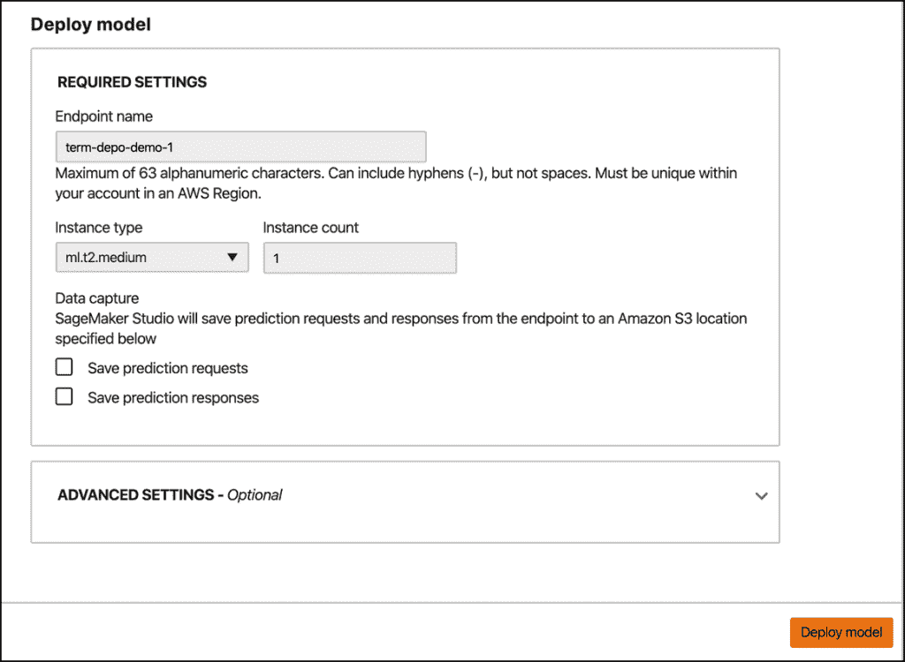

一旦模型被部署，它就会出现在端点部分。等待，直到状态变为正在使用。

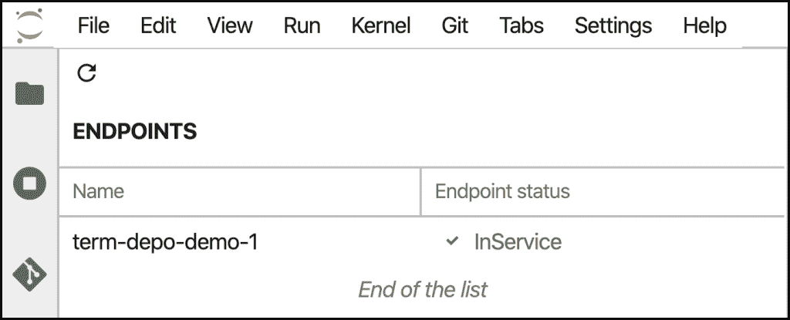

### 使用模型执行推理

切换到启动器并创建另一个名为 infer.ipynb 的笔记本来执行推理。

导入模块并为 SageMaker 运行时初始化客户端。

```
import sagemaker
import boto3
from sagemaker import get_execution_role

```

```
region  =  boto3.Session().region_name
sm_rt  =  boto3.Session().client('runtime.sagemaker',  region_name=region)

```

我们现在可以调用端点进行推理。

```
l="43,technician,divorced,unknown,no,4389,no,no,telephone,2,jul,632,2,85,1,success"
ep_name="term-depo-demo-1"
response  =  sm_rt.invoke_endpoint(EndpointName=ep_name,  ContentType='text/csv',  Accept='text/csv',  Body=l)
response  =  response['Body'].read().decode("utf-8")
print  (response)

```

尝试使用测试数据集中的值进行实验，以查看模型的不同分类结果。还可以通过发送整个测试数据集来执行批量推理。我们将在周五的下一部分教程中探索这一点，我们将使用 SageMaker Python SDK 进行自动驾驶。敬请关注。

*贾纳基拉姆·MSV 的网络研讨会系列“机器智能和现代基础设施(MI2)”提供了涵盖前沿技术的信息丰富、见解深刻的会议。在 http://mi2.live 注册即将到来的 MI2 网络研讨会*

<svg xmlns:xlink="http://www.w3.org/1999/xlink" viewBox="0 0 68 31" version="1.1"><title>Group</title> <desc>Created with Sketch.</desc></svg>