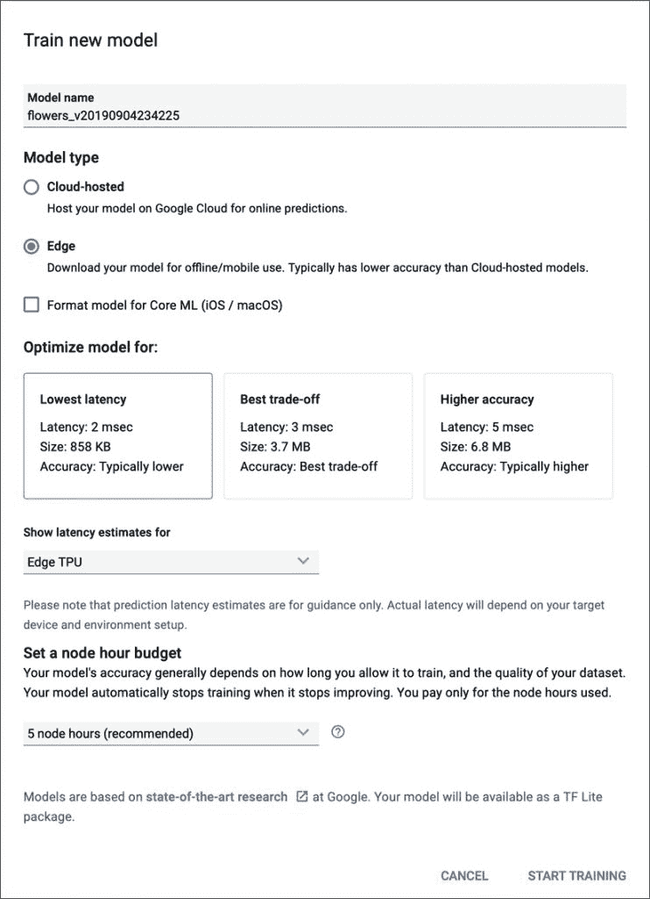
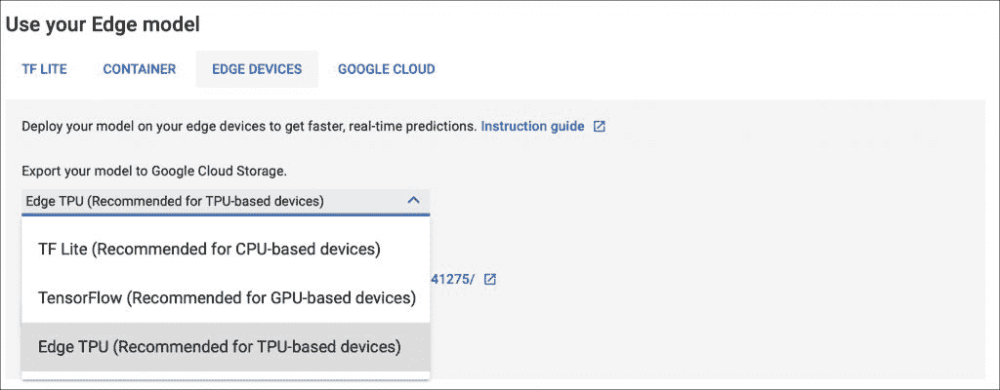
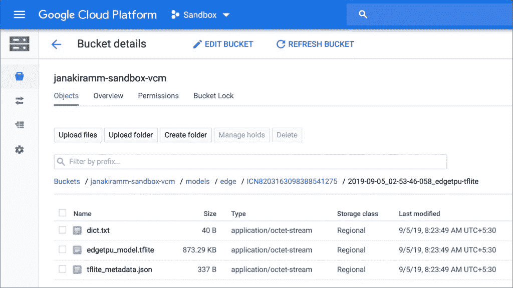
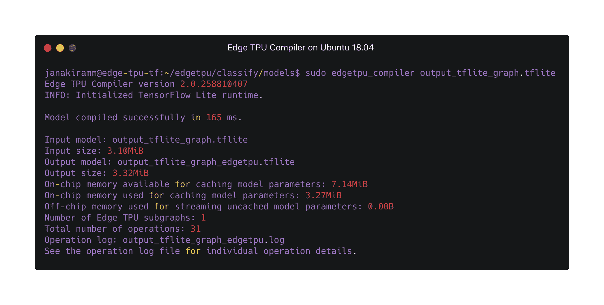

# 训练和部署针对 Google Edge TPU 优化的 TensorFlow 模型

> 原文：<https://thenewstack.io/train-and-deploy-tensorflow-models-optimized-for-google-edge-tpu/>

边缘计算设备正在成为运行深度学习模型的逻辑目的地。虽然公共云是培训的首选环境，但它是运行推理模型的边缘。由于大多数边缘设备都有可用 CPU 和 GPU 资源的限制，因此有专门构建的 AI 芯片来加速推理。这些人工智能加速器通过加速推理中涉及的计算来补充 CPU。它们旨在优化部署在边缘的神经网络的前向传播。

[谷歌边缘 TPU](https://cloud.google.com/edge-tpu/) 是市场上的人工智能加速器之一，针对推理模式下运行张量流模型进行了高度优化。开发者可以通过谷歌 Coral 开发工具包和 Coral USB 加速器开始使用 Edge TPU。关于这两款设备的详细配置和规格，请参考我之前的[文章](/how-the-google-coral-edge-platform-brings-the-power-of-ai-to-devices/)。

在 CPU，TPU 和 TPU 上训练典型 TensorFlow 模型不能直接部署在 TPU 边缘。这些模型需要进行转换和优化，才能充分利用 Edge TPU 提供的加速功能。

TensorFlow 开发人员熟悉 TensorFlow Lite，这是一个在移动、嵌入式和物联网设备上转换和运行 TensorFlow 模型的工具包。TensorFlow Lite 专为在资源受限的移动和嵌入式设备上高效运行模型而设计。将现有 TensorFlow 模型转换为 TF Lite 的工作流包括使用 Python SDK 或 CLI。来自 SavedModel 目录、冻结图、Keras HDF5 格式的模型可以通过 SDK 或 CLI 轻松转换为 TF Lite。转换后的模型可以在装有 TF Lite 解释器的移动或嵌入式设备上部署和运行。

TensorFlow Lite 解释器是一个库，它接受模型文件，对输入数据执行它定义的操作，并提供对输出的访问。该解释器跨多个平台工作，并为运行来自 Java、Swift、Objective-C、C++和 Python 的 TensorFlow Lite 模型提供了简单的 API。

不幸的是，Edge TPU 不支持 TF Lite 模型进行推理。开发人员预计将进一步优化边缘 TPU 的 TF Lite 模型。谷歌已经发布了一个命令行工具，用于转换和优化 Edge TPU 的 TensorFlow 模型。

TensorFlow 支持称为量化的模型优化技术，这是边 TPU 所需要的。量化一个模型本质上就是把所有的 32 位浮点数(比如权重和激活输出)转换成最接近的 8 位定点数。这种技术使模型更小更快。即使这会导致精度降低，该模型仍然保持可接受的精度水平。

由于 Edge TPU 执行深度前馈神经网络，因此它仅支持完全 8 位量化并专门针对 Edge TPU 编译的 TensorFlow Lite 模型。

本文讨论了在 Edge TPU 上训练、优化和部署张量流模型的两种具体机制。

## 谷歌云自动 ML 视觉

AutoML 试图通过自动化大多数步骤来加速训练模型的过程。用户需要上传数据集，并等待预测可用。从特征工程到超参数调整，AutoML 解决了管道中最复杂的步骤。

Google 是首批为视觉计算提供 AutoML 的公司之一。Cloud AutoML Vision 访问上传到云存储桶的图像数据集，并训练一个可供推断的模型。经过训练的模型可以托管在云中进行在线预测，也可以部署在边缘进行离线推理。有关使用云 AutoML 视觉的详细指南，请遵循之前发布的教程 I。

Cloud AutoML Vision 可以生成标准 TensorFlow Lite 模型，这些模型可以部署在包括 Raspberry Pi 在内的移动设备上。它还支持生成针对边缘 TPU 高度优化的模型。

【T2

一旦模型被训练，它可以针对目标推理环境被进一步优化。下面的屏幕截图显示了支持的设备。

该服务将 Edge TPU 优化的 TF Lite 模型上传到云存储桶，可以下载并部署用于推理。

另一种选择是训练一个标准的 TF Lite 模型，然后为 Edge TPU 编译它，这将在下一节中讨论。

使用 Cloud AutoML Vision 服务的最大好处是训练和生成模型的无代码方法。根据数据集的大小，模型将在几个小时内准备好。谷歌在连接 AutoML 视觉服务和 Edge TPU 方面做得非常出色。

### 结合 Edge TPU SDK 和 CLI 的迁移学习

另一种技术是使用强大的迁移学习过程来训练模型，并针对边缘 TPU 对其进行优化。这种方法可以更好地控制神经网络结构和超参数的调整。

从头开始训练卷积神经网络可能需要几天甚至几周的计算时间，并且需要大量的训练数据。但是迁移学习允许开发人员从已经为类似任务训练过的现有神经网络架构开始，然后执行进一步的训练，以教会模型使用较小的训练数据集对新数据点进行分类。我们可以通过重新训练整个模型(调整整个网络的权重)来实现这一点，但我们也可以通过简单地删除执行分类的最后一层，并在其上训练一个新层来识别新的类别，来实现非常准确的结果。

例如，我们可以采用现有的 MobileNet 模型，并重用它来训练一个将狗图像分类为一个品种的模型。由于 90%的神经网络架构保持不变，训练只需几分钟。

一旦从基于迁移学习的训练中生成了模型，就可以很容易地将其转换成针对边缘 TPU 优化的 TF Lite 模型。  谷歌发布了为 Edge TPU 优化的热门机型供下载。这些模型可以用作执行迁移学习的基线。其中一些模型甚至可以用于设备上的培训，整个培训过程在 Google Coral Dev Kit 上运行，无需使用云或强大的计算环境。因为 Dev Kit 有足够的能力，所以可以利用它通过迁移学习来训练基于较小数据集的模型。

谷歌不仅将云 TPU 扩展到了边缘，还让开发人员能够轻松地为边缘 TPU 转换和优化 TensorFlow 模型。

*贾纳基拉姆·MSV 的网络研讨会系列“机器智能和现代基础设施(MI2)”提供了涵盖前沿技术的信息丰富、见解深刻的会议。在 [http://mi2.live](http://mi2.live/) 注册参加即将到来的 MI2 网络研讨会。*

<svg xmlns:xlink="http://www.w3.org/1999/xlink" viewBox="0 0 68 31" version="1.1"><title>Group</title> <desc>Created with Sketch.</desc></svg>