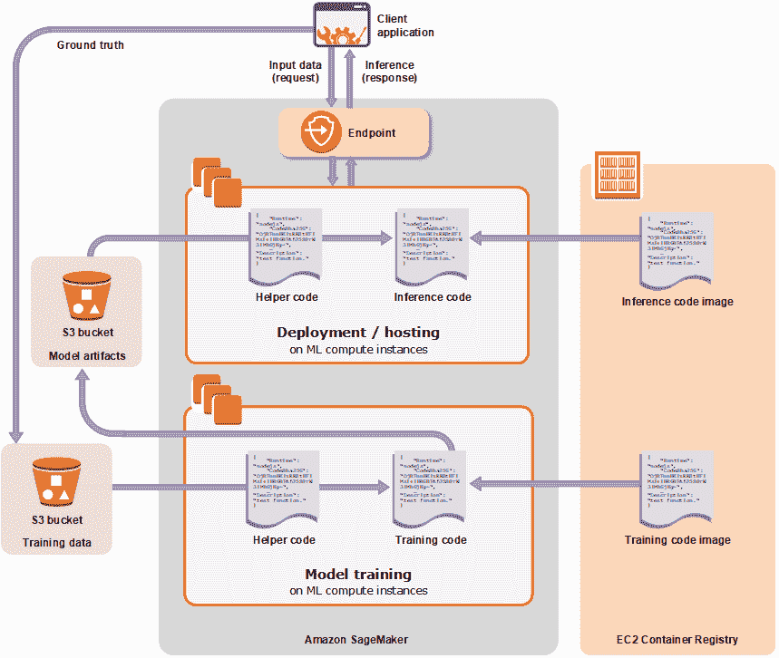

# 用亚马逊 SageMaker 训练、部署机器学习模型

> 原文：<https://thenewstack.io/train-deploy-machine-learning-models-with-amazon-sagemaker/>

编者按:本文是我们探索基于云的机器学习服务系列的一部分。在介绍了 Azure ML 服务和 Google Cloud ML 引擎之后，我们将进一步了解 Amazon SageMaker。

在 re:Invent 2017 上宣布， [Amazon SageMaker](https://docs.aws.amazon.com/sagemaker/latest/dg/whatis.html) 是 AWS 的一项托管机器学习服务。它支持在云端训练和托管机器学习模型。客户可以在 NVIDIA Tesla K80 和 P100 GPU 支持的集群上运行培训任务。训练作业的结果——一个准备好进行推理的模型——可以作为 REST API 公开，提供可伸缩的预测。

该服务还支持超参数调整，数据科学家和开发人员可以在该服务的帮助下找到最适合给定算法和业务问题的最佳参数。例如，为了解决一个典型的回归问题，超参数调整会猜测哪些超参数组合可能会获得最佳结果，并运行训练作业来测试这些猜测。测试第一组超参数值后，超参数调整使用回归来选择要测试的下一组超参数值。

亚马逊 SageMaker 最好的设计决策之一是使用 [Jupyter 笔记本](http://jupyter.org/)作为开发工具。鉴于笔记本在数据科学家中的熟悉度和受欢迎程度，进入门槛很低。AWS 已经构建了一个原生 Python SDK，可以与 NumPy、Pandas 和 Matplotlib 等标准模块混合和匹配。

Amazon SageMaker 与相关的 AWS 服务紧密集成，可以轻松处理模型的生命周期。通过 Boto3，用于 AWS 的 Python SDK，可以从亚马逊 S3 桶中存储和检索数据集。数据也可以从云中的数据仓库 Amazon Redshift 导入。该服务与 IAM 集成，用于身份验证和授权。使用 Amazon EMR 运行的 Spark 集群可以与 SageMaker 集成。AWS Glue 是数据转换和准备的首选服务。

Docker 容器在 SageMaker 的架构中起着关键作用。AWS 为流行的算法提供容器图像，如线性回归、逻辑回归、主成分分析、文本分类和对象检测。开发人员应该在开始训练作业之前将数据集的位置和一组参数传递给容器。然而，高级 Python API 抽象了处理容器所涉及的步骤。最后，经过训练的模型还被打包成容器映像，用于展示预测 API。SageMaker 依赖 Amazon EC2 容器注册表来存储图像，依赖 Amazon EC2 来托管模型。

Amazon SageMaker 有三个基本组件——托管 Jupyter 笔记本、分布式培训作业和展示预测端点的模型部署。

让我们仔细看看在亚马逊 SageMaker 中部署的机器学习模型中进行训练和预测所涉及的步骤。

## 数据准备和探索

亚马逊 SageMaker 预计该数据集将在 S3 桶中可用。在上传数据之前，客户可以选择在外部服务中执行 ETL 操作，如 AWS Glue、AWS Data Pipeline 或 Amazon Redshift。

数据科学家可以使用包括 Pandas 和 Matplotlib 在内的熟悉工具来探索和可视化数据。

在准备和探索数据之后，数据集被转换成 SageMaker 模型所期望的格式。因为该平台在 Apache MXNet 中有很强的根基，所以它使用框架中定义的张量数据类型。在将数据集上传到 S3 存储桶之前，需要将 NumPy 数组和 Pandas 数据帧序列化为 MXNet 张量。

### 模型选择和培训

亚马逊 SageMaker 有内置算法，可以抽象训练模型的底层细节。每种算法都可以作为一个 API 使用，该 API 将数据集和指标作为参数。这消除了在选择合适的培训框架时的困惑。一旦开发人员决定使用什么算法，就要调用映射到该特定算法的 API。

在幕后，SageMaker 使用 Apache MXNet 和 Gluon 框架将 API 翻译成创建作业所需的多个步骤。这些算法被打包成存储在 Amazon ECR 中的容器映像。

除了 Apache MXNet，SageMaker 还将 TensorFlow 作为原生框架公开。开发人员可以编写代码来创建自定义张量流模型。

也可以使用定制框架，如 PyTorch 和 Scikit-learn。SageMaker 希望这些框架封装在容器映像中。Amazon 发布了说明性指南，其中包含用于创建自定义图像的 Dockerfile 和 helper 脚本。就在启动训练作业之前，使用低级 Python API，Amazon SageMaker 可以指向自定义映像，而不是内置映像。

### 模特培训

Amazon SageMaker 的培训作业运行在基于 Amazon EC2 实例的分布式环境中。API 需要实例数量和实例类型来运行培训作业。对于训练复杂的人工神经网络，SageMaker 希望基于 K80 或 P100 GPU 的 ml . p 3.2 x 大型或更好的实例类型。

从 Jupyter 笔记本启动时，培训作业会同步运行，显示基本进度日志，并等到培训完成后再返回。

### 模型部署

在 Amazon SageMaker 中部署模型是一个两步过程。第一个是关于创建一个端点配置，指定用于部署模型的 ML 计算实例。第二步是启动 ML 计算实例，部署模型，并显示用于预测的 URI。

端点配置 API 接受 ML 实例类型和实例的初始计数。对于推理神经网络，配置可以包括 GPU 支持的实例类型。端点 API 按照上一步中的定义提供基础设施。

Amazon SageMaker 既支持在线预测，也支持批量预测。批处理预测使用训练好的模型来获取存储在亚马逊 S3 中的数据集的推理，并将推理保存在创建批处理转换作业期间指定的 S3 存储桶中。

与谷歌云 ML 引擎和 Azure ML 服务相比，亚马逊 SageMaker 缺乏使用本地计算资源来训练和测试模型的能力。开发人员被期望创建托管笔记本，甚至为简单的 ML 项目创建用于训练和预测的实例，这使得服务昂贵。

预计亚马逊将在今年的 re:Invent 上宣布 SageMaker 的多项增强功能。

在本系列的下一部分，我将介绍另一个 ML PaaS。敬请期待！

<svg xmlns:xlink="http://www.w3.org/1999/xlink" viewBox="0 0 68 31" version="1.1"><title>Group</title> <desc>Created with Sketch.</desc></svg>