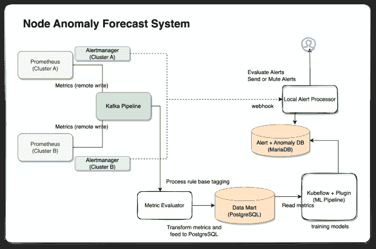

# 训练 ML 模型预测 Kubernetes 节点异常

> 原文：<https://thenewstack.io/training-a-ml-model-to-forecast-kubernetes-node-anomalies/>

这是 10 月 24-28 日 KubeCon + CloudNativeCon 系列文章的一部分。

毫不奇怪，[使用人工智能来改善 It 系统运营](https://docs.broadcom.com/doc/why-machine-learning-for-enterprise-it-operations)受到关注，因为专家认为它有五个好处:主动管理、更快修复、提高生产力、高效协作和提高应用程序性能的能力。

使用机器学习来预测系统异常和减少警报噪音被认为是提高 IT 运营性能的关键领域。开源/标准栈(如 Kubernetes 和 Prometheus)的使用越来越多，支持收集高质量的数据，如指标和日志，机器学习的准确性越来越高，这推动了[采用它](https://www.gartner.com/en/newsroom/press-releases/2021-10-18-gartner-survey-of-over-2000-cios-reveals-the-need-for-enterprises-to-embrace-business-composability-in-2022)。

## 挑战

然而，为了提高机器学习的准确性，组织需要收集适当的数据集来训练机器学习模型。为此，需要发生各种类型的中断，并且必须连续收集来自相关监控目标的信息(如度量、事件和日志)并将其提供给模型，以提高其准确性。

即使单个组织连续收集数据集，也需要收集相当长一段时间的大规模数据，才能在机器学习模型中达到一定的精度水平。这需要努力标记监控目标是否处于异常状态。此外，验证 ML 模型的结果是困难和劳动密集型的。

## 方法

为了克服这些挑战并应用机器学习来预测计算资源的异常，我的团队设计了一种想法，即在初始阶段使用[贝叶斯网络](https://machinelearningmastery.com/introduction-to-bayesian-belief-networks/)方法来保护训练数据。贝叶斯网络从专家的规则集开始，以获得一定水平的模型性能。这种想法将帮助组织收集基本数据集来训练模型，即使他们实际上没有足够的数据来这样做。

此外，我们的团队旨在监控 Kubernetes 节点，因为可以安装 Prometheus、Node Exporter 和 cAdvisor 等标准开源软件来生成数据集，以评估 Kubernetes 资源的异常情况。

我们选择 Kafka 和 Prometheus-Kafka 适配器作为度量管道接收来自 Prometheus 的度量提要。为了从 Kafka 的主题中接收数据并提供学习数据集，我们的团队决定开发一个指标评估引擎，使用系统专家的规则库来消费和预评估指标。

来自引擎的预评估结果被存储在用于机器学习流水线的数据集市中。机器学习管道配置在 Kubeflow 上，这是一个运行在 Kubernetes 上的机器学习管道平台。选择 TensorFlow 机器学习引擎来预测异常模型，评估结果存储在 MariaDB 中。

## 实施细节

下图显示了整体解决方案架构，描述了从指标馈送到保存评估结果的整个流程。

从 Prometheus 的指标收集流程到机器学习模型的指标评估，应在 30 秒内处理指标。默认的普罗米修斯度量收集间隔是 30 秒。30 秒到 1 分钟的时间间隔被广泛认为是系统监控的最佳实践。这意味着从普罗米修斯到机器学习模型的异常预测的度量管道应该在 30 秒内完成。

在 Kubernetes 集群中，Node Exporter、cAdvisor 和 Kubernetes 提供的指标是每分钟 5，000 次。然而，Kubernetes 节点和 pod 异常预测的必备指标的数量根据您所查看的数量而有所不同。每个 Kubernetes 资源大约有 40 到 50 个指标就足够了，因此该流程需要能够过滤必须的指标，以最大限度地减少数据处理时间。

指标评估器使用与 CPU、内存、文件系统和网络相关的指标，应用专家指南中的预设规则，对目标节点进行预评估，并每 30 秒保存一次评估结果。实现的管道能够处理来自集群的指标，但是有时需要 30 多秒来完成管道过程。

机器学习管道每 30 秒读取一次预评估结果，并将结果反馈给训练模型以及评估系统异常，以便信息可用于 IT 运营。保存的评估结果可用于消除警报噪音和主动管理系统中断。

## 实施带来的影响

在管道和系统部署之后，很难训练机器学习模型，因为连续几天没有中断或集群问题。因此，我们的团队必须诱导一种情况，以便管道可以产生预评估结果来训练模型。

如果需要监控两个以上的 Kubernetes 集群，端到端处理可能需要 30 秒以上，除非管道流程是水平扩展的。我们考虑调整指标过滤器逻辑来减少目标指标，以缩短处理时间，但是我们的团队决定使用 1 分钟的处理时间，以便不丢失业务上下文。

评估结果主要由关键指标来解释，如 CPU 使用率、内存使用率、存储、高网络流量和丢弃的数据包。指标对异常的剩余影响相当低。创建更微妙的机器学习模型可能需要更长的训练时间。

团队还在讨论什么时候可以关闭基于规则的预评估来训练模型，目前还没有关闭。

自动化和监控管道是成功的关键因素，因为整个过程相当复杂。

## 改进机会

总体而言，反馈过程至关重要。IT 运营团队应该能够为成功或失败的案例提供关于异常检测的反馈，并将反馈反馈给机器学习模型。

Kubernetes 资源之间的相关性也需要被视为模型的输入之一。Pod 和卷异常可能是节点故障的原因，并且机器学习模型将被改进以适应这种相关性。

除了度量标准之外，各种变量(如 Kubernetes 事件和应用程序日志)也有助于提高模型的性能。

*要了解更多关于云原生的话题，请参加 10 月 24 日至 28 日在底特律举行的 KubeCon + CloudNativeCon 北美 2022(和虚拟)上的云原生计算基金会和云原生社区。*

<svg xmlns:xlink="http://www.w3.org/1999/xlink" viewBox="0 0 68 31" version="1.1"><title>Group</title> <desc>Created with Sketch.</desc></svg>