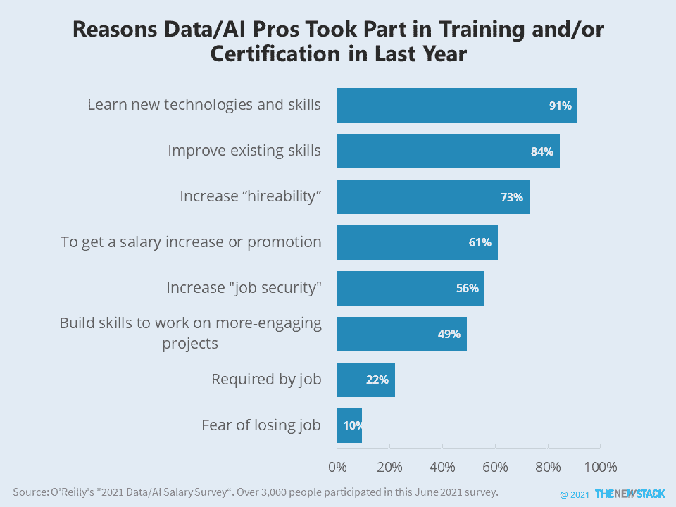

# 培训:数据/人工智能专家的努力会有回报

> 原文：<https://thenewstack.io/training-hard-work-pays-off-for-data-ai-pros/>

数据和人工智能(AI)专业人士并不特别担心他们的工作或金钱，但这并没有阻止他们学习新技能。

[“2021 年数据/人工智能薪酬调查”](https://www.oreilly.com/radar/2021-data-ai-salary-survey/)对 3000 多名奥莱利的*数据&人工智能简讯*的订户进行了调查，发现其主要美国观众的平均年薪为 14.6 万美元。尽管如此，这个自我激励的群体中有 64%的人在去年参加了某种类型的培训或认证项目。

学习的理由从来都不是只有一个，但 91%的调查对象都提到了培养新技能，这表明他们天生就有好奇心。通用术语“可雇佣性”和“工作保障”分别被 73%和 56%的人引用。只有 22%的人把培训作为工作要求，或者是因为他们害怕失去工作。

最有趣的是，61%的人训练自己，因为他们相信这将导致加薪或升职。调查发现，这种情况只有在你长时间工作的情况下才会发生。几乎三分之一接受培训的人为此付出了超过 100 个小时的努力，他们得到了平均 11000 美元的加薪。但问题是:其他人的平均加薪是 9252 美元，包括那些根本没有接受培训的人。

换句话说，如果你没有全身心投入，还不如坐以待毙，等待你的生活成本上涨。

<svg xmlns:xlink="http://www.w3.org/1999/xlink" viewBox="0 0 68 31" version="1.1"><title>Group</title> <desc>Created with Sketch.</desc></svg>