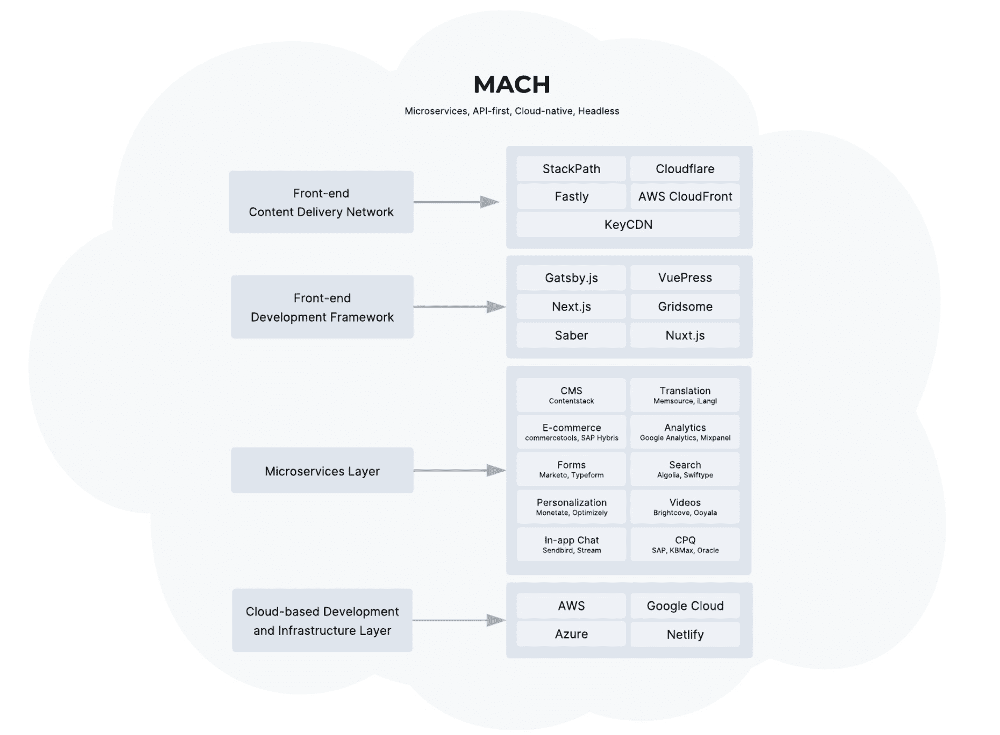

# 使用 MACH 改造您的架构，使其面向未来

> 原文：<https://thenewstack.io/transform-and-future-proof-your-architecture-with-mach/>

 [尼尚·帕特尔

尼尚·帕特尔是 Contentstack 的首席技术官和联合创始人。此前，Nishant 是 Built.io 的创始人、首席执行官兼首席技术官，该公司于 2018 年 9 月被德国软件巨头 Software AG 收购。Nishant 是一位技术梦想家，拥有丰富的软件产品开发经验，推动了数字化转型和 API 经济的发展。凭借 20 多年解决复杂技术问题的经验，Nishant 已成为许多财富 500 强公司尊敬和信赖的技术顾问。Nishant 拥有俄亥俄州立大学的计算机科学学士学位。](http://www.contentstack.com/) 

为了在当今市场中保持竞争力，公司需要不断创新，以跟上技术进步和消费者不断提高的期望。

可悲的事实是，许多老牌公司都被笨重的传统基础设施系统拖垮了。因为这些单体系统需要如此多的资源来管理、维护和升级，所以创新往往处于次要地位。

通常，这些公司发现自己被锁定在一个套件生态系统中，因为当他们建立基础架构时，不需要像今天这样的全渠道交付。此外，管理一个软件供应商似乎比处理多个不同供应商的采购、财务和治理问题要简单得多。

这带来了一些问题。首先，这些供应商中的大多数倾向于将一两件事情做得非常好，而他们套件中的其他产品不太可能与现有的同类最佳产品相比。

第二个问题，也可能是更关键的问题，是许多套件方法供应商仍在转型和转向基于云的服务的阵痛中。

这意味着他们正花费大量精力试图赶上更敏捷的竞争对手。反过来，他们可能没有在创新方面投入足够的资源来为客户提供竞争优势，这意味着他们在拖客户的后腿。

由于自满，这些供应商辜负了他们的客户。他们应该在几年前就迁移到云，并帮助他们的客户适应新的运营方式。

突然间，他们的客户意识到他们落后了，不得不匆忙转变他们的业务模式和底层基础架构，以保持未来的竞争力。

## 为什么如此多的公司仍然与单一供应商保持着这种“糟糕的婚姻”?

对于这些企业中的许多企业来说，他们的遗留系统代表了多年的资本和人力资源投资。因为他们已经投入了太多，做出改变感觉就像承认他们犯了一个错误并放弃了。

另一个起作用的因素是，陷入传统基础架构的企业通常对转型需要什么存在误解。大多数人认为，转型意味着他们将不得不进行大规模的改革，这可以理解为势不可挡。

事实是，这不是他们的错。这些公司相信他们的供应商会把他们的最大利益放在心上，但是他们让他们失望了。但好消息是，一次一个项目地逐步改造企业的基础设施是完全可能的。

## 输入马赫

如今，越来越多的 MACH 供应商支持公司构建基于云的技术堆栈，为其每一项业务需求选择最佳服务。

MACH 代表微服务、API 优先、云原生和无头。让我们仔细看看这些术语的含义:

*   **微服务**–不同的业务功能由独立的软件处理。
*   **API 优先**–所有功能都通过应用编程接口(API)交付。
*   **云原生**–基于云的软件即服务(SaaS)利用云的所有功能，允许快速扩展。更新由供应商管理。
*   **无头**–前端表示与后端逻辑完全分离。无头解决方案与通道、设备、框架和编程语言无关。

MACH 技术本质上是模块化和可扩展的，这意味着它们使公司能够为每种功能选择最佳产品，构建一流的技术堆栈，为客户提供最佳体验。

构建一个 MACH 堆栈意味着让您的业务面向未来，而无需亲自动手。随着技术的进步和趋势的变化，敏捷机器驱动的供应商负责更新和升级功能，使他们的客户保持在创新的前沿。

MACH 架构的模块化方法意味着添加、删除或更新功能不会导致停机，因此公司可以推出新的服务，并根据需要逐步或快速地发展他们的技术堆栈。此外，它们不受套件产品常见的供应商锁定的影响，因为如果有更好的模块可用，它们可以简单地替换单个模块。

全球烘焙配料供应商 [Dawn Foods](https://www.prnewswire.com/news-releases/recipe-for-e-commerce-success-dawn-foods-goes-headless-to-bring-rich-b2b-e-commerce-experience-to-bakers-301087467.html) 最近使用 MACH 方法转变了其运营，推出了一个全新的无头 B2B 电子商务平台。在过去，所有的销售都是通过电话或亲自进行的，而 Dawn Foods 的新平台允许客户点击一下就可以购买其丰富的目录和订单。

为此，Dawn Foods 与 commercetools 合作开发了无头电子商务平台，与 Contentstack 合作开发了无头 CMS，与 EPAM Systems 合作开发了开发服务。使用无头架构意味着管理全渠道内容和快速推出现代化的、引人入胜的客户体验要容易得多。内容管理者可以发布、更新或续订内容，而无需 IT 部门的帮助。

自推出该平台以来，Dawn Foods 根据客户反馈对前端用户界面进行了 40 多项改进。这些措施包括更新产品信息，以回答所有客户关于营养成分等的问题，并推出购物清单等附加功能。

根据 Dawn Foods 首席数字官 Bob Howland 的说法，快速更新客户界面以响应客户需求而无需更新商业引擎代码的能力是他们选择创建一个可组合和无头技术堆栈的关键原因。

## 实施 MACH

实施 MACH 并不意味着立刻彻底检查您的整个基础设施。采取爬行-行走-运行的方法，从推出一个 MACH 驱动的项目或平台开始。

选择敏捷、同类最佳的技术，在您的团队中培养能力，并让他们熟悉 MACH 方法。请记住，成功的转型不仅仅是更新您的技术，还与人员和流程有关。

就像黎明食品一样，你需要决定采取行动来保持未来的竞争力。一旦做出决定，就要靠领导层来铺平道路，让采购、财务和治理团队准备好应对多个供应商，并在整个组织中稳步实施马赫原则，并逐步推出转型改进。

<svg xmlns:xlink="http://www.w3.org/1999/xlink" viewBox="0 0 68 31" version="1.1"><title>Group</title> <desc>Created with Sketch.</desc></svg>