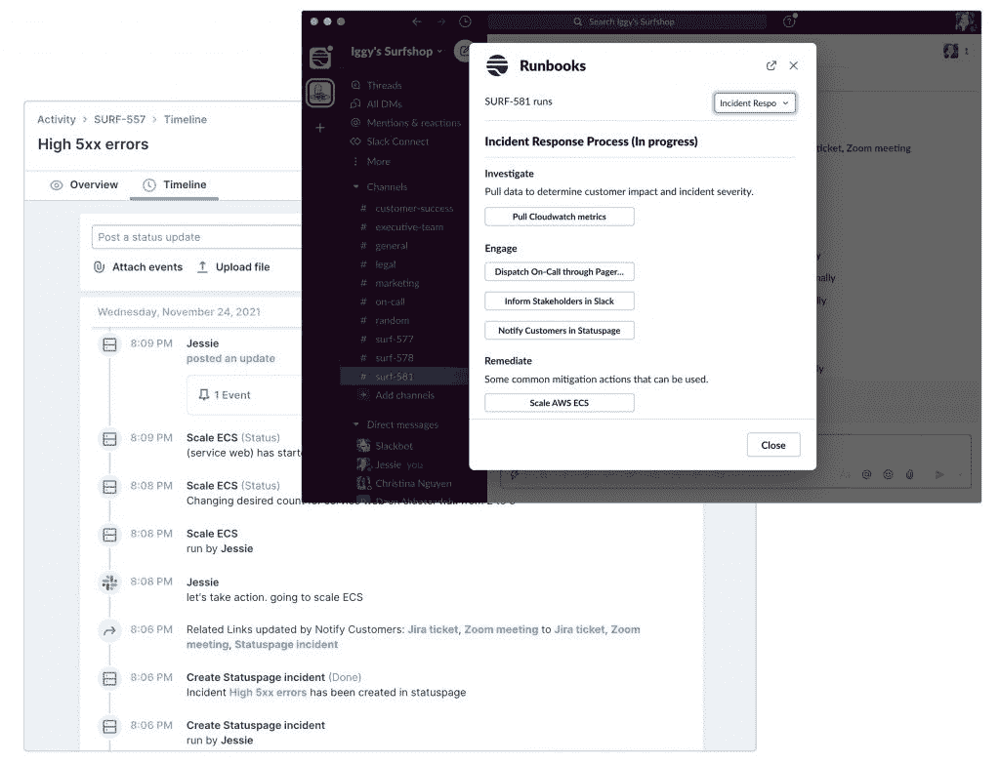

# Transposit 以人性化方式自动化工作流程

> 原文：<https://thenewstack.io/transposit-automates-workflow-with-a-human-touch/>

对于 Tina Huang 来说，没有人工干预的自动化的想法是错误的。这来自于她在芝加哥大学对文化人类学和博客的研究，以及在谷歌和推特的工作。

“我曾在谷歌新闻工作，后来转到了 Twitter。我对这个圈子里的人充满热情，对吗？——比如你如何用人工编辑来增强人工智能？”转运站创始人兼首席技术官黄说。

这家总部位于旧金山的初创公司专注于集成在 [DevOps](https://thenewstack.io/category/devops/) 和站点可靠性工程(SRE)中使用的[工具](https://thenewstack.io/category/tools/)。它旨在提供一个单一的真相来源，通过自动化和人类行动来平息混乱。

她坚持认为，大多数工作流工具，如 Zapier 和其他工具，都渴望没有人工干预的完全自动化。

“这真的很好，”她说，“但在能提供帮助的问题类别中，这非常非常有限。”

人们经常暗示，如果人们可以完全自动化一切，她就会失业。她的回答是:

“嗯，如果你有一个内部和外部都没有变化的筒仓系统，那就是真的。”

随着变化可能会发生意外:*我正在向我的代码库添加新特性。我正在向我的堆栈中添加新的基础架构。*但变化也可能发生在外部。

“就像在 Twitter 一样，许多事件的发生是因为超级碗或一些你没有预料到的事件导致了不同的流量模式。

“我记得阿拉伯之春给 Twitter 带来了挑战，因为这就像是一个使用高峰，一种不同于我们预期的使用风格，”她说。

## 基于 SQL 建模

黄和 Adam Leventhal 于 2016 年创立了这家公司，并从 Splunk 引入 Divanny Lamas 担任首席执行官。Leventhal 和 Lamas 回到了 Sutter Hill Ventures，它的一个投资伙伴。该公司在一年前由 Altimeter Capital Management 领投的 3500 万美元 B 轮融资后，总共筹集了 5040 万美元。

黄看到开发人员的世界在变化，而不是从零开始构建东西，将来自各种数据源的组件通过 API 连接在一起变得越来越常见。

他们花了三年时间创建了一个平台，将所有工作流工具集中在一个地方。在他们的 A 系列推介中，他们将其描述为 API 的关系数据库。

“想象一下，能够像 SQL 一样轻松地查询您的数据，而不必担心这些数据是来自 GitHub、Slack 还是来自这些不同的来源？”黄说。

看着技术，他们意识到 DevOps 和 IT 运营最有可能适合人在回路中响应的想法，即使是在指导机器学习完成手头的任务时。

他们以 SQL 为技术模型，这为开发人员提供了一种方式来谈论他们试图检索的数据，而不必考虑如何实际访问这些数据:

“在最核心的地方，这就是换位集成技术的基础。所以你可以写一个 SQL 查询，我们来处理认证、分页、查询节流等等。…

“我们与我见过的几乎所有集成平台的不同之处之一是我们的深度，它不仅仅是 API 调用之上的一个薄薄的包装。但它确实允许开发人员不用考虑底层服务。”

## 自动化文档

他们最初将他们的想法应用于事故管理手册，这是一些公司为凌晨 2 点发生事故时的紧急呼叫创建的活页夹。在这种情况下，随叫随到的工程师可能会为他没有编写的代码或她不熟悉的操作程序的细节伤脑筋。

Transposit 的平台使组织能够构建自动化的操作手册，规划一组要跨多种工具执行的 DevOps 流程。

黄承认，runbooks 并不是一个热门话题，但他坚持认为，这主要是因为人们对它们缺乏创造力——它们往往是平面的维基页面，每个人都知道，或者至少认为，它们不是最新的，所以他们不使用它们。

Transposit 对此的回答是，通过聚合半结构化和非结构化的机器数据以及人类数据，使它们更具交互性和实用性。

您可以设置一个触发器，启动关于如何继续的自动化工作流。这可能是像开始一个松弛的渠道，为它归档一张票，指派一个指挥官，通知客户成功这个事件正在进行中，弄清楚哪个队被卷入和呼叫人。

“它可以是任何东西，从平面文档到添加有助于您的按钮，因此您可能有一个按钮，上面写着‘重新启动服务’、‘更新状态页面’等。”黄说。

它可以打破孤岛，通过数百个预构建的集成统一开发和运营之间的工作流，或者轻松连接到任何 API。之后，你也可以有一个清理过程。

与此同时，它记录了过程中的每一步，提供了完整的审计跟踪和事后报告。操作手册不是静态文档。底层机器学习算法可以查看工程师如何恢复，并提供数据驱动的流程修订。这也可以获取机构知识。

在[博客文章](https://www.transposit.com/blog/future-of-operations-agile/)中，黄解释了机器和人的编码过程的必要性，他写道:

“理想的世界是能够将这两者无缝结合在一起。当您允许人类将自动化的各个部分缝合在一起时，您实际上会得到更多的自动化和更健壮的自动化。

“这是因为你可以让人类的直觉介入自动化的逻辑会变得如此复杂，以至于导致比它解决的问题更多的问题，逻辑会与快速发展的产品的细节紧密相连，以至于它需要像产品本身一样频繁地更新。”

## 门票加行动

去年年底，Transponsit 宣布了[活动](https://www.transposit.com/blog/new-runbooks-actions-functionality-expand-automation-action-grouping-runbook-statefulness-automation-validation-more/)，采用了 JIRA 和 ServiceNow 等票务系统。

该公司不称之为门票，因为它通常需要门票本身以外的行动。通常会有一个附带的文档，可能是一个合并页面，告诉你应该如何使用 JIRA 门票——例如，根据这些情况对事件进行分类。与此同时，人们在 Slack 或微软团队中谈论这个问题。归档任何票证都需要可重复的操作—您可能需要填写这 10 个字段。

“DevOps 角色的一个美妙之处在于，很多工作都可以自动化，”黄说。“因此，其中的一些部分需要人工干预，如用于调度的人工路由器——我们听说许多人仍在使用某种形式的 [NOC](https://www.inoc.com/blog/incident-management-the-foundation-of-a-successful-noc) (网络运营中心)。…老实说，我们听说有人甚至将这些外包给第三方。他们的工作实际上是查看一些图表，并确定实际寻呼哪个团队。对吗？所以有一点人为因素。

“但是一旦一个人确定了要联系哪个团队，剩下的工作就可以自动化了。”

[https://www.youtube.com/embed/6OtAjeOHOQQ?start=66&feature=oembed](https://www.youtube.com/embed/6OtAjeOHOQQ?start=66&feature=oembed)

视频

## 无代码生成器

该公司吹捧 Transposit 是一个无代码平台。

在一篇关于 2022 年预测的 [BetaNews](https://betanews.com/2021/12/22/low-code-more-productivity-and-closer-links-to-data-teams-development-predictions-for-2022/) 文章中，Transposit 的运营副总裁 Ed Sawma 提出:

*低代码和无代码技术已经开辟了新的创新之路，让组织中更多的用户——无论是否有技术经验——能够为项目或工作流做出贡献和增加价值。2022 年，我们将看到 DevOps 实践在传统软件开发之外的功能中获得更广泛的采用。除了越来越多地采用无代码工具之外，非技术用户将会体验到持续交付方法的所有好处，并希望在他们创建的所有数字产品中采用这种方法。*

该公司有一个无代码平台，以及一个更先进的开发平台。它的无代码构建器可以有与之相关的 git 存储库。它是用 Python 编写的，并且被设计成对开发人员非常友好。

“我们从早期客户那里看到的是，他们很高兴，因为他们不必等待我们为他们打造什么。你甚至不需要等待我们为你建立一个数据连接器，”黄说。

“我们是基于 OpenAPI 的开放标准构建的。所以你知道，如果你有一个内部系统，任何 API，你都可以插入我们的系统。…你几乎可以建造任何你想要的东西。你知道，我们已经看到客户串在一起…转置它以触发 AWS Lambda 调用其计算集群中的边缘节点。因此，它非常强大，非常非常灵活。”

<svg xmlns:xlink="http://www.w3.org/1999/xlink" viewBox="0 0 68 31" version="1.1"><title>Group</title> <desc>Created with Sketch.</desc></svg>