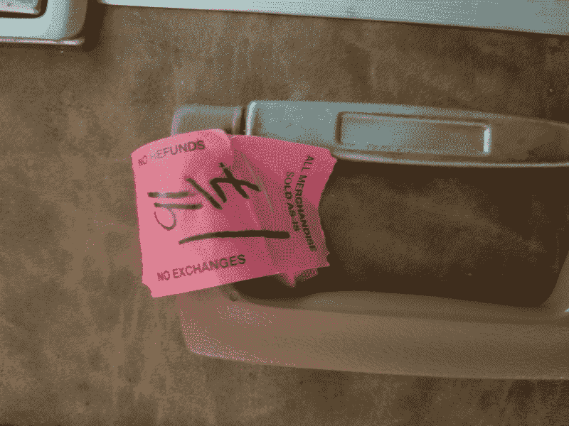
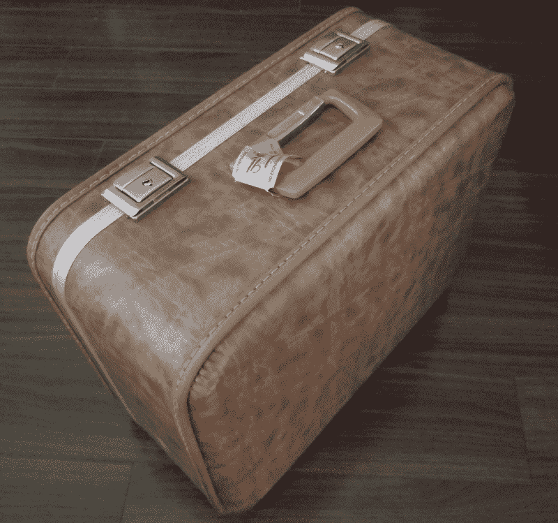

# 和机器人头骨赫德利一起旅行

> 原文：<https://thenewstack.io/traveling-with-hedley-the-robotic-skull/>

我很高兴地告诉大家，机器人头骨赫德利将加入我在 OSCON T2 的工作。

很长一段时间以来，我一直困惑于如何将他从奥兰多运送到波特兰，甚至从我家运送到当地的机器人俱乐部会议。有一件事是肯定的，当你带着一个机器人头骨走在街上时，它肯定会吸引好奇的目光。这对于获得关注很好，但对于保持他的安全和完整却很糟糕。同样值得一提的是悬挂的电缆、壁疣、无线键盘和其他使他正常工作所需的设备的后勤工作。当赫德利乘飞机、火车和汽车旅行时，他需要某种保护性的盒子。我想出了一个有趣的解决方案。

## 旧货店分数

将赫德利从一个地方运送到另一个地方有很多选择。

我想过买一个[鹈鹕箱](http://www.pelican.com/us/en/products/cases)。该公司有各种适合航空旅行的硬塑料盒，通常有舌槽开口和 O 形环密封。这些都是很好的案例，肯定会把赫德利从这里拖到那里。他们的 1600 型(大约 25 x 19 x 8-1/2 英寸)160 美元的价格对我的预算来说有点太高了。

还有一种想法是从头开始制作一个木制/金属/塑料盒子。制造一个盒子，虽然是一篇如何操作的文章的有趣和潜在的内容，但将是耗时的，并且当赫德利从行李传送带上摔下来时，可能很难获得他应得的耐用性。我估计一个木箱或者一个塑料和铝制的角形集装箱可能需要 10 到 20 个小时的制作。按每小时 15 美元的人工费率计算，最低工资仍然是 150 美元，不包括材料。

因此，购买现成产品或成品的决定往往不是很明确。

我在当地社区旧货店发现了一个 18×15×8-1/2 英寸的小手提箱。不太清楚这种尺寸的市场，尽管赫德利非常适合内部，有足够的空间放置泡沫填料和外围设备。虽然不像鹈鹕的情况下防弹，2.13 美元的价格标签，包括税使它成为一个显而易见的购买。

赫德利新的旅行箱价格标签

箱子放在行李架上，与各种大小和形状的行李混在一起。我每隔几周就在同一个旧货店“跑一圈”，寻找可以在我的蒸汽朋克项目中使用的物品。

我先去了西装通道。你永远不知道什么时候你会碰到一件复古的粗花呢夹克或者古怪的格子背心。接下来通常是黄铜烛台区。黄铜在旧货店很便宜，它为蒸汽朋克武器和 T2 科学仪器提供原材料。

最后一个循环带我参观了商店的工具和电子产品区。通常有大量 10-40 岁的立体声放大器，旧缝纫机，便携式钻机和大型黄铜落地灯可供选择。电动工具尤其有趣，因为你可以将马达重新用于机器人和重型工作。小心不要为可能不起作用的东西付出太多。

## 到 Case Mod 或不到 Case Mod

关于这个案子应该如何处理，有一点困惑。一方面，我想把它蒸汽朋克化，用[黄铜护角](https://www.kennedyhardware.com/corners/)，皮革表带，外表看起来很古色古香。我发现的箱子实际上是一个轻微磨损的棕褐色，带有浅麂皮图案。

赫德利的新旅行案例

另一方面，如果赫德利是作为“托运”行李旅行的，那么让行李保持原样，给他贴上一个看起来像蒸汽朋克的标签可能更有意义。任何吸引注意力、看起来“有趣”的东西，都可能会招来一个心怀不满或难以形容的科技行业间谍，带着赫德利和所有东西离开。

我喜欢这个[蒸汽朋克公文包](https://www.pinterest.com/pin/241575967483261992/)的样子。赫德利的案子最终可能会看起来更像这个旧火车案。几条皮带可能就够了。

另一个想法可能是，在赫德利到达会场后，购买/制作一些古董角件，挂在箱子上。我可以在我们走上舞台之前，用磁铁(在里面)把各种刻度盘、仪表、齿轮和小发明放在表壳外面。角件和小发明可能会被 3D 打印，然后涂上颜色，看起来古老而风化。这将是一个很酷的效果，当然也是一个伟大的黑客解决方案。

我只需要一台 3D 打印机和一些磁铁。

我也在寻找泡沫，当赫德利睡在板条箱里时，我可以用它来垫他。鹈鹕案件已安装黑色泡沫插入，可以定制，以适应你的装备。面料商店似乎是一个不错的选择。我需要四到六张床单来让赫德利保持舒适。

## 增加一些额外的东西

在会议上展示一场好的技术秀需要比你意识到的更多的幕后准备。当你对观众说“早上好”时，不仅你的装置需要工作，你还必须首先安全地将所有东西送到会场。

虽然一个简单的小玩意可能看起来无关紧要，但人们会注意到这些小东西，并为展览增添丰富色彩。这里是一次性装备箱，那里是蒸汽朋克大礼帽和佩斯利背心。

在你现成的黑客项目中加入一些无形的东西会让你更有个性，人们肯定会欣赏你的额外努力。

试试看，你就知道了。

【T2

<svg xmlns:xlink="http://www.w3.org/1999/xlink" viewBox="0 0 68 31" version="1.1"><title>Group</title> <desc>Created with Sketch.</desc></svg>