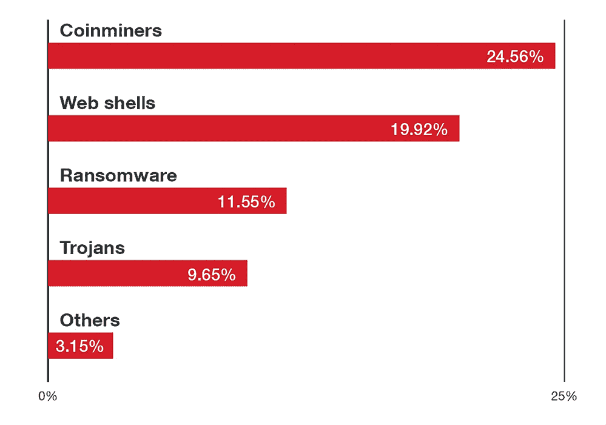

# 趋势科技指出一个巨大的云 Linux 安全问题

> 原文：<https://thenewstack.io/trend-micro-points-out-a-giant-cloud-linux-security-problem/>

别被那个标题搞得太兴奋了。如果你曾经是系统管理员，你大概能猜到这个问题是什么。但是仅仅因为这是一个常见的错误并不意味着很多人从中吸取教训。

首先，不，最大的问题不是愚蠢的密码。这是一个很大的问题，但这比这更基本。[趋势科技](https://www.trendmicro.com/en_us/business.html)根据其[云安全智能防护网络的](https://success.trendmicro.com/solution/1054951-enabling-smart-protection-network-and-smart-feedback-in-officescan-osce)数据，在其 [Linux 威胁报告 2021 1H](https://www.trendmicro.com/vinfo/us/security/news/cybercrime-and-digital-threats/linux-threat-report-2021-1h-linux-threats-in-the-cloud-and-security-recommendations#C04)中发现，子弹的头号问题是公司使用过时的、不受支持的操作系统和程序。

最大的问题——子操作系统，有 44%的安全漏洞检测，是 Linux 7.4 到 7.9 发行版。你猜怎么着！CentOS 7 于 2014 年 6 月首次发布，2019 年 8 月退出全面支持。如果您仍然在生产中运行 CentOS 7，您的云映像应该得到发生在它们身上的一切，并且您应该去一趟失业办公室。

抱歉，我对此没有耐心。一次又一次，主要的“Linux”或“开源软件”安全漏洞被攻破。也许最大的例子就是 Equifax 指责 Apache Struts 丢失了 1 . 43 亿份美国公民信用记录。不，错了。事实并非如此。事实上，负责“安全”的白痴们已经六个月没有修补一个关键的漏洞了。

你猜怎么着？趋势科技发现我们仍然在犯这个令人作呕的基本错误。这不是你基于云的网站和服务什么时候会被攻破的问题，而是什么时候。而且，在很多情况下，当你意识到你已经被欺骗了几个月，甚至几年。

## 快速修补，或稍后付款

当攻击者逼近您的云、服务器、虚拟机和数百万的容器时，是的，数百万，我注意到我自己的云服务器今天已经抵挡了数百次攻击，他们寻找您尚未修补的预先存在的问题。

趋势科技报告更深入地发现了前 15 大漏洞。除了一个以外，其他的都已经修补了至少一年了。你会关心最受攻击的安全漏洞是什么吗？我给你一个提示。我已经提过了。

没错，就是[Apache Struts CVE-2017-5638](https://nvd.nist.gov/vuln/detail/CVE-2017-5638)，顶级常见漏洞评分系统评分 10。我可能会提到，自从*在 2017 年确定以来，它一直保持的排名！*

> 如果您仍然在生产中运行 CentOS 7，您的云映像应该得到发生在它们身上的一切，并且您应该去一趟失业办公室。

有时候我真想揍几个 IT 员工。很明显，这不是安保做得不好的人。是人根本不做安保。

尽管这篇报道的大部分标题都强调了针对 Linux 的攻击数量，但这并不是——我重复一遍——对 Linux 安全性差的控诉。这显示了人们在运行 Linux 时有多糟糕。或者任何其他操作系统。

## 前 5 名攻击者

当攻击者打电话来时，你会得到什么？前五名分别是:

*图表来自趋势科技，2021 年 Linux 威胁报告，1H。*

硬币矿工总是会受欢迎的。20 世纪 30 年代，著名的银行抢劫犯威利·萨顿(Willie Sutton)解释了他抢劫银行的原因:“因为那里有钱。”如今，加密货币存在于不受保护的云中。

一般来说，76%的攻击会指向你的网络服务。因此，例如，拥有自己复杂的软件生态系统的 WordPress ，是一个经常被攻击的目标。

在这些攻击中，趋势科技认为注入漏洞和跨脚本攻击一如既往地流行。特别是有很多不安全的[反序列化漏洞](https://portswigger.net/web-security/deserialization#:~:text=Insecure%20deserialization%20is%20when%20user,data%20into%20the%20application%20code.&text=For%20this%20reason%2C%20insecure%20deserialization,an%20%22object%20injection%22%20vulnerability.)，正在被滥用。这部分是由于 Java 的普遍存在及其反序列化漏洞，但不仅仅是 Java。 [Liferay Portal](https://www.liferay.com/) 、 [Ruby on Rails](https://rubyonrails.org/) 和 [Red Hat JBoss](https://www.redhat.com/en/technologies/jboss-middleware/application-platform) 都有各自的反序列化漏洞。这里的游戏名称是抓住下金蛋的鹅:使用不可靠的身份验证完全访问您的系统。

但是，虽然趋势科技的报告详细介绍了各种攻击，但底线是，如果您保持操作系统最新，您可以使您的云更加安全。就是这样。仅此而已。就这么简单。

与此同时，确保你正在使用的任何流行的应用软件栈——如 WordPress、 [Apache Struts](https://struts.apache.org/) 、 [Atlassian JIRA](https://www.atlassian.com/software/jira) 、 [dnsmasq](https://thekelleys.org.uk/dnsmasq/doc.html) 和[Alibaba Nacos](https://github.com/alibaba/nacos)——都打了补丁，你将比你的竞争对手安全得多。加油，你能行的！去吧！补丁！补丁！补丁！赢了！赢了！赢了！

<svg xmlns:xlink="http://www.w3.org/1999/xlink" viewBox="0 0 68 31" version="1.1"><title>Group</title> <desc>Created with Sketch.</desc></svg>