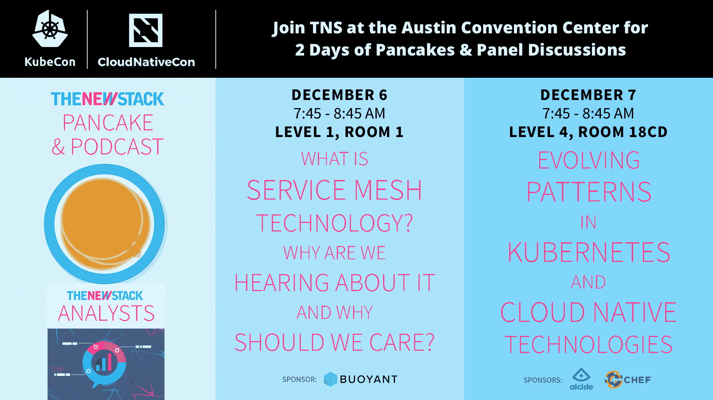

# KubeCon 2017 的发展趋势

> 原文：<https://thenewstack.io/trends-follow-kubecon-2017/>

[KubeCon](http://events.linuxfoundation.org/events/kubecon-and-cloudnativecon-north-america) 本周，2018 年即将到来。经过一年的时间，数据中心和与之相关的技术发生了巨大的变化，现在是时候反思这个行业的发展方向以及我们需要面对的挑战了。考虑到这一点，以下是我们期待在 KubeCon 上听到的更多信息。

## 库伯内特斯

 [Alcide 首席技术官兼联合创始人 Gadi Naor

Gadi Naor 作为首席技术官和 Alcide 的联合创始人，拥有 15 年领导网络安全产品开发的经验。Gadi 将他的管理和技术背景融合在不同的岗位上。Gadi 曾在 CheckPoint 工作，担任业务开发经理和高级开发人员，领导 CheckPoint 的防火墙核心安全引擎和 VPN 软件的开发。然后，他在 Altor Networks 担任高级软件工程师，Altor Networks 是虚拟化数据中心安全领域的先驱，后来被 Juniper Networks 收购，他继续担任高级软件工程师。在联合创立 Alcide 之前，Gadi 是基于微服务的系统 Fitfully 的联合创始人兼首席技术官。他拥有 Technion 技术学院的计算机科学学士学位。](https://www.alcide.io/) 

Kubernetes 成为首选的容器编排平台有很多原因，并且很可能成为构建和操作云原生应用程序的理想系统。虽然 [Kubernetes](/category/kubernetes/) 可能是希望之乡，但它需要解决现有的挑战，如构建、运行、操作和保护部署的服务，这是最大的差距所在。

我们将看到用 Kubernetes 开发的或移植到 Kubernetes 中的应用程序将如何发展成为完全自我管理的应用程序，也称为操作程序。

把操作人员想象成操作应用程序的现场可靠性工程师(SRE ),但作为自主软件组件，负责自动缩放、更新和升级，并确保一切都与所需状态保持一致。

Kubernetes 面临的另一个重大挑战是安全性。无论是运行在裸机上还是公共云上，Kubernetes 都能让您轻松拥有为您的应用提供的基础架构，但一个明显的缺陷是，当涉及到基础架构安全时，运营需要控制他们希望自己的眼睛和耳朵在哪里。

为了让 Kubernetes 更上一层楼，从安全的角度来看，企业需要关注各个层面的安全，包括相关的集成、认证、授权和监控。Kubernetes 的开箱即用特性，结合供应商可以利用的强大可扩展性，将推动适当的安全部署。

## 微服务

我们都同意[微服务](/category/microservices/)与 CI/CD 携手合作，这真正打开了加速业务发展周期的大门——但是，并非所有微服务都是同等创造的。例如，一些微服务是面向客户的，而其他内部微服务可能在规模和性能方面要求较低。虽然 Kubernetes 确实使微服务的迁移和操作更加自然，但我们未来真正需要考虑的是 Kubernetes 如何更动态地优化正在运行的应用程序。

考虑到这一点，您是否打算构建一个集群来运行不同的微服务，并知道并非所有的微服务都是同等创建的？我认为从安全角度和规模角度来看，这是必须的。

在 KubeCon，我必须参加的讲座将是回答此类问题的讲座，重点是多集群、基于自定义指标的自动缩放器以及安全性如何融入其中。

## 基础设施、服务网以及介于两者之间的东西

现在，我们已经获得了强大的 Kubernetes 基础架构，可以满足部署在其上的应用和服务的需求，监控和保护微服务的任务变得艰难而富有挑战性，但也是至关重要的。

[Istio 等服务网格](/tag/service-mesh/)框架虽然仍处于早期阶段，但正试图通过简化监控和保护微服务的流程来解决这一困境。这不是一个完整的解决方案，因为消息队列不是网状网络的一部分。从性能和生产就绪性的角度来看，这可能具有挑战性。但是听到已经取得的进展以及这项技术的发展方向将会很有趣。这将是我必须参加的名单上的下一组 KubeCon 会议。

## 容器

容器肯定会继续存在，作为一种软件打包和部署机制，它们日益流行是有道理的，尤其是有了 Docker 推出的易于使用的工具链。在 KubeCon，我期待了解更多关于新的容器运行时接口(CRI)的知识，以及它将如何以及何时取代现有的 Docker 引擎。

对于这个领域的所有人来说，有趣的几天即将到来，我们将在 KubeCon 与众多思想领袖会面。我希望我们都能对 2018 年 Kubernetes 的所有事情有一些深刻的见解。

Alcide 是新堆栈的赞助商。

通过 Pixabay 的特征图像。

<svg xmlns:xlink="http://www.w3.org/1999/xlink" viewBox="0 0 68 31" version="1.1"><title>Group</title> <desc>Created with Sketch.</desc></svg>