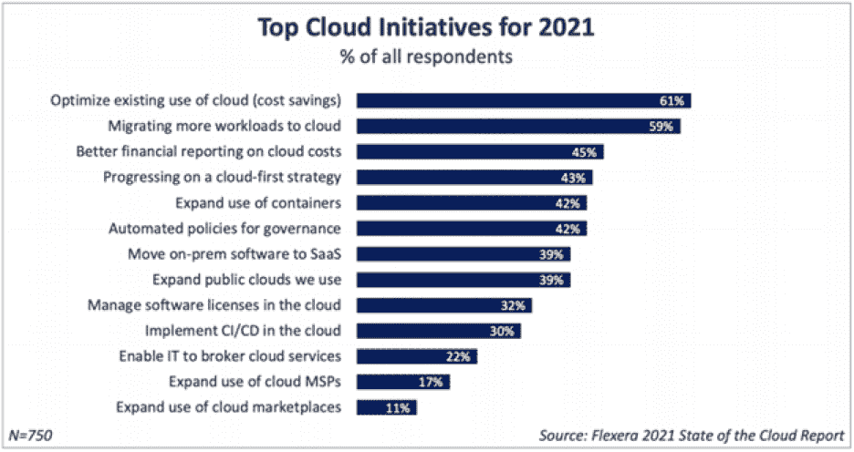

# 云成本优化的诀窍

> 原文：<https://thenewstack.io/tricks-for-cloud-cost-optimization/>

 [帕万·贝拉加蒂

帕万·贝拉加蒂(Pavan Belagatti)是全球 DevOps 的影响者、科技作家和讲故事者。](https://www.linkedin.com/in/pavan-belagatti-growthmarketer/) 

就像使用 Docker、Kubernetes、Terraform、Helm Charts 等云原生工具有最佳实践一样。，有一些技术可以减少云计算资源上的云支出。但不幸的是，公司最常犯的一个错误是没有密切关注他们在云资源上花了多少钱。如果您不能牢牢控制您的云支出，您将很难优化它们。

云成本优化(CCO)是一种以尽可能低的成本有效运行云原生应用的技术，不会影响服务的健康。通俗地说，就是通过对云资源的有效利用来持续传递价值。CCO 需要一个组织良好的策略、技术和可靠的解决方案，让您的工程团队了解运行您的服务所涉及的成本的具体细节。

过去几年来，云成本优化一直是大多数组织的重中之重，这从 [Flexera 的《2021 年云状态报告](https://www.flexera.com/blog/cloud/cloud-computing-trends-2021-state-of-the-cloud-report/)中可以明显看出。

这里有一些建议可以帮助您降低云成本。

*   选择正确的实例是一个很好的实践。大多数公司经常为他们的应用程序选择错误的实例类型，这大大增加了他们的云支出。如果没有减少云使用的策略，就会出现这种情况。在部署服务之前，最好了解云服务提供商提供的各种实例类型。合理分配资源至关重要。[亚马逊网络服务](https://aws.amazon.com/?utm_content=inline-mention)提供了 300 多种实例类型。应该根据应用程序和业务需求来选择实例。

*   Spot 实例可以在减少您的云支出方面发挥重要作用。Spot 实例是由 AWS、Azure 和 GCP 等云提供商以折扣价提供的云的备用计算资源/容量。对于 spot 实例，可靠性没有保证——云提供商可以随时中断这些服务——但这些服务可以用于批处理和许多其他工作负载。AWS 称之为 spot instance，Azure 称之为 spot VMs，GCP 称他们的为可抢占 VM instance。

*   当你刚接触云计算世界时，制定预算是至关重要的。你每月的预算将取决于你的需求。如果你只需要电子邮件托管，那么你的月预算会比你创建一个有大量存储空间的数据库驱动的网站低得多。一旦你为自己建立了预算，制定了策略，就该开始优化你的成本了。

*   采用自动化和现收现付有助于节省云成本。正如我们所知，大多数云提供商都有一个随用随付的定价模式，您只需在需要时为资源付费。此外，通过采用基础设施即代码(IaC)和自动扩展方法，您可以在需要时自动启动资源，在不需要时关闭资源。

*   关闭闲置资源是一项基本但重要的实践，可以节省您的云费用。超支的一个主要原因是闲置和未分配的资源。幸运的是，像[这样的服务利用智能云自动停止规则](https://harness.io/blog/autostopping-rules-kubernetes/)可以动态地、自动地管理你的闲置资源。他们会在您不使用资源时关闭它们，并在您需要时重新打开它们。Harness 的智能云自动停止有助于自动管理您的资源，以确保它们仅在需要时运行，而不是在空闲时运行。

*   在组织内培养云支出和成本意识文化可以帮助工程领导和开发人员了解他们自己的云支出。培训和研讨会将帮助每个人了解健康的云资源利用和可遵循的最佳实践。特别关注关于云支出数据的每周或每月报告可以帮助团队组织起来，并了解他们正在犯什么错误以及如何避免这些错误。

*   资源消耗限制和警报可以帮助您识别超支。例如，在应用程序部署中使用 Kubernetes 时，可以在部署 YAML 文件中指定资源限制。此外，Harness Cloud Cost Management (CCM)通过展示资源优化可能性来减少您的支出，从而为您的 Kubernetes 集群提供建议。

## 结论

随着越来越多的公司采用云服务和云原生技术来快速发布代码和快速扩展，控制成本和遵循最佳实践成为每个人的责任。遵循这些简单的建议应该可以帮助您立即减少云支出。我希望这篇文章能帮助你建立一个策略来优化你的云成本。

<svg xmlns:xlink="http://www.w3.org/1999/xlink" viewBox="0 0 68 31" version="1.1"><title>Group</title> <desc>Created with Sketch.</desc></svg>