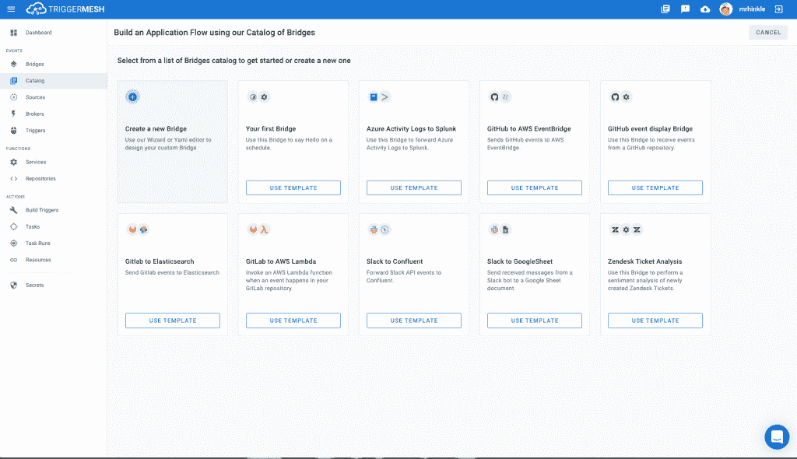
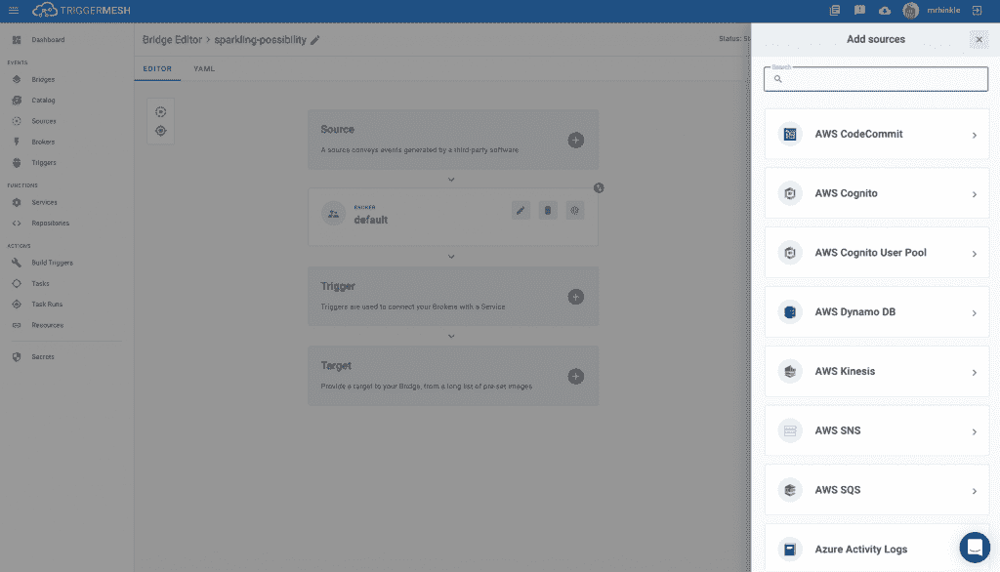

# TriggerMesh 1.0 平台承诺跨云的事件驱动的生产工作流

> 原文：<https://thenewstack.io/triggermesh-1-0-platform-promises-event-driven-production-workflows-across-the-clouds/>

据 TriggerMesh 公司称，该公司的[云原生集成平台](https://triggermesh.com/)现已准备好投入生产使用。TriggerMesh 1.0 提供事件驱动的数据管理功能，可用于多种云和内部架构，是该平台的“成熟”，具有端到端测试、安全检查和负载测试的可扩展性，[trigger mesh](https://www.linkedin.com/in/markrhinkle)首席执行官兼联合创始人马克·r·辛克尔告诉新堆栈。

Hinkle 说:“我们认为，无论是使用我们的云还是 TriggerMesh Enterprise 的内部部署，客户都可以放心地将我们的产品投入全面生产。

Hinkle 表示，其他新功能包括新目标(触发 gerMesh“触发器”的服务)和源(向 TriggerMesh 提供事件的服务)的集成，包括 Datadog、Oracle Cloud 和 Salesforce。

## 事件驱动的工作流

基于事件驱动架构(EDA)的管理事件驱动工作流(EDW)在 TriggerMesh 中起着关键作用。简而言之，EDA 包括当事件被触发时，根据需要将数据实例从一个系统实时转移到其他系统。

TriggerMesh 的平台用于医疗保健、供应和其他工业领域。例如，[达美乐比萨](https://www.dominos.com)依靠 EDW 和埃达在网站上实时显示状态，从下单到准备，再到配送。

实时流媒体系统，如 TriggerMesh 支持的 Apache Kafka，正在越来越多地取代依赖批处理和每天只传输文件的过时系统。Hinkle 说:“为了真正受益于网络中的单一真实来源，(事件驱动系统)受益于基于这些事件的自动化操作。”" TriggerMesh 使用事件在应用层提供自动化工作流."

Hinkle 指出，EDW 功能已经成为亚马逊 EventBridge 和谷歌 EventArc 在各自云环境中广泛接受的设计模式。然而，TriggerMesh 更进一步，充当 EDW 不同云环境之间的桥梁，当然包括 EventBridge 和 EventArc。“我们在每个云上提供相同的工具，并将内部活动与私有数据中心的大量基础设施相集成，”Hinkle 说。“这提供了遗留数据中心和云之间的桥梁。”

TriggerMesh 还可以用于清理日志数据，以提高存储容量并避免日志疲劳。它通过过滤或删除不需要自动传输到系统和从系统传输的日志数据来实现这一点，例如，可能从谷歌云日志发送到 [Splunk](https://www.splunk.com/fr_fr) 的日志。“这种能力不仅限于这些日志，还包括你想摄取的任何其他日志，”Hinkle 说。

TriggerMesh 的平台也随着云原生操作的要求而发展，并与 Kubernetes 紧密集成。Hinkle 指出，例如，TriggerMesh 的平台是如何基于 Kubernetes 的，并利用了谷歌和 SAP(通过其 Kyma 项目)用于自己的 EDAs 的相同活动基础设施，Hinkle 说。对于运行在 Kubernetes 容器内的微服务，TriggerMesh 云本地集成(CNIP)可以自动化编写为解耦微服务的应用程序以及这些服务之间的业务逻辑和通信。

Hinkle 说:“TriggerMesh 诞生于云计算，我们正在为连接服务提供最合理和最现代的集成平台技术。”

作为一个案例，一个小型创业公司的 DevOps 团队提供一个应用程序，作为其向客户提供的平台，该团队可能依赖 TriggerMesh 来触发来自 Google 云和其他云平台(如 Salesforce 或 Twilio 提供的平台)或内部应用程序的工作负载。“这为您的所有基础架构提供了一套一致的事件驱动工具。通过这种方式，如果你想将数据从内部 Oracle 数据库复制到 Google Cloud SQL 或 BigTable，你可以通过将事件从一个系统转发到另一个系统来实现，并提供一种保持它们同步的方法，”Hinkle 说。

<svg xmlns:xlink="http://www.w3.org/1999/xlink" viewBox="0 0 68 31" version="1.1"><title>Group</title> <desc>Created with Sketch.</desc></svg>