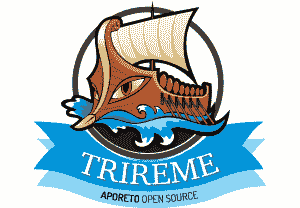

# 背景如何为安全运营提供拼图中缺失的部分

> 原文：<https://thenewstack.io/trireme-brings-much-needed-context-security-ops/>

 [迪米特里·斯蒂利亚迪斯

迪米特里是 Aporeto 的首席执行官和联合创始人，他领导着该公司的技术和公司愿景。在 Aporeto 之前，他是 Nuage Networks 的联合创始人兼首席技术官，领导了大规模 SDN 系统的开发。在此之前，他在贝尔实验室的研究中担任过几个领导职务，在那里他领导了一系列研究项目，在网络、算法和分布式系统方面做出了重要贡献，并在这些技术的商业化方面发挥了重要作用。Dimitri 拥有加州大学圣克鲁斯分校的计算机工程博士和硕士学位。](https://www.aporeto.com/) 

说到安全，上下文才是王道。在我们最近与新堆栈团队的播客[中，我们探讨了环境在安全方面的重要性。这篇文章对我们讨论过的一些概念进行了更深入的分析。](https://thenewstack.io/aporeto-security-context-king/)

为了理解上下文的影响，让我们考虑一个日常用例:简单的 callerID。你接到一个电话，你看着一个电话号码。潜在地，你的手机有一个本地目录(让我们称之为上下文缓存)，它将号码映射到一个名字，并根据这一映射决定是否接听电话，或者你可以稍后检查日志，找出谁给你打电话。事实上，手机正变得越来越智能，它们试图通过查看你的电子邮件和其他本地信息来确定这种映射。这个过程足够有效，可以跳过很多不想要的对话。

当我们考虑应用程序安全性、微分段和所有类似的概念时，它们只不过是 callerID 的简单概念。它们查看 IP 地址，通过一些本地缓存(配置规则)将其映射到好或坏的状态，并基于此接受或拒绝流量。它们是非常精细的 callerID 管理实体。只要缓存是合理更新的，似乎就能工作。

现在，让我们回到 callerID 示例。你接到一个电话，你的本地目录发现它可能来自你孩子的学校。你必须做出决定。我回答还是不回答？但是打电话的人是学校这个事实没有足够的上下文。学校给你打电话是因为一个募捐活动吗？他们打电话给你是因为他们正在为下一次实地考察寻找志愿者吗？校长要求紧急事件吗？你的孩子打电话是因为紧急情况吗？

没有足够的上下文，根据你的举止，你要么接电话(许可模式)，因为你害怕是紧急情况，要么让它转到语音邮件(严格模式)，如果是紧急情况，他们会留下消息。

经典安全性的工作方式非常相似。IP 地址和网络是保密的，缺乏上下文。规则决定呼叫是否总是被接受，日志将通知您是否应该根据策略建立和断开连接，这是一项通常需要复杂分析的任务。

现在，人们可以说，有先进的设备可以深入到通信领域，并试图“猜测”模式。这有时可行，但大多数情况下不可行，尤其是因为所有通信都在通过 TLS 进行完全加密，向防火墙提供私钥并对您的通信进行中间人攻击不一定是最好的主意。

如果通信模型或 callerID 模型可以扩展到包含上下文，会怎么样？让我们假设，例如，当有人打电话给你时，他们的呼叫将具有足够的上下文信息，关于他们从哪里打电话，谁在另一条线上(你的孩子或校长)，他们打电话的原因，等等。然后当你接到电话的时候，你就可以很快做出决定，你要不要接。

此外，如果你的上下文被发送回来，呼叫者可以立即决定是否适合与你交谈。比如校长在打电话，接电话的是你还是逃课的孩子的朋友，假装是你。

同样的原则也适用于应用程序安全环境。当两个实体之间有通信尝试时，如果有足够的关于实体身份的可验证上下文，那么安全可以以更高的置信度做出合理的决策。这避免了假阴性或假阳性，并对什么可以做什么不可以做进行了严格的控制。

例如，让我们考虑两个由于某种原因试图交互的微服务。如果我们有足够的关于每个服务的上下文，比如，它们在哪里运行；谁激活了服务；他们在什么环境中运行；它们是否有漏洞；或者任何其他上下文属性，并且所有这些上下文都是其身份的一部分，则授权系统可以使用完整的上下文信息，而不仅仅是服务 A 和 B 正在尝试通信这一事实。本质上，服务的身份不仅仅是域名或名称，而是一组捕捉服务的环境和运行时上下文的属性。

事实上，这种上下文模型就是用户访问的 Google 安全模型。

有几个关键问题必须注意。首先，创建上下文信息的实体不能是调用者。换句话说，需要一个能够理解上下文并有权对其进行认证的第三方。必须部署强大的加密技术，不允许欺骗上下文或重放上下文(想想我们都见过的欺骗 callerID 问题)。第二，仅仅是一个身份(FQDN 或证书是不够的)。这将把解决方案简化为我们现在拥有的简单的来电显示。拥有应用程序的完整上下文，才能做出明智的决策，而不是“猜测”

本质上，通过在通信中添加上下文，我们可以实现更准确的授权流程，从而显著简化基础设施和运营。每个实体都配备了授权功能，并且每个连接都可以携带足够的可验证上下文，以便其他应用程序就是否希望建立通信做出明智的决定。

我们已经实现了一个框架来支持这种安全的上下文模型，称为 [Trireme](https://www.aporeto.com/trireme/) 。Trireme 是一个分布式框架，其中通信可以基于可验证的上下文而不仅仅是身份进行授权，提供了创建和验证身份的加密方法。它是开源的，所以[在这里查看一下](https://github.com/aporeto-inc/trireme)。

<svg xmlns:xlink="http://www.w3.org/1999/xlink" viewBox="0 0 68 31" version="1.1"><title>Group</title> <desc>Created with Sketch.</desc></svg>