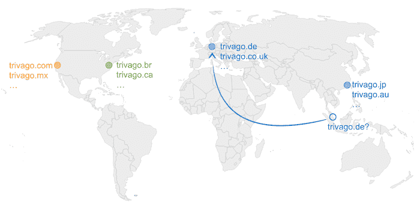
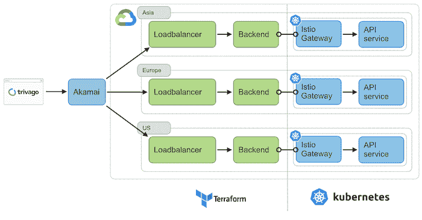
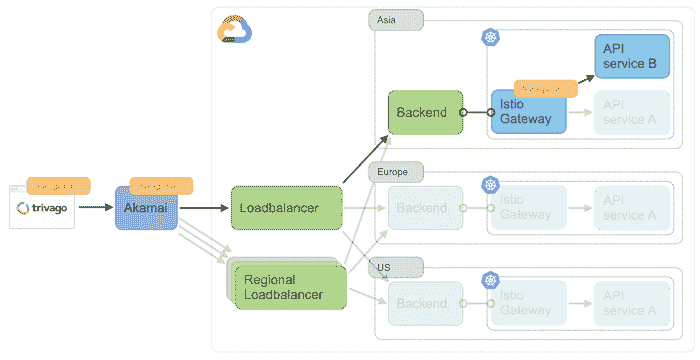
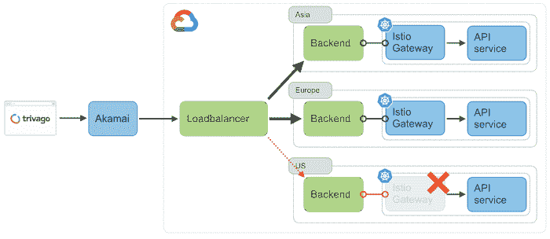

# Trivago 通过 Istio，Kubernetes 实现“区域独立”

> 原文：<https://thenewstack.io/trivago-services-get-regional-independence-with-istio-kubernetes/>

在线旅游服务公司 Trivago 进行了一项“区域故障转移”测试，看看如果它从产品中移除一个谷歌云区域，其网站是否能够维持流量。多亏了 2020 年完成的后端重写，结果是成功的。

目标是实现“区域独立”，这是在 2015 年 Trivago 的年度技术大会上首次提出的，在那里每个地点(即 trivago.de、trivago.com、[、T3、、Trivago . jp](http://trivago.jp)等)。)可以由系统中的任何其他人提供服务，理想情况下，Trivago 的站点可靠性工程师 Arne Claus 在最近的博客中解释道。

最初，这样的壮举是不可能的。当时，区域设置分散在 Trivago 的本地数据中心，这意味着如果用户访问 trivago.de 的网站，他们将始终由德国提供服务，无论其地理位置如何。“区域独立性”的概念最初并不可行，因为太多的系统依赖于区域分离，尤其是在数据方面。

快进到 2020 年，完整的应用程序重写正在进行中，一切似乎都有可能。曾经是两块巨石的后端现在由多个[微服务](https://thenewstack.io/category/microservices/)组成，其中包括谷歌云(GKE)和 Kafka 上的 [Kubernetes](https://thenewstack.io/category/kubernetes/) ，Kafka 接管了 MySQL 复制的复制职责。

由于新冠肺炎·疫情和团队在后端 API 重写完成后的合作，流量减少，这表明是时候尝试“区域独立”了

## **Trivago 的“地区独立”方法**

克劳斯写道:“确保没有服务再依赖于基于本地的共享，这一点非常重要。”。

由于后端重写，大多数服务消除了这种依赖性，剩下的大部分服务也进行了调整。

下一步是确保理论上所有地区都能处理相同的流量。这是通过增加几个组件的最大容量实现的。Trivago 在谷歌云上这样做没有问题。

下图说明了当时的入口设置。

在更新的设置中，传入的请求通过 [Akami](https://www.akamai.com/) 进入。Akami 接收请求，并根据它们的位置将它们发送到适当的负载平衡器。然后，负载平衡器将请求转发给其指定区域中的 [Istio](https://istio.io/) 入口网关。

Trivago 还创建了一个并行的全局负载平衡器，并将其现有的区域后端附加到其上，而无需修改当前的设置。Akami 中添加了一条规则，在区域和全局负载平衡器之间划分流量，以便进行适当的测试。

克劳斯说，这是最酷的部分。Trivago 将路由决策隐藏在一个功能标志头后面，该标志头一直向下传递到每个微服务。他们之所以能够做到这一点，是因为他们将 Google Cloud 入口的管理与 Kubernetes 入口分开了。这使得 Trivago 即使在 Istio 服务网格内部也能根据流量是地区性的还是全球性的来透明地路由流量。这对于那些仍在移除基于区域设置的共享的服务，或者团队正忙于实现预期工作的服务来说是非常有用的。

## **运行“区域故障转移测试”**

在 2021 年第一次“区域故障转移”测试之前，及时完成了向全球路由的转移。为了模拟区域停电，Trivago 将其中一个区域的 Istio 入口网关缩小到零。

克劳斯说，总的来说，这次试验是“巨大的成功”。全局负载平衡器在几秒钟内就开始将流量分发到最近的工作区域。除了位于 Trivago 的内部数据中心的一些旧服务仍然严重依赖于区域分片这一已知问题之外，一切都运行顺利。

然而，测试并非没有惊喜。第一个惊喜是当 Istio Gateway。当故障转移测试在平台上有相当数量的活动用户的情况下完成时，流量同时非常快地回到原始区域。这反过来实际上强制了一个“偶然的负载测试”Trivago 能够处理所有的流量，因此影响最小。

第二个测试发生在 Trivago 测试欧洲地区的时候。欧盟流量前往美国，这是在美国的午夜，美国通常很少或没有流量。这对 Trivago 的服务器来说没什么问题，但像 Expedia 或[【booking.com】](http://booking.com)这样的美国广告商的服务器没有为如此可观的流量增长做好准备，因此面临着处理负载大小的挑战。

对于未来的故障转移测试，Trivago 将选择流量较少的区域，并添加一个他们称为“基于增加的速率限制”的功能。这一特性使他们的基础设施有足够的时间进行扩展，并通过使用灵活的阈值来保护他们免受其他流量高峰的影响，该阈值使用时间窗口方法自动调整流量。如果速率增加太快，流量就会受到限制。一段时间后，Trivago 会根据需求提高门槛，重复整个过程。

## **测试结果**

Claus 解释说，“将整个流程置于特征标志之后的另一个好处是，可以在我们的业务指标中看到全球路由的影响。”特里瓦格发现结果相当有趣。

*   对于大多数地区，变化不大；99%的用户被路由到同一地区。特里瓦格的分裂是正确的。
*   47%的用户分布在某些地区的两到三个区域，尤其是那些位于两个谷歌云区域之间的地理“边缘”的用户。
    *   在大约 17%的地区，超过 5%的用户受到影响。

就用户的“分裂”而言，这对 Trivago 来说并不意外。从背景来看，对于像印度这样从延迟角度来看处于亚洲和欧洲边缘的国家，Trivago 预测了“南北”分裂，而这正是所发生的。

“总而言之，我们对结果非常满意，”克劳斯说。应用程序重写创建了实现这一目标所需的更改。微服务、谷歌云、Kubernetes、Istio 和 Kafka 是帮助实现这一目标的一些技术。

<svg xmlns:xlink="http://www.w3.org/1999/xlink" viewBox="0 0 68 31" version="1.1"><title>Group</title> <desc>Created with Sketch.</desc></svg>