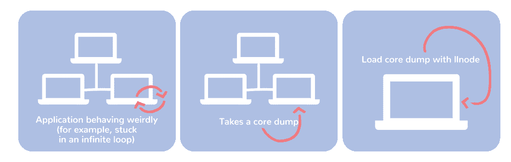
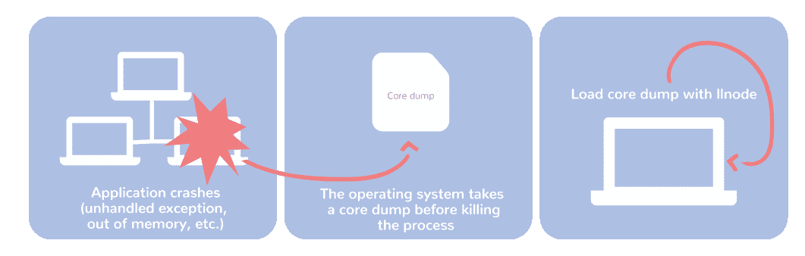

# 使用 llnode 解决生产中的 Node.js 问题

> 原文：<https://thenewstack.io/troubleshooting-node-js-issues-in-production-with-llnode/>

[Matheus Marchini](https://www.sthima.com.br/)

[Matheus 是 Sthima 的一名软件工程师，他在那里为大型公司解决与系统相关的难题。他热衷于开源和让系统更加可靠。他在开源方面的大部分工作都与诊断工具有关，例如为 llnode 开发新功能，为 Node.js 带回 Linux perf 支持，以及为 Linux 引入动态 USDT 探针。](https://www.sthima.com.br/)

*本文是即将于 10 月 10 日至 12 日在温哥华举行的 Linux 基金会 [Node + JS Interactive](https://events.linuxfoundation.org/events/node-js-interactive-2018/) 会议系列文章之一。该计划将涵盖 JavaScript 生态系统的广泛领域，包括 Node.js、框架、最佳实践和来自成功终端用户的故事。*

如果您在生产中运行 Node.js 应用程序，您可能会想"*当应用程序占用生产流量时，我如何调试我的进程？*“有时候，不需要任何诊断工具，就可以很容易地跟踪和修复这些错误。有时，他们需要更深入地了解系统的当前状态。当事情变糟，你需要检查你的框架、对象和源代码时，这就是 [llnode](https://github.com/nodejs/llnode) 出现的地方。

虽然 llnode 可以在真实环境中使用，但该项目仍在进行中。此外，由于它依赖于对虚拟机的启发和假设，在某些情况下使用它可能不完全可靠。

llnode 目前在 Linux 和 OS X 环境下得到支持和测试。FreeBSD 应该也能工作，尽管 Node.js 没有针对它的 CI 测试。目前不支持 Windows。

## 为什么是另一个工具

有了这么多令人惊叹的调试工具，如 ndb、Chrome DevTools 和 Node.js 内置调试器，我们可能会想“但为什么还要创建另一个工具呢？”尽管这些工具在开发环境中非常强大，但它们并不适合生产环境:使用它们会给您的过程带来巨大的开销，有时甚至会阻塞或崩溃它们。当您的应用程序很复杂或者您有一个大规模的部署时，一些问题不会出现在开发环境中。此外，能够在开发或试运行环境中重现问题可能是一项昂贵的任务。使用 llnode，您可以在任何时候拍摄应用程序的快照，而不会显著降低性能，或者在出现故障时拍摄快照，并检查变量和函数，而不会影响您的生产环境。这就是所谓的事后调试。

## 事后调试

事后调试是一种技术，允许开发人员在问题发生后收集见解并找到生产过程中的 bugs 即使应用程序崩溃或进入无限循环。这是 C++等静态语言的常用技术，但只有少数动态运行时支持它。还好 Node.js 是其中之一！

Node.js 中的事后调试最初是由大卫·帕切科在 2012 年引入的，从那时起，社区就努力让它继续工作。在 Node.js 诞生之初，我们必须执行这种分析的唯一工具是 [**mdb_v8**](https://github.com/joyent/mdb_v8) ，但不幸的是，只有少数操作系统——如 SmartOS——能够运行它。几年前，创建 llnode 的目的是为 Node.js 提供跨平台、用户友好且始终受支持的事后调试。受 mdb_v8 的启发并利用 LLDB 的灵活性，llnode 可以在多个平台上运行，并通过检查核心转储或进程中的 JavaScript 对象和调用堆栈以及 LLDB 提供的所有本机功能来执行事后调试。

## 它是如何工作的

llnode 有三种不同的用法。您可以:

*   启动一个附加了 llnode 的新 Node.js 进程
*   将节点附加到现有流程
*   将核心转储加载到 llnode

核心转储是进程内存在给定时刻的快照，可以按需生成，也可以在进程崩溃时生成。执行事后调试时，核心转储也是最重要的因素。

当您的应用程序没有崩溃但行为不正确时，按需核心转储非常有用。一个常见的例子是当应用程序进入无限循环时。要按需生成核心转储，您需要诸如 **gcore** (Linux)或 **lldb 的“save-core”**命令(OS X)之类的工具。

按需进行核心转储时的典型流程

您可以将崩溃核心转储视为相当于飞机上的黑匣子的软件。它包含进程崩溃时的每一条信息，包括变量、调用堆栈、挂起的异步资源等等。崩溃核心转储可以帮助您找出内存不足故障或未处理异常以及其他细微错误的原因。

崩溃时进行核心转储的典型流程

## 当前功能

*   完整的调用堆栈，包含 JavaScript 和 C++框架
    *   有助于找到无限循环的原因
*   按类型列出 JavaScript 对象，包括分配的对象数量以及它们使用的内存
*   列出给定类型的所有已分配对象
*   检查 JavaScript 对象
    *   有助于发现奇怪的行为
*   查找给定对象的所有引用
    *   当进程泄漏内存/OOM 时，查找保持程序很有用

所有命令都可以在项目的[自述文件](https://github.com/nodejs/llnode)中找到，也可以在帮助命令(`v8 help`)中找到。

## 常见使用案例

如前所述，llnode 既可以附加到一个进程，也可以加载一个核心转储文件。当您在开发环境中，想要设置断点、逐步执行函数等时，附加到进程非常有用。

如果您想要调试一个生产应用程序，您将获取应用程序的一个核心转储，并将其加载到您的开发环境中。在这种情况下，您不能设置断点或一步一步地执行函数，但是您可以检查应用程序在进行核心转储时的状态。

无论哪种方式，llnode 都不是银弹，也不应该被如此对待。在一些用例中，你会想要使用其他工具，比如 Chrome DevTools、Node.js 内置的调试器或其他工具。为用例选择 llnode，你会得到最好的结果。llnode 最常见的用例有:

*   追踪内存泄漏
*   了解未捕获异常的上下文
*   调试无限循环
*   调试 Node.js 核心或本机模块
*   使用堆洞察力和对对象的轻松访问以及 JIT 函数名的轻松翻译来调试 V8 内部。

## 现在和未来

llnode 是隐藏的超级能力，它使 Node.js 对企业更有吸引力，并使一些开发人员的生活更容易。拥有这种超级能力的运行时并不多，因此 llnode 对 Node.js 社区有着巨大的价值，特别是对于从事大规模部署、Node.js 核心、V8、本机模块和与外部服务紧密集成的平台的开发人员。

但是这个项目还有很长的路要走。为了让 llnode 对更多的用户有用，我们正集中精力让它对 Node.js 社区整体来说更易访问、更稳定、更有用。这些是我们目前关注的领域:

*   证明文件
*   用户体验
*   更好的安装和分发流程
*   JavaScript API
*   可维护性和跟上 V8 的变化
*   Windows 支持

在未来，你可以期待 llnode 更加稳定、可靠、易于安装和使用。

## 介入

该项目正在寻找合作者！如果你想参与进来，请随时通过我们的 [GitHub 库](https://github.com/nodejs/llnode)或[我的电子邮件](mailto:mat@mmarchini.me)联系我们。

## 进一步阅读

Linux 基金会是新堆栈的赞助商。

通过 Pixabay 的特征图像。

<svg xmlns:xlink="http://www.w3.org/1999/xlink" viewBox="0 0 68 31" version="1.1"><title>Group</title> <desc>Created with Sketch.</desc></svg>