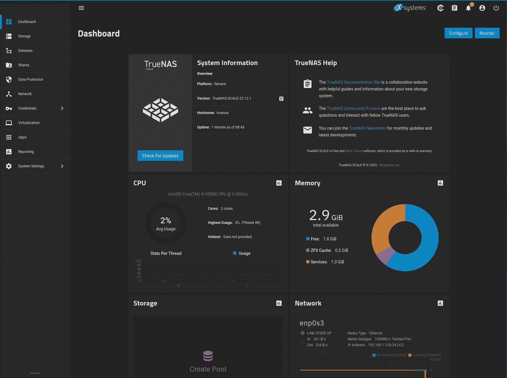
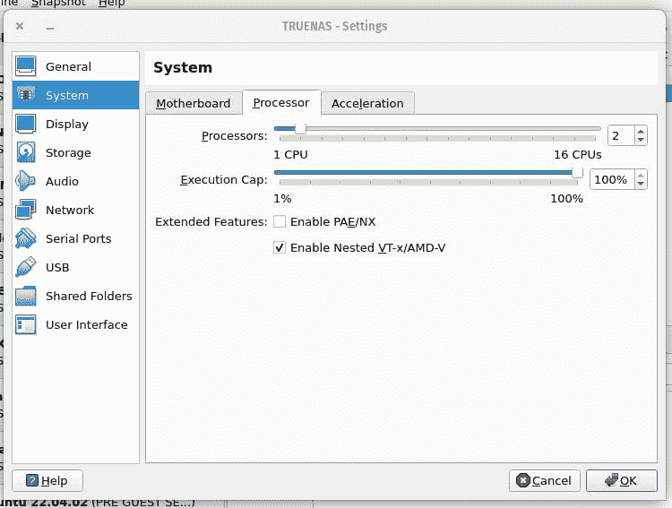

# TrueNAS 规模网络连接存储满足高需求

> 原文：<https://thenewstack.io/truenas-scale-network-attached-storage-meets-high-demand/>

大多数云原生开发者可能不会注意到 TrueNAS SCALE ,但它应该会。尽管 TrueNAS SCALE 在设计上是一个网络连接存储解决方案(基于 [Debian](https://thenewstack.io/the-year-behind-looking-back-at-2015-with-remembrance-of-debian-creator-ian-murdock/) )，但它也可以创建集成的虚拟机，甚至是 [Linux](https://thenewstack.io/contributes-linux-kernel/) 容器。

TrueNAS SCALE 可以作为单个节点部署，甚至可以部署到集群。它可以通过第三方应用程序进行扩展，提供快照，并且可以部署在现成的硬件上或作为虚拟机。

[IXsystems](https://www.ixsystems.com/) ' TrueNAS SCALE 基于 TrueNAS CORE 构建，专为混合云设计，并将很快提供企业支持选项。该操作系统由 [OpenZFS](https://thenewstack.io/linux-creator-linus-torvalds-disavows-the-zfs-filesystem/) 和 [Gluster](https://github.com/gluster/glusterfs) 提供可伸缩的 ZFS 特性和数据管理。

您会发现对 [KVM](https://thenewstack.io/cloud-mobility-for-geographically-shifting-workloads/) 虚拟机、Kubernetes 和 [Docker](https://thenewstack.io/mirantis-acquires-docker-enterprise/) 的支持。

更好的是，TrueNAS SCALE 是开源的，可以免费使用。

## 最新版本

最近，该公司推出了 TrueNAS SCALE 22.12.1 (Bluefin)，其中包括众多改进和漏洞修复。最新版本的改进包括以下内容:

*   SMB 共享代理为通用命名空间中的 SMB 共享提供重定向机制。
*   对无根登录的改进。
*   修复 ZFS 热插拔。
*   针对企业高可用性和机箱管理的改进控制面板。
*   改进了针对规模应用的主机路径验证。
*   增加了对外部共享路径的支持。

最新版本中还增加了许多新功能，包括:

*   SSH 密钥上传简化并更好地保护用户的远程访问。
*   DFS 代理共享
*   Kubernetes Pass-Through 支持外部访问节点内的 Kubernetes API。
*   改进了首次用户界面登录(当没有设置超级用户密码时)。
*   允许用户创建和管理 ACL 预设。
*   Sudo 字段为远程目标提供正确的权限。

阅读整个[变更日志](https://www.truenas.com/docs/scale/scale22.12/#22121)以了解添加到 TrueNAS SCALE 的所有改进和新功能。

## 前期工作

在考虑 TrueNAS SCALE 时要记住的一点是，要使它工作，您必须做一些前期工作。安装操作系统后，您必须创建存储池、用户、共享等。这种 [NAS](https://thenewstack.io/how-kubernetes-provides-networking-and-storage-to-applications/) 解决方案有一点学习曲线，但是最终结果非常值得你花时间让它工作。

就网络用户界面而言，你会发现它设计得非常好(**图 1** )。



图 1:默认的 TrueNAS SCALE web UI 是一个美丽的东西。

为了使用虚拟化功能，您的 CPU 必须支持 KVM 扩展。当使用 TrueNAS 作为虚拟机(使用 VirtualBox 等)时，这可能会有问题。要实现这一点，您必须启用嵌套虚拟化。这是你怎么做的。

首先，为 TrueNAS 创建虚拟机。一旦创建了 VM，您需要找到。TrueNAS VirtualBox 文件夹中的 vbox 文件。打开该文件进行编辑(在我的示例中，该文件是 TRUENAS.vbox)。寻找以下部分:

```
<CPU count="2">
  <PAE enabled="false"/>
  <LongMode enabled="true"/>
  <X2APIC enabled="true"/>
  <HardwareVirtExLargePages enabled="true"/>
</CPU>

```

将下面一行添加到该部分:

```
<NestedHWVirt enabled=”true”/>

```

新的部分应该如下所示:

```
<CPU count="2">
<PAE enabled="false"/>
<LongMode enabled="true"/>
<X2APIC enabled="true"/>
<HardwareVirtExLargePages enabled="true"/>
  <NestedHWVirt enabled=”true”/>
</CPU>

```

## GUI 方法

如果您喜欢 GUI 方法，请打开虚拟机的设置，转到系统，单击启用嵌套 VT-x/AMD-V 复选框，然后单击确定。启动虚拟机，虚拟化现在应该可以工作了。如果您单击虚拟化部分并看到添加虚拟机(**图 2** )，您就会知道它是否在工作。



图 2:我们的 TrueNAS 虚拟机现在支持虚拟化。

在即将撰写的教程中，我将向您展示如何通过 TrueNAS 开始使用容器。在此之前，我强烈建议您下载这个令人难以置信的 NAS 解决方案的 ISO 映像，安装它，创建您的池/用户/共享，并开始享受将文件和文件夹共享到您的网络的能力。

<svg xmlns:xlink="http://www.w3.org/1999/xlink" viewBox="0 0 68 31" version="1.1"><title>Group</title> <desc>Created with Sketch.</desc></svg>