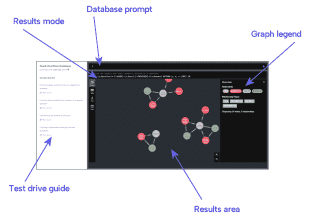
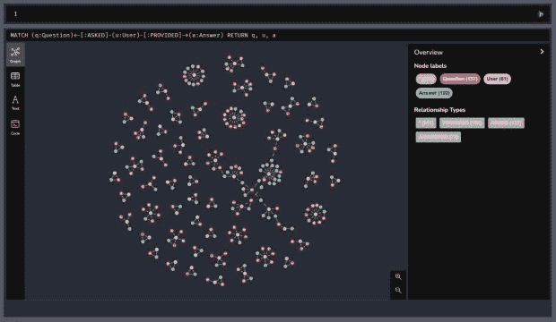

# 尝试 Neo4j 图形数据库就在这里，现在

> 原文：<https://thenewstack.io/try-a-neo4j-graph-database-right-here-right-now/>

有什么是图形数据库能让你完成的，而另一种类型的数据库做不到的？Neo4j 图形数据库可让您分析、试验和准确估计数据元素(“节点”)之间的关系、影响力和影响程度。

换句话说，当您的查询目的不仅仅是检索您已经存储的数据时，图形数据库是合适的工具，现有的数据库结构已经足够好了。它评估数据元素之间关系的深度、程度和完整性，并为您寻找的解决方案指明方向。

一个常规的数据库在那里**召回**。一个图形数据库在这里**解决**。

## 现在看到了吗

在新堆栈的一个特殊安排中，Neo4j 为您建立了一个测试平台，让您尝试使用一个完全预填充的基于云的 Neo4j AuraDB 开源图形数据库引擎。您的 AuraDB 控制台将在一个新的标签页中打开，因此您可以一边阅读一边尝试。你不必先注册或输入你的名字。尽管如此，我们还是希望您在发现 Neo4j 的工作方式以及它如何在您的组织中发挥您以前可能没有考虑过的解决问题的作用之后，再进行注册。但是首先，我们希望您使用 Neo4j 来看看它做什么以及如何工作。

点击这里，立即让 Neo4j AuraDB 开始工作。

## 现在你看到了

您可能熟悉使用[数据库浏览器或控制台](https://sqlitebrowser.org/)，在这里您可以与数据库建立连接，直接在命令行中输入 SQL 命令，并在可滚动窗口中查看结果。从概念上讲，试驾页面上的 Neo4j 工具并没有什么不同。当然，现在它是为使用三组预先导入的样本数据中的任何一组而定制的。完全基于云的 Neo4j AuraDB 引擎使用自己的全尺寸浏览器。

你现在看到的是:StackOverflow，如你所知，以可移植的数据格式发布[其完整的、最新的数据](https://data.stackexchange.com/stackoverflow/query/new)关于用户回答的问题以及他们的回答。这是一个巨大的数据库，因此为了测试页面的目的，我们围绕有关 Neo4j 数据库的 300 个问答问题提取了数据。

当 Test Drive 页面打开时，您看到的第一个测试查询是用 Cypher 语言编写的语句，而不是 SQL。一个 Cypher 查询要求 Neo4j 显示所有与其他节点的关系与模式匹配的**节点**(图中用圆圈表示的数据实体)。这可能是一个非常复杂的模式，尽管在这里非常简单。Cypher 使用特殊字符来帮助您将这些模式绘制到语句中，就好像它们是 ASCII 艺术一样。

下面是这个近距离的密码查询:

```
MATCH  (q:Question)<-[:ASKED]-(u:User)-[:PROVIDED]->(a:Answer)  RETURN  q,  u,  a  LIMIT  10

```

如您所知，SQL 中指定从集合中检索数据的主要关键字是 **SELECT** 。它的密码对应的是**匹配**。在这个 **MATCH** 语句中，您可以看到圆括号 **(** **)** 将位于圆圈内的元素(节点)括起来。图中的关系用箭头表示；这些箭头在 Cypher 中被重新创建，字面意思是穿过属性的名称。

## 找出原因和方法

每个数据库的目的都是将相关信息组合在一起，以便保持分组状态。当您向每个查询提供一个组或一个记录中的部分信息时，该查询将检索该组或该记录中的其余信息。图形数据库是数据库集的子集。它不仅存储相关数据，还存储**为什么**它是相关的——关系**。因此，当您查询数据库时，您将看到所有相关数据以及它们之间的关系。并且因为这些关系最初是作为图形产生的，所以检索到的关系可以同样容易地显示为图形。**

 **在这个数据集中有三个关键关系:一个表示用户提出问题，另一个表示用户收到对问题的响应，第三个表示用户提供对问题的响应。Cypher 语句声明了三个变量 **q** 、 **u** 和 **a** 来表示这个数据集中的三类节点。从 results 区域左侧的 results mode 按钮，您可以选择以传统列表的形式查看结果，甚至以 JSON 的形式查看结果。

但是我们在这里真正想要的是谁问了什么，谁作出了响应的映射。正是通过这些数据的视觉投射，我们变得完全知情。在脑海中想象一个 SQL 查询生成的表，该查询要求输入 **q** 、 **u** 和 **a** ，所有这些都以行和列的形式排列。现在，想象一下将这三个元素之间的关系拼凑在一起，并在一个模型中表达这些关系需要付出多大的努力。没有图表你真的做不到。

现在，您可以投资一个插件，用图形格式重新解释产品表，也许与下图没有什么不同。但是，如果您从一开始就希望建立关系，那么您可以从一开始就选择使用图形数据库，这样可以省去一些麻烦。

图形数据库不是一个关系数据库，它上面安装了一个图形可视化工具，因此它可以生成带有圆圈和箭头的报告，您可以将这些报告粘贴到 PowerPoints 中。它也不是您当前拥有的数据库的附加组件、附件或附件。更确切地说，它是一种存储数据元素之间关系的方式，或者说是存储数据的方式。这样，您的查询可以集中在关系上，并且您可以基于关系进行计算和分析。一个真正的图形数据库回答了**如何**和**为什么**事情彼此相关。

您可能尝试的第一个编辑是将 Cypher 查询从结果窗格复制到数据库提示，并从末尾删除 **MATCH 10** 。然后使用图表右下角的控件，缩小以查看包含 300 个条目的完整数据集的完整图表。

## 

## 从这里去哪里？

这只是将 Neo4j 与一套完整的数据和分析工具结合使用的强大体验的一个缩影。不用投资一分钱，就可以迈出下一步。您可以免费注册 AuraDB，在我们完全托管的云服务中建立一个数据库，并使用完整的 Cypher 语言来创建函数和分析，这些函数和分析可以与您现在使用的相同语言(包括 Python、Java 和 Node.js)集成到应用程序中。

以下是你现在可以选择的一些方法:

<svg xmlns:xlink="http://www.w3.org/1999/xlink" viewBox="0 0 68 31" version="1.1"><title>Group</title> <desc>Created with Sketch.</desc></svg>**