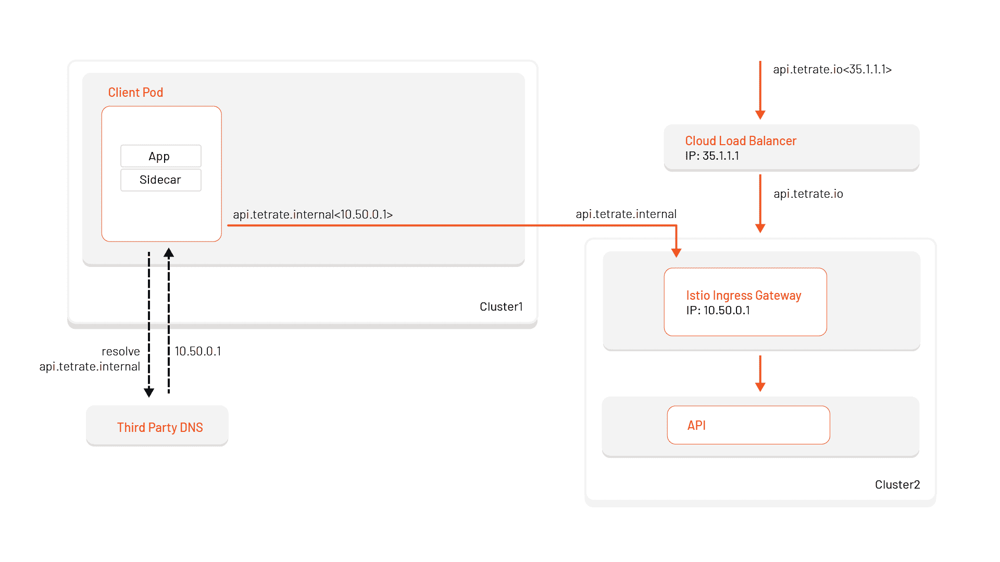
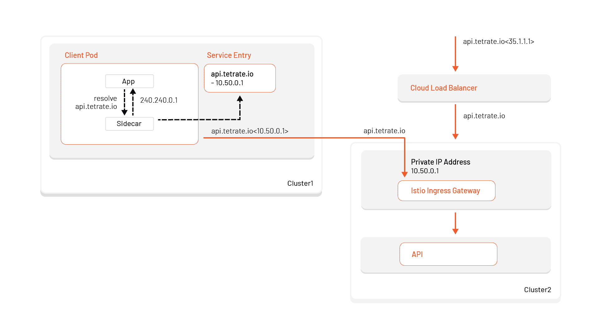

# 试用 Istio 的 DNS 代理

> 原文：<https://thenewstack.io/trying-out-istios-dns-proxy/>

[Tetrate](https://www.tetrate.io/) 赞助了这篇文章。

 [尼克·内利斯

Nick 是 Tetrate 公司的软件工程师，Tetrate 是一家企业服务网格公司。他是 Istio、公共云架构和基础架构自动化方面的 DevOps 专家。](https://www.linkedin.com/in/nick-nellis/) 

您可能听说过 Istio 1.8 中添加了 DNS 功能，但您可能没有想到它会带来什么影响。它解决了 Istio 中存在的一些关键问题，并允许您扩展网格架构，以包括多个集群和虚拟机。在 [Istio 网站](https://preliminary.istio.io/latest/blog/2020/dns-proxy/)上可以找到对这些特性的精彩解释。简而言之，它支持跨多个集群和虚拟机的无缝集成。在本文中，我们将测试这些新特性，并有望解释更多关于幕后发生的事情。

如果您是 Istio 新手，或者想知道为什么 Istio DNS 代理如此重要，请查看[Istio 1.8(DNS 代理)中的新增功能](https://www.tetrate.io/blog/whats-new-in-istio-1-8-dns-proxy-helps-expand-mesh-to-vms-and-multicluster/)。

## **启用 Istio 的 DNS 代理**

这个特性目前在 Alpha 中，但是可以在 IstioOperator 配置中启用。

### DNS 查询

既然 DNS 记录可以缓存在 Istio sidecar 中，kube-dns 的压力就减轻了。但是进步并没有就此结束。由于默认设置，它还减少了每次查找时进行查询的次数。这将缩短解决问题的时间。让我们看看当我为 istio.io 添加一个 ServiceEntry 时会发生什么。

您可能会认为您的 pod 会将 istio.io 解析为其公开可用的 IP 地址，但相反，Istio sidecar 会返回一个由 Istiod 发布的自动分配的虚拟 IP `240.240.0.1`。

如果你和我一样，你可能已经检查过 Istio 是否修改了/etc/resolv.conf 以路由到其他地方，但令我惊讶的是，它仍然指向 kube-dns。

这是因为 Istio 使用 IP 表劫持到 kube-dns 的请求，并将请求路由到 pod 中运行的 Istio 代理。

最后，我们需要记住，当您的应用程序 pod 将 istio.io 解析为 VIP 并发出请求时，VIP 将被交换为 Envoy 中的实际公共 IP 地址。如果我们看一下特使配置，我们可以看到这是如何做到的。

首先，我们将看看特使听众。我们应该以{VIP}_{PORT}的形式看到 istio.io ServiceEntry 的侦听器。侦听器中重要的部分是它被代理到的位置。为此，我们在“envoy . filters . network . TCP _ proxy”中查找 Envoy 集群。之后，我们将了解群集如何发现 istio.io 的真实公共 IP 地址。

istioctl 代理配置监听器 my-pod -o json

查看 istio.io 集群，我们将看到一个使用 STRICT_DNS 的 istio.io 出站条目，这意味着 Envoy 将连续和异步解析指定的 DNS 目标。这就是我们如何获得 istio.io 的公共 IP 地址

istioctl 代理配置集群 my-pod -o json

总之，因为我们创建了 istio.io 服务入口，所以您的 pod 将查询 istio.io 的 Istio DNS 并接收一个 VIP。然后，当通过 envoy sidecar 发出请求时，该虚拟 IP 被转换为公共 IP 地址。

### 外部 TCP 流量

Istio 目前对路由外部 tcp 流量有限制，因为它不能区分两种不同的 tcp 服务。这种限制尤其会影响第三方数据库的使用，如 AWS 关系数据库服务。在下面的例子中，我们有两个服务条目用于 AWS 中的不同数据库。除非手动指定，否则它们在默认端口 3306 上公开。Istio 1.8 之前的 TCP ServiceEntries 将在 sidecars 上为 0.0.0.0 创建出站侦听器:{port}。您可能已经注意到，如果有多个 TCP ServiceEntries 具有相同的端口，它们将具有冲突的特使侦听器。其实这个我们可以自己测试。以下示例使用两个具有相同端口的 TCP ServiceEntries。你可以自己尝试一下。

如果我们看一下在网格中运行的 pod，我们会看到两个侦听器用于不同的数据库。但是因为它们只关闭端口，所以只创建了一个监听器。

目前唯一的解决方案是更改数据库的默认端口，以便在 Istio 中工作。下面，我将 db-2 上的端口改为 3307，现在我们可以看到两个出站 TCP 侦听器。

现在有了 Istio mesh DNS，虚拟 IP 地址会自动分配给服务条目。这给了我们在 VIP 地址和端口上匹配监听器的灵活性，如下所示。这是用 Istio 1.8 用 ISTIO_META_DNS_CAPTURE 捕获的:" true "

### 虚拟机

使用 Istio 的 DNS 代理，虚拟机的可访问性和可发现性现在显著提高。尽管仍处于 alpha 测试之前，Istio 现在已经能够为加入网格的每个虚拟机自动添加工作负载条目。这意味着我们可以为我们的虚拟机(或一组虚拟机)分配一个可在网格内寻址的 DNS 条目。

启用自动虚拟机工作负载条目

自动创建的工作负荷条目示例

创建 Istio ServiceEntry 以通过 my-vm.com 公开标签为 app: myvmapi 的虚拟机实例

当在网格中进行调用时，我们可以看到我们的虚拟机 web 服务器在 my-vm.com 可用

#### **通过 Kube 代理的虚拟机 DNS**

为 VM 实例添加 DNS 条目的另一种方法是通过 Kubernetes 服务。您可以创建如下所示的服务，标签选择器指向 Istio WorkloadEntries。这也将使 VM 实例在 my-vm.vm.svc.cluster.local 上可用

#### **虚拟机上的 Istio DNS 代理**

Istio DNS 代理也适用于虚拟机。我们可以在虚拟机上检查 istio.io 是否仍然指向前面示例中的虚拟 IP 地址。

### 多集群

Istio DNS 代理使内部多集群路由更加容易，并且需要的配置更少。

例如，如果我们想通过一个云负载平衡器将我的 API api.tetrate.io 暴露给互联网，您通常会为该云负载平衡器分配一个公共 DNS 条目(例如 api.tetrate.io:35.1.1.1)。在云负载平衡器背后，可能有一个 Istio 入口网关监听 api.tetrate.io，将请求转发给应用程序。如果我们想从另一个集群访问这个应用程序，我们应该调用 api.tetrate.io (35.1.1.1)，但是这并不理想。当我们能够并且应该在我的内部网络中访问 API 时，我们将通过它的公共负载平衡器来访问它。让我们看看如何用 Istio 的 DNS 代理来解决这个问题。

#### **外部公开服务的内部路由**

为了保持内部流量，我们需要另一个 DNS 条目，我们的客户端应用程序可以通过这个条目访问 API。在下面的示例中，我们在第三方 DNS 提供商中为入口网关的内部 IP 地址 10.50.0.1 创建了 api.tetrate.internal。然后，我们可以配置我们的客户端应用程序来使用这个主机而不是 api.tetrate.io。我们还需要在 Istio 入口网关中为主机 api.tetrate.internal 添加一个额外的侦听器。

【T2

这种配置是当今最常见的，但它有一些缺点，Istio 的 DNS 代理可以解决。

不使用 Istio 的 DNS 代理的缺点(以上配置):

*   将客户端应用程序配置为使用不同于公开可用主机名的主机名。
    *   内部路由:api.tetrate.internal
    *   外部路由:api.tetrate.io
*   对 Istio 入口网关上的外部和内部主机使用监听器。
*   依靠第三方 DNS 进行内部 IP 地址解析。
    *   许多公司目前使用**公共** DNS 服务器解析内部服务。

#### **使用 DNS 代理的多集群路由**

有了 Istio 的 DNS 代理，多集群内部路由就容易多了。只需使用 Istio 入口网关 IP 地址为 api.tetrate.io 创建一个 ServiceEntry，现在您的客户端应用程序就可以在同一台主机上进行内部路由了！Istio sidecar 现在负责使用分配的 VIP 解析主机名，并注入网关的内部 IP 地址。不需要第三方 DNS、入口网关上的多个主机侦听器，最后，不需要对您的客户端应用程序进行任何更改来区分外部和内部路由。

## 进一步阅读

通过 Pixabay 的特征图像。

<svg xmlns:xlink="http://www.w3.org/1999/xlink" viewBox="0 0 68 31" version="1.1"><title>Group</title> <desc>Created with Sketch.</desc></svg>