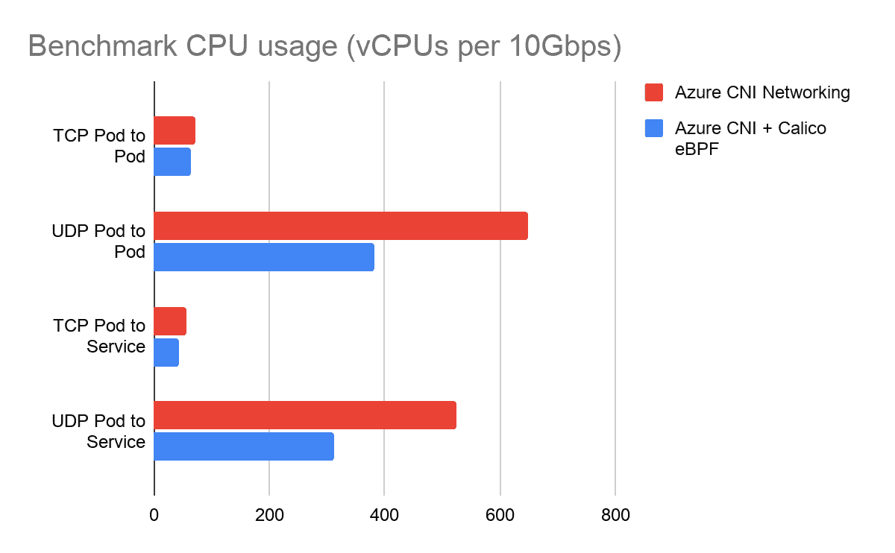
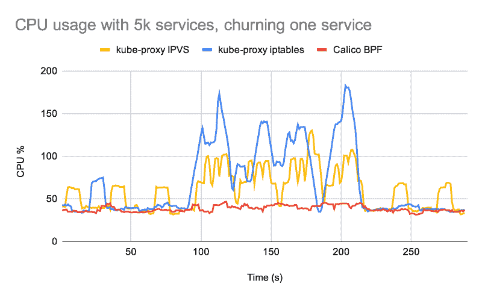
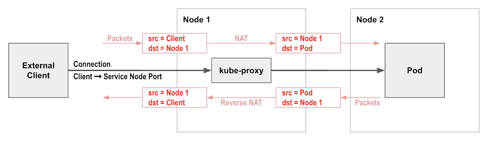
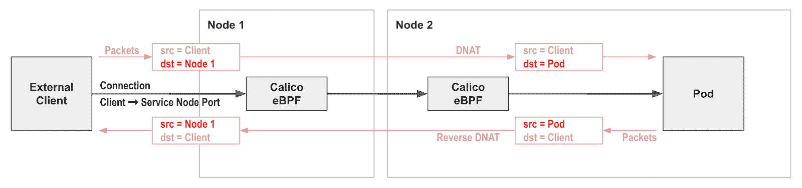

# 使用 Calico eBPF 的涡轮增压 AKS 网络

> 原文：<https://thenewstack.io/turbocharging-aks-networking-with-calico-ebpf/>

[](https://www.linkedin.com/in/rramezanpour/)

[Reza Ramezanpour](https://www.linkedin.com/in/rramezanpour/)

[Reza 是 Tigera 的一名开发人员，致力于促进 Calico 项目的采用。在加入 Tigera 之前，Reza 是一名系统工程师和网络管理员。](https://www.linkedin.com/in/rramezanpour/)

[](https://www.linkedin.com/in/rramezanpour/)[](https://www.linkedin.com/in/rramezanpour/)

单个 Kubernetes 集群在提供集群内联网上花费了其总可用分配资源的一小部分。不过，我们不必满足于此，如果您正在运行网络密集型工作负载，实现尽可能低的开销可以显著节省成本并提高性能。本文探索并解释了在 Azure Kubernetes Service (AKS)中使用 Calico [eBPF](https://docs.projectcalico.org/about/about-ebpf) 可以在 Microsoft Azure 中实现的改进，包括减少 CPU 使用、降低复杂性、实现更容易的合规性和故障排除等等。

在详细介绍 Calico 如何利用 eBPF 之前，需要注意的是，在本文的上下文中，Calico 被视为 Azure Container Networking Interface(CNI)之上的一个附加网络层，它提供了大幅提升其性能的功能。特别是，使用 AKS 安装 Calico 网络策略引擎的标准[指令](https://docs.microsoft.com/en-us/azure/aks/use-network-policies)使用的 Calico 版本早于 eBPF 模式。

## 加速网络性能

### 测试方法

为了展示 Calico 如何使用 eBPF 加速 AKS 网络性能，Calico 团队基于 [k8s-bench-suite 运行了一系列网络性能基准测试。](https://github.com/InfraBuilder/k8s-bench-suite)这些性能指标评测比较了使用 iptables 数据平面的最新 Calico eBPF 数据平面与普通 AKS 集群。

测试使用 Standard_D2s_v3 节点运行，这是 AKS 集群的典型机器类型。每个基准测试都测量了驱动 10 Gbps 流量所需的 CPU 使用率。

性能基准侧重于典型 AKS 群集中两个节点之间最常见的流量，包括 TCP 和 UDP 流的直接 pod 到 pod 流量和 pod 到服务到 pod 流量。

### 试验结果

下图显示了基准测试消耗的总 CPU 利用率，以 vcpu 衡量。这是客户端和服务器 CPU 利用率的总和。在这些测试中，根据流的类型，与没有 Calico 的集群相比，CPU 利用率降低了 11%到 41%。



基准 CPU 使用率(越小越好)

在受控的基准测试环境之外，这意味着 Calico eBPF 在相同的 CPU 利用率下实现了更高的网络吞吐量。如果吞吐量受环境限制，网络的 CPU 利用率较低意味着有更多的 CPU 可用于运行应用程序工作负载，如果您运行的是网络密集型工作负载，这反过来又可以转化为显著的成本节约。

## 更换 kube-proxy 以实现更好的服务处理

Calico 的 eBPF 数据层包含本地服务处理，因此您不再需要运行 kube-proxy。Calico 的本地服务处理在网络和控制平面性能方面都优于 kube-proxy，同时支持源 IP 保留等功能。

如果您的工作负载对网络延迟特别敏感，或者如果您正在运行大量服务，则性能差异会非常明显。在 Calico 团队的这篇[博客文章](https://www.projectcalico.org/introducing-the-calico-ebpf-dataplane/)中，您可以阅读更多关于这些性能优势的信息，并找到一系列不同的基准测试图表，比较 kube-proxy 性能与 Calico 的本地服务处理。



5K 服务的 CPU 使用率(越小越好)

## 保留源 IP 以提高流量可见性

Calico 的本地服务处理的另一个主要优势是它保留了客户端源 IP 地址。

Kubernetes 网络经常遇到的一个摩擦点是 kube-proxy 在到 Kubernetes 服务的输入网络连接上使用网络地址转换(NAT )(例如，通过服务节点端口)。在大多数情况下，这具有从传入流量中删除原始客户端源 IP 地址并用节点的 IP 地址替换它的副作用。



这意味着 Kubernetes 网络策略不能限制特定外部客户端的传入流量，因为当流量到达 pod 时，它不再拥有原始客户端 IP 地址。这也使得对应用程序进行故障诊断变得更加困难，因为日志并没有指出真正的客户端。

这是有问题的，因为对于某些应用程序来说，知道源 IP 地址是可取的或必需的。例如，应用程序可能需要根据客户端地址执行地理定位决策，或者可能有行业合规性要求来记录真实的源 IP 地址。



Calico 的本地服务处理能够保留客户端源 IP 地址。

为了在 AKS 集群中利用这个特性，您通常会创建一个 LoadBalancer 类型的 Kubernetes 服务。产生的负载平衡器将传入的连接定向到相应的服务节点端口，保留客户端源 IP。然后，Calico 的本地服务处理将节点端口负载平衡到后备 pods，再次保留客户端源 IP。因此，您可以从端到端的客户端源 IP 地址保护一直到后备 pod。

这使得日志和故障排除更容易理解，并意味着您现在可以为 pod 编写网络策略，以根据需要限制对特定外部客户端的访问。

## 演示

### 在开始之前

本文假设用户已经安装了 [kubectl](https://kubernetes.io/docs/tasks/tools/#kubectl) 和 [Azure CLI (az)](https://docs.microsoft.com/en-us/cli/azure/install-azure-cli) 。

如果您的系统上已经安装了`az`，请确保您使用的是 2.2.0 或更高版本。(你可以通过执行`az version`来检查你正在使用的`az`的版本。)

### 创建资源组

资源组用于将 AKS 公共云基础架构中的相关对象保存在一起。您可以决定资源组中应该包含哪些资源，以便有效地管理资源。

在本文中，我们将把 Calico 演示集群资源分组到一个名为 CalicoDemoRG 的资源组中。

使用以下命令创建资源组:

```
az group create  --name CalicoDemoRG  --location canadaeast

```

### 创建 AKS 集群

现在我们已经为集群准备好了需求，让我们使用下面的命令来部署它:

```
az aks create  \
  --resource-group CalicoDemoRG  \
  --name MyCalicoCluster  \
  --node-count  2  \
  --kubernetes-version  1.20.2  \
  --enable-managed-identity  \
  --load-balancer-sku standard  \
  --node-vm-size Standard_D2s_v3  \
  --network-plugin azure  \
  --network-policy calico

```

这会导致集群使用 iptables 数据平面运行最新版本的 Calico。

通过将`network-plugin`设置为`azure`，我们指定我们的集群 CNI 插件将使用 Azure CNI，通过将`network-policy`设置为`calico`，我们分配 Calico 为我们的集群网络流量做出策略决策。

注意:对于生产环境，如果需要，您还可以定制其他参数，如`node-vm-size`或`node-count`。如果您想了解更多关于其他论点及其责任的信息，请[参见本文件](https://docs.microsoft.com/en-us/cli/azure/aks?view=azure-cli-latest#az_aks_create)。

### 配置 kubectl

如果您有一个现有的 kubeconfig，您可能希望在此阶段备份它:

```
cp  -r  ~/.kube  ~/.kube.epochtime.$(date  +%s).backup

```

然后，使用以下命令在 kubeconfig 文件中生成新的 Azure 集群上下文:

```
az aks get-credentials  --resource-group CalicoDemoRG  --name MyCalicoCluster  --admin

```

### 设置 eBPF

在 eBPF 模式下，Calico 直接实现 Kubernetes 服务联网，而不是依赖于 kube-proxy。这意味着，像 kube-proxy 一样，Calico 必须直接连接到 Kubernetes API 服务器，而不是通过 API 服务器的 ClusterIP。

首先，安装补丁以确保使用正确的 IP 地址:

```
kubectl patch installation default  --type=merge  -p  '{"spec":{"calicoNetwork": {"nodeAddressAutodetectionV4": {"canReach": "8.8.8.8"}}}}'

```

接下来，由于 AKS 集群实现了与 API 服务器通信的负载平衡方法，建议您使用其 DNS 地址并利用其提供的容错功能。

使用以下命令，我们可以确定我们的负载平衡器 DNS 地址:

```
kubectl cluster-info  |  grep  -i  kubernetes

```

您应该会看到类似于
的结果

```
Kubernetes master is running at https://mycalicocl-calicodemorg-03a087-9388cb76.hcp.canadaeast.azmk8s.io:443

```

使用上述命令的结果创建一个文件，并在执行以下命令之前替换以下配置图中的`<API server host>`和`<API server port>`:

注意:在这种情况下，`<API server host>`将会是`mycalicocl-calicodemorg-03a087-9388cb76.hcp.canadaeast.azmk8s.io`，而`<API server port>`将会是`443`。

```
kind:  ConfigMap
apiVersion:  v1
metadata:
  name:  kubernetes-services-endpoint
  namespace:  tigera-operator
data:
  KUBERNETES_SERVICE_HOST:  "<API server host>"
  KUBERNETES_SERVICE_PORT:  "<API server port>"

```

现在应用文件:

```
kubectl apply  -f  yourfile.yml

```

等待 60 秒，让 kubelet 检测新的配置图。然后，重新启动操作器以获取更改:

```
kubectl delete pod  -n  tigera-operator  -l  k8s-app=tigera-operator

```

## 配置 kube 代理

Calico 在 eBPF 模式下取代了 kube-proxy，因此同时运行两者会浪费资源。您可以通过向 kube-proxy 的 DaemonSet 添加一个不匹配任何节点的节点选择器来禁用 kube-proxy(这是可逆的)。例如:

```
kubectl patch ds  -n  kube-system kube-proxy  -p  '{"spec":{"template":{"spec":{"nodeSelector":{"non-calico": "true"}}}}}'

```

## 启用 eBPF 模式

要启用 eBPF 模式，将 Felix 配置参数`bpfEnabled`更改为`true`。

```
kubectl patch felixconfiguration default  --type=merge  --patch='{"spec": {"bpfEnabled": true}}'

```

注意:启用 eBPF 模式不会中断现有的连接，但是现有的连接将继续使用标准的 Linux 数据路径。您可能希望重启 pod，以确保它们使用 eBPF 数据平面启动新的连接。如果你想了解更多关于 Calico eBPF 的信息，请[见本文件](https://docs.projectcalico.org/maintenance/ebpf/enabling-bpf)。

## 清除

您可以使用以下命令清理本文中创建的资源:

```
az aks delete  --name MyCalicoCluster  --resource-group CalicoDemoRG  -y
az group delete  --resource-group CalicoDemoRG  -y

```

## 结论

总之，Azure 上的 Calico eBPF 在多个方面提供了对默认 Azure CNI 的升级:

*   提高性能以降低 CPU/成本。
*   提高流量可见性，以实现更轻松的合规性和故障排除。
*   降低第一个数据包的延迟，以支持响应速度更快的应用。
*   本地服务处理，降低复杂性。
*   简单的升级途径。

如果您喜欢这篇文章，您可能也会喜欢:

<svg xmlns:xlink="http://www.w3.org/1999/xlink" viewBox="0 0 68 31" version="1.1"><title>Group</title> <desc>Created with Sketch.</desc></svg>