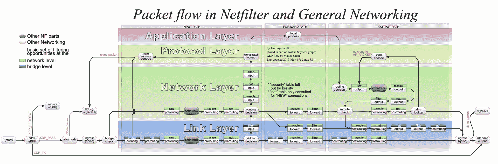
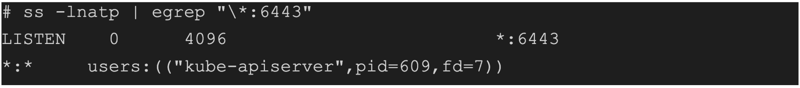
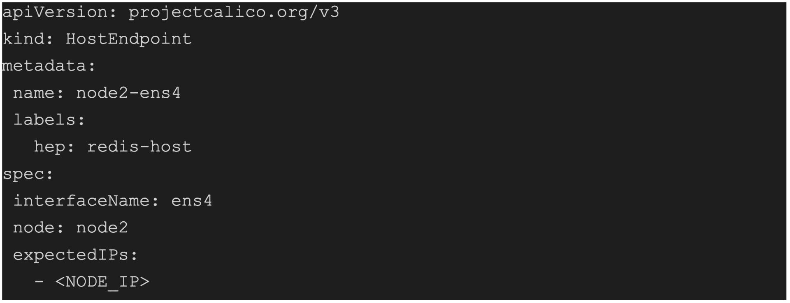
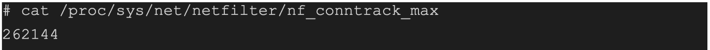
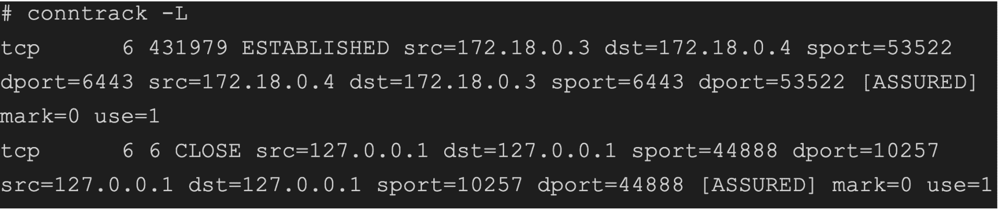
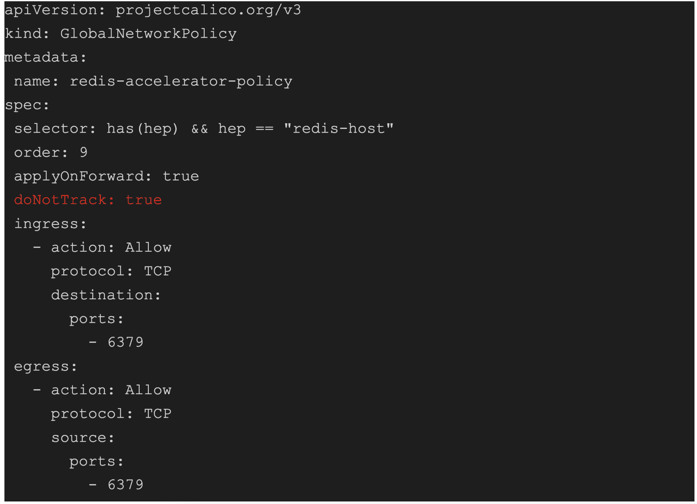

# 使用 Calico eBPF 和 XDP 对主机工作负载进行涡轮增压

> 原文：<https://thenewstack.io/turbocharging-host-workloads-with-calico-ebpf-and-xdp/>

在 Linux 中，基于网络的应用程序依赖内核的网络栈来建立与其他系统的通信。虽然这一过程通常是高效的，并且经过多年的优化，但在某些情况下，它会产生不必要的开销，从而影响网络密集型工作负载(如 web 服务器和数据库)的系统整体性能。

[XDP](https://link.tigera.io/ufol2) (快速数据路径)是 Linux 内核中基于 eBPF 的高性能数据路径，它允许您绕过内核的网络堆栈，直接在网络驱动程序级别处理数据包。

XDP 可以通过执行自定义程序来处理内核收到的数据包，从而实现这一点。这可以大大减少开销，提高整体系统性能，并通过缩短普通流量的正常联网路径来改进基于网络的应用程序。

然而，由于其编程复杂性和高学习曲线，使用原始 XDP 可能具有挑战性。像 [Calico 开源](https://link.tigera.io/ueQ2x)这样的解决方案提供了一种更简单的方法来驯服这些技术。

Calico 开源是一个网络和安全解决方案，与 Kubernetes 和其他云编排平台无缝集成。虽然它的策略引擎和安全功能臭名昭著，但通过安装 Calico，还可以在环境中使用许多其他功能。其中包括路由、IP 地址管理和一个可插拔的数据平面，具有各种选项，如 [eBPF](https://link.tigera.io/ue1Ak) (扩展的 Berkeley 数据包过滤器)、IPtables 和矢量数据包处理器(VPP)。

除了这些特性之外，Calico 还使得创建和加载针对集群主机接口的定制 XDP 程序变得简单。

通过使用您每天用来管理集群资源的熟悉的 Kubernetes 支持的语法，可以使用 XDP 的力量来提高您的主机工作负载的性能。

对于运行 Linux 和 Calico 的任何集群，Calico 与 XDP 的集成都是以相同的方式工作和实现的，无论它使用 IPtables、IP 虚拟服务器(IPVS)还是 Calico 的 eBPF 数据平面。

到本文结束时，您将知道如何利用 XDP 程序的力量来加速您的主机工作负载，而无需学习任何编程语言。您还将了解关于这些技术的更多信息，Calico 如何提供一种更简单的方法来适应不断变化的云计算场景，以及如何使用这些尖端技术来提升您的集群性能。

## XDP 工作负载加速

对于高连接工作负载，XDP 的主要优势之一是能够以低系统开销的线路速率运行。因为 XDP 是在尽可能早的执行点直接在内核中实现的，所以它可以以非常高的速度处理数据包，而延迟最小。这使得它非常适合需要快速高效的数据包处理的高性能网络应用。

下图说明了 Linux 内核中的数据包流。

图 1: XDP 和通用网络数据包流

[https://upload . wikimedia . org/Wikipedia/commons/3/37/Netfilter-packet-flow . SVG](https://upload.wikimedia.org/wikipedia/commons/3/37/Netfilter-packet-flow.svg)

为了更好地理解 XDP 的优势，让我们通过在 Kubernetes 主机上运行内存数据库并使用 XDP 绕过 Linux conntrack 特性，在一个常见的设置中对其进行研究。

## 主机网络安全

基于主机的工作负载是一种直接在主机上运行的应用程序。它通常用于描述不部署在像 Kubernetes 这样的容器编排平台上，而是直接部署在主机上的工作负载。

以下代码块说明了主机工作负载网络套接字。

这种类型的工作负载很难通过使用普通的 [Kubernetes 网络策略](https://projectcalico.docs.tigera.io/about/about-network-policy) (KNP)资源来保护，因为主机工作负载不属于 Kubernetes 管理的任何名称空间。事实上，KNP 的缺点之一是在处理这些类型的流量时的局限性。但是不要担心，Kubernetes 的模块化特性允许我们使用[容器网络接口(CNI)](https://link.tigera.io/ufol5) 插件，比如 Calico，来解决这样的问题。

## Calico 主机端点策略(HEP)

Calico 主机端点策略(HEP)是一个 Kubernetes 自定义资源定义，支持在集群内操纵主机流量。Calico 中的 HEP 表示参与集群的主机以及该主机上的工作负载所产生的流量。hep 可以与主机网卡相关联，并允许您将网络安全策略应用于主机上工作负载生成的流量。

主机端点策略是使用 Calico 中的 host endpoint 资源定义的，其结构如下:

元数据字段包含关于主机端点的信息，例如它的名称和与之相关联的任何标签，类似于其他 Kubernetes 资源，这些标签可以与其他资源一起使用，以引用往来于 HEP 的流量。

spec 字段包含 HEP 的配置，包括与之关联的接口名称、运行它的节点以及指定 Kubernetes 节点网络接口卡的预期 IP 地址。

## 将 HostEndpoint 与安全策略结合使用

与其他 [Kubernetes 安全](https://link.tigera.io/ufol6)资源类似，HEP 将成为一种拒绝所有的行为，并在没有明确许可的情况下对您的集群实施锁定，该许可要求在实施此类资源之前先查看您的集群中应该允许的流量。但是除了其安全优势之外，您还可以参考来自其他 Calico 安全资源(如全球安全策略)的 HEP 标签来控制流量，否则这些流量可能难以控制，并为您的集群环境创建更复杂、更细粒度的安全规则。

安全策略中的以下选择器将允许您过滤与`redis-host`*主机端点策略相关联的数据包:*

 *`selector: has(hep) && hep == "redis-host"`

该选择器匹配带有值为`redis-host`**的`hep`**标签的数据包。您可以将此选择器与安全策略中的其他规则结合使用，以指定 CNI 应该如何处理匹配的数据包。在下一节中，我们将使用相同的逻辑绕过 [Linux conntrack](https://link.tigera.io/ufol7) 特性。****

 ****## Linux 中的连接跟踪

默认情况下，Linux 中的网络是无状态的，这意味着每个传入和传出的通信流在被系统网络堆栈处理之前必须被指定。虽然这提供了强大的安全措施，但在某些情况下也会增加复杂性。为了解决这个问题，开发了 conntrack。

Conntrack，或称连接跟踪，是诸如状态防火墙等技术使用的 Linux 内核的核心特性。它允许内核通过维护每个连接的状态列表来跟踪所有逻辑网络连接或流，例如源和目的 IP 地址、协议和端口号。

这个列表有一个可调的软限制，这意味着它可以根据需要扩展以容纳新的连接。但是，在某些情况下，例如对于短期连接，conntrack 可能会成为系统的瓶颈并影响性能。

例如，这是我的本地计算机的限制。

虽然可以从系统中的`/proc/sys/net/netfilter`路径更深入地挖掘 conntrack 表的细节，但是像 [conntrack](https://packages.ubuntu.com/search?keywords=conntrack) 这样的应用程序可以让您更有组织地查看这些记录。

下面的代码块演示了我的本地 Kubernetes 主机记录的条目。

除了保护集群之外，还可以将主机端点选择器添加到 Calico 全局安全策略中，并使用一个`doNotTrack`*值来绕过特定流的 Linux 跟踪器功能。这种方法有利于接收大量短期请求的网络密集型工作负载，并防止 Linux conntrack 表溢出。*

 *下面的代码块是一个绕过 Linux conntrack 表的策略示例。

值得注意的是，由于`doNotTrack`*禁用了 Linux conntrack 功能，任何符合先前策略的流量都将成为无状态连接。为了将其返回到其原始来源，我们必须专门向我们的 Calico 全球安全策略资源添加一个返回策略(egress)。*

 *Calico 的工作量加速不仅限于 XDP。事实上，Calico 的 eBPF 数据平面可用于为集群中其他类型的工作负载提供加速。如果您想了解更多关于 Calico eBPF 数据平面的信息，请点击[此处](https://www.tigera.io/blog/introducing-the-calico-ebpf-dataplane/)。

## **结论**

总的来说，eBPF 和 XDP 是强大的技术，为高连接工作负载提供了显著的优势，包括高性能、低开销和可编程性。

在本文中，我们介绍了 Calico 如何使利用这些技术变得更加容易，而不用担心与这些复杂技术相关的学习曲线的复杂性。

*查看我们的免费自定进度研讨会，“* [*使用 Calico eBPF 和 XDP*](https://www.tigera.io/self-paced-workshops/) *涡轮增压主机工作负载”，了解更多信息。*

<svg xmlns:xlink="http://www.w3.org/1999/xlink" viewBox="0 0 68 31" version="1.1"><title>Group</title> <desc>Created with Sketch.</desc></svg>*******