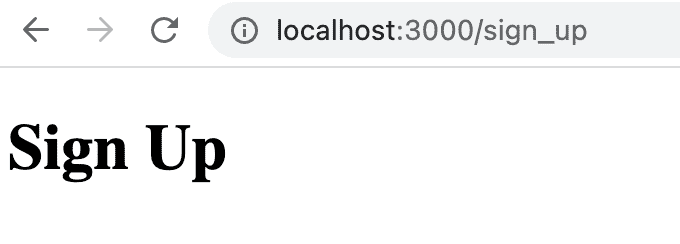
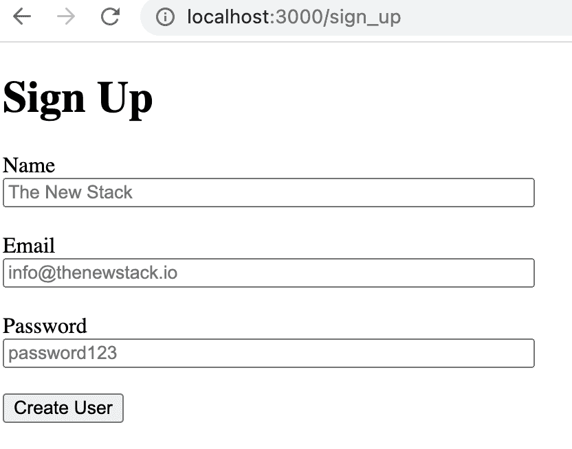
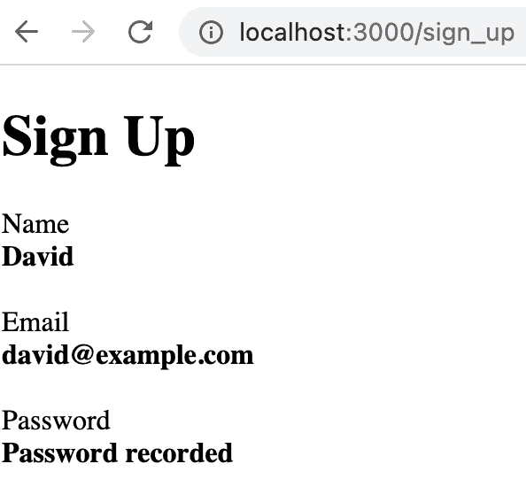

# 用“HTML Over the Wire”对 Ruby on Rails 进行涡轮增压

> 原文：<https://thenewstack.io/turbocharging-ruby-on-rails-with-html-over-the-wire/>

Ruby 是我的初恋，我的第一语言是 C，现在我和 C#走得很稳。这是大多数开发者典型的浪漫之旅；爱上了一个闪亮的新方法，只是为了以后和一个静态类型的语言调情。但是有一点我一直坚持:如果没有必要，我不想写 JavaScript。

现在，作为一个务实的开发人员，我知道为什么我可能需要 JavaScript，但是我总是更喜欢在更大的语言的更舒适的范围内。自从 node.js 诞生以来，已经有很多开发人员乐于专门使用 JavaScript 无论是客户端还是服务器端。不可否认的是，我确实喜欢媒体查询给我的响应式网页设计的控制权。

我一直认为 Ruby on Rails 更容易管理，因为它“固执己见”——即使它有点太热衷于把你推进数据库。所以我对“ [HTML Over the Wire](https://thenewstack.io/ruby-on-rails-creator-takes-on-javascript-frameworks-with-hotwire/) ”的想法很感兴趣；具体来说就是[热线](https://hotwired.dev/)。它似乎给了你类似 JavaScript 的能力，而实际上不需要写任何东西。所以我想是时候启动一个 Rails 项目，看看进展如何了。

## (再次)安装导轨

所以，让我们从一个简单的 Rails 安装开始。我们只是想要一个形式和回应。我假设你对什么是 Rails 和它的基本原则很熟悉，但是可能(像我一样)你已经有一段时间没有做过这些东西了。所以我会这么做:

*   我不会使用数据库；
*   我将尝试使用生成器，这样我就不必记住所有需要的文件。

我有一个 rvm (Ruby 环境管理)，所以让我们试着安装一个新的 Ruby 来匹配我们对 Rails 的需求。自然，无论我有什么红宝石都不够高:

```
theNewStack>  rvm get stable
...
theNewStack>  rvm use ruby  --install  --default
...
theNewStack>  ruby  --version
ruby  3.0.0p0  (2020-12-25  revision  95aff21468)  [x86_64-darwin21]

```

然后重要的东西:

```
theNewStack>  gem install rails

```

这给了我 35 颗宝石和文件。

```
theNewStack>  rails  --version
Rails  7.0.3

```

好了，让我们向生成器请求一个没有测试或活动记录的框架应用程序。

```
theNewStack>  rails new SimpleApp  --skip-active-record  --no-test-framework

```

至少我们有足够的东西可以立刻扔在屏幕上。正如我用 Sinatra 演示的那样，目前最受欢迎的服务器叫做 Puma。所以在我的 Mac 上，我们可以进入 app 目录，用 Puma 启动一个服务器:

```
cd SimpleApp 
bin/rails server

```

在 http://localhost:3000 我们看到了默认的 Rails 页面。我已经可以在 gem 文件中看到一些 Hotwire 的东西(有一个“turbo-rails”gem)，所以也许我们不需要为此做任何进一步的工作。

我们想要一个简单的表单，像一个注册页面，然后在提交后更新它。过去，我曾为此使用过一个快速消息。因此，在模型/视图/控制器世界中，我们需要一个用户模型，然后是“新用户”视图的表单，最后是注册控制器。不，我还没有写这些东西。

幸运的是，尽管最近没有使用 Rails，但我的老朋友“routes.rb”文件仍然存在。一条**路线**是我们如何以良好的休息方式描述我们的内部架构。所以我将 URL GET request "/sign_up "与一个新注册相关联，它也是适当的 POST 响应。

```
# Define your application routes per the DSL in https://guides.rubyonrails.org/routing.html

Rails.application.routes.draw do
  get  "sign_up",  to:  "registrations#new"
  post  "sign_up",  to:  "registrations#create"
end

```

好，我们最好做一个注册控制器。请记住，Rails 世界是非常固执己见的，所以要坚持这个原则，按照预期使用单词和短语。由于没有数据库，我们已经很困难了！

但首先，一个快速的用户模型。请注意，因为我抛弃了数据库，所以我们使用 ActiveModel 来说服 Rails 我们是好公民。所以在“app/models/user.rb”中我们有:

```
class User
  include ActiveModel::Validations
  include ActiveModel::Conversion
  extend  ActiveModel::Naming

  attr_accessor  :objectId,  :name,  :email,  :password

  @id  =  nil

  def initialize(attributes  =  {})
    @name  =  attributes[:name]
    @email  =  attributes[:email]
    @password  =  attributes[:password]
    @objectId  =  attributes[:id]
  end

  def id
    return self.objectId
  end

  def persisted?
    !(self.id.nil?)
  end
end

```

以及“app/controllers/registrations _ controller . Rb”中的快速注册控制器:

```
class RegistrationsController  &lt;  ApplicationController
    def new
        @user  =  User.new
    end
end

```

以及“app/views/registrations/new . erb . html”中的这个最小视图

我们在浏览器中得到这个令人高兴的结果:



好的，这很酷，但是我们需要一个更有趣的形式。毕竟，我们需要让热线有事可做。

现在，这不是一个关于如何让屏幕看起来更好的帖子，但是我已经从 Rails 和 HTML 中挤出了一些汁，所以表单看起来很好，不需要在 CSS 中做任何事情。对于一个真正的项目，你可能想做相反的事情。

Rails 智能魔术通过 ERB 标签之间的“form_for”工作，它查看模型(例如 user.rb)并在其上即兴重复。它甚至推断出“创建用户”将是提交按钮文本的一个很好的默认值。这就是你在使用 Rails 时所付出的代价。

这里是更好的观点:

```
<h1>Sign  Up</h1>

<%=  form_for  (@user),  url:  sign_up_path  do  |form|  %>
    <div  >
        <%=  form.label  :name  %>
        <%=  form.text_field  :name,  class:  "form_field",  id:  "name_field",  placeholder:  "The New Stack"  %>
    </div>
    <br>
    <div>
        <%=  form.label  :email  %>
        <%=  form.text_field  :email,  class:  "form_field",  id:  "email_field",  placeholder:  "info@thenewstack.io"  %>
    </div>
    <br>
    <div>
        <%=  form.label  :password  %>
        <%=  form.password_field  :password,  class:  "form_field",  id:  "password_field",  placeholder:  "password123"%>
    </div>
    <br>
    <div>
        <%=  form.submit  %>
    </div>
<%  end  %>

```

注意 URL 覆盖将响应发送到我们在 routes 中创建的 sign_up 路径。我已经确定了字段，因为很快就需要它。剩下的只是 Rails 和 HTML。

为了让它更简洁，我在“app/assets/样式表/application.css”中添加了一个简单的 CSS:

```
.form_field
{
  display  :  block;  
  min-width:  30%;
}

```

这一切给了我们这样的启示:



## 参与热线

好的，很好，但是这篇文章是关于热线的。通常情况下，我们必须在这里重新绘制一个新页面，或者使用一些 Flash 消息来确认用户已经被创建。但是 Hotwire 在它的 **Turbo Stream** 模式中给我们的是一个替换一段代码来响应一个动作的机会。这是用 AJAX 完成的，所以不需要画屏幕，而且是以一种很好的方式完成的。铁路。看看「app/views/registrations/submit . turbo _ stream . erb」:

```
<%=  turbo_stream.replace("name_field")  do  %>
    <span class  =  "form_field"  style="font-weight: bold"><%=@user.name%>
<%  end  %>

<%=  turbo_stream.replace("email_field")  do  %>
    <span class  =  "form_field"  style="font-weight: bold"><%=@user.email%>
<%  end  %>

<%=  turbo_stream.replace("password_field")  do  %>
    <span class  =  "form_field"  style="font-weight: bold">Password  recorded  
<%  end  %>

```

首先，注意文件名的命名。剩下的很简单。在这种情况下，我们用一些简单的 HTML 替换已标识的 div。

我在“app/controllers/registrations _ controller . Rb”中添加了 create 方法:

```
class RegistrationsController  &lt;  ApplicationController
    attr_accessor  :user

    def new
        @user=User.new
    end

    def create
        @user  =  User.new(params.require(:user))
        render  "submit"
    end
end

```

很明显，我还没有完全理解变量的用法:create 中读取传入参数的@user 是很重要的。

以下是创建用户后的页面:



因此，总结一下行为和流程:

1.  我们将 GET request sign_up 页面与“routes.rb”中注册控制器的**新**方法相关联。
2.  Rails 知道如何将 registrations new 方法与正确的 registrations 视图“new.html.erb”关联起来，其中的形式是。
3.  基于“user.rb”模型显示表单。
4.  表单上的按钮向 sign_up 发送 POST 请求。
5.  我们将 POST sign_up 与控制器的 **create** 方法相关联。这指示 rails 呈现**提交**视图。
6.  Turbo 查找“submit.turbo_stream.erb ”,并按照要求进行替换。
7.  结果是没有页面重绘。

虽然我花了一些时间来研究 Rails 目前是如何设置的，而且我几乎可以肯定我没有以官方的方式使用过它，但它仍然很容易试用并看到结果。然而，熟悉 HTML 和 CSS 仍然是必要的——即使我们可以暂时忽略我们的 JavaScript 霸主。

<svg xmlns:xlink="http://www.w3.org/1999/xlink" viewBox="0 0 68 31" version="1.1"><title>Group</title> <desc>Created with Sketch.</desc></svg>