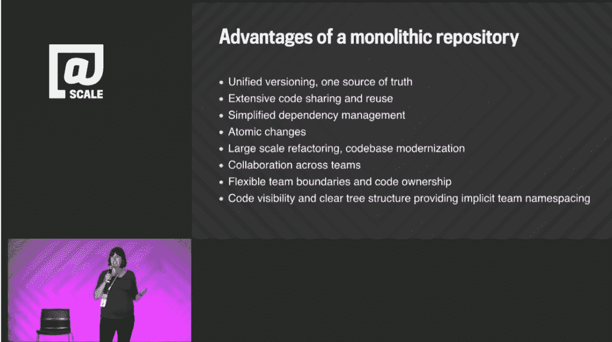
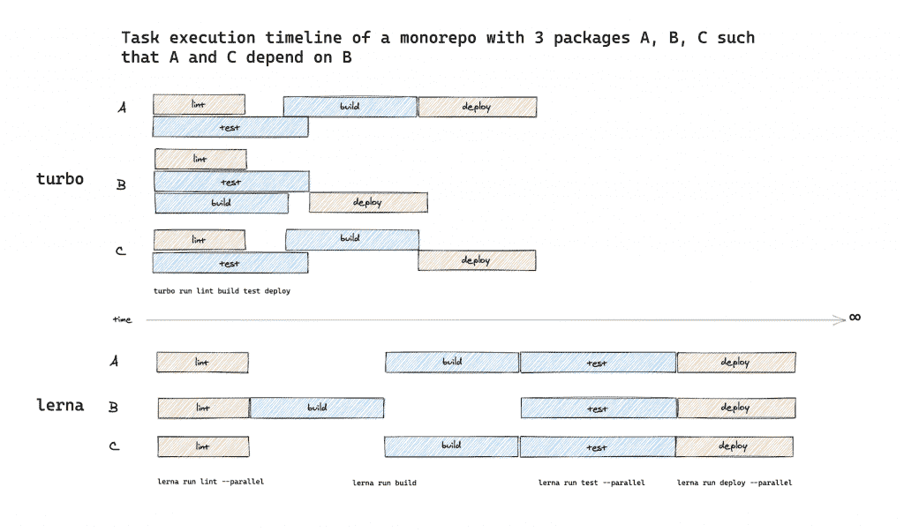

# turbo repo:JavaScript mono repos 的快速构建

> 原文：<https://thenewstack.io/turborepo-speedy-builds-for-javascript-monorepos/>

虽然许多软件商店似乎正在转向 monorepos 作为存储代码的方式，但他们使用的构建管理工具——尤其是 JavaScript/TypeScript——对于这些新环境来说似乎太慢了。

但是 monorepos 也有不好的一面。将所有代码存储在一个 repo 中的便利性被每当添加新的变更时需要处理这些代码的额外构建时间所抵消。

这是开发者[贾里德·帕尔默](https://jaredpalmer.com/)在构建自己的 app(一个 TypeScript 运行时， [TSDX](https://github.com/jaredpalmer/tsdx) )时遇到的问题。他在 monorepo 中构建这个项目，其中所有代码，包括依赖项，都位于一个存储库中，他希望构建 TSDX，以便它也可以在 monorepo 中进行管理。当他在网上发泄不满时，他发现许多人都有同感。

因此，他创建了 [Turborepo](https://turborepo.org/) ，一个开源的 monorepo 构建工具，据 Palmer 称，它可以将构建速度提高大约 65%到 85%。帕尔默声称，在少数例外情况下，它将 30 分钟的构建时间缩短到了 100 毫秒。

一名工程师在推特上热情洋溢地说:“Turborepo 真的很擅长它所做的事情:快得离谱的构建。”。

此外，Palmer 调整了软件，使其对单个开发人员和小团队来说超级直观。与前谷歌工程师创建的类似项目 [NX](https://nx.dev/) 相比，Turborepo 在这方面的确[获得了评论者的好评](https://www.youtube.com/watch?v=9iU_IE6vnJ8)。

由于对该软件印象深刻， [Vercel](https://vercel.com/) 收购了该技术，充实了其 web 开发技术组合，其中还包括 Svelte [下一代前端框架](https://thenewstack.io/vercel-and-svelte-a-perfect-match-for-web-developers/)和 Next.js 库，用于增强 React 框架的服务器端呈现能力。

## 大代码问题

以统一的方式管理大量代码的问题已经存在了一段时间，并且由于 web 开发的爆炸式增长而变得更加严重，web 开发依赖于开放源代码包的多样性和一定的交付速度。

为什么需要 JavaScript 的构建系统？帕尔默解释说，尽管 JavaScript 可以直接在浏览器中运行，但现在很少这样做了。像 React 这样的库需要多个工具，比如需要编译的 [JSX](https://reactjs.org/docs/introducing-jsx.html) 。但是，如果不止一个软件团队在使用 JSX，那么整个组织很快就会发现自己有多个，有时是冲突的 JSX 实例，这是一个后勤和安全的噩梦。

IT 巨头们得出的答案是将所有内容存储在一个巨大的存储库中(“monorepo”)。除了更好地管理代码本身，monorepo 还为整个组织的统一编码风格和测试奠定了基础。

谷歌、脸书和优步 T4 都走过这条路，React 本身的管理者也是如此。



2015 年，时任谷歌工程师的瑞秋·波特温(Rachel Potvin)发表演讲，解释了谷歌为何使用一个巨大的 monorepo 来存储其所有代码。( [YouTube](https://www.youtube.com/watch?v=W71BTkUbdqE&t=1443s) )。

然而，通用的构建工具跟不上这种不断发展的环境。虽然网络巨头脸书和谷歌都开发了内部工具集来解决延迟问题(分别开源为 [Bazel](https://bazel.build/) 和 [Buck](https://buck.build/) )，但这些工具需要大量的配置，并且是为大型工程密集型组织设计的。

Palmer 更感兴趣的是构建一个更容易被小团队使用的工具。输入 Turborepo。

## 缓存和并行化

更快的构建时间来自几种不同的方式。

一个是智能缓存。为此，该软件借用了谷歌 Bazel 的一项技术，围绕内容寻址存储构建。

帕尔默解释说，Turbo 着眼于“你的代码库的状态”。它还记录正在运行的构建软件的命令，制作一个指纹，用于索引已完成的工作。当开发人员键入相同的命令序列时，Turbo 可以快速交付缓存版本，而不是重复工作。

“Turbo 构建了一个依赖图，既有来自包注册表的外部依赖，也有你的代码库中的内部依赖，”Palmer 解释道。开发人员在项目根的一个`turbo.json`配置文件中提供依赖信息。

在协作环境中，每个开发人员的缓存都是共享的，因此一个开发人员可以重用其他人的工作。

与古老的`make`命令相比，它只查看指定文件或文件夹的修改时间，而不是实际工件的指纹。不同的计算机将为完全相同的时间产生不同的时间戳，这将导致构建系统丢失在其他方面完全相同的文件。

除了使用缓存的工作，Turborepo 还寻找将构建拆分成并行操作的地方。

帕尔默解释说，开发人员的管道或任务图为“开发人员提供了一种非常简洁的方式来表达他们需要运行来构建代码库的脚本之间的关系”。



Turborepo 和 Lerna 之间的工作管道比较，显示了 Turborepo 更多的并行执行。( [Turborepo docs](https://turborepo.org/docs/features/pipelines)

Turborepo 使用这些信息来确定哪些操作可以并行运行，从而在可能的情况下通过同时运行多个任务来缩短构建时间。这是无法通过传统的 JavaScript 构建工具轻松完成的。帕尔默说:“他们只按照依赖第一的顺序办事。”他们没有理解这些任务如何相互关联所需的额外信息。

下面是一个示例 json 管道配置文件(来自文档):

```
{
  "$schema":  "https://turborepo.org/schema.json",
  "pipeline":  {
    "build":  {
      "dependsOn":  ["^build"]
    },
    "test":  {
      "dependsOn":  ["build"]
    },
    "deploy":  {
      "dependsOn":  ["build",  "test",  "lint"]
    },
    "lint":  {}
  }
}

```

Turbo 命令行界面是开源的，从 repo 运行。最终用户可以托管远程缓存索引，或者使用 Vercel 的托管服务，该服务具有额外的功能，例如基于指标的可视化。

Turborepo 的另一个独特之处是，它可以被逐步采用。其他构建系统可以“对您的代码库以及它如何工作和它需要如何成形做出约束。虽然这些限制在某些规模下可能很大，但迁移到这些地方可能会非常昂贵且风险很大，”帕尔默说。相比之下，Turborepo 的目标是“在开发者已经在的地方，用他们已经在使用的工具与他们见面。所以它被设计成被采用，在某种程度上也被删除。”

帕尔默承认，对于 Turborepo 来说，现在还为时尚早。([最新版本为 1.1.16](https://github.com/vercel/turborepo) )。据至少一位用户说，设置仍然很复杂，需要一些改进。

“Turborepo 是一个非常酷的项目。这不仅很酷，而且非常必要——随着 monorepos 越来越受欢迎，显然缺少一些这样的工具，”[在一篇博客文章中写道](https://tolgee.io/blog/turborepo-overhyped)frontend architect tápán granát，同时补充说，该软件的不一致性表明仍需要为生产使用做些工作。“我还是最好在没有任何缓存的情况下运行我们的主发布管道，因为我想确保某些东西不会在不应该缓存的时候被缓存，因为这真的可能是一个大问题。”

[https://www.youtube.com/embed/YX5yoApjI3M?start=1594&feature=oembed](https://www.youtube.com/embed/YX5yoApjI3M?start=1594&feature=oembed)

视频

<svg xmlns:xlink="http://www.w3.org/1999/xlink" viewBox="0 0 68 31" version="1.1"><title>Group</title> <desc>Created with Sketch.</desc></svg>