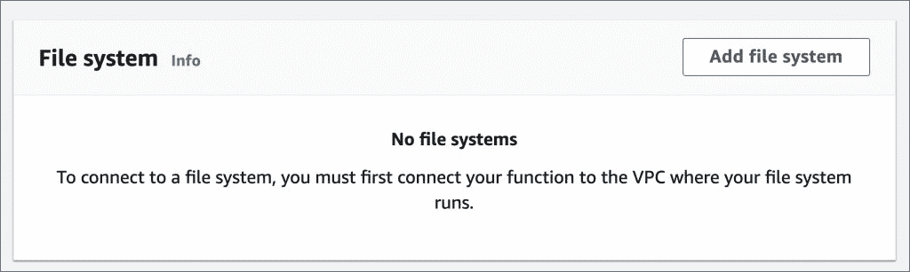
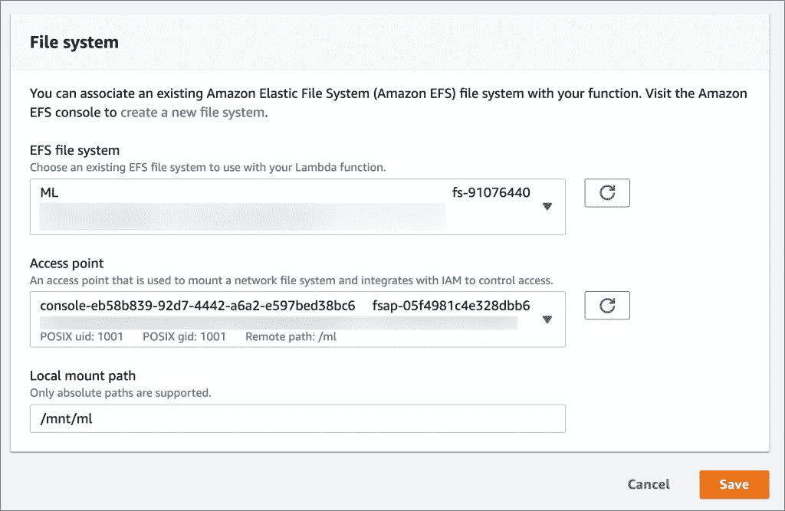
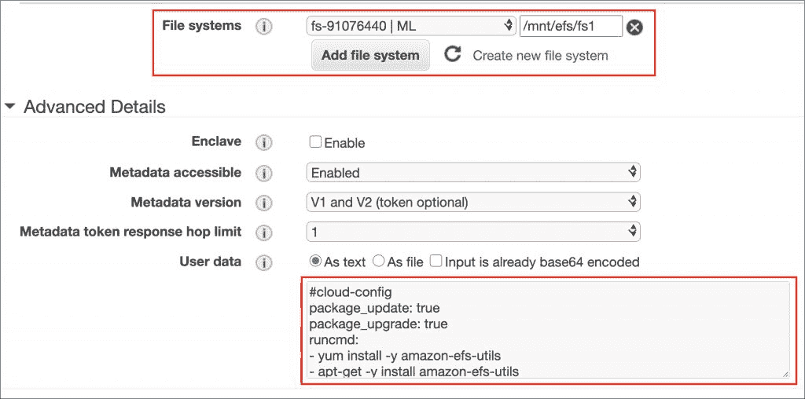
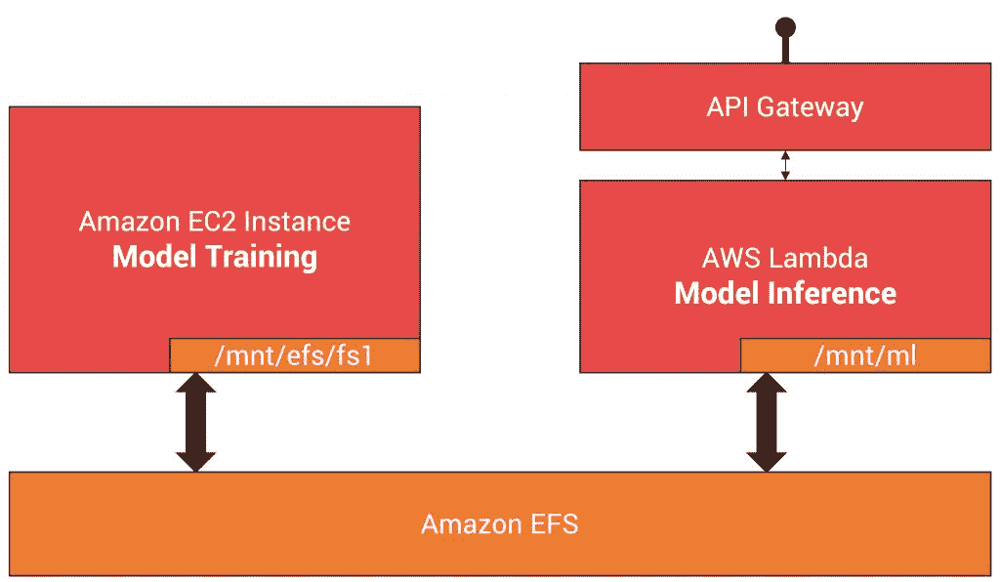

# 用 Amazon 弹性文件系统将 AWS Lambda 函数变成有状态的

> 原文：<https://thenewstack.io/turn-aws-lambda-functions-stateful-with-amazon-elastic-file-system/>

亚马逊网络服务的 Lambda 是业内首批无服务器平台之一。自 2014 年推出以来，亚马逊增加了多个功能，使其成为最成熟的功能即服务(FaaS)。该平台支持各种语言运行时，包括 Node.js、Python、Java、Ruby、C#、Go 和 PowerShell。它与主流 AWS 托管服务紧密集成，充当触发 Lambda 函数的事件源。

传统上，无服务器计算平台和 FaaS 产品(如 AWS Lambda)与无状态功能相关联。因为函数是基于事件调用和终止的，所以没有内在的持久层可用。通过将状态移动到对象存储、NoSQL 数据库、内存数据库或关系数据库实例，状态总是被外部化。在 Lambda 函数中，通过将状态写入 S3 桶或 DynamoDB 或 RDS 表中的对象来维护状态是很常见的。

但是某些用例，如机器学习推理，需要一种新的方法。从亚马逊 S3 桶下载大型模型会增加启动时间，从而导致延迟。有些函数需要的外部库可能太大。虽然 AWS Lambda Layers 的概念解决了这个问题，但有 50MB 的限制(压缩，用于直接上传)，这违背了目的。层在部署后是静态的，这意味着只能通过部署新层来更改内容。

2020 年 6 月，AWS 增加了对 Lambda 的亚马逊弹性文件系统(EFS)的支持，实现了许多令人兴奋的用例。

本系列教程涵盖了使用亚马逊 EFS 和 AWS Lambda 托管无服务器机器学习 API 的所有方面。

## 什么是亚马逊 EFS？

亚马逊弹性文件系统(EFS)为 AWS 服务和内部资源提供了一个托管的弹性 NFS 文件系统。它可以在不中断应用程序的情况下扩展到 Pb 级，随着文件的增加或删除而自动增长和缩减，无需调配和管理容量来适应增长。

因为 EFS 使用共享文件系统的行业标准 NFS v4，所以该文件系统可以很容易地附加到运行 Linux 的 EC2 实例上。

亚马逊 EFS 公开了众所周知的接入点，可以根据应用进行配置。EFS 接入点代表了一种在 NFS 环境中管理应用程序访问的灵活方式，具有增强的可扩展性、安全性和易用性。一个 EFS 文件系统可以有多个访问点。每个接入点都可以配置与 POSIX 兼容的用户 id 和组 id 相关联的权限。结合 IAM，EFS 文件系统可以拥有细粒度的安全性和访问控制。

了解亚马逊 EFS 仅在 VPC 内可用很重要。只有同一个 VPC 内的用户才能访问 EFS 文件系统。内部服务器只能在通过 AWS Direct Connect 或 AWS VPN 建立连接后才能装载 EFS 共享。

### 从 AWS Lambda 访问亚马逊 EFS 文件系统

当 EFS 文件系统附加到 AWS Lambda 函数时，它可以访问现有数据并在其中存储数据。这种方法使得用所有 Lambda 实例都可用的依赖项和附加文件来填充文件系统成为可能。

AWS Lambda 访问 EFS 文件系统的先决条件是该函数应该与 EFS 在同一个 VPC 中。它还应该具有访问文件系统和为 VPC 的子网创建弹性网络接口(ENI)的明确权限。一旦满足这些条件，Lambda 函数就可以读写 EFS 文件系统。

### 通过 Amazon EC2 实例填充 EFS 的内容

填充 Lambda 函数访问的 EFS 文件系统的最简单方法是将其挂载到 EC2 实例。使用标准的 NFS 约定，EFS 文件系统出现在`/mnt`目录中。

当从 AWS 控制台启动 EC2 实例时，可以选择挂载现有的 EFS 文件系统。向导自动添加适当的用户脚本，通过在`/etc/fstab`中添加一个条目来永久挂载文件系统。

### 用例:在 AWS Lambda 上托管无服务器 ML 推理 API

EFS 和拉姆达函数的强大组合可用于在无服务器模式下托管深度学习推理 API。由于 TensorFlow 或 PyTorch 模型的大小可能会超过 Lambda 层和`/tmp`目录的大小限制，因此 EFS 在存储模型时非常方便。

Lambda 的 EFS 存储后端也可以有所有的依赖项，如 OpenCV 或 PIL，它们不仅很大，而且需要时间来安装。Lambda Python 函数可以通过`PYTHONPATH`环境变量指向一个现有的目录。相同的文件系统还将具有存储在由函数加载的单独目录中的完全训练的模型。

为了用 Python 模块和预先训练的模型填充 EFS 文件系统，我们可以使用 Amazon EC2 实例，甚至是 SageMaker 笔记本。这两个选项都让我们能够通过 Python 虚拟环境或通过`pip`安装程序挂载文件系统并添加依赖项。

以下工作流程重点介绍了该方法中涉及的步骤:

1.  在现有 VPC 中创建 EFS 文件系统
2.  在同一个 VPC 中启动 EC2 实例，并挂载 EFS
3.  用 Python 模块和 PyTorch 模型填充 EFS 文件系统
4.  在同一 VPC 中创建一个 AWS Lambda Python 函数
5.  添加用于访问 EFS 和在 VPC 创建网络接口的 IAM 角色
6.  附加 EC2 实例中使用的相同 EFS 文件系统
7.  添加环境变量以将 Python 运行时指向 EFS 中的现有模块
8.  附加一个 API 网关，将函数公开为 HTTP API
9.  使用 NAT 网关配置 VPC，以允许出站流量进入互联网(可选)
10.  调用无服务器 API

本周，新的堆栈将推出一系列关于这个主题的教程，我将带您浏览在 AWS Lambda 中托管无服务器机器学习推理 API 的所有步骤。明天签到[下期](https://thenewstack.io/tutorial-configure-and-mount-an-efs-file-system-in-amazon-ec2-instance/)！

*贾纳基拉姆·MSV 的网络研讨会系列“机器智能和现代基础设施(MI2)”提供了涵盖前沿技术的信息丰富、见解深刻的会议。在 [http://mi2.live](http://mi2.live) 注册参加即将到来的 MI2 网络研讨会。*

<svg xmlns:xlink="http://www.w3.org/1999/xlink" viewBox="0 0 68 31" version="1.1"><title>Group</title> <desc>Created with Sketch.</desc></svg>