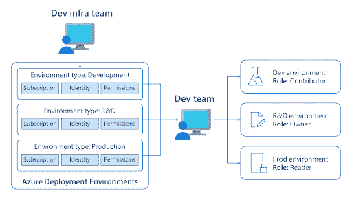

# 使用 Azure 将部署环境转化为商品

> 原文：<https://thenewstack.io/turn-deployment-environments-into-commodities-with-azure/>

当您考虑开发人员生产力的云服务时，重点通常是本地开发环境，在这里您可以将几个小时的工作减少到几秒钟的设置。甚至[使用脚本来启动和运行](https://github.blog/2015-06-30-scripts-to-rule-them-all/)，GitHub 的新员工过去也需要[花半天时间](https://github.blog/2021-08-11-githubs-engineering-team-moved-codespaces/)来准备好 GitHub.com 的本地实例，然后每当他们想转移到一个有新依赖项的分支机构，或者在不同的分支机构帮助同事解决编码问题时，又要花 45 分钟。 [CodeSpaces](https://github.com/features/codespaces) 将 Visual Studio 代码中的回购工作缩短到几秒钟(谷歌云工作站提供类似的各种 JetBrains IDE 和[微软开发盒](https://azure.microsoft.com/en-us/services/dev-box/)在云中为您提供一个完整的预配置开发人员工作站)。

但是，当涉及到部署应用程序运行的复杂环境时，可能需要多个云服务和订阅，并且需要作为构建管道的一部分为测试、试运行和生产进行多次设置，因此在使开发人员快速轻松地进行部署与保持资源安全和可管理之间存在矛盾。

## **Azure 部署环境**

今天在微软 Ignite 大会上宣布的[Azure Deployment Environments](https://aka.ms/deploymentenvironments)的新公开预览版，允许开发人员使用一系列[基础设施作为代码模板](https://aka.ms/deployment-environments/create-environments)，使用基础设施管理团队预先配置的策略和订阅，来加速按需应用部署环境。部署使用托管身份，开发人员不需要访问应用程序将使用的订阅和资源组(因此他们不会试图保存凭据或将其硬编码到脚本中)。

Azure 部署环境将正确的策略组合应用于应用环境，并在开发和部署的不同阶段给予开发人员所需的权限；图片来自微软。

在微软从事开发工具和服务的 Anthony Cangialosi 告诉新的堆栈，模板也提高了应用程序运行环境的安全性。

“我们听到组织谈论的一个问题和挑战是，当我们让开发人员获得订阅时，这就像是在蛮荒的西部。我们不知道他们是否在以安全的方式配置这些环境。我们不知道他们是否按照应用程序设计的方式一致地配置它们。因此，当变更被提交到主分支时，我们经常会在它展开时发现问题。”

Azure 部署环境允许基础设施和运营团队为应用程序运行时环境创建标准定义。开发人员可以从开发人员门户、CLI 或作为 CI/CD 管道的一部分来部署它们。

## **它将用于什么用途**

与 Azure DevTest 实验室不同，Azure DevTest 实验室的高级配置和成本控制功能专注于虚拟机，使用 Azure 资源管理器构建的模板可以在 Azure 中配置和部署任何服务。DevTest Labs 只有使用 ARM 模板构建 PaaS 资源的基本选项，它在同一个订阅中创建所有资源，因此它只对开发和测试场景有用，顾名思义。部署环境在整个生产部署过程中都很有用。

Bicep 和 Terraform 支持已经在 Azure 部署环境的路线图上，也许还有 [Pulumi](https://thenewstack.io/infrastructure-is-code-and-with-pulumi-2-0-so-is-architecture-and-policy/) ，Ansible 和其他基础设施即代码框架。

不同的策略可以应用于沙盒、开发、测试、试运行、生产前和生产环境的模板，例如在使用后自动关闭测试环境，或者在开发或测试环境中给予开发人员比生产环境更多的权限。

“能够为生产、预生产、测试和试运行定义不同的模板，使团队能够在这里定义应用程序在适当的规模下正确运行所需的内容，以管理这些不同阶段的成本，并确保它们得到安全和正确的配置，使开发人员能够灵活地快速创建这些模板，而不必承担学习如何做到这一点的负担，”Cangialosi 解释道。

“这让团队有信心在一致的环境中工作。现在，开发人员可以在提交 PR 之前将他们的更改发布到部署环境中，允许团队协作处理实例中运行的实际更改，该实例代表了实际服务在生产中的运行方式，而不仅仅是运行在本地工作站上的孤立组件。”即使有了容器和 mocking，您也不能在开发人员的笔记本电脑上复制整个交付环境。

## **安全和生产力**

这并不是要锁定开发人员环境或限制他们能做什么。“当 IT 部门试图管理安全性、合规性和治理时，他们与寻求灵活性和控制力的开发人员之间经常存在这种紧张关系。这些服务有助于平衡，并在限制范围内为开发人员提供更大程度的灵活性。”

他建议，能够定义和标准化应用环境为开发人员和基础设施团队提供了一种合作的方式，并尝试不同配置的影响。

“他们可以合作进行变革；您可以将它们部署在一个单独的环境中，让开发人员尝试看看它们是否支持该产品，它们可能对性能、前景、可扩展性产生什么影响，以及在预生产或生产环境中广泛部署之前可能发生的任何功能问题。”模板存储在带有版本控制和拉请求流程的 repos 中，就像任何其他代码一样。

Azure 部署环境与 Dev Box 实例出现在同一个开发人员中心，这为基础架构团队提供了一个管理权限和共享授权的地方。由于您有一个开发团队在从事一个共同的项目，因此您可以定义开发人员，他们有权通过开发盒设置开发人员工作站，以及为他们预定义的部署环境，他们可以在同一服务中创建这些环境

对于开发者来说，Dev Box 的吸引力正在变得更快。他指出，像 Azure 部署环境一样，它使开发和测试或数据工程(或不同的客户，顾问和合同员工)等角色之间的切换更容易。“您不必拥有单独的笔记本电脑。当您承担不同的任务时，您不必担心配置可能会毒害您的现有环境，因为您引入的新工具和 SDK 可能会重置或倒退，从而难以重建您的环境。”

## **调整大小**

开发人员还可以从硬件升级中获益，而不会出现通常意义上的中断，这种经济性正吸引着企业，原因与他们采用 IaaS 的原因相同。“当您发送物理工作站时，您必须最大限度地满足开发人员的需求，即使他们可能不会一直使用它。”像任何其他云服务一样，Dev Box 可以根据需要扩展和缩小。“随着您将这些工作站迁移到云中，您可以更加灵活地工作。您可以针对特定任务或特定角色或项目调整规模，随着这些角色和需求的变化，您还可以改变开发人员可用的硬件和容量。”

这对于混合和远程工作来说比以往任何时候都重要。RedMonk 分析师 James Governor 对 New Stack 表示:“过去几年让我们学到了很多关于更灵活、更受管理的开发和生产环境的需求。“例如，新员工和承包商的入职和离职，以及最终将开发环境完全带入云时代。护栏是我们的口号，因为我们在安全性和合规性方面平衡了开发人员的生产力和开发人员的体验与业务需求。Dev Box 允许 Windows 商店将开发人员工作站转变为完全托管的云服务。Azure 部署环境应该帮助企业标准化从开发到生产的工作流管理。”

私有预览在金融服务行业中特别受欢迎，在该行业中，出于合规性原因，许多组织要求开发人员每两到四周对他们的机器进行重新映像。但即使没有那些有些极端的政策，坎加洛西指出，“你是一个新的开发者，在你职业生涯的不同点上，在一个新的空间，即使你没有离开当前的工作。”

<svg xmlns:xlink="http://www.w3.org/1999/xlink" viewBox="0 0 68 31" version="1.1"><title>Group</title> <desc>Created with Sketch.</desc></svg>