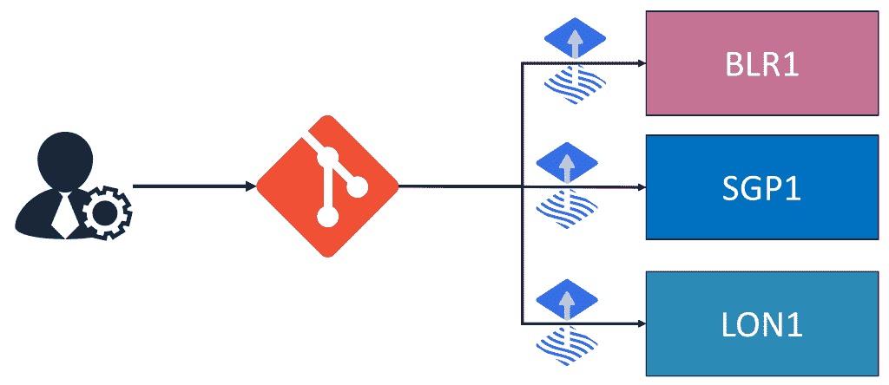
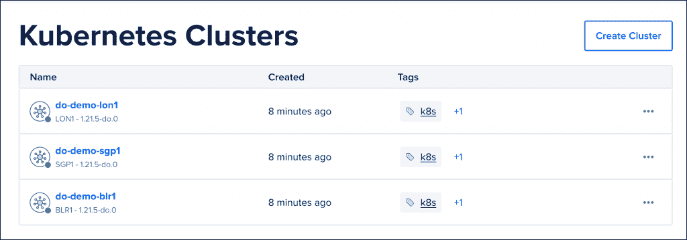
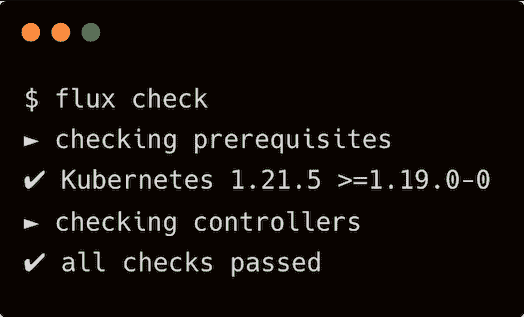
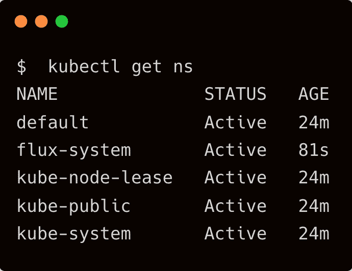
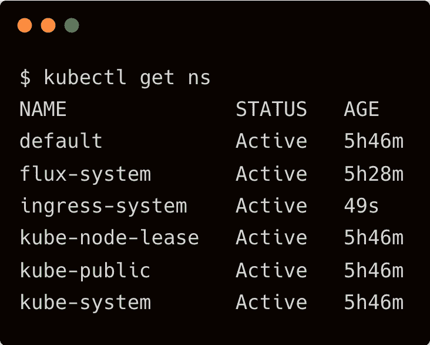
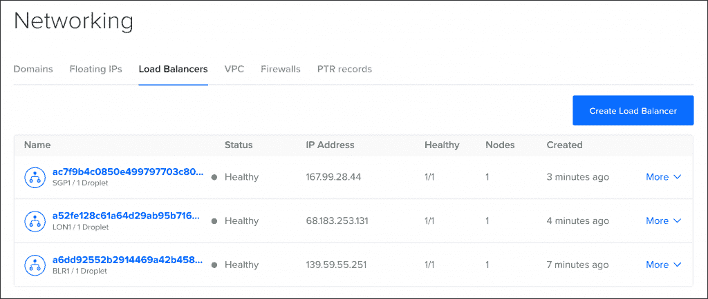
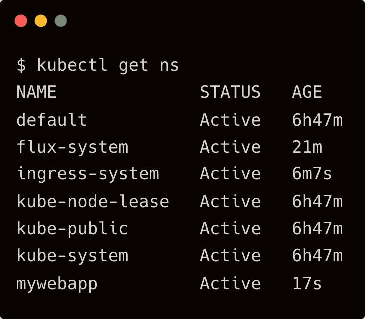
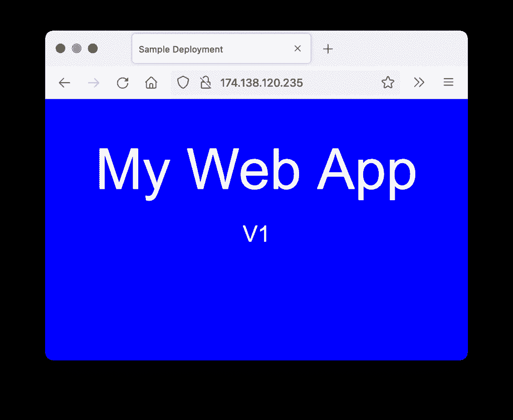
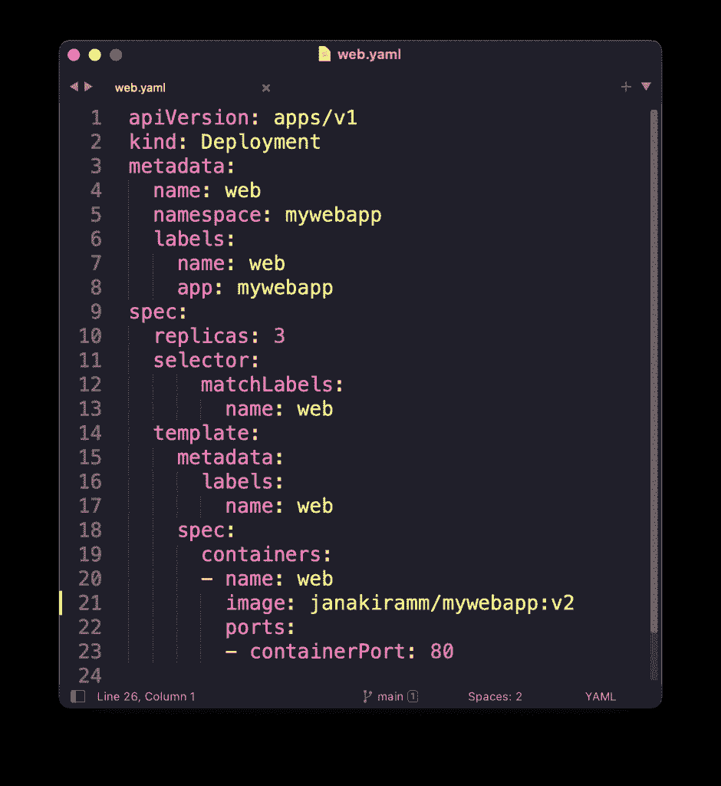
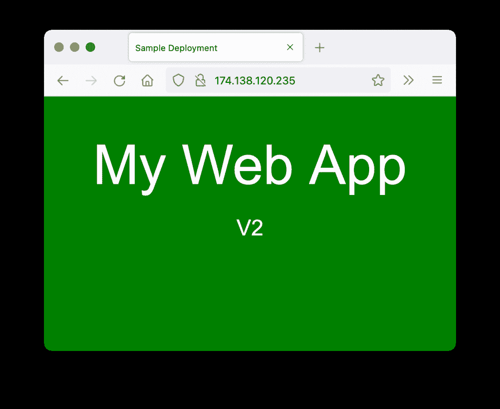

# 教程:数字海洋 Kubernetes 上带有 Flux 的 GitOps 部署

> 原文：<https://thenewstack.io/tutorial-a-gitops-deployment-with-flux-on-digitalocean-kubernetes/>

作为持续部署的首选机制，GitOps 的势头越来越大。根据我在 2021 年 11 月的[数字海洋部署会议](https://deploy.digitalocean.com/)上展示的演示，我将为您带来一步一步的 GitOps 教程，以执行大规模部署。

我们将在班加罗尔、新加坡和伦敦地区运行的三个不同的 DigitalOcean Kubernetes 集群上管理一个简单 web 应用程序的部署。最流行的 CD 工具 [Weaveworks](https://www.weave.works/?utm_content=inline-mention) 管理的开源 [Flux](https://fluxcd.io) 将用于引导 GitOps，配置入口基础设施，并最终部署应用。



在本教程中，我们将遵循 GitOps 的一些最佳实践，比如利用 git 作为事实的单一来源，使用 git 工作流来部署基础设施和应用程序。

除了引导之外，我们将始终使用`git`命令，而不依赖 CLI(`fluxctl`和`kubectl`)进行配置。我们将逐步添加一个入口组件(基础设施),打包为一个舵图和一个 web 应用程序(应用程序),在一组 YAML 文件中声明到 repo 中，最终将在所有集群中进行协调。

无论是一个集群还是几万个集群，工作流程都是一样的。本教程的目的是展示针对多个 Kubernetes 集群的大规模部署。

### 先决条件

### 步骤 1:准备环境

让我们从使用`doctl` CLI 启动 Kubernetes 集群开始。到这一步结束，我们应该有三个集群运行在数字海洋云平台的三个不同区域。一旦集群被提供，我们将下载`kubeconfig`并重命名上下文。



接下来，创建一个 GitHub 存储库，用于存储工件。姑且称此为`do-gitops-demo`。

假设您已经创建了一个 GitHub 个人访问令牌，为 Flux 设置环境变量来访问存储库。

`export GITHUB_TOKEN=YOUR_GITHUB_PERSONAL_ACCESS_TOKEN`

### 步骤 2:为 GitOps 引导集群

让我们确保群集为 Flux 做好准备。我们将通过运行命令`flux check`来实现这一点。



让我们通过将集群指向上一步中创建的 GitHub 存储库来引导集群。

这会导致两件事情——Flux 将清单添加到 repo 的`fleet`目录中，并使集群与清单一致。

目录结构如下:

```
+--  fleet
│ +--  blr1
│ │ +--  flux-system
│ │ │ +--  gotk-components.yaml
│ │ │ +--  gotk-sync.yaml
│ │ │ \--  kustomization.yaml
│ +--  lon1
│ │ +--  flux-system
│ │ │ +--  gotk-components.yaml
│ │ │ +--  gotk-sync.yaml
│ │ │ \--  kustomization.yaml
│ \--  sgp1
│ +--  flux-system
│ │ +--  gotk-components.yaml
│ │ +--  gotk-sync.yaml
│ │ \--  kustomization.yaml

```

您可以在每个集群上验证`flux-system`命名空间。这确认了成功的引导。



我们现在准备好配置基础设施组件(入口)并通过相同的工作流部署它们。

### 步骤 3:通过 GitOps 部署入口

有了在所有集群中运行的 Flux GitOps 代理，我们可以通过将工件提交给 Git 存储库来利用它来推动更新的部署。

在这一步，让我们创建一个名称空间`ingress-system`并安装 [NGINX](https://www.nginx.com?utm_content=inline-mention) 入口舵图表。让我们利用通量增加的`helmrepositories`和`helmreleases`CRD。

首先将 Git 存储库克隆到您的本地工作站。

`git clone https://github.com/$OWNER/do-gitops-demo.git`。

此时，该报告包含负责部署 Flux operator 的 YAML 公司。我们将添加一个新的目录，`infrastructure`并提交基于 NGNIX 的入口的 YAML 文件。

`cd do-gitops-demo`
`mkdir infrastructure`

让我们将 YAML 文件添加到目录中。

这三个文件大致转换成安装 NGINX ingress 的相同命令序列:

`kubectl create ns ingress-system`

`helm repo add ingress-nginx https://kubernetes.github.io/ingress-nginx
helm repo update`

`helm install --namespace ingress-system \
nginx-ingress ingress-nginx/ingress-nginx`

最后，我们需要在集群目录下的`fleet`中添加一个库定制，它将作为基础设施组件的指针。由于目录`fleet`是在引导过程中向 Flux 代理注册的，所以这是添加下面的 YAML 文件的最佳位置。

例如，为了定位 Bangalore 集群，将下面的文件复制到`fleet/blr1`目录。这种方法让我们有机会在以后的阶段为每个集群定制工件。

将该文件添加到所有集群，以确保它们部署了入口。

请注意，在每个特定于集群的目录中添加了`infrastructure.yaml`，在`infrastructure`目录中添加了 YAML 工件。

```
+--  fleet
│    +--  blr1
│    │    +--  flux-system
│    │    │    +--  gotk-components.yaml
│    │    │    +--  gotk-sync.yaml
│    │    │    \--  kustomization.yaml
│    │    \--  infrastructure.yaml
│    +--  lon1
│    │    +--  flux-system
│    │    │    +--  gotk-components.yaml
│    │    │    +--  gotk-sync.yaml
│    │    │    \--  kustomization.yaml
│    │    \--  infrastructure.yaml
│    \--  sgp1
│   +--  flux-system
│   │    +--  gotk-components.yaml
│   │    +--  gotk-sync.yaml
│   │    \--  kustomization.yaml
│   \--  infrastructure.yaml
\--  infrastructure
    +--  ingress-helm-release.yaml
    +--  ingress-helm-repo.yaml
    \--  ingress-ns.yaml

```

是时候提交新的工件并将它们推送到远程 GitHub 存储库了。

`git add .`T20`git commit -m "Added infrastructure components"`

提交更改时，Flux agent 开始协调过程。几分钟后，您应该会看到所有集群都创建了`ingress-system`名称空间。



由于创建入口会导致提供负载平衡器，数字海洋云控制台显示每个集群创建了三个负载平衡器。



这一步演示了如何通过 GitOps 工作流部署舵图。让我们进入下一步，我们将部署利用在这一步中创建的入口的 web 应用程序。

### 步骤 4:通过 GitOps 部署 Web 应用程序

对于 web 应用程序，让我们按照相同的步骤将清单添加到`apps`目录，然后将一个库定制化文件添加到`fleet`目录。

`cd do-gitops-demo`
`mkdir apps`

在`apps`目录中，创建下面的 YAML 文件:

最后，将下面的库定制文件添加到`fleet`目录下的所有集群中。

添加了`apps`之后，请注意目录结构是如何变化的。

```
+--  apps
│    +--  ns.yaml
│    +--  web-ingress.yaml
│    +--  web-service.yaml
│    \--  web.yaml
+--  fleet
│    +--  blr1
│    │    +--  apps.yaml
│    │    +--  flux-system
│    │    │    +--  gotk-components.yaml
│    │    │    +--  gotk-sync.yaml
│    │    │    \--  kustomization.yaml
│    │    \--  infrastructure.yaml
│    +--  lon1
│    │    +--  apps.yaml
│    │    +--  flux-system
│    │    │    +--  gotk-components.yaml
│    │    │    +--  gotk-sync.yaml
│    │    │    \--  kustomization.yaml
│    │    \--  infrastructure.yaml
│    \--  sgp1
│   +--  apps.yaml
│   +--  flux-system
│   │    +--  gotk-components.yaml
│   │    +--  gotk-sync.yaml
│   │    \--  kustomization.yaml
│   \--  infrastructure.yaml
\--  infrastructure
    +--  ingress-helm-release.yaml
    +--  ingress-helm-repo.yaml
    \--  ingress-ns.yaml

```

`git add .`
`git commit -m "Added web application"`
`git push`

几分钟后，您将看到 web 应用程序的名称空间`mywebapp`。



通过访问负载平衡器 IP 地址来访问它，以查看下面的网页:



编辑`do-gitops-demo/apps/web.yaml`将图像标签从 v1 更新到 v2。



提交代码并将其推送到远程 GitHub 存储库。再次访问负载平衡器 IP，查看 web 应用程序的 V2 版本。



如果恢复上次提交，可以将部署回滚到 V1。这就是使用 GitOps 的妙处。

这就完成了使用 FluxCD 和 DigitalOcean Kubernetes 的分步指南。在接下来的教程中，我们将探讨如何使用 Kustomization 来定制每个集群的部署。敬请关注。

<svg xmlns:xlink="http://www.w3.org/1999/xlink" viewBox="0 0 68 31" version="1.1"><title>Group</title> <desc>Created with Sketch.</desc></svg>