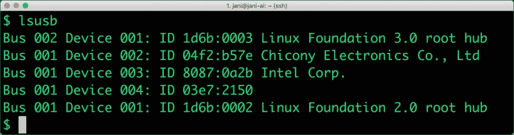

# 教程:借助英特尔 Movidius 加速深度学习模型

> 原文：<https://thenewstack.io/tutorial-accelerate-deep-learning-models-with-intel-movidius/>

英特尔 Movidius 神经计算棒在边缘加速机器学习推理。上周我报道了这个设备的细节[。在本教程中，我们将采用现有的 Caffe 深度学习模型，并针对英特尔 Movidius 进行优化。](https://thenewstack.io/a-closer-look-at-intel-movidius-neural-compute-stick/)

本指南基于英特尔 Movidius NCS 1 和 NCSDK 2。该设备的最新版本使用英特尔 OpenVINO Toolkit，它与以前版本的 SDK 不兼容。但是英特尔仍然在销售 NCS 1 设备，同时积极维护 SDK。

除了 NCS1 设备，你还需要一台带有免费 USB 3 端口的 Ubuntu 16.04 PC。您可以使用 VirtualBox 或 VMware Fusion/Workstation 来设置和配置 SDK。可选地，可以使用 Raspberry Pi 3 设备来运行优化的图表。

### 安装英特尔神经计算软件开发套件 2

让我们首先确认英特尔 Movidius NCS USB 设备已被识别。运行 lsusb 应该显示一个 ID 为 *03e7:2150* 的设备。



我们现在将在 Ubuntu 上安装必备组件——python 3、Pip 和 Git 包。

```
sudo apt-get  upgrade
sudo apt install python3
sudo apt install python3-pip
sudo apt install git-all

```

克隆 NCSDK 2 Github 库，构建 SDK。

```
git clone  -b  ncsdk2 http://github.com/Movidius/ncsdk
cd  ncsdk
make  install

```

安装可能需要几分钟才能完成。完成后，通过运行 **hello_ncs_py** 示例来验证 SDK 是否正确安装。

```
cd  ~/ncsdk/examples/apps/hello_ncs_py
make  run

```


上述输出证实了 SDK 能够访问英特尔 Movidius NCS 设备。

### **从 Caffe 深度学习模型生成图形**

在[之前的一个教程](https://thenewstack.io/train-a-convolutional-neural-network-with-nvidia-digits-and-caffe/)中，我用 NVIDIA DIGITS 构建了一个对图像进行分类的卷积神经网络(CNN)。我们将使用来自该演示的完全训练的模型来分类狗和猫的图像。

从以下链接下载训练好的 Caffe 模型:

```
mkdir  cat-dog  &&  cd  cat-dog
wget https://www.dropbox.com/s/vxyby375e82vq1b/cat-dog.caffemodel?dl=0  -o  cat-dog.caffemodel
wget https://www.dropbox.com/s/byvf1d4ul09ujn9/deploy.prototxt?dl=0  -o  deploy.prototxt

```

在我们使用模型进行推理之前，我们需要生成一个针对英特尔 Movidius 优化的图表。为此，我们将使用 mvNCCompile，它是 NC SDK 中可用的命令工具之一。该工具将经过训练的模型作为输入，并生成所需的图形。

```
mvNCCompile deploy.prototxt  -w  cat-dog.caffemodel  -s  12  -is  227  227

```

前两个参数指向 Caffe 模型，而 *-s 12* 表示我们在图中使用了 12 个 SHAVE 内核。最后一个参数是图像的大小，227X227。

您现在应该找到两个新文件—**graph 和 output_expected.npy** ,它们可以加载到 NCS 设备上进行推理。

是时候让我们编写 Python 代码来加载图表并进行推理了。

```
import os
import sys
import glob
import numpy
import ntpath
import argparse
import skimage.io
import skimage.transform
import sys

import mvnc.mvncapi as mvnc

GRAPH="graph"
SIZE=[227,227]

devices  =  mvnc.enumerate_devices()
if len(  devices  )  ==  0:
print(  "No devices found"  )
quit()

device  =  mvnc.Device(  devices[0]  )
device.open()

with open(GRAPH,  mode='rb'  )  as  f:
blob  =  f.read()

# Load the graph buffer into the NCS
graph  =  mvnc.Graph(GRAPH)
# Set up fifos
fifo_in,  fifo_out  =  graph.allocate_with_fifos(  device,  blob  )

img  =  skimage.io.imread(  sys.argv[1]  )
img  =  skimage.transform.resize(  img,  SIZE,  preserve_range=True,  mode='constant'  )

labels  =[  line.rstrip('\n')  for line in
open(  "./labels.txt"  )  if line  !=  'classes\n']

print(  "\n=============================================================="  )
# Load the image as an array
graph.queue_inference_with_fifo_elem(  fifo_in,  fifo_out,  img.astype(numpy.float32),  None  )
# Get the results from NCS
output,  userobj  =  fifo_out.read_elem()

# Get execution time
inference_time  =  graph.get_option(  mvnc.GraphOption.RO_TIME_TAKEN  )

# Find the index of highest confidence
top_prediction  =  output.argmax()

# Print top predictions for each image
print(  "Predicted "  +  sys.argv[1]
+  " as "  +  labels[top_prediction]
+  " in %.2f ms"  %  (  numpy.sum(  inference_time  )  )
+  " with %3.1f%%"  %  (100.0  *  output[top_prediction]  )
+  " confidence."  )
print(  "==============================================================\n"  )

fifo_in.destroy()
fifo_out.destroy()
graph.destroy()
device.close()
device.destroy()

```

我们把上面的文件叫做 **run.py** 。在我们传递示例图像来测试图形之前，我们需要创建一个标签文件，其中只有两个条目在不同的行中。

```
echo  cat  >  labels.txt
echo  dog  >>  labels.txt

```

你可能想从这个[链接](https://www.dropbox.com/s/1ulcuyb49e7ew4w/images.zip?dl=0)下载预处理过的图像样本。

通过下面的命令调用图形:

```
python3 run.py images/3.jpg

```


在我即将推出的一个教程中，我将演示如何将英特尔 Movidius NCS 2 与 OpenVINO Toolkit 配合使用。

*贾纳基拉姆·MSV 的网络研讨会系列“[机器智能和现代基础设施(MI2)](https://mi2.janakiram.com/) ”提供了涵盖前沿技术的信息丰富、见解深刻的会议。[注册](https://mi2.janakiram.com/)参加即将举行的 MI2 网络研讨会，深入了解如何利用英特尔 Movidius 加速机器学习推理。*

图片由来自 Pixabay 的 F. Muhammad 拍摄。

<svg xmlns:xlink="http://www.w3.org/1999/xlink" viewBox="0 0 68 31" version="1.1"><title>Group</title> <desc>Created with Sketch.</desc></svg>