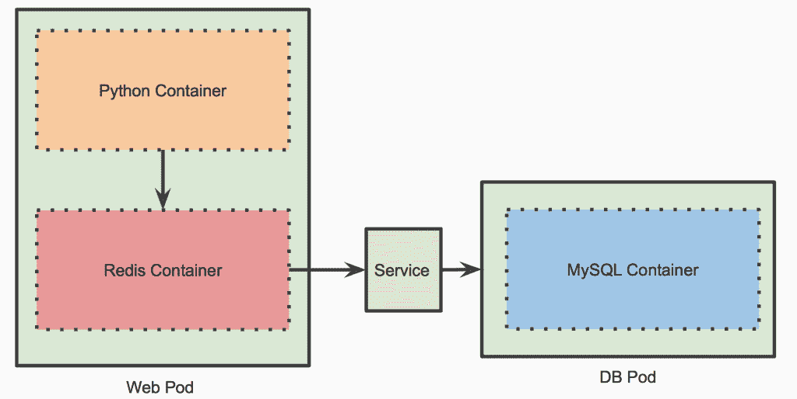

# 教程:应用 Sidecar 模式在 Kubernetes 中部署 Redis

> 原文：<https://thenewstack.io/tutorial-apply-the-sidecar-pattern-to-deploy-redis-in-kubernetes/>

在上一期 Kubernetes [教程](https://thenewstack.io/implement-node-and-pod-affinity-anti-affinity-in-kubernetes-a-practical-example/)中，我们探讨了节点和 pod 亲和/反亲和的概念，以确保相关的 pod 位于同一位置或均匀分布在集群中。在这一部分中，我将演示如何利用 sidecar 模式将两个容器作为一个单元进行打包、部署和伸缩。

Kubernetes 中 Pod 的设计方式使其成为通过协同定位两个容器来实现 sidecar 模式的理想选择。一个 Pod 可以包含一个或多个包装为一个部署单元的容器。

在本教程中，我们将部署一个使用 MySQL、Redis 和 Python/Flask 构建的微服务应用程序，如下图所示。



MySQL 部署将使用节点关联性的概念来利用连接到其中一个节点的 SSD 磁盘。关于节点和单元关联性的详细演练，请参考[之前的教程](/implement-node-and-pod-affinity-anti-affinity-in-kubernetes-a-practical-example/)。

然后，我们将创建一个 multicontainer Pod，它具有无状态 web API 和一个 Redis 容器，用于缓存频繁访问的行。

### 部署 MySQL Pod

让我们使用节点关联性规则来定位 GKE 群集中连接了 SSD 磁盘的节点。请参考本教程的第一步启动集群并连接 SSD 磁盘。

```
apiVersion:  v1
kind:  Service
metadata:
  name:  mysql
  labels:
    app:  mysql
spec:
  ports:
  -  port:  3306
    name:  mysql
    targetPort:  3306
  selector:
    app:  mysql
---
apiVersion:  apps/v1
kind:  Deployment
metadata:
  name:  mysql
spec:
  selector:
    matchLabels:
      app:  mysql
  template:
    metadata:
      labels:
        app:  mysql
    spec:
      affinity:
        nodeAffinity:
          requiredDuringSchedulingIgnoredDuringExecution:
            nodeSelectorTerms:
            -  matchExpressions:
              -  key:  disktype
                operator:  In
                values:
                -  ssd
      containers:
      -  image:  mysql:5.6
        name:  mysql
        env:
        -  name:  MYSQL_ROOT_PASSWORD
          value:  "password"
        ports:
        -  containerPort:  3306
          name:  mysql
        volumeMounts:
        -  name:  mysql-persistent-storage
          mountPath:  /var/lib/mysql
      volumes:
      -  name:  mysql-persistent-storage
        hostPath:
          path:  /mnt/data

```


### 为 Redis 和 Web 应用程序定义多容器 Pod

因为我们希望确保每个 web Pod 都有一个 Redis Pod，所以我们将定义一个多容器部署。这为我们提供了通过 Pod 串联扩展两个容器的灵活性。

```
apiVersion:  v1
kind:  Service
metadata:
  name:  web
  labels:
    app:  web
spec:
  ports:
  -  port:  80
    name:  redis
    targetPort:  5000
  selector:
    app:  web
  type:  LoadBalancer    
---
apiVersion:  apps/v1
kind:  Deployment
metadata:
  name:  web
spec:
  selector:
    matchLabels:
      app:  web
  replicas:  3
  template:
    metadata:
      labels:
        app:  web
    spec:
      containers:
      -  name:  redis
        image:  redis
        ports:
          -  containerPort:  6379
            name:  redis
            protocol:  TCP        
      -  name:  web-app
        image:  janakiramm/py-red
        env: 
          -  name:  "REDIS_HOST"
            value:  "localhost"

```

注意，部署规范有两个容器映像——Web App 和 Redis。

让我们应用规范来安排 Pod 的三个实例。

```
kubectl apply  -f  web.yaml

```


每个网荚有两个容器，通过 2/2 的就绪状态可见。

运行 *kubectl describe* 命令检查 pod。

```
kubectl describe pod web-f46bc87dc-dzvwh

```


这个截屏显示了 kubectl describe 命令的部分输出。

### 验证缓存

让我们测试一下缓存是否给应用程序的性能增加了任何价值。

使用下面的命令获取负载平衡器的 IP 地址:

```
export HOST_IP=`kubectl get services  -l  app=web  -o  jsonpath="{.items[0].status.loadBalancer.ingress[0].ip}"`
export HOST_PORT=80

```

初始化数据库，将测试数据插入 MySQL。

```
curl http://$HOST_IP:$HOST_PORT/init

```

```
curl  -i  -H  "Content-Type: application/json"  -X  POST  -d  '{"uid": "1", "user":"John Doe"}'  http://$HOST_IP:$HOST_PORT/users/add
curl  -i  -H  "Content-Type: application/json"  -X  POST  -d  '{"uid": "2", "user":"Jane Doe"}'  http://$HOST_IP:$HOST_PORT/users/add
curl  -i  -H  "Content-Type: application/json"  -X  POST  -d  '{"uid": "3", "user":"Bill Collins"}'  http://$HOST_IP:$HOST_PORT/users/add
curl  -i  -H  "Content-Type: application/json"  -X  POST  -d  '{"uid": "4", "user":"Mike Taylor"}'  http://$HOST_IP:$HOST_PORT/users/add

```

当我们访问数据时，它第一次从数据库中被检索出来。Redis 容器将缓存后续请求使用的数据。

```
  curl http://$HOST_IP:$HOST_PORT/users/1

```


后缀为 *(c)* 的响应表示这些值是从缓存而不是数据库中检索的。

如果你对代码感兴趣，Python web 应用程序可以在 GitHub 上找到。

*贾纳基拉姆·MSV 的网络研讨会系列“机器智能和现代基础设施(MI2)”提供了涵盖前沿技术的信息丰富、见解深刻的会议。在 [http://mi2.live](http://mi2.live) 注册参加即将举行的 MI2 网络研讨会。*

<svg xmlns:xlink="http://www.w3.org/1999/xlink" viewBox="0 0 68 31" version="1.1"><title>Group</title> <desc>Created with Sketch.</desc></svg>