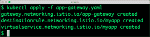

# 教程:使用 Kubernetes 和 Istio 进行蓝/绿部署

> 原文：<https://thenewstack.io/tutorial-blue-green-deployments-with-kubernetes-and-istio/>

Istio 是一个服务网格，旨在使微服务之间的通信可靠、透明和安全。Istio 拦截针对部署在 Kubernetes 等容器平台中的服务的外部和内部流量。

虽然 Istio 能够做很多事情，包括安全的服务到服务通信、指标的自动记录、执行访问控制、速率限制和配额的策略，但我们将只关注流量管理特性。

Istio 让 [DevOps 团队构建部署策略](https://thenewstack.io/deployment-strategies/)并创建规则以智能地将流量路由到内部服务。配置断路器、超时和重试等服务级别属性，设置各种部署模式(包括蓝/绿部署和金丝雀部署)非常简单。

本教程的目的是帮助您了解如何使用 Istio 配置在 Kubernetes 中运行的微服务的蓝/绿部署。除了在 Kubernetes 中部署 pods 和服务的基本想法之外，您不需要有任何先决条件来探索这个场景。我们将配置从 Minikube 到 Istio 到示例应用程序的所有内容。

本教程分为四个步骤——安装 Minikube、安装和验证 Istio、部署同一应用程序的两个版本，以及最后配置蓝/绿部署服务。我们将使用两个简单的、预先构建的容器图像来表示蓝色(V1)和绿色(V2)版本。

### **第一步:安装 Minikube**

为了最小化依赖性，我们将使用 Minikube 作为我们设置的测试平台。因为我们需要 Minikube 的自定义配置，所以从删除现有设置开始，并使用附加参数重新启动集群。

```
$  minikube start  --memory=8192  --cpus=4  --kubernetes-version=v1.10.0  \
--extra-config=controller-manager.cluster-signing-cert-file="/var/lib/localkube/certs/ca.crt"  \
--extra-config=controller-manager.cluster-signing-key-file="/var/lib/localkube/certs/ca.key"  \
--vm-driver=virtualbox

```

我们需要至少 8GB 的内存和 4 核 CPU 才能在 Minikube 上运行 Istio。等待群集启动。

[](https://cdn.thenewstack.io/media/2018/10/b1cfb731-istio-0.png)

### 步骤 2:安装 Istio

随着 Kubernetes 的启动和运行，是时候安装 Istio 了。按照以下步骤进行配置。

```
$  curl  -L  https://git.io/getLatestIstio | sh -

```

您将在运行上述命令的同一个目录中找到一个文件夹 istio-1.0.2。将位置 istio-1.0.2/bin 添加到 PATH 变量中，以便于访问 istio 二进制文件。

由于我们使用 Minikube 运行 Istio，因此在继续下一步之前，我们需要做一个更改——将入口网关服务从 LoadBalancer 类型更改为 NodePort。

打开文件 istio-1 . 0 . 2/install/kubernetes/istio-demo . YAML，搜索 LoadBalancer 并将其替换为 NodePort。 [](https://cdn.thenewstack.io/media/2018/10/2a64731e-istio-1.png) 
Istio 为 Kubernetes 提供了许多自定义资源定义(CRD)。它们帮助我们操作虚拟服务、规则、网关和 kubectl 中其他特定于 Istio 的对象。让我们在部署实际的服务网格之前安装 CRDs。

```
$  kubectl apply  -f  install/kubernetes/helm/istio/templates/crds.yaml

```

最后，让我们在 Kubernetes 内部安装 Istio。

```
$  kubectl apply  -f  install/kubernetes/istio-demo.yaml

```

上述步骤将创建一个新的名称空间——istio-system——在该名称空间下部署多个对象。

[](https://cdn.thenewstack.io/media/2018/10/b7aec084-istio-2.png)

我们将注意到在 **istio-system** 名称空间中创建的多个服务。

[](https://cdn.thenewstack.io/media/2018/10/38e93379-istio-3.png)

几分钟后，你会看到由 Istio 部署的多个吊舱。通过运行*ku bectl get pods-n = istio-system 来验证这一点。*

[](https://cdn.thenewstack.io/media/2018/10/846a8174-istio-4.png)

所有单元必须处于运行或完成模式，这表示 Istio 已成功安装和配置。

现在，我们已经准备好为蓝/绿模式部署和配置服务了。

### **步骤 3:部署同一个应用程序的两个版本**

为了表示应用程序的两个不同版本，我构建了简单的基于 Nginx 的 Docker 映像——janakiram/myapp:v1 和 janakiram/myapp:v2。部署时，它们显示一个蓝色或绿色背景的静态页面。我们将在教程中使用这些图像。

```
apiVersion:  v1
kind:  Service
metadata:
  name:  myapp
  labels:
    app:  myapp
spec:
  type:  ClusterIP
  ports:
  -  port:  80
    name:  http
  selector:
    app:  myapp
---
apiVersion:  extensions/v1beta1
kind:  Deployment
metadata:
  name:  myapp-v1
spec:
  replicas:  1
  template:
    metadata:
      labels:
        app:  myapp
        version:  v1
    spec:
      containers:
      -  name:  myapp
        image:  janakiramm/myapp:v1
        imagePullPolicy:  IfNotPresent
        ports:
        -  containerPort:  80
---
apiVersion:  extensions/v1beta1
kind:  Deployment
metadata:
  name:  myapp-v2
spec:
  replicas:  1
  template:
    metadata:
      labels:
        app:  myapp
        version:  v2
    spec:
      containers:
      -  name:  myapp
        image:  janakiramm/myapp:v2
        imagePullPolicy:  IfNotPresent
        ports:
        -  containerPort:  80

```

你可以从 Github 获得 YAML 的要点。

让我们从创建一个 YAML 文件开始，该文件定义了 V1 和 V2 的部署，以及公开它们的 ClusterIP。请注意用于识别 pod 的标签——应用程序和版本。虽然应用程序名称保持不变，但两个部署的版本不同。

Istio 希望将它们视为一个单独的应用程序，但根据版本进行区分。

ClusterIP 服务定义也是如此。由于标签 app: myapp，它与基于不同版本的两个部署中的 pod 相关联。

用 kubectl 创建部署和服务。请注意，这些是简单的 Kubernetes 对象，不了解 Istio。与 Istio 的唯一联系是我们为部署和服务创建标签的方式。

```
$  kubectl apply  -f  myapp.yaml

```

[](https://cdn.thenewstack.io/media/2018/10/7ddbc930-istio-5.png)

在配置 Istio 路由之前，让我们检查一下应用程序的版本。我们可以通过端口转发部署来访问豆荚。

要访问应用程序的 V1，运行下面的命令并点击 localhost:8080。完成后按 CTRL+C。

```
$  kubectl port-forward deployment/myapp-v1  8080:80

```


对于 V2，运行下面的命令并点击 localhost:8081。完成后按 CTRL+C。

```
$  kubectl port-forward deployment/myapp-v2  8081:80

```


### **步骤 4:配置蓝/绿部署**

我们的目标是在不停机的情况下，有选择地将流量导向其中一个部署。为此，我们需要告诉 Istio 根据权重路由流量。

实现这一点有三个目标:

#### 门

一个 [Istio 网关](https://thenewstack.io/why-do-you-need-istio-when-you-already-have-kubernetes/)描述了一个在网格边缘运行的负载平衡器，接收输入或输出的 HTTP/TCP 连接。该规范描述了应该公开的一组端口、要使用的协议类型、负载平衡器的 SNI 配置等。在下面的定义中，我们将网关指向由 Istio 在安装期间创建的默认入口网关。

让我们将网关创建为 Kubernetes 对象。

```
apiVersion:  networking.istio.io/v1alpha3
kind:  Gateway
metadata:
  name:  app-gateway
spec:
  selector:
    istio:  ingressgateway
  servers:
  -  port:
      number:  80
      name:  http
      protocol:  HTTP
    hosts:
    -  "*"

```

#### 目的地规则

Istio DestinationRule 定义了在路由发生后应用于服务流量的策略。注意规则是如何基于最初的 Kubernetes 部署中定义的标签来声明的。

```
apiVersion:  networking.istio.io/v1alpha3
kind:  DestinationRule
metadata:
  name:  myapp
spec:
  host:  myapp
  subsets:
  -  name:  v1
    labels:
      version:  v1
  -  name:  v2
    labels:
      version:  v2

```

#### 虚拟服务

VirtualService 定义了一组流量路由规则，在对主机进行寻址时应用。每个路由规则都为特定协议的流量定义了匹配标准。如果流量匹配，则根据版本将其发送到指定的目标服务。

在下面的定义中，我们将 v1 和 v2 的权重都声明为 50，这意味着流量将均匀分布。

```
apiVersion:  networking.istio.io/v1alpha3
kind:  VirtualService
metadata:
  name:  myapp
spec:
  hosts:
  -  "*"
  gateways:
  -  app-gateway
  http:
    -  route:
      -  destination:
          host:  myapp
          subset:  v1
        weight:  50
      -  destination:
          host:  myapp
          subset:  v2
        weight:  50        

```

您可以在一个 YAML 文件中定义以上所有内容，这个文件可以从 kubectl 中使用。这个 YAML 文件可以作为 Github [Gist](https://gist.github.com/janakiramm/35078d95730745caa62f81d917d6d553) 获得。

```
$  kubectl apply  -f  app-gateway.yaml  

```



现在，让我们继续访问该服务。因为我们将 Minikube 与 NodePort 一起使用，所以我们需要获得运行入口网关的确切端口。

运行以下命令来访问入口主机(Minikube)和入口端口。

```
$  export INGRESS_HOST=$(minikube ip)

$  export INGRESS_PORT=$(kubectl  -n  istio-system get service istio-ingressgateway  -o  jsonpath='{.spec.ports[?(@.name=="http2")].nodePort}')

```

如果您从浏览器访问 URI，您会看到流量在蓝色和绿色页面之间平均分配。

我们可以从终端窗口看到结果。从终端窗口运行以下命令，查看 V1 和 V2 的交替响应。

```
while  :  ;do export GREP_COLOR='1;33';curl  -s  192.168.99.100:31380  \
  |  grep  --color=always  "V1"  ;  export GREP_COLOR='1;36';\
  curl  -s  192.168.99.100:31380  \
  |  grep  --color=always  "vNext"  ;  sleep  1;  done

```

T12

当上面的命令循环运行时，让我们回到 app-gateway.yaml 文件来调整权重。将 V1 的权重设置为 0，将 V2 的权重设置为 100。

向 Istio 提交新定义。

```
$  istioctl replace  -f  app-gateway.yaml

```

T17

更新权重后，V2 将立即获得 100%的流量。这可以从第一个终端窗口的输出中看到。

[](https://cdn.thenewstack.io/media/2018/10/82d4e75d-istio-11.png)

您可以继续调整权重，观察流量被动态地重新路由，而不会导致任何停机。

流量管理只是 Istio 的特色之一。在接下来的文章中，我们将探索 Istio 的其他功能。

<svg xmlns:xlink="http://www.w3.org/1999/xlink" viewBox="0 0 68 31" version="1.1"><title>Group</title> <desc>Created with Sketch.</desc></svg>