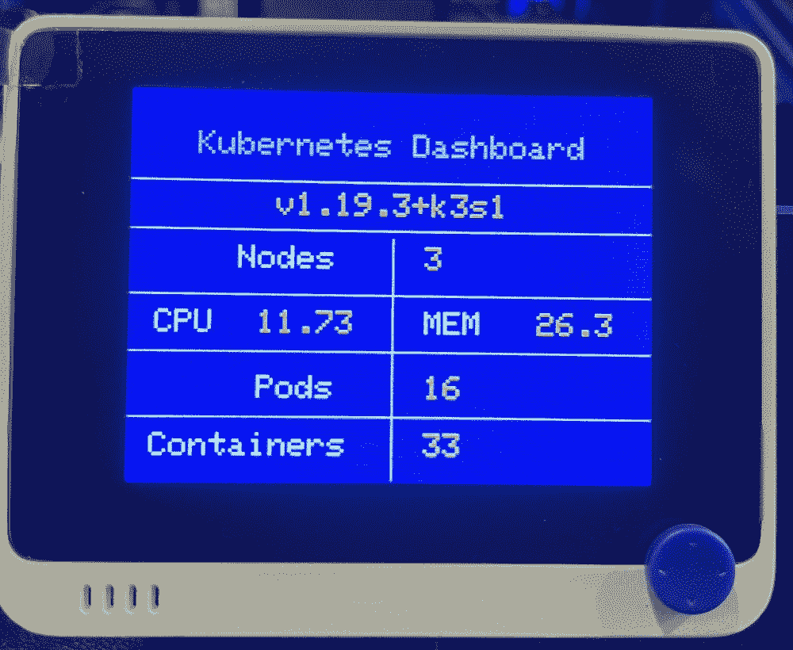
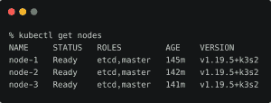
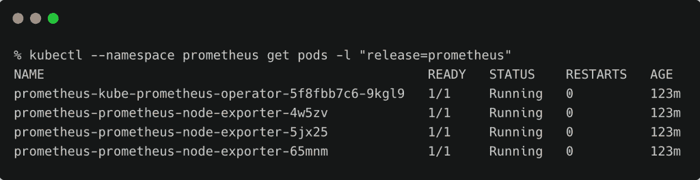
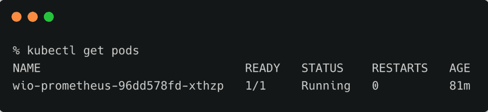
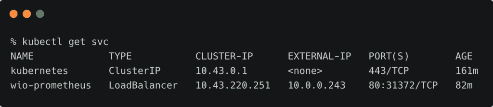
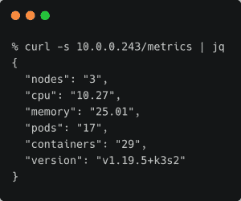
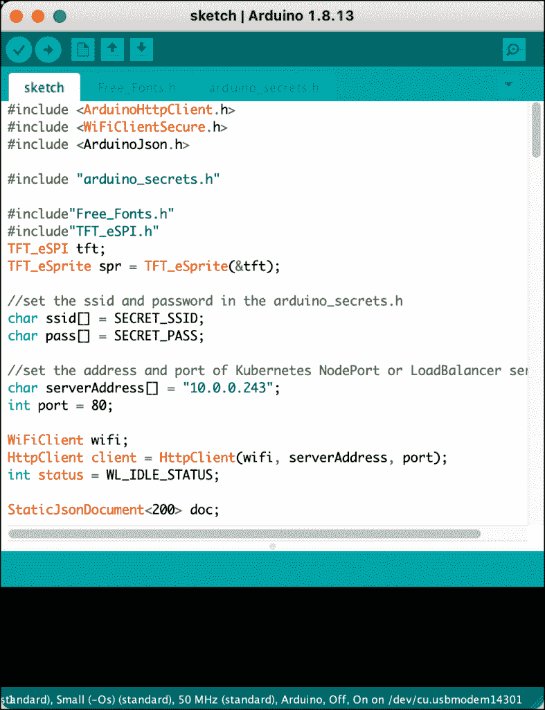
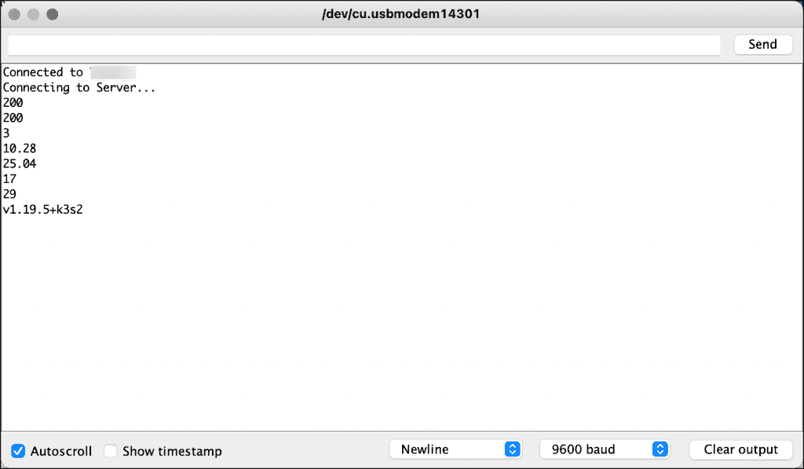

# 教程:用 Wio 终端为 K3s 构建一个 Prometheus 仪表板

> 原文：<https://thenewstack.io/tutorial-build-a-prometheus-dashboard-for-k3s-with-wio-terminal/>

Seeed Studio 的 [Wio 终端](https://thenewstack.io/10-reasons-why-the-wio-terminal-is-the-last-diy-iot-device-you-need/)是一款紧凑型设备，配有兼容 Arduino 的微控制器和 2.4 英寸 LCD。它还拥有内置的 WiFi 和 BLE 无线电，用于无线连接。

Wio 终端给了我一个想法，让我建立一个迷你的[普罗米修斯仪表板](https://prometheus.io/)，显示在边缘运行的 Kubernetes 集群的重要统计数据。经过一点努力，我把这个想法变成了一个工作原型。



虽然本教程适用于任何 Kubernetes 集群，但它是在 Seeed Studio 的 [Odyssey Blue J4105 Mini PC](https://www.seeedstudio.com/Odyssey-Blue-J4105-128GB-p-4668.html) 上运行的三节点 [K3s 集群](https://thenewstack.io/how-rancher-labs-k3s-makes-it-easy-to-run-kubernetes-at-the-edge/)上测试的。



## 体系结构

Prometheus 公开了一个 REST API 端点，可以通过查询来提取任何可用的指标。对于任何有效的 Prometheus 查询，API 都以 JSON 有效负载作为响应。我们将利用这个 API 来提取一些关键指标的值。

虽然 Wio Terminal 可以使用 HTTP 和 JSON 库来查询和解析响应，但是草图的大小可能会让设备不堪重负。因此，最好将繁重的工作转移到外部计算环境，该环境发送一个简化的、轻量级的 JSON，只包含基本的指标。充当 Wio 终端和 Prometheus 之间的桥/适配器的包装器被部署为 Kubernetes pod，并通过 NodePort/LoadBalancer 服务公开。Wio 终端定期调用这个服务来获取所需的值。

本质上，这个项目有三个组件 Wio 终端设备、一个包装服务和运行在 Kubernetes 上的 Prometheus 部署。

完整的源代码和配置可以在 [GitHub](https://github.com/janakiramm/wio-prometheus) 上获得。

## 安装和配置 Prometheus

在你的 Kubernetes 集群中，通过[舵图](https://github.com/prometheus-community/helm-charts/tree/main/charts/kube-prometheus-stack)安装普罗米修斯。这是在集群中部署 Prometheus 和 Grafana 堆栈的最有效机制。

首先更新 Helm 存储库，然后在 Prometheus 名称空间中安装图表。

```
helm repo add prometheus-community https://prometheus-community.github.io/helm-charts
helm repo add stable https://charts.helm.sh/stable
helm repo update

```

```
kubectl create ns prometheus
helm install prometheus prometheus-community/kube-prometheus-stack  --namespace prometheus

```

验证 pod 和服务是否安装正确。

```
kubectl  --namespace prometheus get pods  -l  "release=prometheus"
kubectl  --namespace prometheus get svc  -l  "release=prometheus"

```



我通过用下面的命令打补丁将 Prometheus 服务转换成了一个负载均衡器:

```
  kubectl  -n  prometheus patch svc prometheus-kube-prometheus-prometheus  -p  '{"spec": {"type": "LoadBalancer"}}'

```


如果您没有配置负载平衡器，请将其更改为类型`NodePort`。

## 编写普罗米修斯包装

Prometheus wrapper 服务是一个简单的 Flask web 应用程序，它抽象查询并以 JSON 返回一个聚合响应。

下面的代码片段显示了服务如何包装查询以获得集群的节点数。

```
import flask
from flask import json
import requests  
import json

app  =  flask.Flask(__name__)
data={}
PROMETHEUS  =  'http://10.0.0.242:9090/api/v1/query'

@app.route('/metrics')
def metrics():
    getMetrics()
    response  =  app.response_class(
        response=json.dumps(data),
        status=200,
        mimetype='application/json'
    )
    return response

def getMetrics():
    global data

    response  =  requests.get(PROMETHEUS,
    params={'query':  'count(kube_node_info)'})  
    results  =  response.json()
    print("nodes:"+results['data']['result'][0]['value'][1])
    data["nodes"]=results['data']['result'][0]['value'][1]

if __name__  ==  "__main__":
    print("Loading server") 
    app.run(host='0.0.0.0')

```

我们可以向该服务添加多个查询，以公开额外的指标。关于包装器服务的完整代码，请参考 GitHub 上的这个[文件](https://github.com/janakiramm/wio-prometheus/blob/main/Kubernetes/build/app.py)。

我将服务转换成 Docker 映像，并将其部署在 K3s 集群中，作为无状态部署公开为服务。这些工件的 YAML 规范可以在部署目录中找到。

下面的截图显示了同样的情况:





调用包装服务端点会返回下面的 JSON 有效负载。

```
curl  -s  10.0.0.243/metrics  |  jq

```



现在服务已经部署好了，让我们为 Wio 终端构建仪表板。

### Wio 终端的 Arduino 草图

为了构建仪表板，我们将需要使用 [Arduino WiFi 库](https://wiki.seeedstudio.com/Wio-Terminal-Wi-Fi/)、 [Arduino HTTP 客户端](https://github.com/arduino-libraries/ArduinoHttpClient/tree/master/examples)、 [JSON 库](https://github.com/bblanchon/ArduinoJson)和 [TFT LCD 库](https://wiki.seeedstudio.com/Wio-Terminal-LCD-Overview/)。

在将[草图](https://github.com/janakiramm/wio-prometheus/blob/main/Wio/sketch/sketch.ino)上传到 Wio 终端之前，更新 [arduino_secrets.h](https://github.com/janakiramm/wio-prometheus/blob/main/Wio/sketch/arduino_secrets.h) 中的 WiFi SSID 和密码。将`serverAddress[]`和`port`设置为适当的值。



检查 Arduino 的串行监视器，以确保草图能够连接到 WiFi 和包装服务端点。



现在，您可以使用这个始终在线的迷你仪表盘远程跟踪 K3s 集群的运行状况。

*贾纳基拉姆·MSV 的网络研讨会系列“机器智能和现代基础设施(MI2)”提供了涵盖前沿技术的信息丰富、见解深刻的会议。在 [http://mi2.live](http://mi2.live) 注册参加即将举行的 MI2 网络研讨会。*

<svg xmlns:xlink="http://www.w3.org/1999/xlink" viewBox="0 0 68 31" version="1.1"><title>Group</title> <desc>Created with Sketch.</desc></svg>