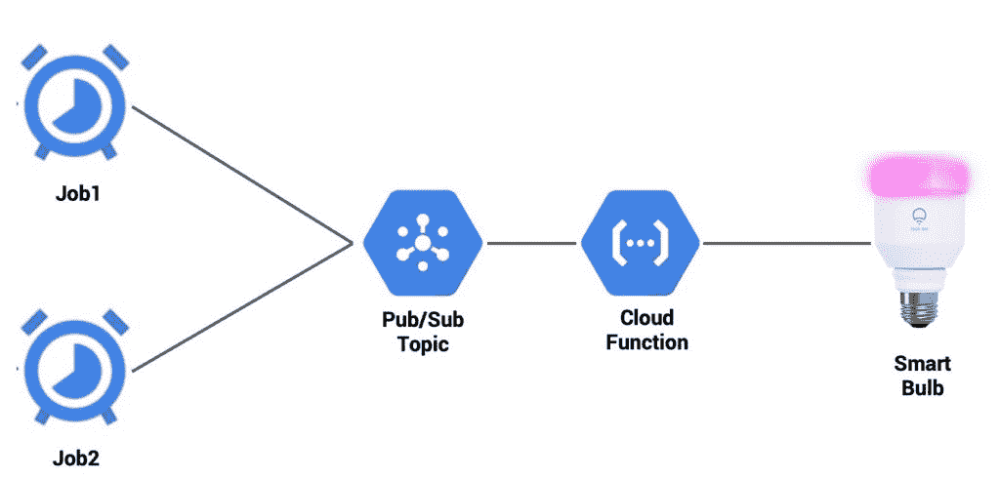
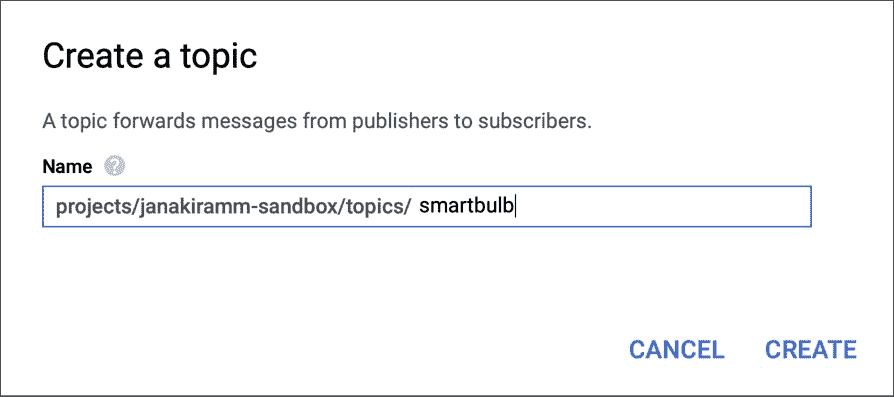
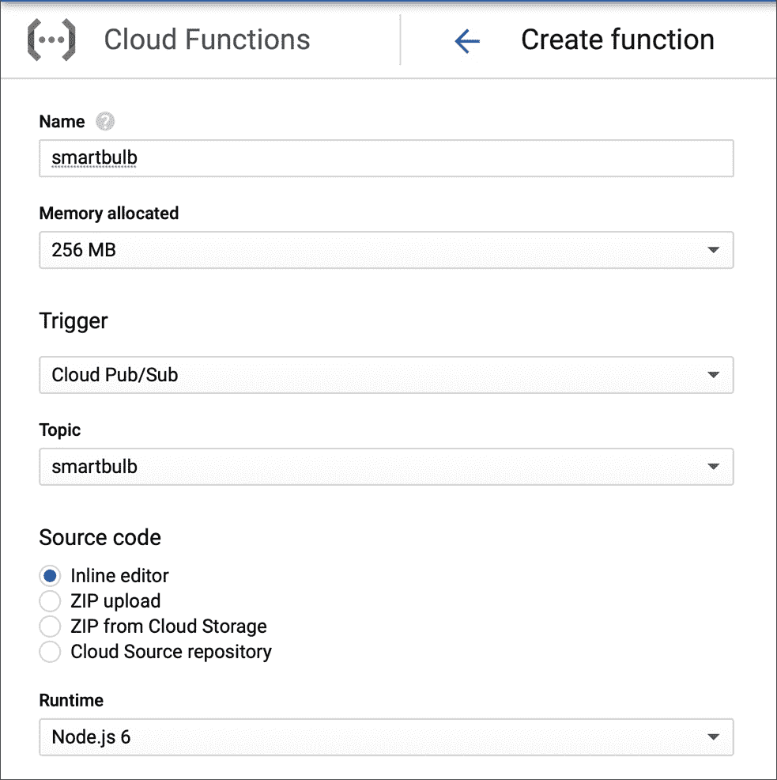
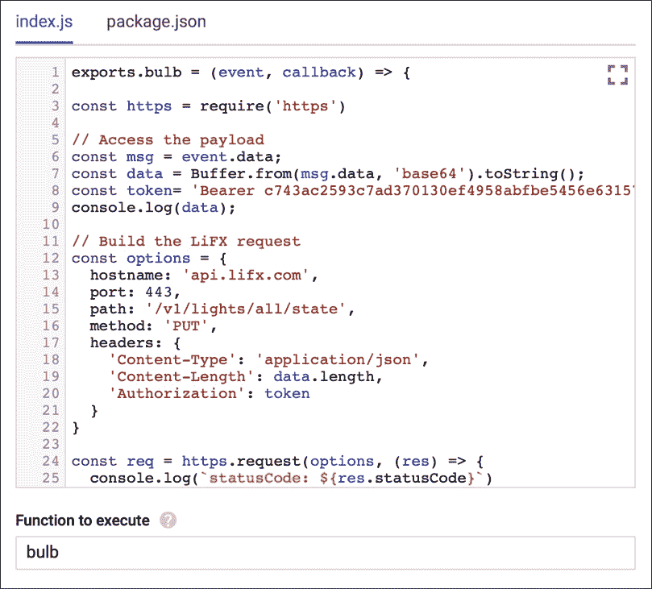
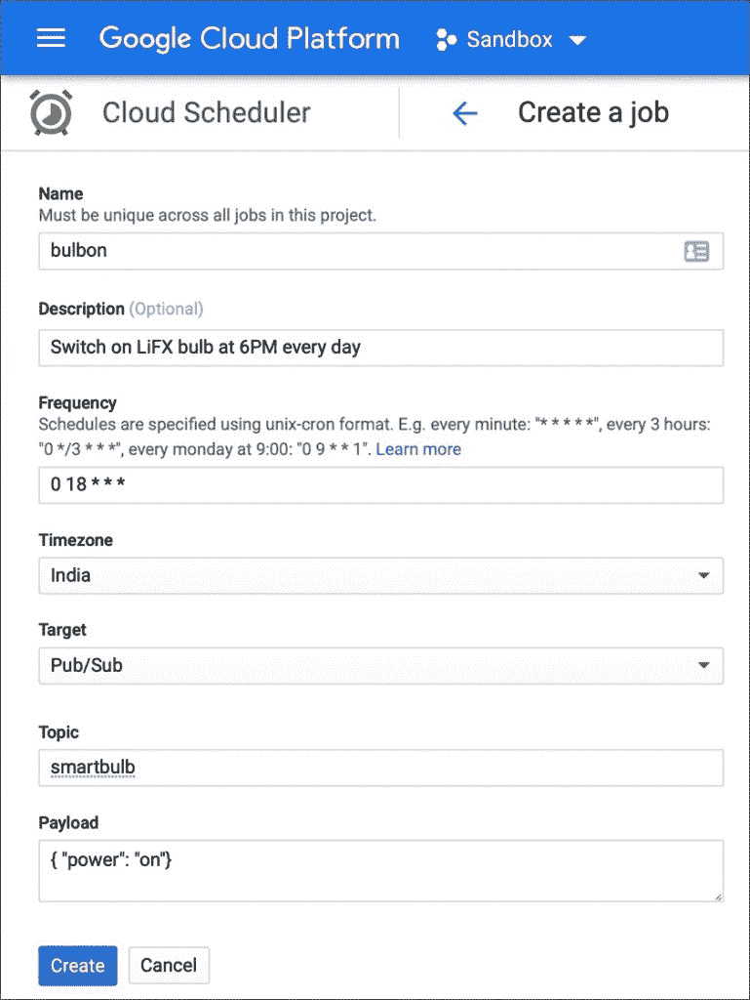
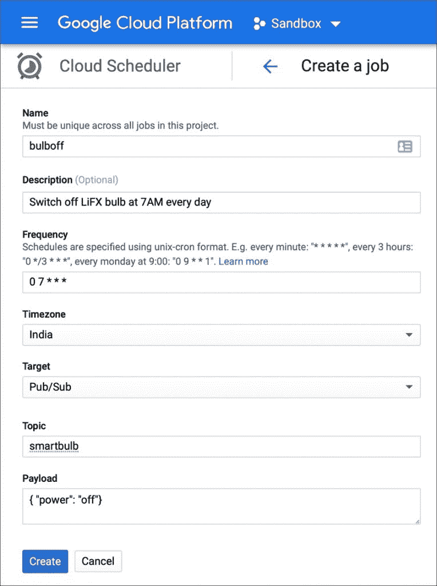

# 教程:构建一个无服务器应用程序来控制智能灯泡

> 原文：<https://thenewstack.io/tutorial-build-a-serverless-application-to-control-a-smart-bulb/>

在本教程的第一部分中，我介绍了 Google Cloud Functions 作为一个无服务器平台。在这一期中，我们将构建一个基于功能即服务(FaaS)的应用程序来控制智能灯泡。

我是 [LiFX 智能灯泡](https://www.lifx.com/)及其可编程性的忠实粉丝。LiFX 灯泡支持 WiFi，可以通过简单的 REST API 进行控制。如果您已经拥有一个灯泡，那么您所需要的就是一个 [API 令牌](https://api.developer.lifx.com/)，它需要嵌入到对端点的 HTTP 调用中。

我们将利用 LiFX 灯泡的 API、谷歌云调度器、谷歌云发布/订阅和谷歌云功能，每天下午 6 点自动打开灯泡，早上 7 点关闭。我们还可以使用相同的配置来交互式地更改灯泡设置，如颜色、亮度及其状态。

[](https://thenewstack.io/tutorial-build-a-serverless-application-to-control-a-smart-bulb/gcf-6/)

该应用程序的架构非常简单。该应用程序的核心是一个 Google Cloud Pub/Subtopic，我们将云调度程序、Google Cloud 功能和一个交互式 CLI 应用程序连接到它。当一个消息被发送到 Pub/Subtopic 时，它触发调用 LiFX API 的函数。云调度程序和交互式应用程序只需将灯泡的期望状态发布到发布/子主题。该有效载荷被自动转发到谷歌云功能。

在我们继续之前，请确保您拥有有效的 Google Cloud Platform 订阅，并且在您的开发机器上安装了 Google Cloud SDK。

## **配置谷歌云发布/订阅**

Google Cloud Pub/Sub 是一个消息总线，可以连接各种发布者和消费者。在这个场景中，我们依赖 Pub/Subtopic 作为中心，将消息分发给一个或多个消费者。

登录 Google 云控制台，访问云发布/订阅仪表板。单击“创建主题”按钮，并为新主题命名。

[](https://thenewstack.io/tutorial-build-a-serverless-application-to-control-a-smart-bulb/gcf-1/)

这就是我们在云发布/订阅中需要做的一切。我们创建的主题是应用程序最重要的组成部分。

### **创建谷歌云功能**

我们现在将添加负责调用 LiFX API 作为云函数的代码片段。这是通过发布/订阅间接调用的。

访问云函数仪表板，并单击创建函数。给函数一个合适的名称，并通过选择 Cloud Pub/Sub 作为触发器，将它连接到上一步中创建的 Pub/Sub 主题。

[](https://thenewstack.io/tutorial-build-a-serverless-application-to-control-a-smart-bulb/gcf-2/)

用下面的代码替换 index.js 的代码。确保用您自己的 API 替换 LiFX API 标记。将入口点更改为要执行的函数下的灯泡。

```
exports.bulb  =  (event,  callback)  =>  {

const https  =  require('https')

// Access the payload
const msg  =  event.data;
const data  =  Buffer.from(msg.data,  'base64').toString();
const token  =  'Bearer <put your LiFX API token here>'

console.log(data);

// Build the LiFX request
const options  =  {
  hostname:  'api.lifx.com',
  port:  443,
  path:  '/v1/lights/all/state',
  method:  'PUT',
  headers:  {
    'Content-Type':  'application/json',
    'Content-Length':  data.length,
    'Authorization':  token
  }
}

const req  =  https.request(options,  (res)  =>  {
  console.log(`statusCode:  ${res.statusCode}`)

  res.on('data',  (d)  =>  {
    process.stdout.write(d)
  })
})

req.on('error',  (error)  =>  {
  console.error(error)
})

req.write(data)
req.end()  
console.log("Success!");  
callback();
};

```

[](https://thenewstack.io/tutorial-build-a-serverless-application-to-control-a-smart-bulb/gcf-3/)

代码是不言自明的。通过 Pub/Sub 发送给函数的有效负载被解码成一个 JSON 字符串，并通过 PUT 请求发送给 LiFX API。有效负载包含如下所示的设置

```
{  "power":  "on",  "color":  "yellow",  "brightness":  1,  "fast":  true  }

```

### **测试功能**

我们通过从 CLI 发送一个 JSON 有效负载来测试我们的无服务器应用程序。假设您安装了 Google Cloud SDK，启动 gcloud 实用程序发布到 Pub/Subtopic。

```
gcloud pubsub topics publish smartbulb  --message  '{ "power": "on", "color": "blue", "brightness": 1, "fast": true }'

```

该步骤导致灯泡通电，颜色设置为蓝色。非常简单明了！

现在，让我们通过配置一个基于云的 CRON 作业在一天中的预定义时间打开和关闭灯来自动化这个过程。我们将通过谷歌云调度。

**配置 Google Cloud Scheduler 定期发布到 Pub/Subtopic**

访问云调度程序控制面板，并使用以下配置创建一个作业:

 [](https://thenewstack.io/tutorial-build-a-serverless-application-to-control-a-smart-bulb/gcf-5/) [](https://thenewstack.io/tutorial-build-a-serverless-application-to-control-a-smart-bulb/gcf-4/)

这一步只需发送有效载荷，

到每天下午 6 点的 Pub/Sub 主题。让我们也配置另一个在早上 7 点关掉灯泡的作业。

[](https://thenewstack.io/tutorial-build-a-serverless-application-to-control-a-smart-bulb/gcf-5/)

就是这样！我们已经完成了无服务器应用程序的编码和配置。这种方法的优点是简单。通过不到 50 行代码和几次点击，我们能够部署一个成熟的应用程序。

您可以轻松地扩展这个应用程序，使灯泡与日出和日落时间同步。创建一个调用云函数的云调度程序作业，该云函数查询[日落 API](https://sunrise-sunset.org/api) 并配置 smart bulb CRON 作业的准确开启和关闭时间。

我们可以使用 HTTP 触发器来代替发布/订阅。但是，使用 Pub/Subtopic 有很多好处。其中之一是扇出方法，我们可以用相同的有效负载调用多个函数。

*贾纳基拉姆·MSV 的网络研讨会系列“[机器智能和现代基础设施(MI2)](https://mi2.janakiram.com/) ”提供了涵盖前沿技术的信息丰富、见解深刻的会议。[注册](https://mi2.janakiram.com/)参加即将举行的 MI2 网络研讨会，深入了解如何利用英特尔 Movidius 加速机器学习推理。*

<svg xmlns:xlink="http://www.w3.org/1999/xlink" viewBox="0 0 68 31" version="1.1"><title>Group</title> <desc>Created with Sketch.</desc></svg>