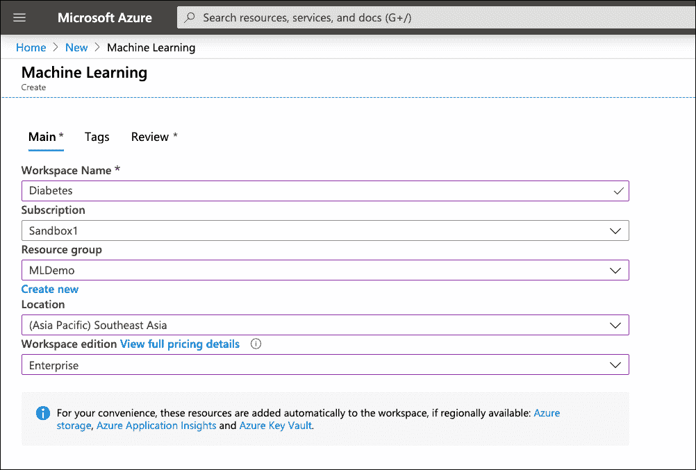
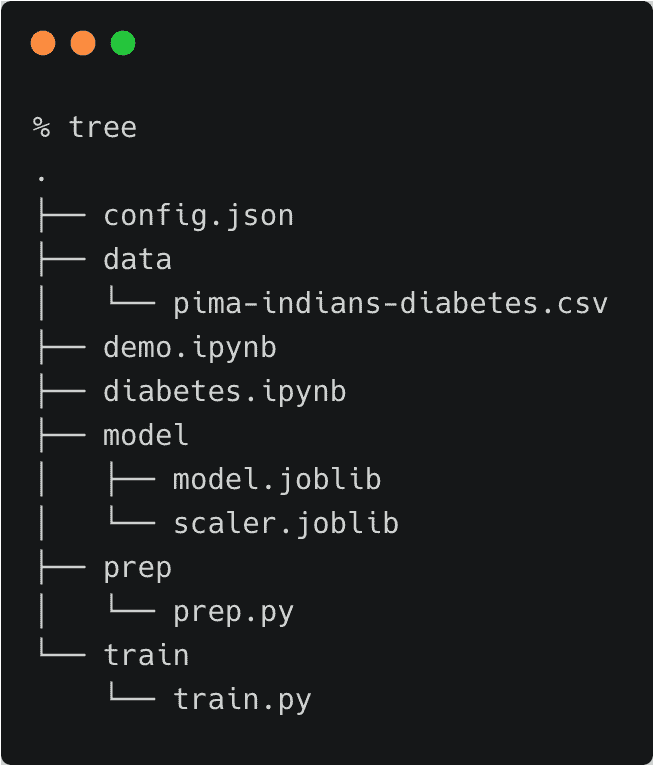
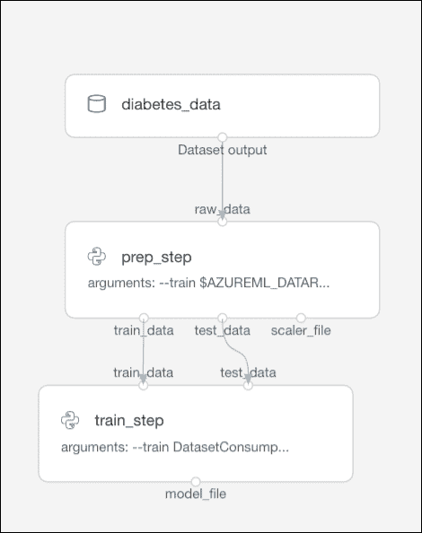
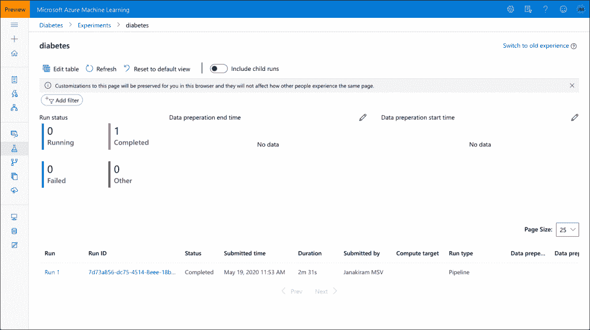
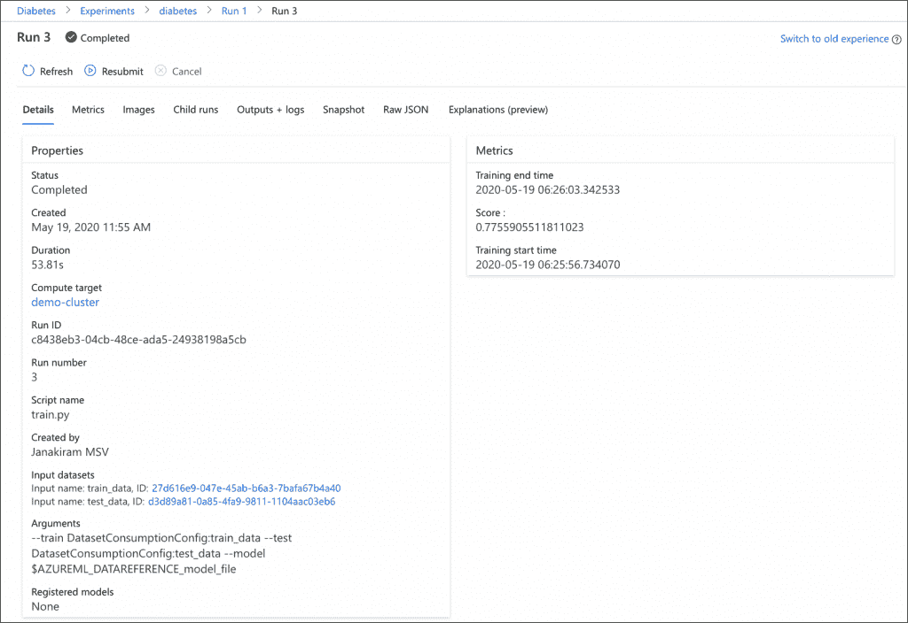

# 教程:使用 Python SDK 构建端到端 Azure ML 管道

> 原文：<https://thenewstack.io/tutorial-build-an-end-to-end-azure-ml-pipeline-with-the-python-sdk/>

在关于 [Azure ML 管道](https://github.com/Azure/MachineLearningNotebooks/tree/master/how-to-use-azureml/machine-learning-pipelines)系列的第三部分中，我们将使用 [Jupyter Notebook](https://jupyter.org/) 和 [Azure ML Python SDK](https://docs.microsoft.com/en-us/python/api/overview/azure/ml/?view=azure-ml-py) 来构建一个用于训练和推理的管道。关于概念的背景，请参考以前的文章和教程([第 1 部分](/tutorial-create-training-and-inferencing-pipelines-with-azure-ml-designer/)、[第 2 部分](/build-repeatable-ml-workflows-with-azure-machine-learning-pipelines/))。

我们将使用相同的 [Pima Indian Diabetes](https://www.kaggle.com/uciml/pima-indians-diabetes-database) 数据集来训练和部署模型。为了演示如何使用训练中使用的相同数据转换技术进行推理，我将序列化 Scikit 的 MinMaxScaler 从数据准备阶段开始学习，并将其用于评分。

## 设置环境

首先在一个支持 Azure 的区域中创建一个新的 ML 工作区。确保选择工作区的企业版，因为设计器在基本版中不可用。

[](https://thenewstack.io/tutorial-create-training-and-inferencing-pipelines-with-azure-ml-designer/aml-p-0/)

使用 Azure ML SDK 配置虚拟环境。运行以下命令来安装 Python SDK，并启动 Jupyter 笔记本。从 Jupyter 启动一个新的 Python 3 内核。

```
conda create  -n  aml  -y  Python=3.6

conda activate aml

conda install nb_conda

pip install azureml-sdk[notebooks]

```

接下来，在您的开发工作站上，创建以下目录结构:

管道
–数据
–准备
–列车
–型号

这些目录中的每一个都将包含管道的每个阶段所使用的 Python 脚本和工件。

将 CSV 格式的糖尿病数据集复制到数据目录。最终的目录结构如下图所示。

[](https://thenewstack.io/tutorial-build-an-end-to-end-azure-ml-pipeline-with-the-python-sdk/aml-py-1-2/)

创建以下脚本，用于准备 prep 目录下的数据(prep.py)。

```
import argparse
import os
from azureml.core import Run

from pandas import read_csv
import numpy as np
from sklearn.preprocessing import MinMaxScaler
from sklearn.model_selection import train_test_split
import joblib 

run  =  Run.get_context()

parser  =  argparse.ArgumentParser("prep")

parser.add_argument("--train",  type=str,  help="train")
parser.add_argument("--test",  type=str,  help="test")
parser.add_argument("--scaler",  type=str,  help="test")

args  =  parser.parse_args()

dataframe=run.input_datasets["raw_data"].to_pandas_dataframe()
array  =  dataframe.values

X  =  array[:,0:8]
Y  =  array[:,8]
scaler  =  MinMaxScaler(feature_range=(0,  1))
rescaledX  =  scaler.fit_transform(X)

test_size  =  0.33
seed  =  7

X_train,  X_test,  Y_train,  Y_test  =  train_test_split(X,  Y,  test_size=test_size,
random_state=seed)

train=np.column_stack((X_train,Y_train))
test=np.column_stack((X_test,Y_test))

os.makedirs(args.train,  exist_ok=True)
os.makedirs(args.test,  exist_ok=True)

np.savetxt(args.train+"/train.txt",train,fmt="%f")
np.savetxt(args.test+"/test.txt",test,fmt="%f")

if not os.path.isdir(args.scaler):
  os.mkdir(args.scaler)

joblib.dump(scaler,args.scaler+"/scaler.joblib")

```

该脚本负责以下任务:

*   接收存储在默认工作空间存储中的 CSV 文件作为输入。
*   将 CSV 文件拆分为训练(77%)和训练(33%)数据集。
*   将数据集保存到默认工作空间存储。
*   将 MinMaxScaler 应用于训练数据集。
*   将 scaler 对象序列化并保存到默认工作空间存储中。
*   将任务的开始和结束时间记录到 Azure ML 工作区。

在 train 目录下创建下面的培训脚本(train.py)。

```
import numpy as np
from sklearn.linear_model import LogisticRegression
import joblib
import os
from azureml.core import Run

parser  =  argparse.ArgumentParser("train")

parser.add_argument("--train",  type=str,  help="train")
parser.add_argument("--test",  type=str,  help="test")
parser.add_argument("--model",  type=str,  help="model")

args  =  parser.parse_args()
run  =  Run.get_context()

run.log("Training start time",  str(datetime.datetime.now()))

train=np.loadtxt(args.train+"/train.txt",dtype=float)
test=np.loadtxt(args.test+"/test.txt",dtype=float)

X_train=train[:,0:8]
Y_train=train[:,8]

X_test=test[:,0:8]
Y_test=test[:,8]

model  =  LogisticRegression(max_iter=100000)
model.fit(X_train,  Y_train)
if not os.path.isdir(args.model):
  os.mkdir(args.model)
joblib.dump(model,args.model+"/model.joblib")  
result  =  model.score(X_test,  Y_test)

run.log('Score :',  result)

run.log("Training end time",  str(datetime.datetime.now()))
run.complete()

```

这个脚本负责下面的任务:

*   接收存储在默认工作空间存储中的训练和测试数据集作为输入。
*   将要素和标注从训练和测试数据集中分离出来。
*   对模型进行训练和评分。
*   序列化模型文件，并将其保存到默认工作区。
*   将任务的分数、开始和结束时间记录到 Azure ML workspace。

这些文件将用于构建两步管道，该管道将由 Azure ML 管道环境执行。

我们正在构建的管道将如下图所示:

[](https://thenewstack.io/tutorial-build-an-end-to-end-azure-ml-pipeline-with-the-python-sdk/aml-py-2/)

## 建设管道

首先创建一个新的 Jupyter 笔记本，然后按照以下步骤操作。在单独的笔记本单元中运行这些模块。

让我们导入管道需要的所有模块。

```
import os
import azureml.core
from azureml.core import Workspace,  Experiment,  Datastore
from azureml.widgets import RunDetails

from azureml.core import Dataset

from azureml.pipeline.core import Pipeline,  PipelineData
from azureml.pipeline.core import PipelineRun,  StepRun,  PortDataReference
from azureml.pipeline.steps import PythonScriptStep

from azureml.core.compute import ComputeTarget,  AmlCompute
from azureml.core.compute_target import ComputeTargetException

from azureml.core.runconfig import RunConfiguration
from azureml.core.conda_dependencies import CondaDependencies

from azureml.core.model import Model

# Check core SDK version number
print("SDK version:",  azureml.core.VERSION)

```

让我们配置工作区和默认存储。

```
ws  =  Workspace.from_config()

```

```
def_blob_store  =  ws.get_default_datastore()  

```

我们现在准备将数据集从本地目录上传到工作区默认存储。

```
def_blob_store.upload_files(["./data/pima-indians-diabetes.csv"],  target_path="data",  overwrite=True)

```

我们现在已经准备好将管道与计算环境相关联。下面的代码片段将启动一个新的计算集群，或者将其自身附加到一个现有的集群。

```
aml_compute_target  =  "demo-cluster"
try:
    aml_compute  =  AmlCompute(ws,  aml_compute_target)
    print("found existing compute target.")
except ComputeTargetException:
    print("creating new compute target")

    provisioning_config  =  AmlCompute.provisioning_configuration(vm_size  =  "STANDARD_D2_V2",
                                                                min_nodes  =  1,  
                                                                max_nodes  =  4)    
    aml_compute  =  ComputeTarget.create(ws,  aml_compute_target,  provisioning_config)
    aml_compute.wait_for_completion(show_output=True,  min_node_count=None,  timeout_in_minutes=20)

print("Azure Machine Learning Compute attached")

```

下一步是为管道定义软件环境和依赖关系。为此，我们将使用适当的 pip 和 Conda 模块构建一个定制的 Docker 映像。管道的步骤将在运行时利用这个映像。

```
aml_run_config  =  RunConfiguration()

aml_run_config.target  =  aml_compute
aml_run_config.environment.docker.enabled  =  True
aml_run_config.environment.docker.base_image  =  "mcr.microsoft.com/azureml/base:latest"

aml_run_config.environment.python.user_managed_dependencies  =  False

aml_run_config.environment.python.conda_dependencies  =  CondaDependencies.create(
    conda_packages=['pandas','scikit-learn','numpy'],  
    pip_packages=['joblib','azureml-sdk','fusepy'],  
    pin_sdk_version=False)

```

我们现在已经有了计算基础架构。下一步是定义作为管道阶段的输入和输出的数据集。

让我们首先将 CSV 文件定义为输入数据集。

```
diabetes_data  =  Dataset.Tabular.from_delimited_files(def_blob_store.path('./data/pima-indians-diabetes.csv'))
diabetes_data  =  diabetes_data.register(ws,  'diabetes_data')

```

让我们也定义中间数据集和每个步骤的输出。

```
raw_data  =  diabetes_data.as_named_input('raw_data')
train_data  =  PipelineData("train_data",  datastore=def_blob_store).as_dataset()
test_data  =  PipelineData("test_data",  datastore=def_blob_store).as_dataset()
scaler_file  =  PipelineData("scaler_file",  datastore=def_blob_store)
model_file  =  PipelineData("model_file",  datastore=def_blob_store)

```

一切就绪后，我们准备定义数据准备和培训步骤。

```
source_directory="./prep"
step1  =  PythonScriptStep(name="prep_step",
 script_name="./prep.py",  
 arguments=["--train",  train_data,"--test",  test_data,"--scaler",scaler_file],
 inputs=[raw_data],
 outputs=[train_data,test_data,scaler_file], 
 compute_target=aml_compute,  
 runconfig=aml_run_config,
 source_directory=source_directory,
 allow_reuse=True)

```

注意输入和输出值是如何发送到脚本的。

```
source_directory="./train"
step2  =  PythonScriptStep(name="train_step",
 script_name="./train.py",  
 arguments=["--train",  train_data,"--test",  test_data,"--model",model_file],
 inputs=[train_data,test_data],
 outputs=[model_file], 
 compute_target=aml_compute,  
 runconfig=aml_run_config,
 source_directory=source_directory,
 allow_reuse=True)

```

我们已经准备好创建由以上两个步骤组成的管道，验证它，并最终提交给 Azure ML。

```
pipeline1  =  Pipeline(workspace=ws,  steps=steps)

```

```
pipeline_run1  =  Experiment(ws,  'diabetes').submit(pipeline1,  regenerate_outputs=False)

```

运行完笔记本中的所有单元格后，您可以切换 Azure 门户并查看这两个步骤的指标。

[](https://thenewstack.io/tutorial-build-an-end-to-end-azure-ml-pipeline-with-the-python-sdk/aml-py-3/)

单击 Run ID 链接将进入一个页面，您可以在该页面中访问每个步骤的指标和输出。

[](https://thenewstack.io/tutorial-build-an-end-to-end-azure-ml-pipeline-with-the-python-sdk/aml-py-4/)

您可以将 scaler 对象和模型从 Azure storage 下载到您的工作站。

```
prep_step  =  pipeline_run1.find_step_run('prep_step')[0]
step_run_output  =  prep_step.get_output("scaler_file")

port_data_reference  =  step_run_output.get_port_data_reference()
port_data_reference.download(local_path=".")
scaler_file=port_data_reference.path_on_datastore

```

```
train_step  =  pipeline_run1.find_step_run('train_step')[0]
step_run_output  =  train_step.get_output("model_file")

port_data_reference  =  step_run_output.get_port_data_reference()
port_data_reference.download(local_path=".")
model_file=port_data_reference.path_on_datastore

```

```
model=model_file+"/model.joblib"
scaler=scaler_file+"/scaler.joblib"
os.makedirs("model",  exist_ok=True)
os.popen("cp "+  model  +" model")  
os.popen("cp "+  scaler  +" model")  

```

使用下载的文件，您可以在本地托管模型，或者在 Azure 中将它们注册为模型以进行推理。

在本系列的下一部分，我们将探索 Azure AutoML 在不编写代码的情况下训练模型。敬请期待！

*贾纳基拉姆·MSV 的网络研讨会系列“机器智能和现代基础设施(MI2)”提供了涵盖前沿技术的信息丰富、见解深刻的会议。在 [http://mi2.live](http://mi2.live) 上注册参加即将举行的 MI2 网络研讨会。*

<svg xmlns:xlink="http://www.w3.org/1999/xlink" viewBox="0 0 68 31" version="1.1"><title>Group</title> <desc>Created with Sketch.</desc></svg>