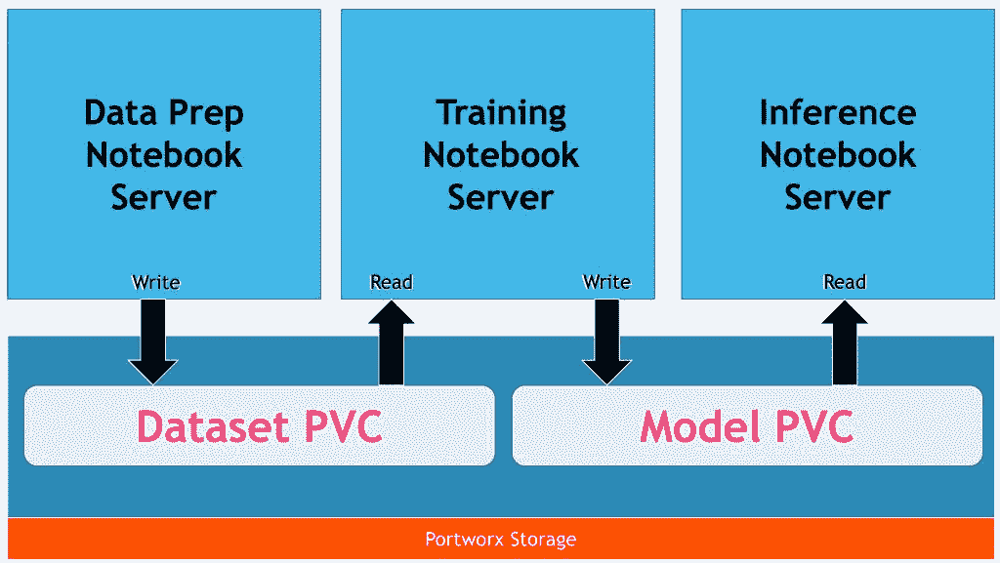
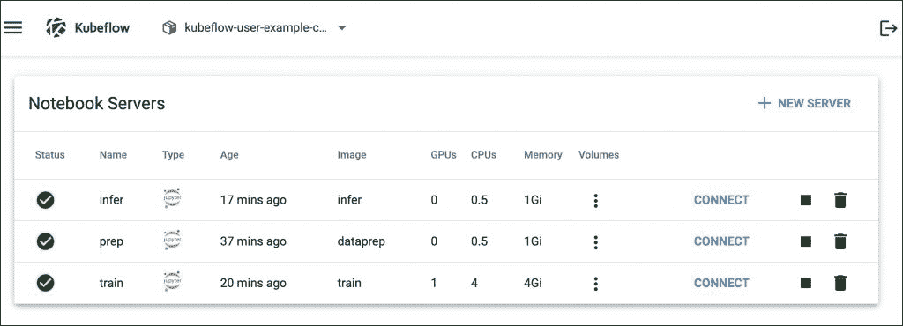

# 教程:为 Kubeflow 笔记本服务器构建自定义容器映像

> 原文：<https://thenewstack.io/tutorial-build-custom-container-images-for-a-kubeflow-notebook-server/>

在这一期中，我们将开始探索为数据准备、训练和推理构建一个端到端的机器学习管道。我们将在接下来的几期中更深入地研究这些任务。

为了遵循这个指南，您需要在您的环境中安装 [Kubeflow](https://www.kubeflow.org/) 和一个像 [Portworx](https://portworx.com/?utm_content=inline-mention) 这样的支持共享卷的存储引擎，以创建具有 RWX 支持的 PVC。

我们将训练一个卷积神经网络(CNN)来对狗和猫的图像进行分类。目标不是训练最复杂的模型，而是探索如何使用 Kubeflow 笔记本服务器构建 ML 管道。这个场景将进一步扩展到运行基于 Kubeflow 管道的 [MLOps](https://thenewstack.io/category/machine-learning/) 。对于模型服务，我们将利用 KFServing，它是 Kubeflow 的核心构件之一。

在本系列的第一部分中，我们将为 Kubeflow 笔记本服务器构建定制的容器映像，我们将在本教程的剩余部分中使用这些映像。

## 概观

这个练习包括三个独立的步骤:数据准备、模型训练和推理。每个步骤都与一个专用的 Jupyter 笔记本电脑服务器环境相关联。数据准备和推理环境将针对 CPU，而用于训练的 [Jupyter 笔记本](https://jupyter.org/)将在 GPU 主机上运行。

数据科学家将执行数据处理任务，并将最终数据集保存到由训练模型的机器学习工程师使用的共享卷中。经过训练的模型存储在另一个共享卷中，DevOps 工程师使用该共享卷来打包和部署用于推理的模型。

下图描述了笔记本电脑服务器如何利用存储引擎。



每台 Jupyter 笔记本服务器都使用自己的容器映像以及适当的工具和框架。这给了团队运行各自任务所需的灵活性。

一旦构建了自定义容器映像，并且配置了存储，我们的 Kubeflow 环境将看起来像下面的屏幕截图:



虽然整个流程只需一台没有共享文件夹的笔记本电脑服务器即可完成，但生产部署需要为每个团队提供隔离的环境。

## 构建容器图像

由于每台笔记本电脑服务器都有明确定义的角色，因此我们将为每个环境构建专用映像。

先从图像开始，进行数据准备和预处理。这将包含模块，如熊猫和 Matplotlib 用于处理和分析数据。

```
FROM ubuntu:18.04

RUN apt-get update  &amp;&amp;  apt-get install  -y  \
python3  \
python3-pip

RUN python3  -m  pip  --no-cache-dir install  --upgrade  \
"pip&lt;20.3"  \
setuptools

RUN python3  -m  pip install  --no-cache-dir  \
jupyter  \
matplotlib  \
pandas  \
scipy  \
imutils  \
opencv-python

RUN apt-get install  -y  --no-install-recommends  \
zip  \
unzip  \
wget  \
git  \
libgl1-mesa-glx

EXPOSE  8888

ENV NB_PREFIX  /

CMD  ["bash","-c",  "jupyter notebook --notebook-dir=/home/jovyan --ip=0.0.0.0 --no-browser --allow-root --port=8888 --NotebookApp.token='' --NotebookApp.password='' --NotebookApp.allow_origin='*' --NotebookApp.base_url=${NB_PREFIX}"]

```

让我们称这个文件为`Dockerfile.prep`

上述 Dockerfile 文件中使用的命令是不言自明的。我们从 Ubuntu 18.04 的基础映像开始，然后安装 Python 3 和 Pip。然后，我们安装所需的 Python 包，接着安装必要的命令行工具。最后，我们公开了用于访问 Jupyter Hub web 界面的端口 8888，并使用正确的参数集启动笔记本。

如果您想知道我们为什么使用环境变量`NB_PREFIX`，那么请参考 Kubeflow 文档，了解控制器如何使用变量来配置 URL。实际上，Kubeflow 笔记本控制器使用环境变量 NB_PREFIX 来管理笔记本服务器的基本 URL。

构建映像并将其推送到 Docker Hub 或任何其他映像注册表。

 `docker build -t janakiramm/dataprep -f Dockerfile.prep .` 

 `docker push janakiramm/dataprep` 

是时候为培训笔记本电脑服务器构建映像了。我们将使用最新的支持 GPU 的 TensorFlow 图像。

```
FROM tensorflow/tensorflow:latest-gpu-jupyter
RUN  /usr/bin/python3  -m  pip install  --upgrade pip

RUN pip install pandas  \
sklearn  \
scipy  \
matplotlib  \
imutils  \
opencv-python

RUN apt-get update
RUN apt-get install  -y  git  \
wget  \
libgl1-mesa-glx

ENV NB_PREFIX  /

CMD  ["sh","-c",  "jupyter notebook --notebook-dir=/home/jovyan --ip=0.0.0.0 --no-browser --allow-root --port=8888 --NotebookApp.token='' --NotebookApp.password='' --NotebookApp.allow_origin='*' --NotebookApp.base_url=${NB_PREFIX}"]

```

我们从 TensorFlow GPU 的基本映像开始，它附带了所有必需的 CUDA 库。然后，在公开 Jupyter 笔记本 URL 之前，我们安装所需的 Python 库和 OS 工具。

构建此映像并将其上传到注册表。

 `docker build -t janakiramm/train -f Dockerfile.train .` 

最后，对于模型服务和测试，我们将创建一个基于 TensorFlow CPU 的映像。

```
FROM tensorflow/tensorflow:latest-jupyter
RUN  /usr/bin/python3  -m  pip install  --upgrade pip

RUN pip install pandas  \
sklearn  \
scipy  \
matplotlib  \
imutils  \
opencv-python

RUN apt-get update
RUN apt-get install  -y  git  \
wget  \
libgl1-mesa-glx

ENV NB_PREFIX  /

CMD  ["sh","-c",  "jupyter notebook --notebook-dir=/home/jovyan --ip=0.0.0.0 --no-browser --allow-root --port=8888 --NotebookApp.token='' --NotebookApp.password='' --NotebookApp.allow_origin='*' --NotebookApp.base_url=${NB_PREFIX}"]

```

构建映像并将其推送到注册中心。

 `docker build -t janakiramm/train -f Dockerfile.infer .` 

 `docker push janakiramm/infer` 

在本教程的下一部分，我们将配置 Kubernetes 存储类，即运行笔记本服务器所需的持久性卷。敬请关注。

<svg xmlns:xlink="http://www.w3.org/1999/xlink" viewBox="0 0 68 31" version="1.1"><title>Group</title> <desc>Created with Sketch.</desc></svg>