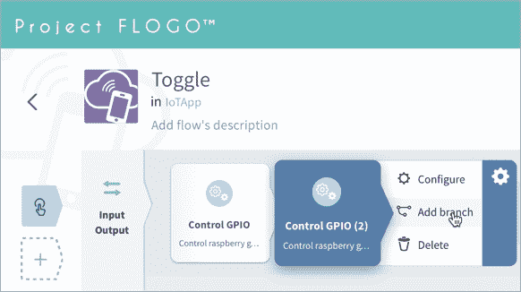

# 教程:用 Flogo 和 Raspberry Pi 构建物联网应用

> 原文：<https://thenewstack.io/tutorial-building-an-iot-app-with-flogo-and-raspberry-pi/>

在本系列的最后一部分，我[介绍了 Project Flogo](https://thenewstack.io/project-flogo-a-lightweight-runtime-for-edge-computing/) 作为运行微服务和物联网应用的轻量级边缘计算平台。在本教程中，我将向您介绍从 Flogo 构建和部署物联网应用程序的步骤。从提取 Docker 映像到在 Raspberry Pi 上运行应用程序，我将涵盖使用 Flogo 构建物联网和边缘计算应用程序的所有方面，而无需编写一行代码。

该应用程序公开了一个可以控制 Raspberry Pi 的 GPIO 引脚的 REST 端点。每次我们调用端点时，它都会切换引脚的状态。当发送 MQTT 消息时，用例可以很容易地扩展到从传感器读取数据或控制执行器。

## 先决条件

本教程展示了如何从 Flogo 控制 Raspberry Pi 的 GPIO。我们将切换 GPIO 引脚的状态，以打开和关闭 LED。确保您手头有以下组件:

*   1 个 Raspberry Pi 型号，带默认 Raspbian 操作系统
*   1 个试验板
*   1 个 LED
*   2 根跳线
*   1 个 300 欧电阻器

如下图所示，连接 LED、电阻器和跳线。Raspberry Pi 的 GPIO 引脚 23 通过一个 330E 电阻连接到 LED。


在您的开发机器上，安装 Docker。我们需要这个来运行 Flogo Web UI。

## 从 Project Flogo 设计物联网应用

让我们从启动包含 Web UI 的 Docker 图像开始。运行以下命令，等待控制台显示消息"*【成功】在浏览器中打开 http://localhost:3303。*

```
$  docker run  -it  -p  3303:3303  flogo/flogo-docker:latest eula-accept


```

我们现在已经准备好访问网络用户界面了。点击 http://localhost:3303 将显示控制台:


单击“新建”,然后从弹出菜单中选择“微服务”。


让我们将新服务称为 *IoTApp* ，将流称为 *Toggle* 。


这将为我们创建一个空白画布，添加相关的触发器和活动:


单击左侧导航栏上的加号添加触发器。由于我们要公开一个 REST 端点，我们将选择“*接收 HTTP 消息*”作为触发器:


单击触发器图标来配置 REST 端点。可以通过向端口 8888 上的 */led/toggle* 路径发送 GET 请求来调用该服务。


在下一步中，我们将配置服务发送的输出参数。为此，单击输入/输出按钮，并将参数添加到触发器的输出部分。code 参数表示 HTTP 状态，消息包含其中一个活动的输出。完成后点击*保存*按钮。


除了监听入站消息或请求之外，触发器本身并不做太多事情。为了使应用程序有意义，我们需要添加活动。Flogo 项目支持的活动之一是访问和控制 GPIO 引脚。我们将广泛使用它来设置引脚的方向。读取状态，并更改状态。

让我们继续将 GPIO 活动添加到画布中。单击虚线框内的加号，添加一项活动。


流程的第一步是将 GPIO 引脚方向设置为输出。由于引脚可用于读写，我们需要配置它来控制 LED。单击活动，使用以下参数对其进行配置:


因为我们想要切换 GPIO 引脚的状态，所以需要读取当前状态。我们可以通过添加另一个 GPIO 活动来读取当前状态。如果引脚为高电平，输出将为 1，否则将为 0。

添加另一个 GPIO 活动，并将其配置为读取状态。


是时候让我们创建一个基于当前状态切换状态的决策了。如果状态是 1，我们需要把它变成 0。

让我们继续添加一个分支。



画布应该类似于下面的配置:


我们需要向分支添加一个条件。单击分支并添加以下语句作为 if 条件。

```
$activity[gpio_3].result==0

```

这里， *gpio_3* 是负责读取引脚状态的活动的标识符。只有满足条件时，才会调用与分支相关的后续活动。在这种情况下，我们检查 GPIO 状态是设置为低还是 0。

要切换状态，我们需要向分支添加另一个 GPIO 活动，在那里我们操作引脚的状态。


注意，我们只配置了*方法*、*引脚编号*和*状态*参数。对于此步骤，其他设置是可选的。

我们还需要通过添加返回活动来结束工作流，这将终止流并将输出返回给触发器。

单击+按钮，将返回活动添加到分支。单击配置以调用设置弹出窗口。适当地设置代码和消息变量。我们将代码设置为 200，通过 HTTP 触发器发送一个 OK 响应。


重复上述步骤，添加另一个包含关闭 LED 的活动的分支。确保第二个分支的条件设置为 *$activity[gpio_3]。结果==1* 。

您的最终流程应该看起来像下面的截图。


这个流程表示一个操作 Raspberry GPIO 引脚的活动最少的准系统应用程序。您可能想要包括额外的活动，比如帮助调试流的日志记录。

## 构建应用程序并将其部署到 Raspberry Pi

应用程序就绪后，是时候构建二进制文件并在设备上运行了。回到应用程序，并点击建立按钮。选择 *Linux/arm* 针对树莓 Pi。


几秒钟之内，您会发现一个包含。下载文件夹中的 dms 扩展名。重命名去掉扩展名，复制到 Raspberry Pi。如果您的设备和开发机器在同一个网络上，您可以使用 SCP。

SSH 进入 Raspberry Pi，找到刚才复制的二进制文件。更改权限并运行可执行文件。


在您的开发机器上，用 cURL 点击 REST 端点。用您的 Raspberry Pi 的实际 IP 地址替换 *rpi_IP* 。

```
$  curl http://&lt;rpi_IP&gt;:8888/led/toggle

You should see the LED toggle each time you access the service.

```

您可以通过 Flogo 轻松扩展这一场景，构建复杂的物联网应用。用 MQTT 替换 HTTP 触发器可以很容易地与现有部署集成。

Flogo 项目还支持调用 TensorFlow 模型作为活动。有可能建立预测分析，可以发现传感器摄取的遥测数据中的异常。

<svg xmlns:xlink="http://www.w3.org/1999/xlink" viewBox="0 0 68 31" version="1.1"><title>Group</title> <desc>Created with Sketch.</desc></svg>