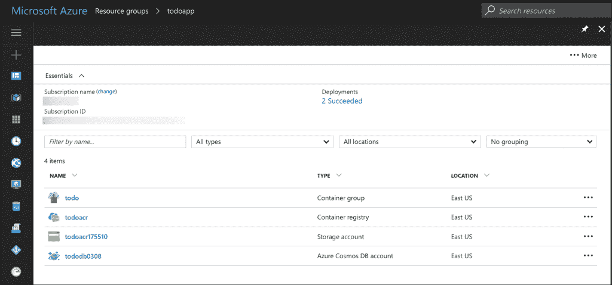
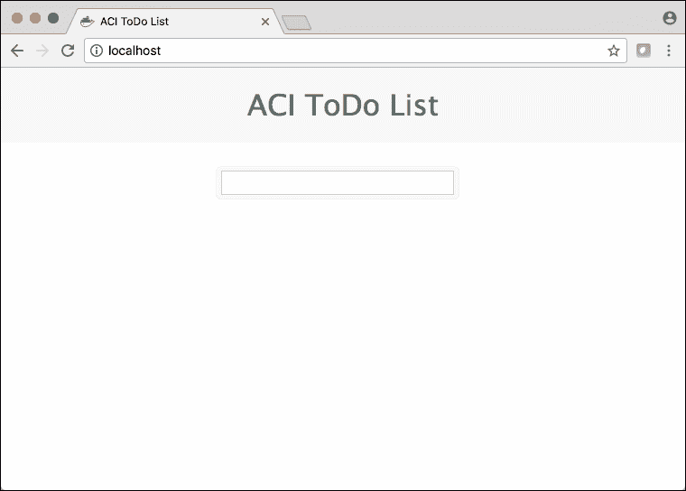
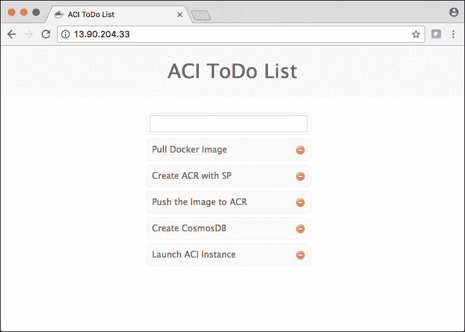
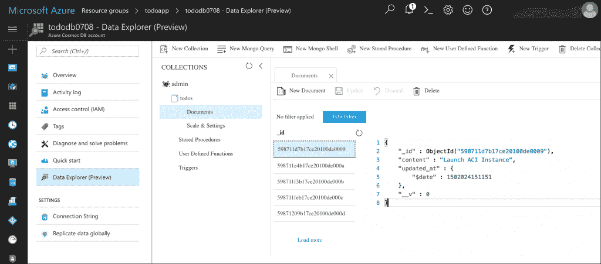

# 教程:使用 Azure 容器实例构建和部署微服务应用程序

> 原文：<https://thenewstack.io/tutorial-building-deploying-microservices-application-azure-container-instances/>

在本教程中，我将带您了解在利用 Azure 容器实例、 [Azure 容器注册中心](https://azure.microsoft.com/en-us/services/container-registry/)和 [Azure Cosmos DB](https://azure.microsoft.com/en-us/services/cosmos-db/) 的 [Azure 容器服务](https://azure.microsoft.com/en-us/services/container-service/)中部署端到端应用程序的步骤。

Azure 容器实例(ACI)是无需服务器的容器，无需主机虚拟机即可直接供应。它们是轻量级、超快的实例，按每秒执行模式定价。ACI 是为执行通常在响应外部事件时调用的代码而设计的。这些实例是短命的，在它们的工作完成后退出。

虽然本教程没有强调 ACIs 的典型用例，但它展示了应用程序的生命周期。在部署应用程序时，我们将探索如何使用 Azure Container Registry 来存储图像，并将状态转移到 Azure Cosmos DB。

我们部署的应用程序是一个简单的 stack 应用程序，需要一个 MongoDB 后端。由于 Cosmos DB 与 MongoDB 兼容，我们将简单地将应用程序指向 Azure Cosmos DB 的一个实例，而不对原始代码进行任何更改。

在本次部署结束时，我们将拥有一个 [Azure 资源组](https://azure.microsoft.com/en-us/resources/videos/resource-group-model-modern-management-for-modern-cloud/)，它将拥有如下所示的资源:

[](https://storage.googleapis.com/cdn.thenewstack.io/media/2017/08/712552d8-aci-tut1.png)

## 准备环境

让我们从从 [Docker Hub](https://hub.docker.com/) 提取正确的图像开始，并在我们的开发机器上测试应用程序。您需要 Docker for Mac 或 Docker for Windows 来测试应用程序。

运行以下命令来签出应用程序。

```
$  docker run  -d  --name db mongo

$  docker run  -d  -p  80:3000  --link db:db  --name todo janakiramm/todo

```

访问应用程序会在浏览器中显示一个简单的用户界面:

[](https://storage.googleapis.com/cdn.thenewstack.io/media/2017/08/436cdaf2-aci-tut2.png)

我们现在将初始化一些环境变量，这些变量将在部署过程中派上用场。

```
$  export LOC=eastus

$  export RG=todoapp

$  export DB=tododb$RANDOM

$  export REG=todoacr

```

让我们首先创建一个 Azure 资源组来保存这个应用程序的所有相关资源:

```
$  az group create  --name  $RG  --location  $LOC

```

## 将图像推送到 Azure 容器注册表

下一步是将图像移动到 Azure 容器注册中心(ACR)。

ACR 通过将 Docker 注册表保存在与您的部署相同的数据中心，减少了网络延迟并消除了入口/出口费用。它为您提供了订阅中容器图像的本地、网络封闭存储，以及对访问和图像名称的完全控制。

```
$  az acr create  -g  $RG  --location  $LOC  --sku Basic  -n  $REG

```

使用以下命令验证 ACR 的可用性。你应该可以在列表中找到 *todoacr* 。

```
$  az acr list  --query  [*].name

```

让我们创建一个 Azure 服务主体来验证容器注册中心。该服务将为需要基于角色访问 Azure 资源的应用程序启用身份和访问管理。

当您有需要访问资源的基于云的应用程序或脚本时，您可以为应用程序设置一个身份，并使用其自己的凭据对应用程序进行鉴定。

我们将使用 Azure CLI 为 ACR 创建服务主体。

```
$  az ad sp create-for-rbac  --scopes  /subscriptions/&lt;SUBSCRIPTION_ID&gt;/resourceGroups/todoapp/providers/Microsoft.ContainerRegistry/registries/todoacr  --role Owner  --password Password@123

$  az acr update  -n  todoacr  --admin-enabled true

$  az acr credential show  -n  todoacr

$  export USR=&lt;appID&gt;  # Replace with actual value

$  export PASSWD=&lt;password&gt;  # Replace with actual value

```

确保用 Azure 订阅 ID、服务主体应用程序 ID 和服务主体密码的实际值替换占位符。

注册中心就绪后，让我们将图像移入其中。

```
$  docker pull janakiramm/todo:latest

$  docker tag janakiramm/todo:latest todoacr.azurecr.io/todo:latest

$  docker login  -u  $USR  -p  $PASSWD todoacr.azurecr.io

$  docker push todoacr.azurecr.io/todo:latest

```

在这一步结束时，您应该已经创建了一个 Azure 容器注册中心和一个服务主体。Docker Hub 中的图像也被移动到注册表中。

## 创建 Azure Cosmos DB 实例

Cosmos DB 是一个基于 Azure 的全球分布式、网络规模的托管数据库。它是一个多模型数据库服务，支持键值、列、文档和图形模型。该服务公开了流行格式的 API，包括 DocumentDB、Azure Table、MongoDB 和 [Gremlin API。](https://tinkerpop.apache.org/gremlin.html)

让我们在保存应用程序其他资产的同一个资源组中创建一个 Azure Cosmos DB。我们将使用这个数据库来存储 ACI 容器的状态。

```
$  az cosmosdb create  --name  $DB  --kind MongoDB   -g  $RG

$  az cosmosdb list-connection-strings  -g  $RG  --name  $DB

$  export CONNSTR=&lt;Connection_String&gt;  # Replace with actual value

```

使用以下命令
验证创建

## 启动 Azure 容器实例

现在，我们已经在 ACR 中获得了这个映像和 Cosmos DB 实例。下一步是基于映像创建实例。

```
$  az container create  \

--name todo  \

--resource-group todoapp  \

--registry-login-server todoacr.azurecr.io  \

--registry-username  $USR  \

--registry-password  $PASSWD  \

--image todoacr.azurecr.io/todo  \

--environment-variables DB="$CONNSTR"  PORT=80  \

--ip-address public  \

--port=80

```

上面的命令通过使用我们之前创建的服务主体凭证从 ACR 提取映像。它将 Cosmos DB 连接字符串作为环境变量传递给 Node.js 应用程序。它强制应用程序监听端口 80。最后，它分配一个可在端口 80 上访问的公共 IP 地址。

注意:如果在这一步遇到错误，切换到通过 Azure 资源管理(ARM)模板创建 ACI。当前版本的 Azure CLI 有一个错误，不接受带有特殊字符的环境变量。手臂模板在 Github 上作为 [Gist](https://gist.github.com/janakiramm/78a7af86ba6b8a71b15a86746a0082a0) 提供。不要忘记用前面步骤中获得的实际值替换变量。

```
$  az group deployment create  --name todo  --resource-group  $RG  --template-file azuredeploy.json

```

ACI 实例启动后，通过实例的公共 IP 地址访问应用程序:

[](https://storage.googleapis.com/cdn.thenewstack.io/media/2017/08/eb22dc75-aci-tut3.png)

在 web UI 中输入几个 todos 后，在 Azure CosmosDB 中检查创建。您可以在 Azure Portal 的 CosmosDB blade 中使用数据浏览器。它应该显示应用程序创建的集合和文档:

[](https://storage.googleapis.com/cdn.thenewstack.io/media/2017/08/c6f52c93-aci-tut4.png)

最后，使用以下命令查看 ACI 和日志的详细信息。

```
$  az container list

$  az container logs  --name todo  --container-name todo  -g  $RG

```

本教程中使用的所有命令都可以通过 Github [Gist](https://gist.github.com/janakiramm/8f26db1d339ef3c87342c81fb63e5912) 获得。

## 结论

本教程的目标是演示 ACR、ACI 和 Azure Cosmos DB 的用法。虽然您可能需要 Azure Container Service (ACS)来协调和管理生产中的多容器工作负载，但 ACI 提供了一种简单的机制来运行基于单个容器的无状态应用程序。通过利用 Azure Storage 和 Azure CosmosDB，我们可以将状态隔离到一个持久的服务中，该服务可以在 ACI 和 ACS 中运行的多个容器之间共享。

在本系列的下一部分中，我们将利用用于 Kubernetes 的 ACI 连接器将这个用例扩展到多容器部署场景。敬请期待！

<svg xmlns:xlink="http://www.w3.org/1999/xlink" viewBox="0 0 68 31" version="1.1"><title>Group</title> <desc>Created with Sketch.</desc></svg>