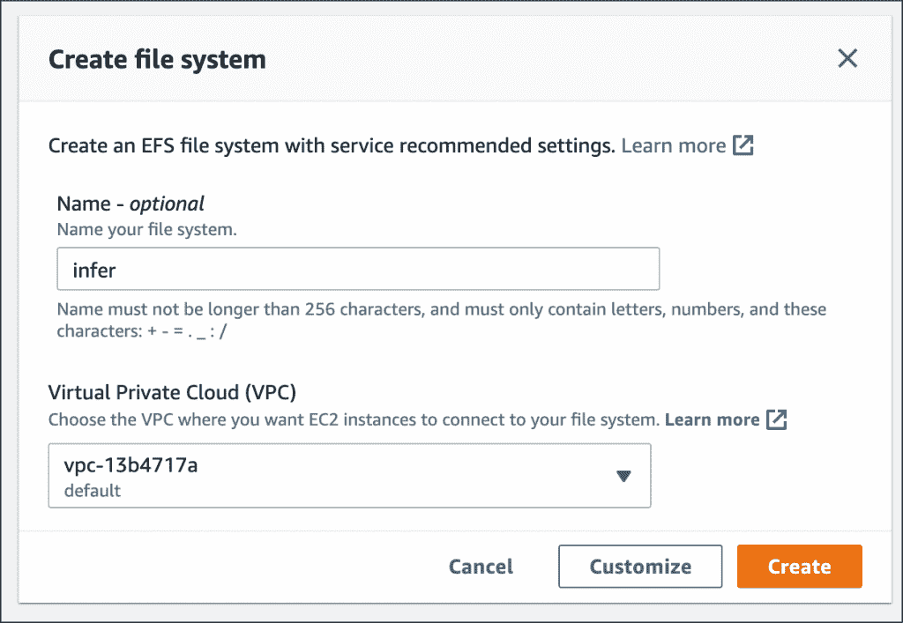
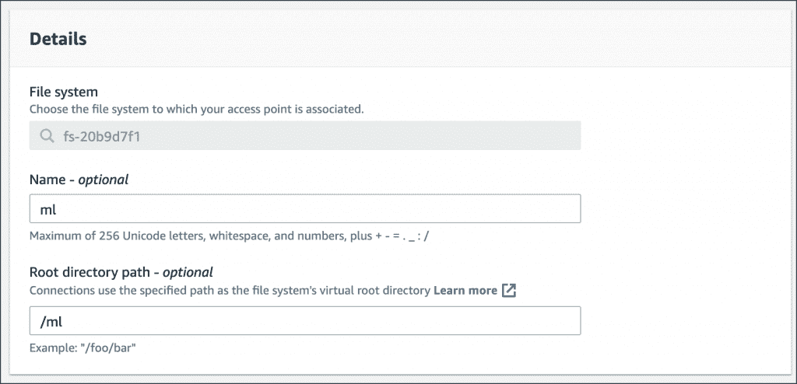
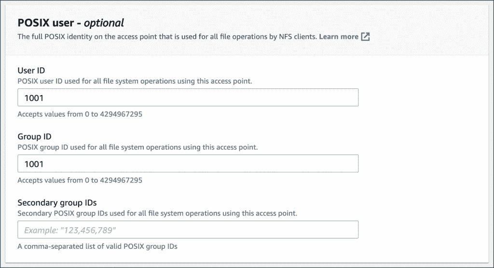
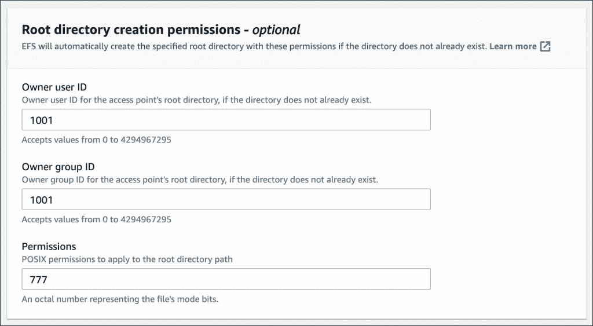
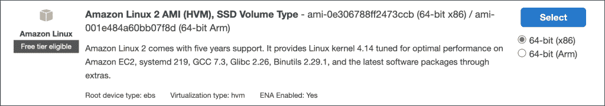
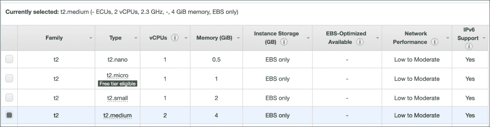
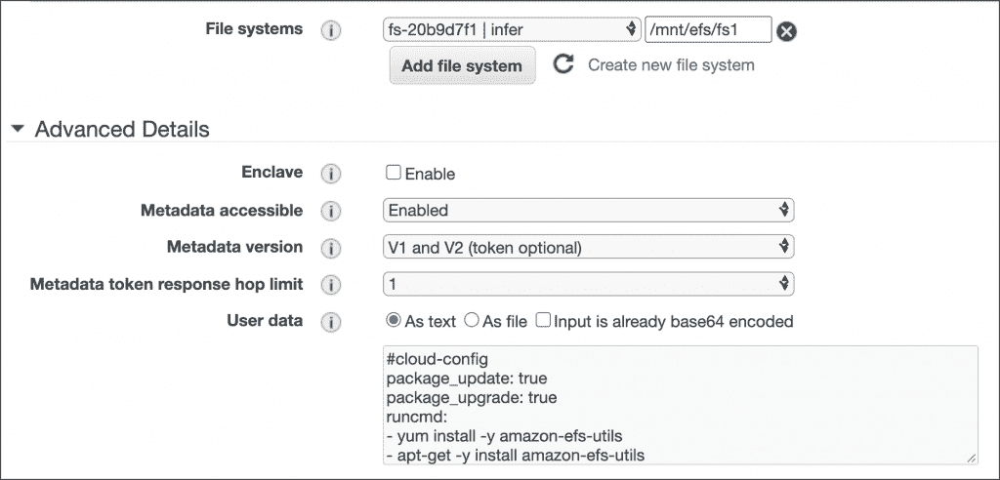
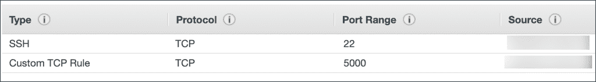

# 教程:在 Amazon EC2 实例中配置和挂载 EFS 文件系统

> 原文：<https://thenewstack.io/tutorial-configure-and-mount-an-efs-file-system-in-amazon-ec2-instance/>

在本教程中，我将带您了解创建亚马逊 EFS 文件系统并将其挂载到 EC2 实例中的步骤。本文是关于用亚马逊 EFS 使 AWS Lambda 函数有状态的系列文章的[的一部分。](https://thenewstack.io/turn-aws-lambda-functions-stateful-with-amazon-elastic-file-system/)

### 创建一个亚马逊 EFS 文件系统

首先访问 AWS 管理控制台的 EFS 部分。点击**创建文件系统**按钮创建文件系统。从下拉列表中选择一个 VPC。我建议您选择所选地区的默认 VPC。

创建文件系统后，单击**访问点**选项卡，为我们的机器学习应用程序创建一个访问点。

确保根目录是`/ml`。创建一个众所周知的根目录比默认选项更有帮助。

将 POSIX 用户和 root 用户的用户 ID 和组 ID 配置为`1001`。这用于管理文件系统的所有权和权限。

让我们用`777`作为根目录路径的权限。

最后，点击**创建接入点**完成配置。

选择**网络**选项卡，验证 EFS 文件系统在 VPC 所有子网中的可用性。

EFS 文件系统现在准备好了。下一步，我们将从 Amazon EC2 实例中访问它。

## 在 Amazon EC2 实例中挂载 EFS 文件系统

在 EC2 启动向导的第一步中，选择 64 位 Amazon Linux 2 AMI。

在下一步中，选择 *t2.medium* 实例类型。

第三步，点击**添加文件系统**，选择为本教程创建的 EFS。请注意，向导已经添加了用户数据来装载文件系统。

在第六步中，选择默认安全组以及一个开放端口 22 和 5000 的自定义安全组。这个配置将允许我们 SSH 到实例中，还可以访问将由 Python 应用程序公开的推理端点。

查看并启动实例。

一旦实例处于运行模式，就可以使用 SSH 来检查 EFS 文件系统是否已挂载。

您应该看到目录`/mnt/efs/fs1/`，它代表我们创建的同一个 EFS 文件系统。

在本系列的下一部分中，我们将在共享文件系统中安装 PyTorch，并运行推理服务来测试环境。敬请关注。

贾纳基拉姆·MSV 的网络研讨会系列“机器智能和现代基础设施(MI2)”提供了涵盖前沿技术的信息丰富、见解深刻的会议。在 [http://mi2.live](http://mi2.live) 上注册参加即将举行的 MI2 网络研讨会。

亚马逊网络服务是新堆栈的赞助商。

由[马丁·亚当斯](https://unsplash.com/@martinadams?utm_source=unsplash&utm_medium=referral&utm_content=creditCopyText)在 [Unsplash](https://unsplash.com/s/photos/high-school?utm_source=unsplash&utm_medium=referral&utm_content=creditCopyText) 上拍摄的特征图像。

<svg xmlns:xlink="http://www.w3.org/1999/xlink" viewBox="0 0 68 31" version="1.1"><title>Group</title> <desc>Created with Sketch.</desc></svg>