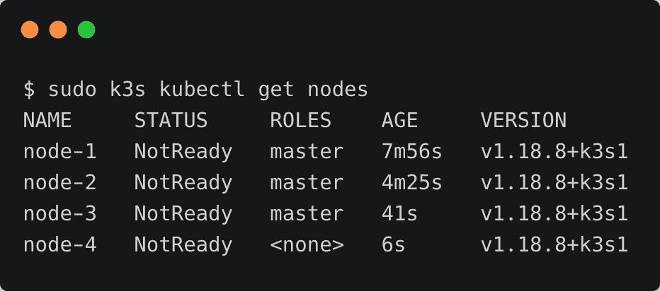
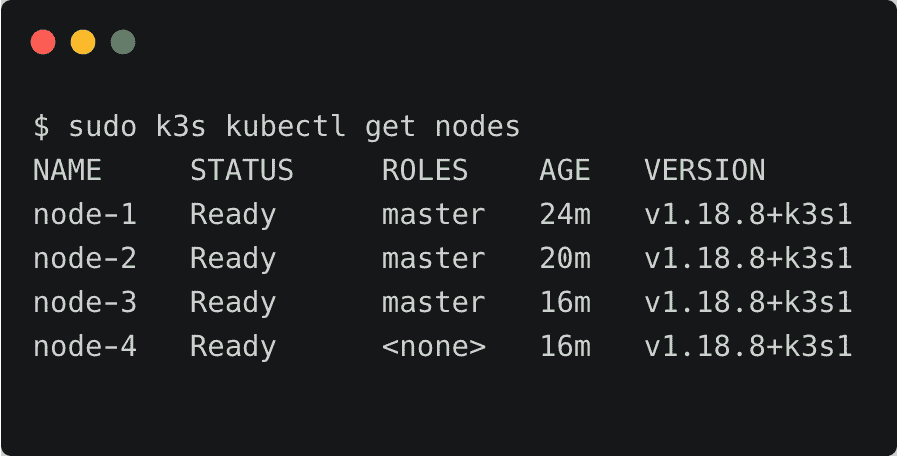
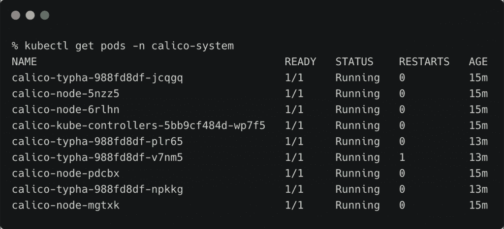
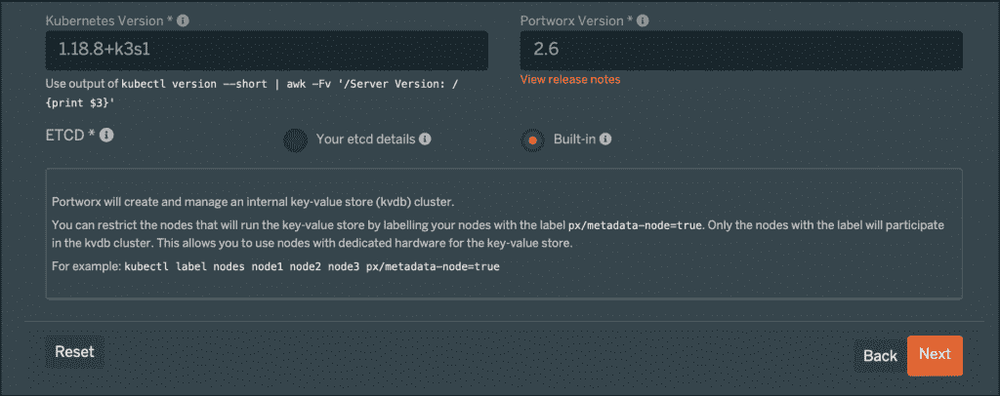
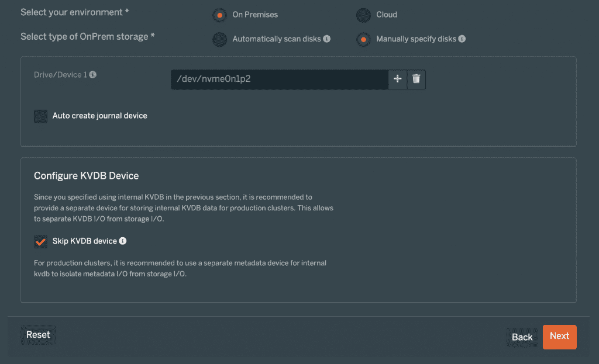
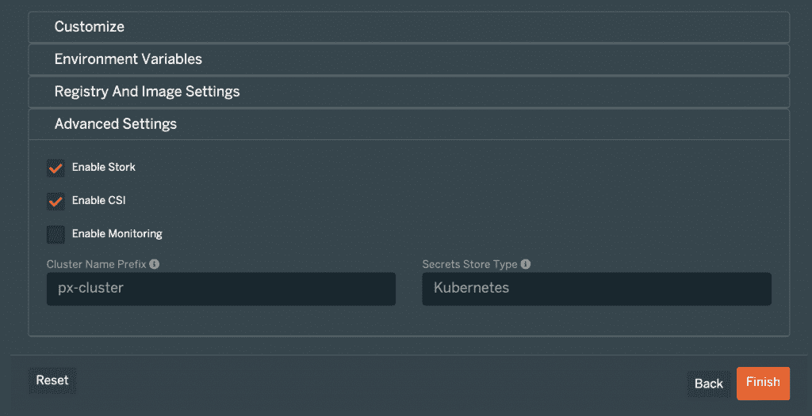
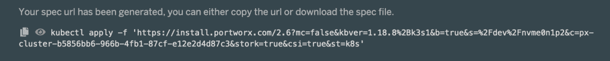
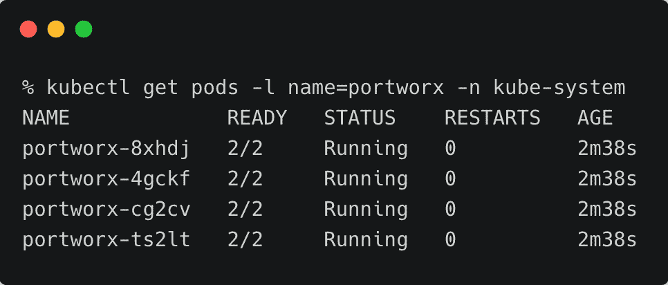
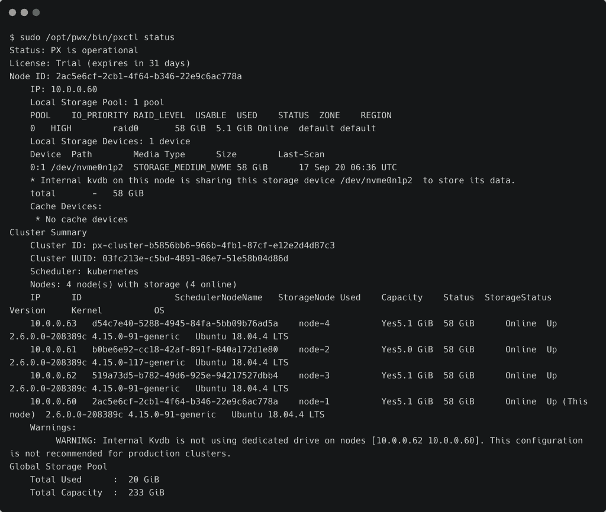

# 教程:使用 K3s、Calico、Portworx 配置云原生边缘基础架构

> 原文：<https://thenewstack.io/tutorial-configure-cloud-native-edge-infrastructure-with-k3s-calico-portworx/>

在本系列的[上一篇](https://thenewstack.io/how-k3s-portworx-and-calico-can-serve-as-a-foundation-of-cloud-native-edge-infrastructure/)中，我介绍了云原生边缘计算栈的核心构建模块: [K3s](https://k3s.io/) 、 [Project Calico](https://www.projectcalico.org/) 和 [Portworx。](https://portworx.com/)

本教程将带您完成在 edge 集群上安装和配置该软件的步骤，edge 集群是一组运行 Ubuntu 18.04 的英特尔 NUC 迷你电脑。该基础设施可用于在边缘运行可靠、可扩展且安全的人工智能和物联网工作负载。

### 为 Calico 定制 K3s 安装

默认情况下，K3s 将运行法兰绒作为容器网络接口(CNI)，使用 VXLAN 作为默认后端。我们将用符合 CNI 标准的印花棉布代替。

要将 Calico 网络堆栈与 K3s 集成，我们需要定制安装以启用 CNI 支持。

请注意，为了获得高可用性，您至少需要三个节点在边缘运行 K3s 群集。

在指定为服务器的第一个节点上，运行以下命令。

```
export K3S_TOKEN="secret_edgecluster_token"

```

```
export INSTALL_K3S_EXEC="--flannel-backend=none --disable=traefik --cluster-cidr=172.16.2.0/24 --cluster-init"

```

```
curl  -sfL https://get.k3s.io | sh -

```

如果 *172.16.2.0/24* 已经在您的网络中使用，您必须通过替换上述命令中的 *172.16.2.0/24* 来选择不同的 pod 网络 CIDR。

在其余的服务器节点上，运行以下命令。注意，我们在安装程序中添加了`--server`开关，将它指向第一个节点的 IP 地址。

```
export K3S_TOKEN="secret_edgecluster_token"

```

```
export INSTALL_K3S_EXEC="--flannel-backend=none --disable=traefik --cluster-cidr=172.16.2.0/24 --server https://10.0.0.60:6443"

```

```
curl  -sfL https://get.k3s.io | sh -

```

要配置工作节点或代理，请运行以下命令:

```
export K3S_URL=https://10.0.0.60:6443

```

```
export K3S_TOKEN="secret_edgecluster_token"

```

```
curl  -sfL https://get.k3s.io | sh -

```

将`K3S_URL`替换为 K3s 服务器的 IP 地址。

在这一步结束时，您应该拥有一个包含四个节点的集群。

由于网络尚未配置，这些节点都没有准备好。一旦我们将 Calico 规格应用到集群，节点就会准备就绪。

  ☓

在进行下一步之前，将`/etc/rancher/k3s/k3s.yaml`从一个服务器节点复制到您的本地工作站，并将`KUBECONFIG`环境变量指向它。不要忘记更新 YAML 文件中的主 URL。这提供了通过`kubectl` CLI 对 K3s 群集的远程访问。

### 在多节点 K3s 集群上安装 Calico

我们将从下载印花布清单并修改它们开始。

```
wget https://docs.projectcalico.org/manifests/tigera-operator.yaml

```

```
wget https://docs.projectcalico.org/manifests/custom-resources.yaml

```

打开`custom-resources.yaml`文件，将 CIDR 更改为 K3s 安装期间提到的相同 IP 地址范围。

应用这两个清单来配置 K3s 群集的 Calico 网络。

```
kubectl create  -f  tigera-operator.yaml

```

```
kubectl create  -f  custom-resources.yaml

```

几分钟后，集群准备就绪。



最后，修改`calico-system`名称空间中的`cni-config` configmap 以启用 IP 转发。

```
kubectl edit cm cni-config  -n  calico-system

```

更改下面显示的值以启用 IP 转发。

```
"container_settings":  {
              "allow_ip_forwarding":  true
          }

```

使用以下命令验证 Calico 是否启动并运行:

```
kubectl get pods  -n  calico-system

```



### 在 K3s 上安装 Portworx

Portworx 2.6 以上支持 K3s 发行。K3s 上的安装过程和其他口味的 Kubernetes 没什么区别。按照[教程](https://thenewstack.io/tutorial-install-and-configure-portworx-on-a-bare-metal-kubernetes-cluster/)中提到的步骤在裸机集群上安装 Portworx。

如果你手边没有 etcd 集群，你可以在 [PX-Central](http://central.portworx.com) 安装向导中选择内置的 KVDB。



对于存储选项，我选择了连接到每台主机的 NVMe 磁盘。根据您的存储配置对此进行修改。



K3s 的重要前提之一是对 CSI 的支持。确保在最后一步选择`Enable CSI`选项。



复制规范并将其应用到集群中。



几分钟后，K3s 上的 Portworx 存储集群将启动并运行。

```
kubectl get pods  -l  name=portworx  -n  kube-system

```



CSI 驱动程序作为边车连接到 DaemonSet 中的每个吊舱，这就是为什么我们在吊舱中看到两个集装箱。

SSH 进入其中一个节点，使用下面的命令检查 Portworx 集群状态。

```
sudo  /opt/pwx/bin/pxctl status

```



我们现在有了基于 K3s、Calico 和 Portworx 的完整配置的边缘基础设施。在本系列的下一部分中，我们将部署在边缘运行的 AIoT 工作负载。

*贾纳基拉姆·MSV 的网络研讨会系列“机器智能和现代基础设施(MI2)”提供了涵盖前沿技术的信息丰富、见解深刻的会议。在 [http://mi2.live](http://mi2.live) 注册参加即将到来的 MI2 网络研讨会。*

Portworx 是新堆栈的赞助商。

来自 Pixabay 的 Uwe Baumann 的特写图片。

<svg xmlns:xlink="http://www.w3.org/1999/xlink" viewBox="0 0 68 31" version="1.1"><title>Group</title> <desc>Created with Sketch.</desc></svg>