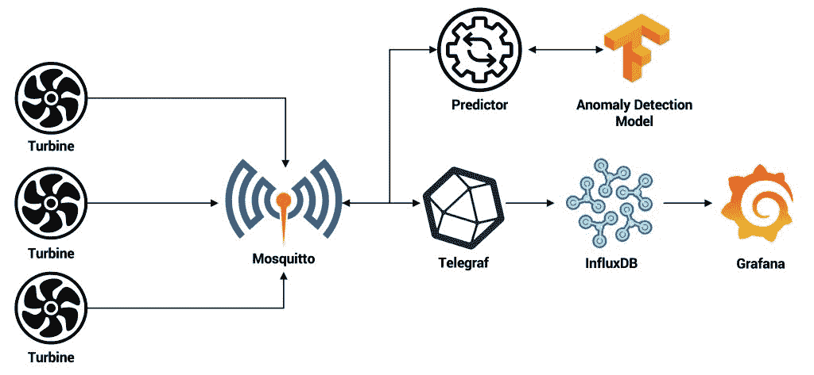

# 教程:在云本地边缘基础设施上配置和部署边缘应用

> 原文：<https://thenewstack.io/tutorial-configure-deploy-an-edge-application-on-cloud-native-edge-infrastructure/>

这是 [4 部分系列](https://thenewstack.io/design-an-edge-system-for-the-cloud-native-edge-infrastructure/) ( [第 1 部分](https://thenewstack.io/how-k3s-portworx-and-calico-can-serve-as-a-foundation-of-cloud-native-edge-infrastructure/) ) ( [第 2 部分](https://thenewstack.io/tutorial-configure-cloud-native-edge-infrastructure-with-k3s-calico-portworx/) ) ( [第 3 部分](https://thenewstack.io/design-an-edge-system-for-the-cloud-native-edge-infrastructure/))的最后一部分，我们将在云原生边缘基础设施上的“边缘”物联网(AIoT)工作负载上配置和部署人工智能工作负载。该应用程序对涡轮机进行预测性维护。关于用例的背景和解释，请参考教程的[前一部分](https://thenewstack.io/design-an-edge-system-for-the-cloud-native-edge-infrastructure/)。

[](https://thenewstack.io/design-an-edge-system-for-the-cloud-native-edge-infrastructure/aiot-0-2/)

首先克隆包含代码、配置和 Kubernetes 部署清单的 [GitHub 存储库](https://github.com/janakiramm/aiot)。请随意探索存储库中可用的源代码、配置和清单。您可以为每个服务构建容器映像，并将它们存储在私有注册表中。

当我们开始部署每个微服务时，我将讨论设计决策和配置选择。如果您有一个配置了项目 Calico 和 Portworx 的 K3s 集群，您可以部署整个应用程序而无需构建映像。

如果您想要一次部署一个工件，那么从名称空间开始。工作负载在专用的名称空间`aiot`中运行。

```
kubectl apply  -f  deploy/aiot-ns.yaml

```

### 部署 Mosquitto MQTT 代理

充当 MQTT 代理的 Mosquitto pod 依靠持久卷声明来持久化日志和数据。该 PVC 使用基于 Portworx 存储类的动态配置，该存储类针对数据库进行了优化。InfluxDB 时序数据库使用相同的存储类。

```
kind:  StorageClass
apiVersion:  storage.k8s.io/v1
metadata:
  name:  db-sc
provisioner:  pxd.portworx.com
parameters:
  io_profile:  "db_remote"
  repl:  "3"

```

部署 storage 类，然后部署 Mosquitto 服务。

```
kubectl apply  -f  deploy/db-sc.yaml

```

```
kubectl apply  -f  deploy/mosquitto.yaml

```

### 部署风扇模拟器

fan 模拟器被配置为 pod，环境变量指向 MQTT 代理和与遥测相关的主题。环境变量`FAULT`将决定模拟器是否发布异常数据。`DEVICE_ID`变量为设备标识符分配一个任意值。

```
      initContainers:
      -  name:  wait-for-mosquitto
        image:  janakiramm/wait
        args:  ["--timeout=60",  "mosquitto:1883"]
      containers:
      -  name:  fan-1
        image:  janakiramm/fan
        imagePullPolicy:  Always
        env:
          -  name:  MQTT_HOST
            value:  "mosquitto"
          -  name:  MQTT_TOPIC
            value:  "fan/messages"
          -  name:  FAULT
            value:  "0"
          -  name:  DEVICE_ID
            value:  "1"

```

在超时之前，InitContainer 将等待 60 秒，以便 Mosquitto 代理变得可用。这将确保 pod 在等待相关服务时不会经历 CrashLoopBackOff。

部署两个风扇，其中一个配置为接收异常数据。

```
kubectl apply  -f  deploy/fan-1.yaml

```

```
kubectl apply  -f  deploy/fan-2.yaml

```

现在，我们有两个模拟器向 MQTT 主题发布遥测数据。

### 部署人工智能推理和预测服务

推理窗格下载模型的最新版本，并将其作为 REST 端点公开。InitContainer 检查模型是否存在于一个已知的目录中，只有当它丢失时才提取压缩的 TensorFlow 模型。这种方法避免了每次扩展部署时下载和复制模型。

随着推理服务的扩展，模型需要通过一个共享的文件系统对多个 pod 可用。为了实现这一点，我们使用 SharedV4 标志定义了一个不同的 Portworx 存储类，以创建一个全局共享的命名空间卷，供多个 pod 使用。

```
kind:  StorageClass
apiVersion:  storage.k8s.io/v1
metadata:
  name:  infer-sc
provisioner:  pxd.portworx.com
parameters:
  repl:  "1"
  sharedv4:  "true"

```

```
kubectl apply  -f  deploy/infer-sc.yaml

```

创建存储类之后，让我们创建推理服务。

```
kubectl apply  -f  deploy/infer.yaml

```

有了推理服务，我们可以部署 predictor 微服务，作为 MQTT 代理和 AI 模型之间的中介。

与 MQTT 代理和推理服务端点相关的值作为环境变量传递。

```
      containers:
      -  name:  predict
        image:  janakiramm/predict
        env:
          -  name:  MQTT_HOST
            value:  "mosquitto"
          -  name:  MQTT_DEV_TOPIC
            value:  "fan/messages"
          -  name:  MQTT_PREDICT_TOPIC
            value:  "fan/anomaly"
          -  name:  SCORING_URL
            value:  "http://infer:5000/score"

```

```
kubectl apply  -f  deploy/predict.yaml

```

由于推断微服务使用共享卷，我们可以轻松扩展副本的数量。

```
kubectl scale deploy/infer  --replicas=3

```

### 部署 Telegraf 和 InfluxDB

InfluxDB 用作时序数据库，存储来自风扇模拟器和预测服务的遥测数据。它被配置为由 PVCs 支持的有状态集，PVCs 是从 Mosquitto 使用的同一个 Portworx 存储类中创建的。

```
kubectl apply  -f  deploy/influxdb.yaml

```

Telegraf 通过一个被创建为 Kubernetes 配置图的配置文件将 InfluxDB 与 Mosquitto 连接起来。

```
kubectl apply  -f  deploy/telegraf.yaml

```

检查 Telegraf pod 的日志，以确认从 Mosquitto 到 InfluxDB 的消息流。

```
TELEGRAF_POD=$(kubectl get pods  -n  aiot  -l  app=telegraf  -o  jsonpath='{.items[0].metadata.name}')

```

```
kubectl logs  -f  $TELEGRAF_POD

```

### [](https://thenewstack.io/tutorial-configure-deploy-an-edge-application-on-cloud-native-edge-infrastructure/carbon/)

### 部署 Grafana 和配置仪表板

与 Grafana pod 相关联的配置映射将 InfluxDB 配置为数据源。这种捆绑有助于我们快速导入现有的仪表板。

```
apiVersion:  v1
kind:  ConfigMap
metadata:
  name:  grafana-datasources
  namespace:  aiot
data:
  influxdb.yaml:  |-
    {
        "apiVersion":  1,
        "datasources":  [
            {
 "access":"proxy",
                "editable":  true,
                "name":  "influxdb",
                "orgId":  1,
                "type":  "influxdb",
                "database":  "fan",
                "url":  "http://influxdb:8086",
                "version":  1
            }
        ]
    }

```

使用下面的命令部署格拉夫纳:

```
kubectl apply  -f  deploy/grafana.yaml

```

访问 Grafana 仪表板后，使用`admin/admin`登录并更改密码。转到“管理仪表板”部分，然后单击“导入”按钮。

[](https://thenewstack.io/tutorial-configure-deploy-an-edge-application-on-cloud-native-edge-infrastructure/aiot-2-1/)

从`dashboard`目录中复制`fan.json`的内容，粘贴到文本框中，点击加载按钮。

[](https://thenewstack.io/tutorial-configure-deploy-an-edge-application-on-cloud-native-edge-infrastructure/aiot-2-2/)

配置就绪后，您将能够访问下面的控制面板:

[](https://thenewstack.io/design-an-edge-system-for-the-cloud-native-edge-infrastructure/aiot-5/)

### 配置网络策略

由于 K3s 群集配置了基于 Calico 的 CNI，我们可以保护网络。部署目录中包含一个防止访问 AI 推理的示例策略。

```
kubectl apply  -f  deploy/netpol.yaml

```

贾纳基拉姆·MSV 的网络研讨会系列“机器智能和现代基础设施(MI2)”提供了涵盖前沿技术的信息丰富、见解深刻的会议。在 [http://mi2.live](http://mi2.live) 注册参加即将举行的 MI2 网络研讨会。

来自 Pixabay 的 Dmitrii Bardadim 的特写图片。

<svg xmlns:xlink="http://www.w3.org/1999/xlink" viewBox="0 0 68 31" version="1.1"><title>Group</title> <desc>Created with Sketch.</desc></svg>