# 教程:配置 Nvidia DeepOps 以使用 Portworx 作为 Kubeflow 的存储

> 原文：<https://thenewstack.io/tutorial-configure-nvidia-deepops-to-use-portworx-as-storage-for-kubeflow/>

Nvidia DeepOps 是一个脚本集合，用于在 CPU 和 GPU 主机上配置 Kubernetes 和 Kubeflow。它将 NFS 作为默认存储选择。本教程将演示如何配置 DeepOps，以使用纯存储的 Portworx 作为运行 Kubeflow 平台和机器学习工作负载的默认存储引擎。

该设置包括 CPU 和 GPU 主机的混合集合，它将成为 Kubernetes 集群的一部分。一个关键的要求是所有的主机必须运行相同的 Linux 内核。在开始安装之前，最好在所有主机上安装 Ubuntu 18.04 LTS 服务器。

## 步骤 1:定制 DeepOps Ansible 行动手册

由于 Nvidia DeepOps 依赖于 Kubespray 和 [Red Hat](https://www.openshift.com/try?utm_content=inline-mention) Ansible，所以你需要一个引导机来运行剧本。这可以是能够访问目标主机的 Ubuntu VM。我使用了运行在 Mac 上的 Ubuntu 18.04 VirtualBox 虚拟机作为引导机。

确保您可以在没有密码的情况下 SSH 到主机，这意味着您需要在引导计算机上有 SSH 私有密钥。

首先在引导/供应机器上克隆 DeepOps GitHub 存储库。

```
git clone https://github.com/NVIDIA/deepops.git

```

切换到最稳定版本的安装程序。

```
cd deepops
git checkout tags/21.03

```

安装必备组件并配置 Ansible。

接下来，使用主机详细信息更新清单文件。

将主机和 IP 地址添加到清单文件。

```
[all]
kf-master    ansible_ssh_pass=ubuntu ansible_ssh_user=ubuntu ansible_host=10.0.0.50
kf-node-1    ansible_host=10.0.0.51
kf-node-2    ansible_host=10.0.0.52
kf-node-3    ansible_host=10.0.0.53
kf-node-4    ansible_host=10.0.0.54

```

将`kf-master`添加到`[kube-master]`和`[etcd]`组。将剩余节点添加到`[kube-node]`部分。这将我们的集群定义为一个主节点和四个工作节点。

接下来，我们需要禁用 NFS 作为存储引擎。导航到`deepops/config/group_vars`目录，编辑`k8s-cluster.yml`，禁用 NFS 服务器和客户端的配置。

将`k8s_nfs_client_provisioner`和`k8s_deploy_nfs_server`设置为假并保存文件。

```
# NFS Client Provisioner
# Playbook: nfs-client-provisioner.yml
k8s_nfs_client_provisioner:  false
k8s_deploy_nfs_server:  flase
k8s_nfs_mkdir:  flase  # Set to false if an export dir is already configured with proper permissions
k8s_nfs_server:  '{{ groups["kube-master"][0] }}'
k8s_nfs_export_path:  '/export/deepops_nfs'

```

## 第二步:安装 Kubernetes 和 Nvidia GPU 运营商

我们现在准备开始安装。运行下面的命令，等待它完成。这可能需要几分钟时间。

```
$  ansible-playbook  -u  ubuntu  -l  k8s-cluster playbooks/k8s-cluster.yml

```

这会运行一个定制的 Kubespray Ansible 剧本来安装 Kubernetes 集群，然后在 GPU 主机上安装 Nvidia GPU Operator。等到您看到类似下面的输出。

```
PLAY RECAP *********************************************************************
kf-master                  :  ok=714  changed=166  unreachable=0    failed=0    skipped=1225  rescued=0    ignored=0
kf-node-1                  :  ok=412  changed=104  unreachable=0    failed=0    skipped=622  rescued=0    ignored=0
kf-node-2                  :  ok=412  changed=104  unreachable=0    failed=0    skipped=620  rescued=0    ignored=0
kf-node-3                  :  ok=412  changed=104  unreachable=0    failed=0    skipped=620  rescued=0    ignored=0
kf-node-4                  :  ok=412  changed=104  unreachable=0    failed=0    skipped=620  rescued=0    ignored=0

```

## 步骤 3:验证安装

安装完成后，将配置文件和`kubectl`二进制文件复制到引导程序机器上的适当位置，以访问集群。

```
cp config/artifacts/kubectl  /usr/local/bin/
mkdir  ~/.kube
cp config/artifacts/admin.conf  ~/.kube/config

```

我们现在准备好访问 Kubernetes 集群。

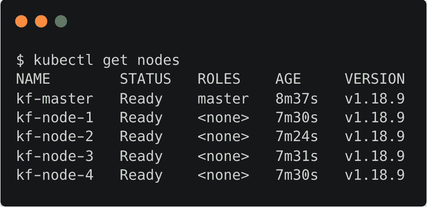

让我们测试一下 Kubernetes 是否能够访问 GPU。

```
export CLUSTER_VERIFY_EXPECTED_PODS=1  
./scripts/k8s/verify_gpu.sh  

```

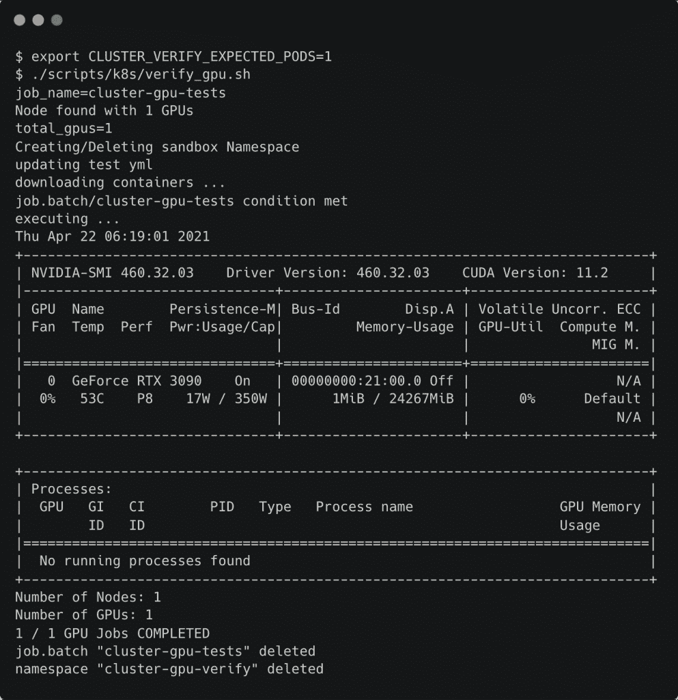

GPU 操作员已成功安装。我们可以通过检查`gpu-operator-resources`名称空间中的 pod 来验证它。

```
kubectl get pods  -n  gpu-operator-resources

```

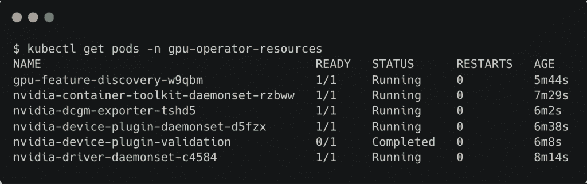

下一步是安装和配置 Portworx 存储集群作为 Kubeflow 的默认存储引擎。

## 步骤 4:安装和配置 Portworx 存储集群

Portworx 是一个现代的分布式云本地存储平台，旨在与 Kubernetes 等 orchestrators 一起工作。该平台来自同名公司，将一些适用于传统存储架构的成熟技术带到了云原生环境中。

关于 Portworx 架构和安装过程的详细概述，请参考我在新堆栈上发布的这个[指南](https://thenewstack.io/tutorial-install-and-configure-portworx-on-a-bare-metal-kubernetes-cluster/)。

从 2.7 版开始，Portworx 使用 operator 模式来安装和配置存储集群。我强烈推荐这种方法，因为它简单高效。

在 [Portworx Central](http://central.portworx.com) 提供的安装向导的第一步中选择操作员。

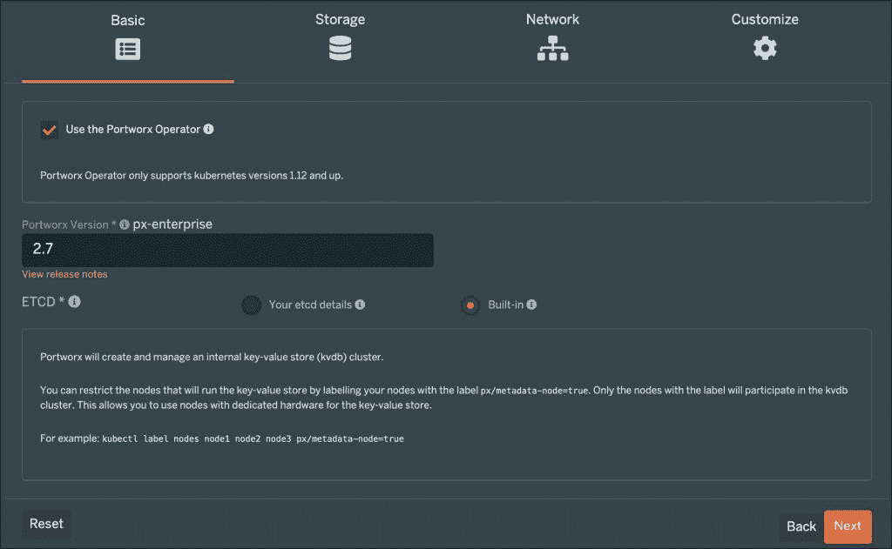

在下一步中，为本地裸机群集选择适当的选项。

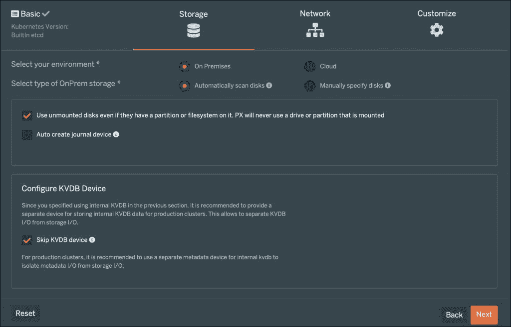

在接下来的两步中接受缺省值，并运行最后一步中显示的命令。

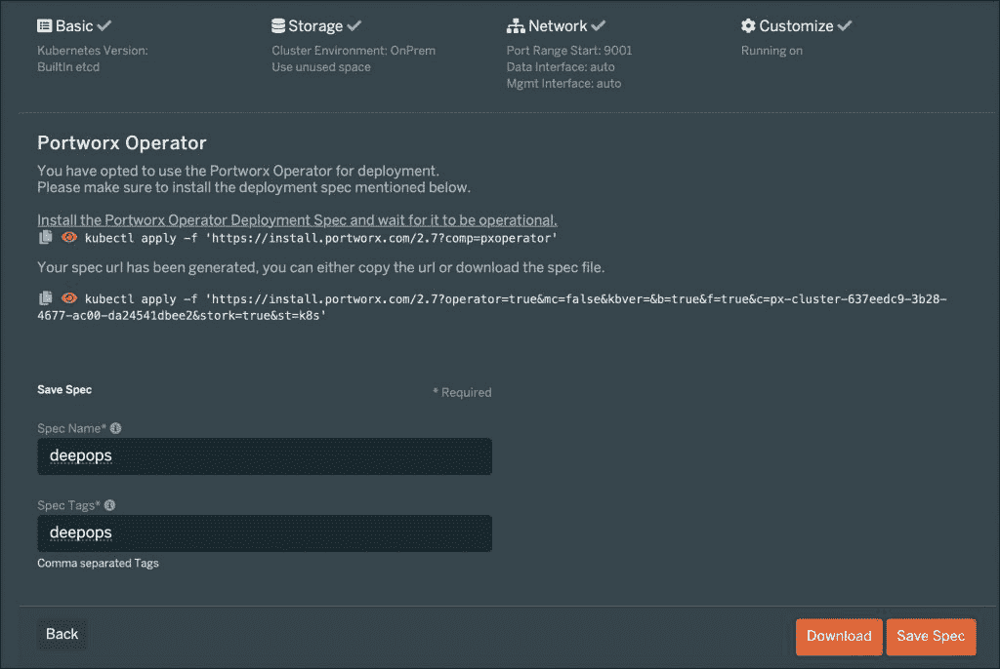

一旦按照向导所示运行了`kubectl`命令，Portworx 集群就会启动并运行。使用以下命令验证安装。

```
kubectl get pods  -n  kube-system  -l  name=portworx

```

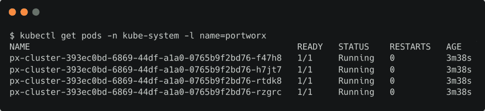

为了让 Kubeflow 正常工作，我们需要一个支持动态供应的存储类。让我们继续创建一个 Portworx 存储类，它针对运行 MySQL 和 MinIO 之类的有状态工作负载进行了优化，而 MySQL 和 MinIO 是 Kubeflow 的核心构建块。

```
kind:  StorageClass
apiVersion:  storage.k8s.io/v1
metadata:
    name:  standard-sc
    annotations:
      storageclass.kubernetes.io/is-default-class:  "true"
provisioner:  kubernetes.io/portworx-volume
parameters:
 repl:  "3"
 io_profile:  "db_remote"

```

注意，我们用 `storageclass.kubernetes.io/is-default-class: "true"`注释了该类，使其成为用于动态预配置的默认存储类。

应用存储类别规范并验证配置。

```
kubectl apply  -f  standard-sc.yaml

```


一切就绪后，让我们继续安装 Kubeflow。

## 步骤 5:安装并验证 Kubeflow

通过运行以下命令启动 Kubeflow 安装:

```
./scripts/k8s/deploy_kubeflow.sh

```

安装完成后，确保 kubeflow 名称空间中的所有 pod 都在运行。

```
kubectl get pods  -n  kubeflow

```

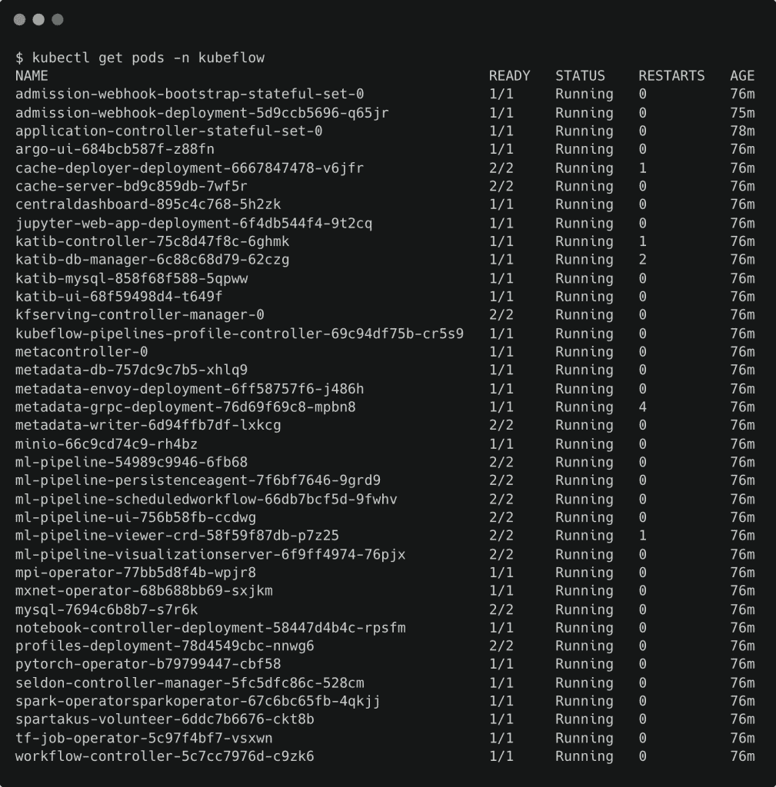

Kubeflow 的核心构建模块，如 MySQL 和 MinIO，现在由基于我们创建的存储类的 Portworx 卷提供支持。

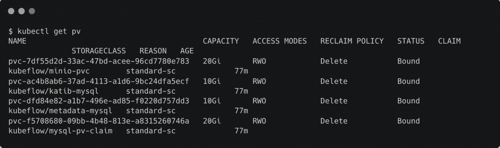

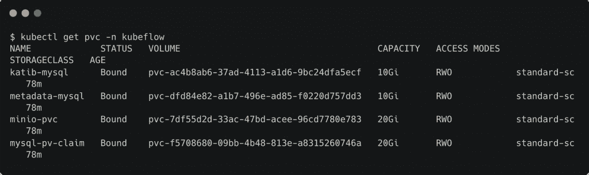

您可以通过点击主服务器上的 31380 端口来访问 Kubeflow UI。

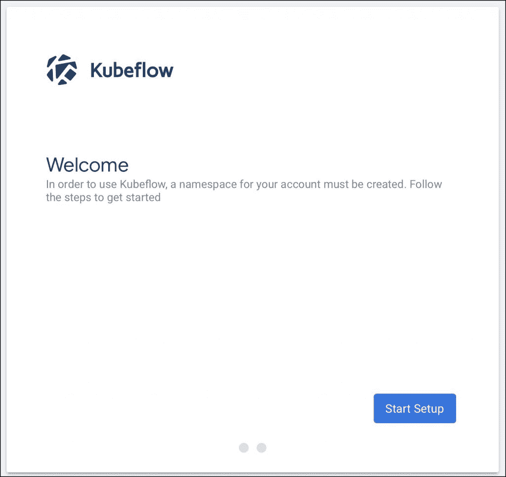

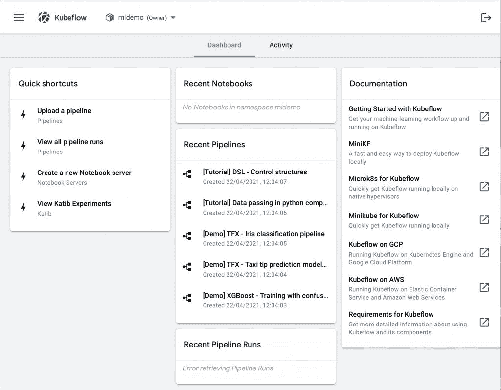

恭喜你！您已经成功地在多节点混合集群上安装了 Kubeflow，该集群具有由 Portworx 存储引擎支持的 CPU 和 GPU 主机。

在本系列的下一部分，我们将配置笔记本服务器来执行 MLOps。敬请期待！

<svg xmlns:xlink="http://www.w3.org/1999/xlink" viewBox="0 0 68 31" version="1.1"><title>Group</title> <desc>Created with Sketch.</desc></svg>