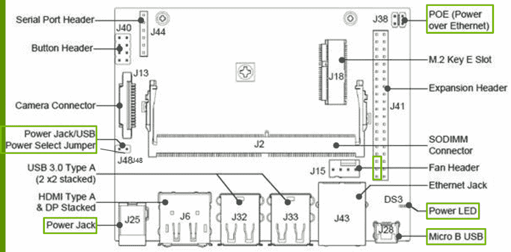
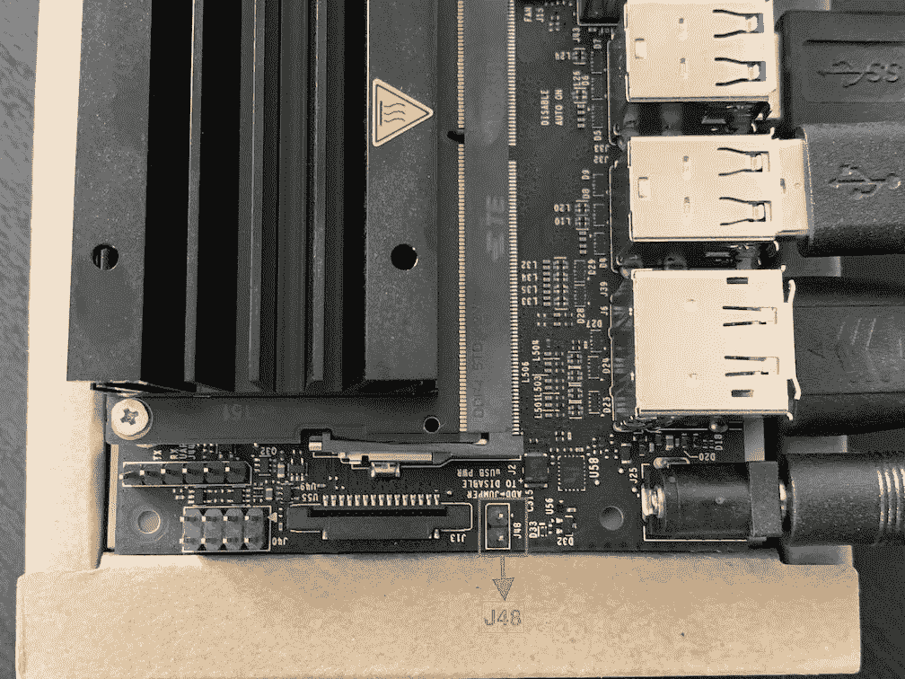
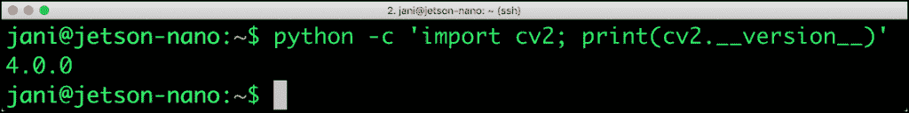

# 教程:将 NVIDIA Jetson Nano 配置为人工智能试验台

> 原文：<https://thenewstack.io/tutorial-configure-nvidia-jetson-nano-as-an-ai-testbed/>

在 [NVIDIA Jetson Nano 开发套件](https://developer.nvidia.com/embedded/jetson-nano-developer-kit)的本系列教程的最后一部分[，我提供了这款强大的边缘计算设备的概述。在本期文章中，我将介绍将 Jetson Nano 配置为用于推理的人工智能试验台的步骤。您将学习如何在边缘安装、配置和使用 TensorFlow、OpenCV 和 TensorRT。](/nvidia-brings-affordable-gpu-to-the-edge-with-jetson-nano/)

## Jetson Nano 的推荐配件

为了让设备发挥最大功效，你需要一个外部[电源](https://www.adafruit.com/product/1466)，额定 4A 为 5V，连接到功率桶插孔。默认的 MicroUSB 不足以驱动 GPU 和像 USB 摄像头这样的外围设备。

[](https://thenewstack.io/tutorial-configure-nvidia-jetson-nano-as-an-ai-testbed/nano-ai-0/)

要强制电路板从外部适配器获取电源，必须在电路板上靠近摄像头接口的 J48 上放置一根跳线。

[](https://thenewstack.io/tutorial-configure-nvidia-jetson-nano-as-an-ai-testbed/nano-ai-0b/)

强烈建议您使用 32GB 的 micro SD 卡，配杰特森 Nano。这足以安装交换驱动器，下载所需的软件和型号。

最后，使用兼容的 USB 网络摄像头以获得最佳性能。我使用的是罗技 270 网络摄像头，但也有其他分辨率更高的型号可以与 Nano 配合使用。

### **准备 SD 卡**

下载并闪存带有 NVIDIA 最新 [JetPack SDK for Nano](https://developer.nvidia.com/embedded/downloads) 的 micro SD 卡。它包含操作系统和基本的运行时组件，如 GPU 驱动程序、CUDA 工具包、cuDNN 库、TensorRT 库和其他依赖项。

您可能想使用 [BalenaEtcher](https://www.balena.io/etcher/) 将图像刷新到 SD 卡。

### 首次引导和配置

在用 SD 卡启动设备并配置 Ubuntu 18.04 之后，我们需要做两件事——添加交换内存和最大化处理器的时钟速度。

运行下面的脚本来添加一个 2GB 的交换文件。

```
sudo fallocate  -l  2G  /swapfile
sudo chmod  600  /swapfile
sudo mkswap  /swapfile
sudo swapon  /swapfile
sudo swapon  --show
sudo cp  /etc/fstab  /etc/fstab.bak
echo  '/swapfile none swap sw 0 0'  |  sudo tee  -a  /etc/fstab

```

接下来，我们将通过运行以下命令将 Jetson Nano 锁定在其最大频率和功率模式:

```
sudo jetson_clocks
sudo nvpmodel  -m  0

```

### 安装深度学习框架和库

现在是时候安装 TensorFlow、Keras、NumPy、Jupyter、Matplotlib 和 Pillow 了。让我们先从依赖项开始。

```
sudo apt install  -y  git  \
cmake  \
libatlas-base-dev  \
  gfortran  \
python3-dev  \
python3-pip  \
libhdf5-serial-dev  \
hdf5-tools

```

我们现在将默认的 Python 可执行文件指向 Python3。因为我们将把大多数二进制文件安装在主目录中( *~/)。local/bin* )，我们将把它添加到 path 变量中。

```
echo  "export PATH=$PATH:/$HOME/.local/bin"  >>  .bashrc
echo  "alias python=python3"  >>  .bashrc
echo  "alias pip=pip3"  >>  .bashrc
source  .bashrc

```

让我们安装 PIP 来管理 Python 模块。

```
cd  ~
wget https://bootstrap.pypa.io/get-pip.py
sudo python get-pip.py
rm  get-pip.py

```

是时候开始安装模块了。请注意，我们使用的是 NVIDIA 官方提供的 TensorFlow 的优化版本。Keras 和 Matplotlib 等其他模块是来自社区的标准构建。

由于我们使用了带有 pip 的*–user*开关，所以所有的 Python 模块都被安装在本地用户的主目录中。这保持了配置的整洁和简单。

```
pip install  -U  pip setuptools  --user
pip install  --user numpy
pip install  --user  --extra-index-url https://developer.download.nvidia.com/compute/redist/jp/v42 tensorflow-gpu==1.13.1+nv19.3
pip install  --user keras
pip install  --user jupyter
pip install  --user pillow
pip install  --user matplotlib

```

通过在 Python 中导入模块，验证模块安装成功。

```
python  -c  'import numpy; print(numpy.__version__)'
python  -c  'import tensorflow; print(tensorflow.__version__)'
python  -c  'import keras; print(keras.__version__)'
python  -c  'import jupyter; print(jupyter.__version__)'
python  -c  'import PIL; print(PIL.__version__)'
python  -c  'import matplotlib; print(matplotlib.__version__)'

```


### 安装 JetCam Python 模块

JetCam 是 NVIDIA 的官方开源库，是 Jetson 的一个易于使用的 Python 相机接口。它通过 Jetson 的加速 GStreamer 插件与各种 USB 和 CSI 相机配合使用。我喜欢 JetCam 的地方是它集成了 Jupyter Notebook 的简单 API，用于可视化相机馈送。

这个模块将方便我们将来在 Jetson Nano 系列中的演练。

```
git clone https://github.com/NVIDIA-AI-IOT/jetcam
cd  jetcam
pip install  ./  --user

```

### 构建并链接 OpenCV4

OpenCV 充当图像运行时，用于捕获、处理和操作图像和视频。尽管 JetPack 附带了 OpenCV，但它并没有针对 GPU 进行优化，也没有利用加速功能。

我们将从源代码构建 OpenCV，它将针对 Jetson Nano 进行高度优化。

让我们使用 NVIDIA 的一个方便的 BASH 脚本来构建和链接 OpenCV4。

```
wget https://raw.githubusercontent.com/AastaNV/JEP/master/script/install_opencv4.0.0_Nano.sh
bash  install_opencv4.0.0_Nano.sh  $HOME/.local

```

将 PYTHONPATH 变量指向 OpenCV 安装目录。

```
export PYTHONPATH="$PYTHONPATH:/usr/local/python/cv2/python-3.6/"
echo  "export PYTHONPATH=$PYTHONPATH:/usr/local/python/cv2/python-3.6/"  >>  ~/.bashrc
source  ~/.bashrc

```

通过加载模块验证 OpenCV 的安装。

```
python  -c  'import cv2; print(cv2.__version__)'

```



### 在 Jetson Nano 上安装推理引擎

最后，我们将克隆官方推理引擎 repo，并在设备上构建样本。这些示例对学习 TensorRT 很有用，TensorRT 是 C++和 Python 的推理运行时。

```
sudo apt-get  install git cmake
cd  ~
git clone https://github.com/dusty-nv/jetson-inference
cd  jetson-inference
git submodule update  --init

```

```
cd  ~/jetson-inference
mkdir  build
cd  build
make
sudo make  install

```

随意探索样品。要运行分类演示，导航到*~/jetson-inference/build/aarch 64/bin*文件夹并运行下面的命令。

```
cd  ~/jetson-inference/build/aarch64/bin
./imagenet-console  --network=googlenet orange_0.jpg output_0.jpg

```

[T8](https://thenewstack.io/tutorial-configure-nvidia-jetson-nano-as-an-ai-testbed/nano-ai-4/)T10

在本系列即将推出的教程中，我计划涵盖将 TensorFlow 和 PyTorch 模型转换为 TensorRT、TensorRT 的本地推理、边缘设备上的迁移学习等主题。敬请关注。

*贾纳基拉姆·MSV 的网络研讨会系列“机器智能和现代基础设施(MI2)”提供了涵盖前沿技术的信息丰富、见解深刻的会议。在 [http://mi2.live](http://mi2.live/) 注册参加即将举行的 MI2 网络研讨会。*

<svg xmlns:xlink="http://www.w3.org/1999/xlink" viewBox="0 0 68 31" version="1.1"><title>Group</title> <desc>Created with Sketch.</desc></svg>